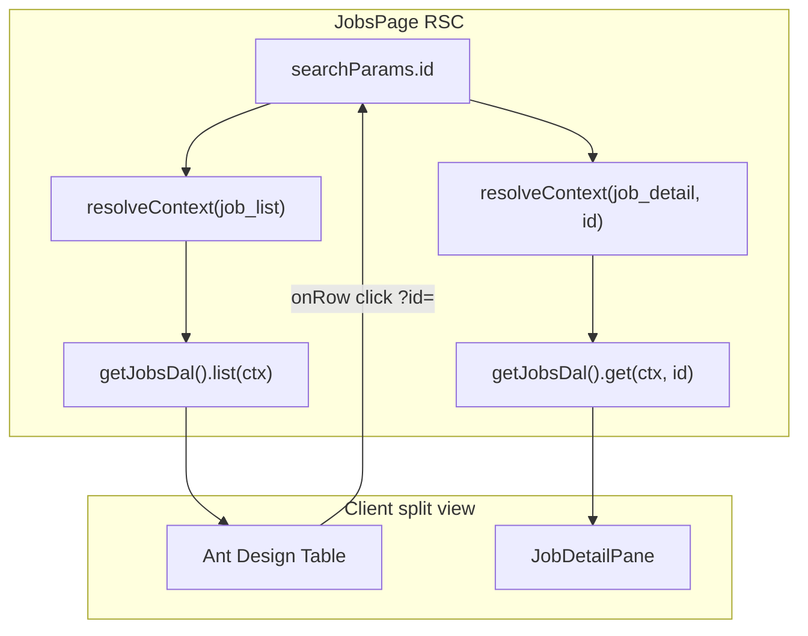

# CRM Step B-list — Jobs list pane

## Scope (from [TASKS.md](./apps/crm/docs/TASKS.md) § Step B-list)

**Proves:** Phase 01 `dal.jobs.list`, list projection, `job_list` row scope (tech `own` vs admin `all`).

**In:**

- Left pane `Table` from list DTO; `rowKey="id"`; row click sets selected id → right `job_detail` pane (existing `?id=` URL).
- Columns derived from list DTO keys ∩ manifest `read` (forbidden Fields not in DOM).
- Loading (`Table` `loading`) + empty (`Empty`) states.

**Out (explicit):**

- Bulk select + toolbar action — skip unless trivial; platform proof is in [`tests/job-list.e2e.test.ts`](./tests/job-list.e2e.test.ts) and web API routes.
- New Surfaces, nav catalog changes, Tailwind, raw `db.*`.
- Extracting shared `ManifestTable` package — inline in CRM first ([LAYOUT.md](./apps/crm/docs/LAYOUT.md)).

**Prerequisite (now satisfied):** Phase 01 complete — `job_list` YAML, policy, DAL `list`, projection, e2e + threat tests merged. Timing rule in [`crm-and-phases.md`](./docs/reference/crm-and-phases.md) allows this slice.

**Depends on Step B-detail (done):** [`JobsSplitView.tsx`](./apps/crm/src/components/jobs/JobsSplitView.tsx) + [`JobDetailPane.tsx`](./apps/crm/src/components/jobs/JobDetailPane.tsx) + `?id=` selection already exist; this task only replaces the left placeholder.

---

## Architecture



| Concern | Choice | Rationale |
|---------|--------|-----------|
| List fetch | **Server only** — RSC in [`(app)/jobs/page.tsx`](./apps/crm/src/app/(app)/jobs/page.tsx) | Invariant: no DAL in client components; mirror [`apps/web/src/app/jobs/page.tsx`](./apps/web/src/app/jobs/page.tsx) |
| Context | `resolveContext({ surfaceId: 'job_list' })` → `PermissionContext` with `surface: 'job_list'`, `mode: 'list'` | DAL `list` asserts `ctx.surface === 'job_list'` ([repository.ts](./packages/dal/src/jobs/repository.ts)) |
| Columns | Static column defs + `fieldAllows(manifest, field, 'read')` filter | Same pattern as web list page; UI mirror only — DTO already omits forbidden keys |
| Row scope | **No client filter** | DAL returns only in-scope rows per manifest `rowScope` |
| Selection | Preserve **`?id=`** query param | Already used by detail pane; `useRouter().push(\`${pathname}?id=${row.id}\`)` on row click |
| Detail auth | Prefer **membership in list rows** over `listVisibleSeedJobIds()` | List DTO is authoritative for what the principal can see on this Surface |

---

## 1. Extend `lib/latch.ts`

Mirror [`apps/web/src/lib/latch.ts`](./apps/web/src/lib/latch.ts):

```ts
export type ResolveContextInput =
  | { surfaceId: "job_detail"; entityId: string }
  | { surfaceId: "job_list" };
```

- `job_detail` → `mode: 'detail'`, `entityId` required (unchanged).
- `job_list` → `mode: 'list'`, no `entityId`.

**Remove** (placeholder-era):

- `listVisibleSeedJobIds()` — N× `job_detail` get probes against two seed ids.
- `listExistingSeedJobIds()` if only used by that helper.

**Keep** `getJobsDal()` / memory store / audit wiring unchanged.

Optional thin helper (not required):

```ts
export const fetchJobList = async () => {
  const ctx = await resolveContext({ surfaceId: "job_list" });
  return { ...getJobsDal().list(ctx), manifest: ctx.manifest };
};
```

---

## 2. Jobs page (RSC)

Update [`apps/crm/src/app/(app)/jobs/page.tsx`](./apps/crm/src/app/(app)/jobs/page.tsx):

1. **Always** (with or without `id`): `const listCtx = await resolveContext({ surfaceId: 'job_list' }); const { rows, total } = getJobsDal().list(listCtx);`
2. Pass to `JobsSplitView`: `listRows={rows}`, `listTotal={total}`, `listManifest={listCtx.manifest}`.
3. **Selection guard:** if `selectedId` is set and `!rows.some(r => r.id === selectedId)` → `notFound` (same UX as today; replaces seed-id allowlist).
4. Detail branch unchanged: `resolveContext({ surfaceId: 'job_detail', entityId })` + `get`.

**Suspense fallback:** pass `listLoading` or render split view with `Table loading` and no rows (match current `Loading…` detail placeholder).

**Query filters:** defer `status` filter unless trivial — pilot list query exists in DAL but TASKS does not require filters.

---

## 3. List pane UI (Ant Design)

Replace placeholder block in [`JobsSplitView.tsx`](./apps/crm/src/components/jobs/JobsSplitView.tsx) (extract [`JobListPane.tsx`](./apps/crm/src/components/jobs/JobListPane.tsx) if the file grows).

### Column map (align with web)

Reuse the same logical columns as [`apps/web/src/app/jobs/page.tsx`](./apps/web/src/app/jobs/page.tsx) — adapt renders for Ant Design `ColumnsType<ProjectedJobListRow>`:

| Field id | Header(s) | Render source |
|----------|-----------|---------------|
| `summary` | Title, Status, Scheduled | `row.summary.*` |
| `customer_site` | Customer, Site | `row.customer_site.*` |
| `financial_terms` | Contract amount | `row.financial_terms?.contract_amount` — **only if** `fieldAllows(manifest, 'financial_terms', 'read')` |
| `assignments` | Assignees | `row.assignments?.length ?? 0` |

- Build `columns` from defs filtered by manifest (omit entire column groups when Field denied).
- `rowKey="id"`.
- `pagination={false}` for harness (pilot seed is small); show `total` in Card extra or subtitle.
- **Empty:** `<Empty description="No jobs" />` when `rows.length === 0`.
- **Loading:** `loading={listLoading}` on `Table` (Suspense / transition).
- **Selected row:** `rowClassName` or `onRow` style when `record.id === selectedId` (replace link-list highlight).

### Row click

```ts
onRow: (record) => ({
  onClick: () => router.push(`${pathname}?id=${record.id}`),
  style: { cursor: "pointer" },
}),
```

Do not use separate “Open” link column (split view selects in-pane; differs from web’s navigate-to-`/jobs/[id]`).

### Props cleanup

Remove `PLACEHOLDER_JOBS`, `visibleJobIds` prop (unless retained only for Suspense — prefer list-driven).

---

## 4. Security / invariants checklist

Before marking done, confirm:

- [ ] `getJobsDal().list` only called with `PermissionContext` from `resolveContext` after `requireSession()` (layout already guards `(app)`).
- [ ] No `financial_terms` column in DOM for tech (manifest lacks `read`).
- [ ] Tech `rows.length` ≤ admin `rows.length` on same seed store.
- [ ] List rows for tech omit `financial_terms` key in DTO (DAL) — optional devtools check; primary verify is column absence.
- [ ] No `db.*` in `apps/crm`.
- [ ] Forbidden list Fields are **omitted** from columns, not hidden with CSS.

---

## 5. Optional bulk (skip by default)

Per TASKS: only if &lt; ~1 hour.

If attempted:

- Checkbox column + single “Delete selected” when `surfaceAllows(manifest, 'delete')`.
- Server Action → re-resolve `job_list` manifest → `dal.bulkDelete` / `bulkUpdate` with `mode: 'partial'`.
- Otherwise leave bulk to package e2e only.

**Plan default:** do not implement bulk UI in CRM.

---

## 6. Docs hygiene (same PR as implementation)

| Doc | Action |
|-----|--------|
| [`apps/crm/docs/TASKS.md`](./apps/crm/docs/TASKS.md) | Check off Step B-list items + verify gates after manual QA |
| [`apps/crm/docs/TASKS.md`](./apps/crm/docs/TASKS.md) line 5 | Update “list pane waits…” note — no longer blocked |
| [`apps/crm/README.md`](./apps/crm/README.md) | Mention list pane live if status blurb is stale |

No new phase task file — CRM consumes existing Phase 01 contract.

---

## 7. Manual verify (stop gate)

| Check | How |
|-------|-----|
| Tech login | `tech@demo.local` / `demo` → `/jobs` — **one** row (owned assignment); **no** Contract amount / financial column |
| Admin login | `admin@demo.local` — **more** rows than tech; financial column visible when manifest grants |
| Row click | Click list row → `?id=` set → detail pane loads; highlight follows selection |
| Empty store | Optional: delete all jobs as admin — list shows `Empty`; detail shows select prompt |
| Detail delete | Still clears selection / refreshes list on success (may need `router.refresh()` after delete action if list stale) |
| Build | `npm -w @latch/crm run build` |

**Regression:** Step B-detail verify items (tech financial section absent on **detail**, save, delete) still pass.

---

## File checklist (implementation order)

1. [`apps/crm/src/lib/latch.ts`](./apps/crm/src/lib/latch.ts) — `job_list` in `resolveContext`; remove seed list helpers
2. [`apps/crm/src/app/(app)/jobs/page.tsx`](./apps/crm/src/app/(app)/jobs/page.tsx) — list fetch + props
3. [`apps/crm/src/components/jobs/JobListPane.tsx`](./apps/crm/src/components/jobs/JobListPane.tsx) (new) or inline in split view — Table + columns
4. [`apps/crm/src/components/jobs/JobsSplitView.tsx`](./apps/crm/src/components/jobs/JobsSplitView.tsx) — wire list pane; drop placeholder
5. [`apps/crm/src/app/actions/job-detail.ts`](./apps/crm/src/app/actions/job-detail.ts) — if delete leaves list stale, add `revalidatePath('/jobs')` or `router.refresh()` from client after success
6. Docs — TASKS checkboxes

---

## Risks / deferrals

| Item | Handling |
|------|----------|
| Stale list after patch/delete | Call `router.refresh()` from detail actions (pattern may already exist) |
| Nav uses `job_detail` for Jobs link | Unchanged — list Surface does not need nav entry |
| Playwright CRM e2e | Out of scope for this slice; manual verify per TASKS |
| `status` list filter | Defer — not in CRM TASKS stop gate |
| Shared column helper with `apps/web` | Defer — duplicate thin column defs acceptable |

---

## Reference implementations

- Web list RSC + columns: [`apps/web/src/app/jobs/page.tsx`](./apps/web/src/app/jobs/page.tsx)
- Web `resolveContext`: [`apps/web/src/lib/latch.ts`](./apps/web/src/lib/latch.ts)
- DAL list + projection: [`packages/dal/src/jobs/repository.ts`](./packages/dal/src/jobs/repository.ts), [`list-project.ts`](./packages/dal/src/jobs/list-project.ts)
- Policy matrix: [`packages/policy/src/surfaces/job-list.ts`](./packages/policy/src/surfaces/job-list.ts)
- Stack e2e: [`tests/job-list.e2e.test.ts`](./tests/job-list.e2e.test.ts)
