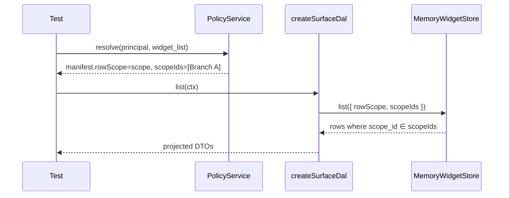

# Scoped row visibility proof

Phase 08 task 04 consumer proof — **memory harness** (no UI).

## Flow

## Stop gate

- `widgets.scope_id` migrated + seeded (`011`, `900`)
- `scoped-visibility.test.ts` green under `npm run test`
- Store adapter passes `scopeIds` from manifest on list/get/bulk paths
