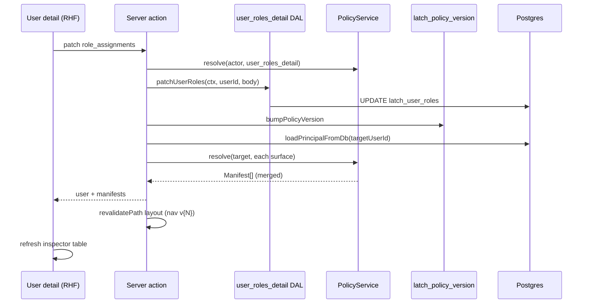

# 04 — Users UI + manifest inspector (same page)

> **Status:** Complete (2026-06-09). Spike UI complete — optional follow-ups: user create, profile write, `CachingPolicyService` (Phase 06).
>
> **Depends on** [01](./01-next-shell.md), [02](./02-vocabulary-fixture.md), [03](./03-roles-ui.md) (catalog must exist to assign).
>
> **Absorbs** former task [05 — Manifest inspector](./05-manifest-inspector.md).

## Goal

`/users` list and `/users/[id]` detail: **name + attached roles (1 or more)** for v1. On the **same detail page**, a read-only **manifest inspector** shows the **merged** effective permissions for the **selected user** and **auto-updates after a successful role save**.

Port Phase 03 assignment rules (**P4a / P4b**). **Persist users and assignments to Postgres.**

This is the primary **visual proof** that [`@latch/policy`](../../../packages/policy) works:

- Change **assignments** (multi-select) → merged inspector updates (`unionGrants`, `mergeRowScope`)
- Change **role grants** in task **03** → re-open user → inspector reflects new effective permissions
- Ungranted fields show `[]` (**default deny**)

---

## Deliverables

### Server

- `modules/iam/user_roles_detail.*` — already present; ensure codegen current
- **Postgres store adapter** for `latch_users` / `latch_user_roles` (replace `MemoryUserStore` on UI path)
- **Postgres-backed assignment validation deps:**
  - `catalog` — `Map<roleId, RoleCatalogEntry>` from `SELECT id, role_class FROM latch_roles`
  - `listUsersWithRole(roleId)` — query `latch_user_roles` for P4b last-`system_iam` guard
- Server actions: list users, get user + manifests, patch assignments
- **`resolveAllManifests(userId)`** helper:
  1. `loadPrincipalFromDb(pool, userId)` → target `Principal`
  2. `createPolicyServiceForPrincipal(pool, principal, spikePolicyRegistry)`
  3. For each surface id in `spikePolicyRegistry`: `policy.resolve(principal, { surface })`
  4. Return `Record<SurfaceId, Manifest>`
- **Patch flow:**
  1. `loadPrincipalFromDb(actAs)` → actor
  2. `createPolicyServiceForPrincipal` → `resolve(actor, { surface: "user_roles_detail" })` → `PermissionContext`
  3. `patchUserRoles(ctx, userId, { role_assignments })`
  4. `bumpPolicyVersion(actor.id, pool)` on assignment change
  5. `revalidatePath('/', 'layout')` — nav badge ticks up
  6. `resolveAllManifests(userId)` → return `{ user, manifests }`
- Audit on assignment change

### P4a / P4b (must implement on patch)

- **Exclusivity:** reject `system_data` + any `app` role on same user
- **Privileged assignment:** assign `system_iam` only if actor holds `system_iam`; same for `system_data`
- **Last-admin:** cannot revoke last `system_iam` holder
- **Self-patch denied:** actor cannot PATCH own `user_id` assignments (`ForbiddenError`)

### UI stack

- Ant Design 6 layout components
- **react-hook-form** for the editable section only (profile name if writable; **role multi-select**)
- Inspector is **read-only** (antd `Table`, no form)

---

## Page layout sketch — `/users/[id]`

```
┌─────────────────────────────────────────────────────────────────────────────┐
│  Breadcrumb: Users / {display_name}          [Act as: bootstrap ▼]  v12   │  ← global policy version (layout)
├─────────────────────────────────────────────────────────────────────────────┤
│                                                                             │
│  ┌─ Card: User ──────────────────────────────────────────────────────────┐  │
│  │  Display name   [ readonly text or Input — v1 may be read-only ]       │  │
│  │                                                                         │  │
│  │  Roles          [ Select mode="multiple" — 1+ role UUIDs + labels ]    │  │
│  │                 Merged effective access shown in inspector below.       │  │
│  │                                                                         │  │
│  │  [ Save assignments ]     (disabled when actor cannot write or self)   │  │
│  └─────────────────────────────────────────────────────────────────────────┘  │
│                                                                             │
│  ┌─ Card: Effective permissions (manifest inspector) ────────────────────┐  │
│  │  Subtitle: PolicyService.resolve for THIS user — merged across roles.  │  │
│  │  Refreshes automatically after Save. Ungranted fields → (none).        │  │
│  │                                                                         │  │
│  │  ┌──────────────┬──────────┬─────────────────────┬──────────────────┐  │  │
│  │  │ Surface      │ rowScope │ Field actions       │ Surface actions  │  │  │
│  │  ├──────────────┼──────────┼─────────────────────┼──────────────────┤  │  │
│  │  │ alpha_list   │ all      │ status: read, write │ read, write      │  │  │
│  │  │              │          │ title: read         │                  │  │  │
│  │  │ beta_detail  │ own      │ …                   │ read             │  │  │
│  │  │ gamma_form   │ —        │ (none)              │ (none)           │  │  │
│  │  │ role_detail  │ all      │ catalog: read,write │ read,write,delete│  │  │
│  │  └──────────────┴──────────┴─────────────────────┴──────────────────┘  │  │
│  │                                                                         │  │
│  │  Optional: [ Table | JSON ] toggle for debugging                        │  │
│  └─────────────────────────────────────────────────────────────────────────┘  │
│                                                                             │
└─────────────────────────────────────────────────────────────────────────────┘
```

### react-hook-form shape (client form)

```ts
type UserDetailFormValues = {
  /** v1: optional — may be omitted if profile is read-only */
  display_name?: string;
  /** Assigned role catalog UUIDs — 0..n; merge happens in PolicyService */
  role_assignments: string[];
};
```

- Default values from server: `role_assignments` = current `latch_user_roles` for user
- Resolver: Zod schema aligned with `UserRolesDetailPatchSchema` (strict — only known keys)
- On submit: server action with `role_assignments`; on success, update inspector from returned `manifests`; nav badge updates via layout revalidation

### Manifest inspector columns

| Column | Source (`Manifest`) | Render notes |
|--------|---------------------|--------------|
| **Surface** | `manifest.surface` | Monospace id; sort alphabetically; IAM surfaces badged `iam` |
| **rowScope** | `manifest.rowScope` | `own` \| `all` \| `—` when undefined; **`all` wins over `own`** across roles |
| **Field actions** | `manifest.fields` | Per field: `{fieldId}: [{actions}]`; skip or mute fields with `[]` (**default deny**) |
| **Surface actions** | `manifest.actions` | Comma-separated; empty → “(none)” |

Do **not** add a per-row `policyVersion` column — version is **global** (nav badge only).

**Synthesis rows:** `bootstrap-admin` shows wildcard-style manifests on business surfaces (`system_data`) and IAM surfaces (`system_iam`).

**Multi-role merge:** user with two app roles that overlap on `alpha_list` should show **union of field actions** and **most-permissive `rowScope`** — this is the key `unionGrants` / `mergeRowScope` proof.

### List page — `/users`

```
┌────────────────────────────────────────────────────────┐
│  Users                                    [ + Add ]    │  ← add deferred if out of scope
│  ┌────────────┬──────────────────┬─────────────────┐ │
│  │ Name       │ Roles (summary)  │ Actions         │ │
│  ├────────────┼──────────────────┼─────────────────┤ │
│  │ Admin      │ system_data, …   │ View            │ │
│  │ Tech One   │ field_tech       │ View            │ │
│  └────────────┴──────────────────┴─────────────────┘ │
└────────────────────────────────────────────────────────┘
```

---

## Data flow (inspector auto-update)



---

## Verify (stop gate)

- [x] User list + detail load from Postgres; assignments persist across `npm run dev` restart
- [x] Assign `field_tech` (or app role from UI) → inspector shows sparse grants on **multiple** fixture surfaces
- [x] Assign **two overlapping app roles** to one user → inspector shows **merged** field actions and `rowScope: all` when one role has `all` (proves `unionGrants` + `mergeRowScope`)
- [x] Save assignments → inspector + nav **`Policy v{N}`** update on same page
- [x] `bootstrap-admin` inspector shows synthesis on business + IAM surfaces
- [x] Surfaces with no grants show empty field actions (**default deny**)
- [x] Edit role grants in task **03** → re-open user → inspector reflects changed effective permissions
- [x] Non-`system_iam` actor gets 404 hide on IAM routes (T8)
- [x] Exclusivity + last-admin tests pass
- [x] Self-patch → 403

## Next

Spike UI complete — optional follow-ups: user create, profile write, `CachingPolicyService` (Phase 06). Explicit `effect: deny` authoring is **out of scope** — see [README Decision](./README.md#decision-runtime-grants-are-allow-only-no-explicit-deny-authoring-2026-06-08).
