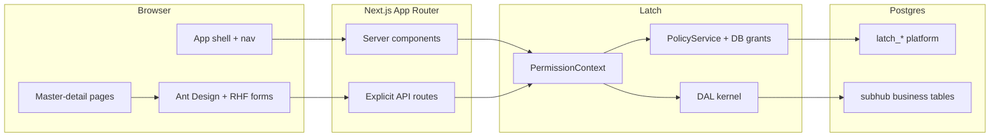

# SubHub — architecture

> **Status:** Planning (2026-06-12). **Decisions:** [decisions.md](./decisions.md).

## System context



Every gated request: `getPrincipal` → `resolveContext({ surfaceId, entityId? })` → DAL method with `PermissionContext`. UI receives `{ data, manifest }` and renders through `CapabilitiesProvider`.

## Data model (summary)

### Party spine

| Table | Purpose |
|-------|---------|
| `party` | Person or organization — anchor for contacts |
| `party_role` | Tags: `customer`, `vendor`, `manufacturer`, `employee` |
| `party_phone`, `party_email` | Child collections |
| `employee` | `party_id` + optional `latch_user_id` |

### Sites

| Table | Purpose |
|-------|---------|
| `site` | Location / address |
| `site_system` | Systems at site |
| `site_contact` | `site_id` + `party_id` + relation |

### Catalog

| Table | Purpose |
|-------|---------|
| `manufacturer_part` | MPN/SKU, specs, cut sheet URL |
| `vendor_part_price` | Price per vendor per part |
| `item`, `item_category`, `item_part_link` | Sellable/engineering resources |

### Sales → operations → billing

| Table | Purpose |
|-------|---------|
| `estimate`, `estimate_line` | Quote with snapshot lines |
| `job`, `job_line`, `job_line_progress` | Exploded BOM from estimate; per-line progress |
| `change_order`, `change_order_line` | Job deltas |
| `invoice`, `invoice_line`, `schedule_of_value`, `sov_line` | Billing + progress milestones |
| `purchase_order`, `po_line` | Procurement from job |

Physical DDL lands in numbered migrations (`013+`). Detail ER and column lists evolve in migration task files.

## Surface catalog

Convention: `{entity}_list` + `{entity}_detail` where both exist. IAM uses platform tables.

| Slice | Surfaces | Anchor | Multi-table |
|-------|----------|--------|-------------|
| 0 | `user_list`, `user_detail`, `role_list`, `role_detail`, `user_roles_detail` | `latch_*` | Yes |
| 1 | `contact_list`, `contact_detail`, `customer_list`, `vendor_list`, `manufacturer_list`, `employee_list`, `employee_detail` | `party` / `employee` | Yes |
| 2 | `site_list`, `site_detail` | `site` | Yes |
| 3 | `part_list`, `part_detail`, `item_list`, `item_detail` | `manufacturer_part` / `item` | Yes |
| 4 | `estimate_list`, `estimate_detail` | `estimate` | Yes |
| 5 | `job_list`, `job_detail`, `change_order_list`, `change_order_detail` | `job` / `change_order` | Yes |
| 6 | `invoice_list`, `invoice_detail`, `purchase_order_list`, `purchase_order_detail` | `invoice` / `purchase_order` | Yes |
| 7 | Reports | — | Custom SQL pages (not Surfaces initially) |

Filtered lists (`customer_list`, etc.) share `party` anchor; DAL applies `party_role` filter from list query or surface id.

## App directory shape (target)

```
apps/subhub/
  app/
    (public)/page.tsx
    (app)/
      layout.tsx                 # shell: nav, header, auth
      contacts/
        layout.tsx               # master-detail: list sider + {children}
        page.tsx                 # empty state
        [id]/page.tsx            # detail pane
      iam/users/...
      iam/roles/...
    api/
      contacts/route.ts
      contacts/[id]/route.ts
      iam/users/[id]/route.ts
  components/
    shell/
    form/                        # RHF + Ant Design wrappers
  lib/
    contacts/                    # descriptor, repository, dal factory
  modules/
    contact/*.surface.yaml
    */generated/
  migrations/
    001-012                      # platform (shipped)
    013+                         # business
```

## Dev roles (seed)

| Role | Typical surfaces |
|------|------------------|
| `admin` | All + IAM |
| `sales` | Contacts, sites, estimates |
| `project_manager` | Jobs, change orders |
| `technician` | Assigned jobs, line progress (scoped later) |
| `accounting` | Invoices, POs |
| `readonly` | Read-most |

Start with `row_scope: all`; adopt `scope` row filter when multi-branch data exists.

## Out of scope (SubHub v1)

- Approval / verification workflow
- Optimistic UI updates
- Mobile layouts
- Blob storage for cut sheets (URL field first)
- Full AIA / SOV sophistication (milestone lines first)
