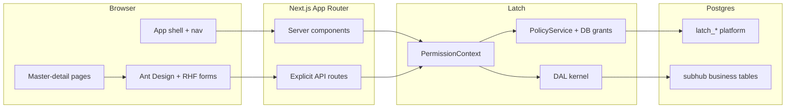
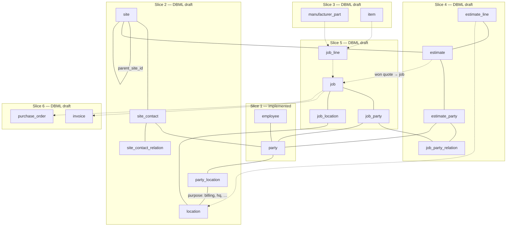

# SubHub — architecture

> **Status:** Planning (2026-06-16). **Schema:** [`schema/current.dbml`](./schema/current.dbml) through Slice 6 (task 17). **Decisions:** [decisions.md](./decisions.md).

## System context



Every gated request: `getPrincipal` → `resolveContext({ surfaceId, entityId? })` → DAL method with `PermissionContext`. UI receives `{ data, manifest }` and renders through `CapabilitiesProvider`.

## Data model (summary)

### Party spine

| Table | Purpose |
|-------|---------|
| `party` | Person or organization — anchor for contacts |
| `party_person`, `party_organization` | 1:1 kind extensions (names, DBA) — *pending migration; see [`schema/current.dbml`](./schema/current.dbml)* |
| `party_role` | Master tags: `customer`, `vendor`, `manufacturer`, `employee`, `property_owner`, `other` |
| `party_phone`, `party_email` | Child collections |
| `party_location` | `party_id` + `location_id` + `purpose` (billing, hq, …) |
| `party_user` | Login bridge + session profile (`display_name`, `avatar_url`) for any person with access — *draft; see [`schema/current.dbml`](./schema/current.dbml)* |
| `employee` | Staff-only HR extension: FK → `party_person`; interim `latch_user_id` until `party_user` ships — *planned HR columns documented, not in DDL* |

**Identity split (where data lives):**

| Concern | Table |
|---------|--------|
| Credentials (`login_name`, password) | `latch_users` |
| Login ↔ person bridge + shell profile | `party_user` *(draft)* |
| Address-book name, legal name | `party` |
| First / last name | `party_person` |
| Phones, emails | `party_phone`, `party_email` |
| Staff marker + future HR | `employee` |
| Permissions | `latch_user_roles` + grants |

### Cross-cutting

| Table | Purpose |
|-------|---------|
| `note` | Polymorphic notes (`entity_type`, `entity_id`, body) — any Surface anchor; replaces inline `party.notes` *(pending migration)* |
| `attachment` | Polymorphic files/images — *deferred* ([decisions](./decisions.md#decision-notes-and-attachments-shared-tables-deferred-2026-06-15)) |

### Sites and locations

| Table | Purpose |
|-------|---------|
| `site` | Logical place; optional `parent_site_id` hierarchy — no address link |
| `location` | Normalized address (manual entry v1; verification deferred) |
| `party_location` | `party_id` + `location_id` + `purpose` |
| `site_contact_relation` | Catalog of standing-contact roles at a site |
| `site_contact` | `site_id` + `party_id` + `relation_id` |

`job_location` (*job slice*) attaches a `location` to a specific job work area. Line-level `location_id` on `estimate_line` / `job_line` (*Slices 4–5*) scopes where work or installed items apply within the building — see [in-building work scope](./decisions.md#decision-in-building-work-scope--estimate--job-lifecycle-2026-06-16). Installed systems at a site (*catalog slice*) — tied to items/parts, not `site_system` in Slice 2.

### Catalog

| Table | Purpose |
|-------|---------|
| `manufacturer_part` | MPN per manufacturer `party`; specs, `cut_sheet_url` |
| `vendor_part_price` | Current unit price per vendor `party` + part |
| `item`, `item_category`, `item_part_link` | Sellable/engineering resources and BOM composition |

### Sales → operations → billing

| Table | Purpose |
|-------|---------|
| `job_party_relation` | Catalog of engagement stakeholder roles (estimate + job) |
| `estimate`, `estimate_party`, `estimate_line` | Quote at `site_id` with per-quote parties and snapshot lines |
| `job`, `job_party`, `job_location` | Work at a `site`; per-job stakeholders; work-area address |
| `job_line`, `job_line_progress` | Exploded BOM from estimate; per-line progress |
| `change_order`, `change_order_line` | Job scope deltas |
| `invoice`, `invoice_line`, `schedule_of_value`, `sov_line` | Billing + simplified progress milestones |
| `purchase_order`, `po_line` | Procurement from job |

Physical DDL lands in numbered migrations after the [schema design pass](./tasks/17-schema-design-pass.md) exits (task **18+**). Column detail: [`schema/current.dbml`](./schema/current.dbml).

**Timestamps:** Business anchors get `created_at` / `updated_at` in DDL for list sort and freshness; IAM catalog tables follow platform P11 (audit only, no row timestamps). Neither belongs in Surface YAML unless manifest-gated UI requires it — see [decisions.md](./decisions.md#decision-row-timestamps-vs-audit--ddl-vs-surface-fields-2026-06-13).

## Entity flow {#entity-flow}

How business entities **link** across slices (relationship map — not a duplicate of the table list above). **Solid** lines = implemented (Slice 1) or in [`current.dbml`](./schema/current.dbml); **dashed** = deferred identity/HR/attachments. Locked placement: [15-entity-flow.md](./tasks/15-entity-flow.md#step-1--section-placement-2026-06-15-).



**Reading the map:** `location` attaches to **parties** via `party_location` (billing / HQ / …) and to **jobs** via `job_location` (Slice 5) — see [location attachments](./decisions.md#decision-location-attachments-2026-06-15) and [in-building work scope](./decisions.md#decision-in-building-work-scope--estimate--job-lifecycle-2026-06-16). **`site` is logical only** — no site↔location link. `site_contact` links standing people at a property; per-job counterparty graphs use `job_party` in Slice 5 ([party_role vs job relations](./decisions.md#decision-party_role-master-tags-vs-job-scoped-relations-2026-06-15)). Sales flow: `estimate` → `job` → billing (`invoice`) and procurement (`purchase_order`); line items snapshot at each hop ([line-item snapshots](./decisions.md#decision-line-item-snapshots-on-estimate--job--invoice-2026-06-12)).

**Deferred (dashed or omitted):** [address verification](./decisions.md#decision-address-verification--deferred-2026-06-15) on `location`; [shared notes / attachments](./decisions.md#decision-notes-and-attachments-shared-tables-deferred-2026-06-15); [installed assets at site](./decisions.md#decision-installed-systems--deferred-to-catalog-slice-2026-06-15) (catalog-linked, not Slice 2); [`party_user` / portal identity](./decisions.md#decision-party-identity--party_user--user_class-deferred-2026-06-15) (login + session profile; replaces interim `employee.latch_user_id`); [employee HR columns](./decisions.md#decision-employee-hr-fields-deferred-2026-06-16).

### DBML vs shipped migrations

| Entity / junction | Shipped (`016`) | In [`current.dbml`](./schema/current.dbml) | Migration task |
|-------------------|-----------------|-------------------------------------------|----------------|
| `party`, `party_role`, `party_phone`, `party_email`, `employee` | ✓ Slice 1 | ✓ (+ kind extensions draft) | refactor in task **18** batch |
| `party_person`, `party_organization`, `note` | — | ✓ draft | task **18** batch |
| `location`, `site`, `party_location`, `site_contact_*` | — | ✓ | task **18** |
| `manufacturer_part`, `item`, vendor pricing | — | ✓ | Slice 3 |
| `estimate`, `estimate_party`, `estimate_line` | — | ✓ | Slice 4 |
| `job_party_relation`, `job`, `job_party`, `job_line`, `change_order` | — | ✓ | Slice 5 |
| `invoice`, `purchase_order`, SOV | — | ✓ | Slice 6 |

## Surface catalog

Convention: `{entity}_list` + `{entity}_detail` for business anchors. **Catalog tables** use a single `{table}_table` Surface ([decision](./decisions.md#decision-catalog-tables--editable-table-page-not-master-detail-2026-06-16)) — editable table page, not master-detail. IAM uses platform tables.

| Slice | Surfaces | Anchor | Multi-table |
|-------|----------|--------|-------------|
| 0 | `user_list`, `user_detail`, `role_list`, `role_detail`, `user_roles_detail` | `latch_*` | Yes |
| 1 | `contact_list`, `contact_detail`, `customer_list`, `vendor_list`, `manufacturer_list`, `employee_list`, `employee_detail` | `party` / `employee` | Yes — list/detail nav shape [deferred](./decisions.md#decision-party-listdetail-surface-shape--deferred-2026-06-16) (unified party + role filters vs subset lists / role-specific detail) |
| 2 | `site_list`, `site_detail`, `site_contact_relation_table` | `site` / `site_contact_relation` | Yes |
| 3 | `part_list`, `part_detail`, `item_list`, `item_detail` | `manufacturer_part` / `item` | Yes |
| 4 | `estimate_list`, `estimate_detail` | `estimate` | Yes |
| 5 | `job_list`, `job_detail`, `change_order_list`, `change_order_detail` | `job` / `change_order` | Yes |
| 6 | `invoice_list`, `invoice_detail`, `purchase_order_list`, `purchase_order_detail` | `invoice` / `purchase_order` | Yes |
| 7 | Reports | — | Custom SQL pages (not Surfaces initially) |

Filtered lists (`customer_list`, etc.) share `party` anchor; DAL applies `party_role` filter from list query or surface id.

## Navigation

Three **shell chrome layers** ([decision](./decisions.md)):

```text
┌──────────┬──────────────────────────────────────────────┐
│ SideNav  │ App header — title, search, settings ▼       │
│ (inline  ├──────────────────────────────────────────────┤
│  Menu)   │ SurfaceToolbar — New | Save | ⋯ More         │
│          ├──────────────────────────────────────────────┤
│          │ Page content                                 │
└──────────┴──────────────────────────────────────────────┘
```

**Sidebar** merges three sources:

| Source | Gating | Menu shape | Examples |
|--------|--------|------------|----------|
| Public | Always | Top-level item | Home `/` |
| Session chrome | Authenticated | Top-level item | Settings `/settings` |
| Surface catalog | `resolveContext` per `surfaceId` | `type: 'group'` | IAM → Users, Roles; Contacts → `/contacts` |

**App chrome** (public + session) is not a Latch Surface. **IAM / Contacts groups** are Surfaces — manifest-filtered; omit empty groups server-side.

Static catalog in `lib/nav.ts`; server filter in `lib/nav-server.ts`. Sidebar labels use `next/link` ([routing-and-libraries.md](./routing-and-libraries.md)). Per-page actions use `SurfaceToolbar` with priority + overflow menu (task **08**).

## App directory shape (target)

```
apps/subhub/
  app/
    layout.tsx                   # root shell; isAuthenticated → nav
    (public)/
      page.tsx                   # home
      login/page.tsx             # sign-in (not gated)
    (private)/
      layout.tsx                 # passthrough (no pathname redirect)
      settings/page.tsx          # requireAuth('/settings')
      contacts/
        layout.tsx               # master-detail: list sider + {children}
        page.tsx                 # empty state
        [id]/page.tsx            # detail pane
      sites/
        layout.tsx               # master-detail
        page.tsx
        [id]/page.tsx
        contact-relations/
          page.tsx               # catalog table — site_contact_relation_table (not list/detail)
      iam/users/...
      iam/roles/...
    api/
      contacts/route.ts
      contacts/[id]/route.ts
      iam/users/[id]/route.ts
  components/
    shell/
    form/                        # RHF + Ant Design wrappers
  lib/
    auth-session.ts              # readBetterAuthSession wrappers
    auth-utils.ts                # sanitizeCallbackUrl, loginHref
    require-auth.ts              # requireAuth(callbackPath)
    contacts/                    # descriptor, repository, dal factory
  modules/
    contact/*.surface.yaml
    */generated/
  migrations/
    001-013                      # platform (shipped; 013 = identity guards)
    014+                           # business
```

## First-run setup (Slice 0)

Platform migration `013_latch_identity_guards.sql` ships DB guards. Task **09** implements `/setup`:

| Piece | Shape |
|-------|--------|
| Gate | No `latch_users` rows and `setup_complete = false` → `/setup` |
| Form | `LATCH_SETUP_KEY` + **login_name** + password |
| `latch_users` | `id = gen_random_uuid()::text`; `login_name` unique; `login_email` null until party link |
| Role assignments | `system_data` + `system_iam` via `role_class` lookup |
| IAM grants | **None** — `PolicyService` synthesizes for `system_iam` |

**Login:** username or linked `login_email` (`resolveLatchUserId`). **Party link (task 10+):** interim `employee.latch_user_id` → `party`; promote `party_email` → `login_email` (unique guard). **Target:** `party_user` (login + shell `display_name` / `avatar_url`) for staff and future portal users — [deferred](./decisions.md#decision-party-identity--party_user--user_class-deferred-2026-06-15).

Platform rule: [P4b amendment](../../../packages/policy/docs/tasks/00-decisions-needed.md#amendment-first-run-setup--db-identity-guards-2026-06-13).

## App roles (future catalog)

Business slices will introduce `role_class = 'app'` rows with sparse grants. Planned names (not seeded in task **09**):

| Role | Typical surfaces |
|------|------------------|
| `admin` | All + IAM |
| `sales` | Contacts, sites, estimates |
| `project_manager` | Jobs, change orders |
| `technician` | Assigned jobs, line progress (scoped later) |
| `accounting` | Invoices, POs |
| `readonly` | Read-most |

Start with `row_scope: all`; adopt `scope` row filter when multi-branch data exists.

## Out of scope (SubHub v1)

- Approval / verification workflow
- Optimistic UI updates
- Mobile layouts
- Blob storage for cut sheets (URL field first)
- Full AIA / SOV sophistication (milestone lines first)
