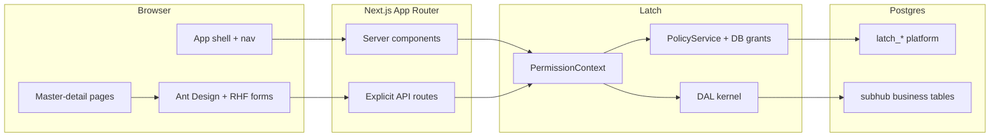
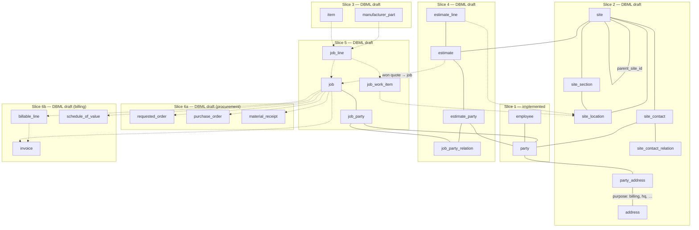

# SubHub — architecture

> **Status:** Planning (2026-06-17). **Schema:** [`schema/current.dbml`](./schema/current.dbml) through Slice 6a/6b (procurement + billing pass). **Decisions:** [decisions.md](./decisions/README.md).

## System context



Every gated request: `getPrincipal` → `resolveContext({ surfaceId, entityId? })` → DAL method with `PermissionContext`. UI receives `{ data, manifest }` and renders through `CapabilitiesProvider`.

## Data model (summary)

### Party spine

| Table | Purpose |
|-------|---------|
| `party` | Person or organization — anchor for contacts |
| `party_person`, `party_organization` | 1:1 kind extensions (names, DBA) — *pending migration; see [`schema/current.dbml`](./schema/current.dbml)* |
| `party_role` | Master tags: `customer`, `vendor`, `manufacturer`, `employee`, `property_owner`, `other` |
| `party_phone`, `party_email` | Child collections (`party_email.address` UNIQUE — login safety) |
| `party_address` | `party_id` + `address_id` + `purpose` (billing, hq, …) |
| `employee` | Staff-only HR extension: FK → `party_person` — *planned HR columns documented, not in DDL* |

**Identity split (where data lives):**

| Concern | Table |
|---------|--------|
| Credentials (`login_name`, password, `login_email`) | `latch_users` |
| Login ↔ person link + session chrome | `party_person` (`latch_user_id`, `nick_name`, `display_name`, `avatar_url`) |
| Address-book list sort | `party.display_name` (DAL-maintained) |
| First / last name | `party_person` |
| Phones, emails | `party_phone`, `party_email` |
| Staff marker + future HR | `employee` |
| Permissions | `latch_user_roles` + grants |

### Cross-cutting

| Table | Purpose |
|-------|---------|
| `note` | Polymorphic notes (`entity_type`, `entity_id`, body) — any Surface anchor; replaces inline `party.notes` *(pending migration)* |
| `attachment` | Polymorphic files/images — *deferred* ([decisions](./decisions/cross-cutting.md#decision-notes-and-attachments--shared-tables-deferred-2026-06-15)) |

### Sites and geography

| Table | Purpose |
|-------|---------|
| `site` | Logical place; optional `parent_site_id` hierarchy — no address link |
| `address` | Normalized postal address (manual entry v1; verification deferred) |
| `party_address` | `party_id` + `address_id` + `purpose` |
| `site_section` | Coarse site geography — Floor 3, wing, … (flat list; site-owned as-built) |
| `site_location` | Exact work spot — Door A-32, Rm 345 Cam 1; lifecycle `proposed` → `active` |
| `site_contact_relation` | Catalog of standing-contact roles at a site |
| `site_contact` | `site_id` + `party_id` + `relation_id` |

In-building scope on **`site_section` / `site_location`** (site-owned); estimate/job lines FK `site_location_id`. Postal addresses attach to **parties** via `party_address` — not to `site`. Per-job counterparties use `job_party` ([address vs site geography](./decisions/site.md#decision-address-vs-site-geography--rename-and-split-2026-06-17).

### Catalog

| Table | Purpose |
|-------|---------|
| `category` | Hierarchy for items and quote sections; optional `csi_code` for MasterFormat |
| `labor_class` | Rate class on labor items (rates table deferred) |
| `manufacturer_part` | Exact MPN; UOM (`unit`, `purchase_unit`, `units_per_purchase`) |
| `vendor_part` | Vendor PN + current price (UOM from part) |
| `item`, `item_part_link` | Sellable SKU, part alternates/BOM (`alternate` \| `component`) |

### Sales → operations → billing

| Table | Purpose |
|-------|---------|
| `job_party_relation` | Catalog of engagement stakeholder roles (estimate + job) |
| `estimate`, `estimate_party`, `estimate_section`, `estimate_line` | Quote at `site_id`; sections by `category`; snapshot lines |
| `job`, `job_party` | Work at a `site`; per-job stakeholders |
| `job_line`, `job_line_part`, `job_work_item` | Sold scope + engineering buy list; field status (all-or-nothing per phase) → billable staging |
| `change_order`, `change_order_line` | Job scope deltas |
| `requested_order`, `requested_order_line` | Requisition — BOM or ad-hoc parts before PO |
| `purchase_order`, `purchase_order_line`, `purchase_order_line_shipment` | Vendor commitment from job / requisition |
| `material_receipt`, `material_receipt_line`, `job_material_movement` | Job-site inventory (received vs on hand) |
| `billable_line` | Earned / billable staging before customer invoice |
| `invoice`, `invoice_line`, `schedule_of_value`, `sov_line`, `sov_allocation` | Customer billing + SOV milestones |

Physical DDL lands in numbered migrations after the [schema design pass](./tasks/17-schema-design-pass.md) exits (task **18+**). Column detail: [`schema/current.dbml`](./schema/current.dbml).

**Timestamps:** Business anchors get `created_at` / `updated_at` in DDL for list sort and freshness; IAM catalog tables follow platform P11 (audit only, no row timestamps). Neither belongs in Surface YAML unless manifest-gated UI requires it — see [decisions.md](./decisions/general.md#decision-row-timestamps-vs-audit--ddl-vs-surface-fields-2026-06-13).

## Entity flow {#entity-flow}

How business entities **link** across slices (relationship map — not a duplicate of the table list above). **Solid** lines = implemented (Slice 1) or in [`current.dbml`](./schema/current.dbml); **dashed** = deferred identity/HR/attachments. Locked placement: [15-entity-flow.md](./tasks/15-entity-flow.md#step-1--section-placement-2026-06-15-).



**Reading the map:** `address` attaches to **parties** via `party_address` (billing / HQ / …). In-building scope uses **`site_section` / `site_location`** on the job's site — see [address vs site geography](./decisions/site.md#decision-address-vs-site-geography--rename-and-split-2026-06-17). `site_contact` links standing people at a property; per-job counterparties use `job_party` ([party_role vs job relations](./decisions/party.md#decision-party_role-master-tags-vs-job-scoped-relations-2026-06-15). Sales flow: `estimate` → `job` → requisition (`requested_order`) → procurement (`purchase_order`) and job-site stock (`job_material_movement`); billing is **`billable_line` → `invoice`** with optional SOV milestones ([billing decision](./decisions/billing.md#decision-billing--earned-staging-progress-sov-retainage-2026-06-17), [procurement decision](./decisions/procurement.md#decision-procurement--requisition-layer-and-job-site-inventory-2026-06-17). Line items snapshot at each hop ([line-item snapshots](./decisions/general.md#decision-line-item-snapshots-on-estimate--job--invoice-2026-06-12).

**Deferred (dashed or omitted):** [address verification](./decisions/site.md#decision-address-verification--deferred-2026-06-15) on `address`; [shared notes / attachments](./decisions/cross-cutting.md#decision-notes-and-attachments--shared-tables-deferred-2026-06-15); [installed assets at site](./decisions/site.md#decision-installed-systems--deferred-to-catalog-slice-2026-06-15) (catalog-linked, not Slice 2); [`latch_users.user_class` / portal row scope](./decisions/party.md#decision-party-identity--party_person-login-link-2026-06-18) (portal audience); [employee HR columns](./decisions/party.md#decision-employee-hr-fields-deferred-2026-06-16).

### DBML vs shipped migrations

| Entity / junction | Shipped (`016`) | In [`current.dbml`](./schema/current.dbml) | Migration task |
|-------------------|-----------------|-------------------------------------------|----------------|
| `party`, `party_role`, `party_phone`, `party_email`, `employee` | ✓ Slice 1 | ✓ (+ kind extensions draft) | wave 1 ([`deferred/site-migration.md`](./tasks/deferred/site-migration.md)) |
| `party_person`, `party_organization`, `note` | — | ✓ draft | wave 1 batch |
| `address`, `site`, `site_section`, `site_location`, `party_address`, `site_contact_*` | — | ✓ | wave 1 |
| `manufacturer_part`, `item`, `vendor_part` | — | ✓ | Slice 3 |
| `estimate`, `estimate_party`, `estimate_section`, `estimate_line` | — | ✓ | Slice 4 |
| `job_party_relation`, `job`, `job_party`, `job_line`, `job_line_part`, `change_order` | — | ✓ | Slice 5 |
| `requested_order`, `purchase_order`, `material_receipt` | — | ✓ | Slice 6a |
| `billable_line`, `invoice`, SOV | — | ✓ | Slice 6b |

## Surface catalog

Convention: `{entity}_list` + `{entity}_detail` for business anchors. **Catalog tables** use a single `{table}_table` Surface ([decision](./decisions/general.md#decision-catalog-tables--editable-table-page-not-master-detail-2026-06-16)) — editable table page, not master-detail. IAM uses platform tables.

**Field-level detail:** [`surfaces.md`](./surfaces.md) — canonical catalog (routes, Fields, collection shapes, implementation waves). Headline table:

| Wave | Surfaces | Anchor |
|------|----------|--------|
| 0 | `user_*`, `role_*`, `customer_*`, `vendor_*`, `manufacturer_*`, `property_owner_*`, `employee_*` | `latch_*` / `party` / `employee` |
| 1 | `site_list`, `site_detail`, `site_contact_relation_table` | `site` / `site_contact_relation` |
| 2 | `addresses` on `{role}_detail`; geography on `site_detail` | `party_address` / `site_section` |
| 3 | `part_*`, `item_*`, `category_table`, `labor_class_table` | `manufacturer_part` / `item` |
| 4 | `estimate_*`, `job_party_relation_table` | `estimate` |
| 5 | `job_*`, `change_order_*` | `job` / `change_order` |
| 6a | `requested_order_*`, `purchase_order_*`, `material_receipt_*` | procurement anchors |
| 6b | `invoice_*` (+ `billable_items` on `job_detail`) | `invoice` / `billable_line` |
| 7 | Reports | custom SQL (not Surfaces initially) |

Filtered list/detail pairs share `party` anchor; DAL filters `party_role` from `surfaceId`. Matched pairs per [party list/detail decision](./decisions/party.md#decision-party-listdetail-surface-shape-2026-06-16-locked-2026-06-17). Open items: [task 18](./tasks/18-surface-catalog.md).

## Navigation

Three **shell chrome layers** ([decision](./decisions/README.md)):

```text
┌──────────┬──────────────────────────────────────────────┐
│ SideNav  │ App header — title, search, settings ▼       │
│ (inline  ├──────────────────────────────────────────────┤
│  Menu)   │ SurfaceToolbar — New | Save | ⋯ More         │
│          ├──────────────────────────────────────────────┤
│          │ Page content                                 │
└──────────┴──────────────────────────────────────────────┘
```

**Sidebar** merges three sources:

| Source | Gating | Menu shape | Examples |
|--------|--------|------------|----------|
| Public | Always | Top-level item | Home `/` |
| Session chrome | Authenticated | Top-level item | Settings `/settings` |
| Surface catalog | `resolveContext` per `surfaceId` | `type: 'group'` | IAM → Users, Roles; Contacts → `/customers`, `/vendors`, … |

**App chrome** (public + session) is not a Latch Surface. **IAM / Contacts groups** are Surfaces — manifest-filtered; omit empty groups server-side.

Static catalog in `lib/nav.ts`; server filter in `lib/nav-server.ts`. Sidebar labels use `next/link` ([routing-and-libraries.md](./routing-and-libraries.md)). Per-page actions use `SurfaceToolbar` with priority + overflow menu (task **08**).

## App directory shape (target)

```
apps/subhub/
  app/
    layout.tsx                   # root shell; isAuthenticated → nav
    (public)/
      page.tsx                   # home
      login/page.tsx             # sign-in (not gated)
    (private)/
      layout.tsx                 # passthrough (no pathname redirect)
      settings/page.tsx          # requireAuth('/settings')
      customers/
        layout.tsx               # master-detail
        page.tsx
        [id]/page.tsx
      vendors/
        layout.tsx
        page.tsx
        [id]/page.tsx
      manufacturers/ ...
      property-owners/ ...
      employees/ ...
      sites/
        layout.tsx               # master-detail
        page.tsx
        [id]/page.tsx
        contact-relations/
          page.tsx               # catalog table — site_contact_relation_table (not list/detail)
      iam/users/...
      iam/roles/...
    api/
      customers/route.ts
      customers/[id]/route.ts
      vendors/...
      iam/users/[id]/route.ts
  components/
    shell/
    form/                        # RHF + Ant Design wrappers
  lib/
    auth-session.ts              # readBetterAuthSession wrappers
    auth-utils.ts                # sanitizeCallbackUrl, loginHref
    require-auth.ts              # requireAuth(callbackPath)
    contacts/                    # shared party DAL — rename TBD (wave 1)
  modules/
    contact/*.surface.yaml
    */generated/
  migrations/
    001-013                      # platform (shipped; 013 = identity guards)
    014+                           # business
```

## First-run setup (Slice 0)

Platform migration `013_latch_identity_guards.sql` ships DB guards. Task **09** implements `/setup`:

| Piece | Shape |
|-------|--------|
| Gate | No `latch_users` rows and `setup_complete = false` → `/setup` |
| Form | `LATCH_SETUP_KEY` + **login_name** + password |
| `latch_users` | `id = gen_random_uuid()::text`; `login_name` unique; `login_email` nullable UNIQUE (app syncs from `party_email`) |
| Role assignments | `system_data` + `system_iam` via `role_class` lookup |
| IAM grants | **None** — `PolicyService` synthesizes for `system_iam` |

**Login:** username or `latch_users.login_email` (`resolveLatchUserId`). **Party link:** `party_person.latch_user_id`; app syncs login email from `party_email.is_login_email` — [party identity](./decisions/party.md#decision-party-identity--party_person-login-link-2026-06-18). **Shipped interim:** `employee.latch_user_id` until identity wave.

Platform rule: [P4b amendment](../../../packages/policy/docs/tasks/00-decisions-needed.md#amendment-first-run-setup--db-identity-guards-2026-06-13).

## App roles (future catalog)

Business slices will introduce `role_class = 'app'` rows with sparse grants. Planned names (not seeded in task **09**):

| Role | Typical surfaces |
|------|------------------|
| `admin` | All + IAM |
| `sales` | Contacts, sites, estimates |
| `project_manager` | Jobs, change orders |
| `technician` | Assigned jobs, line progress (scoped later) |
| `accounting` | Invoices, POs |
| `readonly` | Read-most |

Start with `row_scope: all`; adopt `scope` row filter when multi-branch data exists.

## Out of scope (SubHub v1)

- Approval / verification workflow
- Optimistic UI updates
- Mobile layouts
- Blob storage for cut sheets (URL field first)
- Full AIA / SOV sophistication (milestone + allocation model ships; G702/G703 export deferred)
- Payment ledger / partial payment application
- Formal `billing_period` month-end close table
