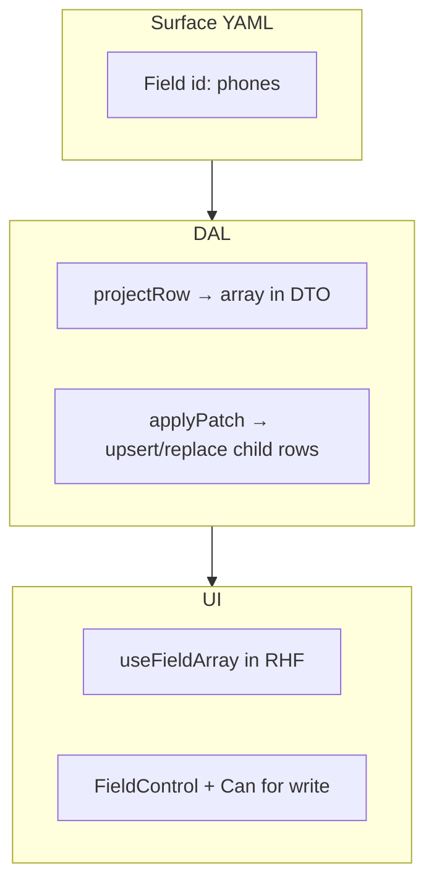

# Child collections on a parent Surface

> **Planning answer:** yes — there is a concrete plan for related records (`party` → phones/emails, `site` → systems, `estimate` → lines). They are **logical Fields** on the parent **detail** Surface, not separate Surfaces per child row.

## Pattern overview



| Layer | Responsibility |
|-------|----------------|
| **YAML** | Field id (`phones`, `emails`, `line_items`) with `columns: []` or child-table column refs for codegen cross-check |
| **Zod** | Patch key is `z.array(z.object({...})).strict()` — strict array elements |
| **DAL `get`** | Join child tables; omit Field if no `read` |
| **DAL `patch`** | Transaction: update anchor + replace/sync children for writable array Fields |
| **UI** | `useFieldArray`; add/remove rows gated on `write`; save sends whole array |

## v1 patch semantics: **replace collection**

When the client PATCHes `phones`, the body includes the **full desired array**. DAL:

1. Validates each element with narrowed Zod.
2. Deletes child rows for that party not in the payload (or soft-replace via `DELETE + INSERT` in one transaction).
3. Upserts rows with stable `id` when editing existing lines.

**Defer delta/op-based patches** (`{ op: 'add', ... }`) until needed — replace is easier to test and matches RHF field-array submit shape.

## Example: `contact_detail`

### Surface YAML (sketch)

```yaml
id: contact_detail
anchorTable: party
tables:
  - party
  - party_phone
  - party_email
  - party_role
fields:
  - id: profile
    columns:
      - column: party.display_name
        type: string
      - column: party.kind
        type: string
  - id: phones
    columns: []   # logical — DAL maps to party_phone
  - id: emails
    columns: []
  - id: roles
    columns: []   # party_role tags — may be read-only on detail, edited elsewhere
```

Codegen today: multi-table glue is **hand-written**; `phones` / `emails` stubs in descriptor + repository.

### DTO shape (projected)

```json
{
  "id": "…",
  "profile": { "display_name": "Acme", "kind": "organization" },
  "phones": [
    { "id": "…", "label": "main", "number": "555-0100", "is_primary": true }
  ],
  "emails": [
    { "id": "…", "label": "billing", "address": "ap@acme.com", "is_primary": false }
  ]
}
```

Forbidden Fields are **omitted** from the DTO, not returned as `[]`.

### Patch body (strict)

```json
{
  "phones": [
    { "id": "existing-uuid", "label": "main", "number": "555-0199", "is_primary": true },
    { "label": "fax", "number": "555-0200", "is_primary": false }
  ]
}
```

New rows omit `id` (server generates). Unknown top-level keys → **400**.

### Repository (hand-written SQL)

- `loadPartyRelated(partyId)` → phones, emails
- `replacePartyPhones(partyId, rows[])` in same transaction as anchor patch
- Audit: include child snapshot in `before`/`after` when mode requires

## UI: React Hook Form

```tsx
// Inside ContactDetailForm — manifest from CapabilitiesProvider
const { fields, append, remove } = useFieldArray({ control, name: "phones" });

<FieldControl manifest={manifest} field="phones">
  {fields.map((field, index) => (
    <RhfInput key={field.id} name={`phones.${index}.number`} … />
  ))}
  <Can manifest={manifest} field="phones" action="write">
    <Button onClick={() => append({ label: "", number: "", is_primary: false })}>
      Add phone
    </Button>
  </Can>
</FieldControl>
```

**Read-only:** `phones` readable but not writable → render `Descriptions` / static list, hide add/remove.

**Validation:** element schema from codegen patch schema; resolver surfaces per-row errors.

## Line items (estimates, jobs, invoices)

Same pattern at larger scale:

| Surface | Field id | Child table |
|---------|----------|-------------|
| `estimate_detail` | `line_items` | `estimate_line` |
| `job_detail` | `line_items` | `job_line` |
| `invoice_detail` | `line_items` | `invoice_line` |

Extra rules (implemented in DAL, not generic kernel):

- **Snapshot on copy** — `copyEstimateToJob(estimateId)` creates `job_line` from `estimate_line` values
- **Ordering** — `line_number` or `sort_order` column
- **Progress** — `job_line_progress` may be a nested array Field or separate sub-section with its own Field id

## Permissions

| Grant | UI |
|-------|-----|
| no `read` on `phones` | Section omitted |
| `read` only | Static list |
| `read` + `write` | Editable field array + add/remove |

Bulk delete of parent cascades children in SQL (`ON DELETE CASCADE`).

## Latch platform follow-ups

Log in [latch-feedback.md](./latch-feedback.md):

- Codegen **collection field** stub in multi-table descriptors
- Documented patch contract for array Fields
- Optional `<FieldArrayControl>` primitive in `@latch/react`

## Tasks

- Slice 1 task **14** — implement phones/emails on `contact_detail` ([01-task-index.md](./tasks/01-task-index.md))
- Slice 4+ — line items on estimate/job surfaces
