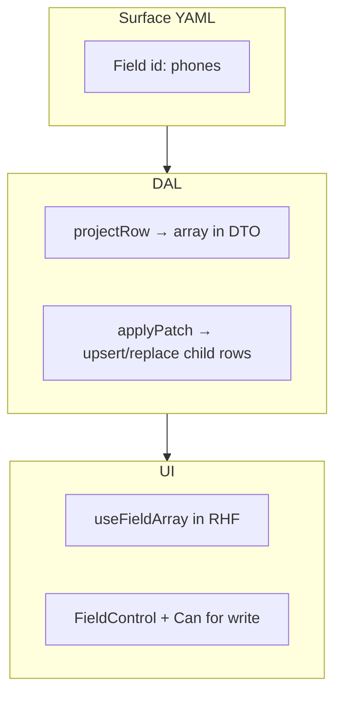

# Child collections on a parent Surface

> **Planning answer:** yes — there is a concrete plan for related records (`party` → phones/emails, `site` → systems, `estimate` → lines). They are **logical Fields** on the parent **detail** Surface, not separate Surfaces per child row.

## Pattern overview



| Layer | Responsibility |
|-------|----------------|
| **YAML** | Field id (`phones`, `emails`, `line_items`) with `columns: []` or child-table column refs for codegen cross-check |
| **Zod** | Patch key is `z.array(z.object({...})).strict()` — strict array elements |
| **DAL `get`** | Join child tables; omit Field if no `read` |
| **DAL `patch`** | Transaction: update anchor + replace/sync children for writable array Fields |
| **UI** | `useFieldArray`; add/remove rows gated on `write`; save sends whole array |

## v1 patch semantics: **replace collection**

When the client PATCHes `phones`, the body includes the **full desired array**. DAL:

1. Validates each element with narrowed Zod.
2. Deletes child rows for that party not in the payload (or soft-replace via `DELETE + INSERT` in one transaction).
3. Upserts rows with stable `id` when editing existing lines.

**Defer delta/op-based patches** (`{ op: 'add', ... }`) until needed — replace is easier to test and matches RHF field-array submit shape.

## Example: `customer_detail` *(lens — pattern shared across `{role}_detail`)*

Slice 1 implemented the same shape on interim `contact_detail`; wave 1 splits type lenses per [party list/detail decision](./decisions/party.md#decision-party-listdetail-surface-shape-2026-06-16-locked-2026-06-17).

### Surface YAML (sketch)

```yaml
id: contact_detail
anchorTable: party
tables:
  - party
  - party_phone
  - party_email
  - party_role
fields:
  - id: profile
    columns:
      - column: party.display_name
        type: string
      - column: party.kind
        type: string
  - id: phones
    columns: []   # logical — DAL maps to party_phone
  - id: emails
    columns: []
  - id: roles
    columns: []   # party_role tags — may be read-only on detail, edited elsewhere
```

Codegen today: multi-table glue is **hand-written**; `phones` / `emails` stubs in descriptor + repository.

### Decision: SubHub `contact_detail` implementation (2026-06-13)

**Choice:** Hand-written `contactDetailDescriptor`, `ContactDetailPatchSchema`, and `projectContactDetailRow` live in [`lib/contacts/descriptors.ts`](../lib/contacts/descriptors.ts) (not generated glue). Repository replace helpers: `loadPartyPhones` / `loadPartyEmails`, `replacePartyPhones` / `replacePartyEmails` in [`lib/contacts/repository.ts`](../lib/contacts/repository.ts).

**Rationale:** Codegen emits placeholder `user_id` array elements for empty-column logical Fields (L2). IAM pattern (`user_roles_detail`, `role_detail`) already overrides generated glue in app descriptors; same approach for child collections until collection Field codegen ships.

### DTO shape (projected)

```json
{
  "id": "…",
  "profile": { "display_name": "Acme", "kind": "organization" },
  "phones": [
    { "id": "…", "label": "main", "number": "555-0100", "is_primary": true }
  ],
  "emails": [
    { "id": "…", "label": "billing", "address": "ap@acme.com", "is_primary": false }
  ]
}
```

Forbidden Fields are **omitted** from the DTO, not returned as `[]`.

### Patch body (strict)

```json
{
  "phones": [
    { "id": "existing-uuid", "label": "main", "number": "555-0199", "is_primary": true },
    { "label": "fax", "number": "555-0200", "is_primary": false }
  ]
}
```

New rows omit `id` (server generates). Unknown top-level keys → **400**.

### Repository (hand-written SQL)

- `loadPartyRelated(partyId)` → phones, emails
- `replacePartyPhones(partyId, rows[])` in same transaction as anchor patch
- Audit: include child snapshot in `before`/`after` when mode requires

## UI: React Hook Form

Scalar fields use `SurfaceFormLayout` + `*Input` controllers (`FormFieldItem`) inside `FormSection` (default max 960px). Collection Fields use **`FieldArrayTable`** inside **`FormSection width="full"`** — the section does not cap width; pass **`maxWidth`** on the table (e.g. `TABLE_WIDTH_LG`) so the list/table structure is capped independently.

```tsx
// Scalar — inside SurfaceFormLayout + FormSection (default width)
<TextInput field="display_name" name="display_name" label="Display name" />

// Collection — full-width section; table carries its own max
<FormSection title="Phones" width="full">
  <FieldArrayTable
    field="phones"
    name="phones"
    maxWidth={TABLE_WIDTH_LG}
    createRow={() => ({ label: "", number: "", is_primary: false })}
    addLabel="Add phone"
    columns={[
      {
        key: "label",
        title: "Label",
        render: ({ index, writable, loading, disabled }) => (
          <Controller
            name={`phones.${index}.label`}
            render={({ field }) =>
              writable ? <Input {...field} disabled={disabled} /> : <Typography.Text>{field.value}</Typography.Text>
            }
          />
        ),
      },
      // … number, is_primary columns
    ]}
  />
</FormSection>
```

**Read-only:** `useFieldMode(field)` → `"read"` renders read cells; no footer add button or delete column.

**Write:** `"write"` → editable cells; `<Can field="phones" action="write">` on add/delete (inside `FieldArrayTable`).

**Validation:** element schema from patch schema; resolver surfaces per-row errors (cell `status` / table row — follow-on).

**Migrate from:** `PhoneEmailFields` row/`RhfInput` pattern → `FieldArrayTable` when contacts move to the shared stack.

## Site collections (`site_detail` — Slice 2)

Same replace-on-save pattern for child collections on `site_detail`:

| Field id | Child table | Notes |
|----------|-------------|-------|
| `contacts` | `site_contact` + `site_contact_relation` | `party_id`, `relation_id` (display name from catalog) |

Catalog starts **empty** in `019_site.sql`. Ongoing edit via **`site_contact_relation_table`** ([catalog table page](./decisions/general.md#decision-catalog-tables--editable-table-page-not-master-detail-2026-06-16); optional first-use suggestions via [progressive setup](./decisions/cross-cutting.md#decision-progressive-setup--master-catalogs-2026-06-16); local dev rows via [`020_site_contact_relation_dev_seed.sql`](../../migrations/020_site_contact_relation_dev_seed.sql).

No address collection on `site_detail` — sites are logical places; postal addresses live on `party_address`; in-building scope on `site_section` / `site_location` ([decision](./decisions/site.md#decision-address-vs-site-geography--rename-and-split-2026-06-17).

`party_address` on `{role}_detail` lenses (wave 2) — same replace-array pattern; two-table spine + copy-on-write — [`surface-specs/party-addresses.md`](./surface-specs/party-addresses.md).

Installed systems at a site deferred to catalog slice (items/parts linkage), not `site_detail` collections.

## Catalog tables (`{table}_table` Surfaces)

Same replace-array algorithm as child collections, scoped to the **whole catalog table** ([decision](./decisions/general.md#decision-replace-array-sync-algorithm-2026-06-22)):

| Surface | Route PATCH body | Order field |
|---------|------------------|-------------|
| `site_contact_relation_table` | `{ rows: [{ id?, display_name }] }` | `sort_order` — 1-based from array index |

**UI:** `CatalogTableSurface` + `FieldArrayTable` (Save/Revert toolbar, footer add, staged delete, optional drag sort).

**Permissions:** Surface **`write`** for add/edit/Save; Surface **`delete`** for row remove (not Field write). See [catalog UX decision](./decisions/general.md#decision-catalog-table-ux--draft-saverevert-2026-06-22).

**First instance:** [`site-contact-relation.md`](./surface-specs/site-contact-relation.md).

## Line items (estimates, jobs, invoices)

Same pattern at larger scale:

| Surface | Field id | Child table |
|---------|----------|-------------|
| `estimate_detail` | `line_items` | `estimate_line` |
| `job_detail` | `line_items` | `job_line` |
| `invoice_detail` | `line_items` | `invoice_line` |

Extra rules (implemented in DAL, not generic kernel):

- **Snapshot on copy** — `copyEstimateToJob(estimateId)` creates `job_line` from `estimate_line` values (including planned `location_id` for in-building scope — [decision](../decisions/site.md#decision-site-owned-sections-and-locations--lifecycle-and-history-2026-06-17))
- **Ordering** — `line_number` or `sort_order` column
- **Progress** — `job_work_item` nested array Field or sub-section on `job_detail` ([decision](./decisions/job.md#decision-field-status--job_work_item-2026-06-17))

## Billable staging (jobs → invoices)

Parallel to requisition before PO — earned rows before customer invoice:

| Surface | Field id | Child table |
|---------|----------|-------------|
| `job_detail` (billing section) | `billable_items` | `billable_line` |

Extra rules (DAL):

- **Auto-generate** — refresh `open` rows from `job_work_item` (install), receipt qty (deferred), or manual entry per [billing decision](./decisions/billing.md#decision-billing--earned-staging-progress-sov-retainage-2026-06-17))
- **Pickup** — selected `open` rows → `invoice_line` with `billable_line_id` (canonical); set `billable_line.invoice_line_id` in same transaction
- **Void invoice** — revert linked billable rows to `open`
- **Cap** — billed qty per `job_line` cannot exceed sold quantity

## SOV milestones (`progress_sov` jobs)

| Surface | Field id | Child tables |
|---------|----------|--------------|
| `job_detail` (Billing tab) | `sov_milestones` | `schedule_of_value`, `sov_line`, `sov_allocation` |

Visible when `job.billing_model = progress_sov`. No standalone SOV Surface — [SOV UI decision](./decisions/billing.md#decision-sov-ui--nested-on-job_detail-billing-tab-2026-06-17).

Extra rules (DAL):

- **Allocation XOR** — each `sov_allocation` row: exactly one of `allocation_pct` or `allocated_value`
- **Cap** — milestone billing cannot exceed `sov_line.scheduled_value` minus prior invoiced amounts
- **Sync warning** — DAL warns when SUM(`sov_line.scheduled_value`) diverges from active sold scope (auto-sync deferred)

## Permissions

| Grant | UI |
|-------|-----|
| no `read` on `phones` | Section omitted |
| `read` only | Static list |
| `read` + `write` | Editable field array + add/remove |

Bulk delete of parent cascades children in SQL (`ON DELETE CASCADE`).

## Latch platform follow-ups

Log in [latch-feedback.md](./latch-feedback.md):

- Codegen **collection field** stub in multi-table descriptors
- Documented patch contract for array Fields
- Optional `<FieldArrayControl>` primitive in `@latch/react`

## Tasks

- Slice 1 task **14** — implement phones/emails on `contact_detail` ([01-task-index.md](./tasks/01-task-index.md))
- Slice 2 — `site_detail` collections ([surfaces.md](./surfaces.md), wave 1)
- Slice 4+ — line items on estimate/job surfaces
