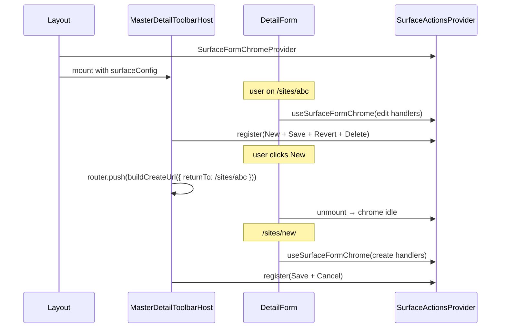

# 12 — Master-detail chrome (toolbar + create navigation)

> **Status:** Planning (2026-07-01). Locks shared UI/navigation for list+detail Surfaces before per-surface retrofit and category create fixes.
>
> **Decisions:** [list+detail create](../decisions/general.md#decision-listdetail-surface-create--toolbar-and-picker-add-new-2026-06-19), [Surface create route `/new`](../decisions/general.md#decision-surface-create-route--new--db-assigned-id-2026-06-25), [picker return context](../decisions/general.md#decision-picker-return-context--url-protocol-2026-06-24).
>
> **Task (draft):** [38-master-detail-chrome.md](../tasks/38-master-detail-chrome.md).

## Problem

SubHub has a **consistent data spine** (DAL hooks, prefetch, `MasterDetailShell`, `SurfaceFormRoot`) but **reimplements the same chrome** in every Surface:

| Symptom | Example |
|---------|---------|
| **New** only on list placeholder | `SiteList`, `PartList`, … use `onListRoute` — hidden on `<surface>/[id]` despite locked decision |
| **Toolbar registration fights** | List pane + detail form both call `useRegisterSurfaceActions`; last mount wins |
| **Cancel / returnTo inconsistent** | `PartyDetailForm` / `SiteDetailForm` correct; `PartDetailForm` / `EstimateDetailForm` omit Cancel |
| **Categories one-off** | `CategoryTreeList` POSTs on click; **New child** unreachable (toolbar gated to list route while selection lives on detail route) |
| **Copy-paste** | Debounced search, layout prefetch, `new/page.tsx` shells, toolbar memos (~25–80 lines × N surfaces) |

**Goal:** One reusable **master-detail chrome** layer. Domain forms stay bespoke; navigation and toolbar do not.

---

## Locked behavior (already in decisions)

| Topic | Rule |
|-------|------|
| **New placement** | Same toolbar slot on `<surface>` **and** `<surface>/[id]` (and create route uses Save/Cancel only — no New) |
| **New label** | **`New`** only — not `New site`, `New part`, … |
| **Create flow** | Navigate to `<surface>/new` → draft form → **Save** (dropdown) or **Save and New** → see [A2b](#a2b-create-save-actions--locked-2026-07-01-session-1) |
| **Permission (business)** | Gate **New** on `*_detail` **`write`** — not `*_list` `create` |
| **Permission (IAM)** | Gate on `*_list` `create` (roles, users) |
| **Create mode toolbar** | **Save** + **Cancel** (not Revert) |
| **Edit mode toolbar** | **Save** + **Revert** + **Delete** (when granted; job may omit delete) |
| **Cancel** | Go to **`returnTo`** when present; else list route |
| **Picker add-new** | `<target>/new?returnTo=…&returnField=…` — existing protocol in `lib/picker-return-context.ts` |
| **Standalone New** | **Also** attach `returnTo` = current URL (list, detail, or origin `/new`) so Cancel is uniform — **amended 2026-07-01** ([general.md](../decisions/general.md)) |

**Reference implementations today:**

- Create + Cancel + `returnTo`: [`PartyDetailForm`](../../components/parties/PartyDetailForm.tsx), [`SiteDetailForm`](../../components/sites/SiteDetailForm.tsx)
- New on detail (partial): [`RoleDetailForm`](../../components/iam/RoleDetailForm.tsx) — still hand-rolled

---

## Work tracks (separate discussions)

| Track | Scope | When |
|-------|--------|------|
| **A — Generic chrome** | Shared navigation + toolbar; retrofit shipped surfaces | **First** — [task 38](../tasks/38-master-detail-chrome.md) |
| **B — Categories** | Draft create, New dropdown (root / child), remove inline POST | **After A Layer 2** — amends [37d](../tasks/37d-category-catalog-dal-surfaces.md) / [category.md](../surface-specs/category.md) |

**Deferred (Track B follow-up):** child-create **spec participation** checklist seeding when `?parent_id=` — separate discussion.

---

## Track A — Extraction layers

Build bottom-up. Each layer is its own PR / discussion.

### Layer 1 — Small utilities (low risk)

| Module | Replaces |
|--------|----------|
| `lib/hooks/use-debounced-value.ts` | 300ms debounce in 4 list components |
| `lib/next-search-params.ts` → `toSearchParams()` | Duplicated helper in `sites/new`, `manufacturers/new` |
| `lib/hooks/create-surface-picker-hook.ts` | Six thin `use-*-picker.ts` wrappers |

No toolbar behavior change.

### Layer 2 — Master-detail chrome (**A1 — this doc § below**)

| Module | Role |
|--------|------|
| `lib/surface-navigation.ts` | Generalize `returnTo` / create URLs / cancel / after-create (extend picker-return, don’t fork) |
| `lib/hooks/use-master-detail-toolbar.ts` | Compose toolbar actions + single `useRegisterSurfaceActions` |
| `components/surface/SurfaceFormChromeContext.tsx` | Detail form publishes save/cancel handlers |
| `components/shell/SurfaceToolbar.tsx` | Add **dropdown** variant on `ToolbarAction` (categories: root / child) |
| Optional: `MasterDetailToolbarHost` in layout | Owns registration; list never registers toolbar |

**Pilot:** **sites** — already has Cancel + `returnTo`.

### Layer 3 — List pane scaffolding

| Module | Role |
|--------|------|
| `components/surface/SurfaceListTable.tsx` | Shared table chrome (error, selection, `size="small"`) |
| `lib/hooks/use-surface-list-search.ts` | Debounced `{ q }` + manifest-gated search |

Lists keep columns; **do not** fold `CategoryTreeList` into a generic table.

### Layer 4 — Route/layout factories (optional)

| Module | Role |
|--------|----------|
| `lib/surfaces/create-master-detail-layout.tsx` | 7 identical `(master-detail)/layout.tsx` files |
| `lib/surfaces/create-surface-page.tsx` | Thin `page.tsx` / `[id]/page.tsx` shells (`id === "new"` branch) |

Factories for **identical** route files only — not a catch-all form ([explicit routes decision](../decisions/general.md#decision-explicit-routes--no-catch-all-surface-pages-or-apis-2026-06-12)).

### Route file shape — prefer `page` + `[id]` over `[[...id]]` (2026-07-01)

When flattening master-detail routes, **do not** consolidate into a single optional catch-all (`sites/[[...id]]/page.tsx`). Prefer **two explicit page files** per surface and treat **`new` as a sentinel `id`**:

```text
sites/
  layout.tsx       ← list pane + MasterDetailShell + chrome host
  page.tsx         ← /sites — placeholder (“Select a …”)
  [id]/page.tsx    ← /sites/new AND /sites/:id — branch on id
```

| URL | File | Branch |
|-----|------|--------|
| `/sites` | `page.tsx` | Placeholder only |
| `/sites/new` | `[id]/page.tsx` | `id === "new"` → create prefetch + form |
| `/sites/<uuid>` | `[id]/page.tsx` | else → detail prefetch + form |

**Rationale:**

| | `page` + `[id]` | `[[...id]]` |
|--|-----------------|-------------|
| Aligns with [explicit routes](../decisions/general.md#decision-explicit-routes--no-catch-all-surface-pages-or-apis-2026-06-12) | One dynamic segment per domain folder | Optional catch-all; also matches `/sites/a/b` unless guarded |
| Create URL | `/sites/new` unchanged (sentinel in `[id]`) | Same |
| `(master-detail)` route group | Can drop — URLs already flat ([`contacts/layout.tsx`](../../app/(private)/contacts/layout.tsx) precedent) | N/A |
| Auth / prefetch | Layout: list; page: mode-specific `requireAuth` + prefetch | Same logic, one file — harder to read |

**Not in scope:** `app/[surface]/…` catch-all across all domains — still forbidden.

**Toolbar:** Physical buttons render in **`AppShell`** header (`HeaderSurfaceToolbar` via `SurfaceActionsProvider` at root). Surface **`layout.tsx`** owns chrome registration (`MasterDetailToolbarHost`); server **`page.tsx`** does not register buttons — client form or chrome context does.

**Optional follow-up:** merge `new/page.tsx` into `[id]/page.tsx` when touching a surface; orthogonal to Layer 2 chrome work.

### Layer 5 — Detail mutation hook (after Layer 2 proven)

`useSurfaceDetailMutations` + `buildDetailToolbarActions` — config-driven variants (no delete, cancelled guard, etc.).

---

## A1 — Chrome architecture (deep dive)

### A1.1 Root cause: single registration slot

`SurfaceActionsProvider` holds **one** `registration` at a time. In `MasterDetailShell`, **list** and **detail** are siblings:

```text
MasterDetailShell
├── Sider → CategoryTreeList / SiteList / …     ← may call useRegisterSurfaceActions
└── Content → DetailForm / Placeholder / …        ← may call useRegisterSurfaceActions
```

React effect order: **detail wins**. Lists that register `[]` off-route still run effects and can flash or race. **Categories** disabled toolbar on detail route entirely — so create actions vanish when a row is selected.

**Invariant to enforce:** Exactly **one** registrar per master-detail layout route tree.

### A1.2 Options considered

| Option | Pros | Cons |
|--------|------|------|
| **A — Hook only** (`useMasterDetailToolbar` in each list + form) | Minimal new files | Still two callers; easy to regress |
| **B — Context + layout host** (recommended) | Single registrar; list is list-only | New context; forms must publish state |
| **C — Merge registrations in provider** | Lists and forms both register partial actions | Provider complexity; ordering bugs |
| **D — Toolbar in app header globally** | One physical location | Breaks surface-scoped manifest gating |

**Recommendation: Option B** — `SurfaceFormChromeProvider` in `(master-detail)/layout.tsx` + `MasterDetailToolbarHost` child that calls `useMasterDetailToolbar`.

### A1.3 Component tree (target)

```text
(private)/sites/layout.tsx
  SurfaceFormChromeProvider
    createManifest from prefetch
    surfaceConfig: { listRoute, newRoute, detailRoute, detailSurfaceId, create?: CreateConfig }
    HydrationBoundary
      MasterDetailShell
        list → SiteList                    // NO toolbar registration
        children → page.tsx | [id]/page.tsx   // [id] includes id === "new"
          SiteDetailForm
            useSurfaceFormChrome({ ... })  // publishes handlers + mode
      MasterDetailToolbarHost              // ONLY registrar
        reads: pathname, chrome context, surfaceConfig
        registers into SurfaceActionsProvider → HeaderSurfaceToolbar (AppShell)
```

### A1.4 `SurfaceFormChromeContext` API — **locked (2026-07-01, Session 1 / A1a)**

**Split:** layout **host** owns **New** + pathname mode + `createManifest` for New gating. **Detail form** publishes form actions via `useSurfaceFormChrome`.

```ts
type SurfaceFormChromeMode = "create" | "edit";

type SurfaceFormChromeRegistration = {
  mode: SurfaceFormChromeMode;
  manifest: Manifest;       // activeManifest from form (gates Save / Revert / Delete)
  canSave: boolean;
  saving: boolean;
  onSave: () => void;

  // edit
  canDelete?: boolean;
  isDirty?: boolean;        // gates Save + Revert on edit only; ignored on create
  onRevert?: () => void;
  onDelete?: () => void;

  // create
  onCancel?: () => void;
  onSaveAndNew?: () => void;   // create: Save and New — host omits if undefined or picker returnField
};

// Form: register on mount, clear on unmount (no explicit idle registration).
useSurfaceFormChrome(registration: SurfaceFormChromeRegistration): void;
```

| Decision | Choice |
|----------|--------|
| **`isDirty`** | **1-A** — edit: Save + Revert disabled when `!isDirty`; create: ignore `isDirty` |
| **`manifest`** | **2-A** — form publishes `activeManifest`; host uses layout `createManifest` only for **New** |
| **Surface guards** (e.g. job cancelled) | **3 — case by case; v1 fold into `canSave` / omit handlers** — host stays dumb. Toolbar may later support extra menu/dropdown items per surface; revisit when a surface needs form-owned overflow actions |
| **Lifetime** | **4-A** — register on mount, clear on unmount; list placeholder = no registration |
| **`isDirty` on create** | **C5-A** — always publish; used for Cancel confirm + **New** disable, not for Save gating on create |

**Dirty leave (A1c, locked 2026-07-01):**

| Action | When dirty | Owner |
|--------|------------|--------|
| **Cancel** (create) | Confirm *"Leave without saving?"* then navigate | **Form** — `onCancel` wraps confirm, host calls `onCancel` |
| **New** | **Disabled** — user must Save or Cancel first | **Host** — `disabled: context.isDirty` on New |
| **Revert** / **Save** | No confirm | unchanged |

Extends [picker dirty confirm](../decisions/general.md#decision-picker-navigate-away--dirty-form-confirm-v1-2026-06-24) to toolbar **Cancel** only; **New** is blocked, not confirmed (C2-C). Split ownership (C3-C): form confirms Cancel, host gates New.

**Idle:** On `<surface>` placeholder, no form mounts → context empty → host shows **New** only (A1b).

### A1.4b Route mode vs context — **locked (2026-07-01, Session 1 / A1b)**

**Pathname is source of truth** for route mode (`idle` | `create` | `edit`). Context only supplies form action state when a detail form is mounted.

| Pathname | Route mode | Toolbar before form mounts | After `useSurfaceFormChrome` registers |
|----------|------------|----------------------------|----------------------------------------|
| `<surface>` | idle | **New** only | **New** only (no form) |
| `<surface>/new` | create | **Save** ▾ (disabled) + **Cancel** | **Save** dropdown + **Cancel** from context |
| `<surface>/[id]` | edit | **Save** (disabled) + **New** + **Revert** / **Delete** (disabled) | enabled per context |

| Decision | Choice |
|----------|--------|
| **B1** Loading / hydration | **A** — show edit/create toolbar shell disabled until context registers |
| **B2** Navigate list → detail | **A** — pathname wins; empty context on detail route = disabled form buttons, **New** still active |
| **B3** Placeholder | **A** — no registration; pathname `/sites` → **New** only |
| **B4** `entityId` for New / child create | **A** — host parses from pathname via surface route config, not from context · **Amended (2026-07-02, [task 39](../tasks/39-toolbar-chrome-slots.md)):** flat surfaces unchanged; **tree surfaces** (categories) source New child parent from **`MasterDetailSelectionContext`** (`selectionRef` at click, `selectedId ?? entityId` fallback) — never pathname-only during pending navigation |

### A1.5 `surface-navigation.ts` API (sketch)

Extend [`picker-return-context.ts`](../../lib/picker-return-context.ts) — same query param names:

```ts
currentReturnTo(pathname: string, search: URLSearchParams): string

buildCreateUrl(input: {
  newPath: string;                    // routes.sites.new
  returnTo?: string;                  // default: currentReturnTo(...)
  params?: Record<string, string>;    // categories: parent_id
}): string

navigateOnCancel(router, returnTo: string | null, fallbackList: string): void

navigateAfterCreate(router, input: {
  returnTo: string | null;
  returnField?: string | null;
  newId: string;
  fallbackDetail: (id: string) => string;
}): void
```

**Rule:** Every **New** click (list or detail) sets `returnTo` to the **current** pathname + query.

### A2b Create Save actions — **locked (2026-07-01, Session 1)**

On **create** route (`<surface>/new`), primary **Save** is a **hover** dropdown (first dropdown-on-toolbar exception alongside categories **New**):

| Menu item | After successful POST |
|-----------|------------------------|
| **Save** | `router.replace(<surface>/[newId])` — open new record in edit mode. Picker create (`returnField` set): `redirectAfterCreate(returnTo, newId)` instead. |
| **Save and New** | Stay on `<surface>/new` (preserve `returnTo` query); reset form to blank create defaults. **Standalone create only** — omit when `returnField` is set. |

| Topic | Choice |
|-------|--------|
| **Trigger** | **Hover** on create Save dropdown |
| **Edit mode Save** | Plain button (no dropdown) |
| **`onSaveAndNew`** | Form publishes via chrome context; host renders second menu item |

Form registration adds optional `onSaveAndNew?: () => void` — host shows menu item only when provided and not a picker create.

### A2d `returnTo` validation — **locked (2026-07-01, Session 1)**

Generalize [`sanitizeReturnTo`](../../lib/provision-user-context.ts) into `surface-navigation.ts` (provision-user re-imports). Apply to **all** `returnTo` reads — standalone New, picker create, provision user.

| Decision | Choice |
|----------|--------|
| **D1** When | **A** — validate on read (Cancel, after Save, picker return) and when building create URLs |
| **D2** Invalid fallback | **A** — fall back to `<surface>` list route |
| **D3** Helper location | **A** — shared `surface-navigation.ts` |
| **D4** Scope | **A** — all `returnTo` consumers |
| **D5** Encode on write | **A** — sanitize parsed query `returnTo`; trust host-built `currentReturnTo()` |

Rules (unchanged from [provision decision](../decisions/general.md#decision-provision-user-return-context-2026-06-25)): same-origin relative path only (`/` prefix, no `//`, no scheme).

### A3 Sites pilot PR scope — **locked (2026-07-01, Session 1)**

| Decision | Choice |
|----------|--------|
| **E1** PR shape | **A** — one PR: Layer 1 utilities + Layer 2 chrome + sites wiring + route flatten |
| **E2** Tests | **A** — unit tests for `sanitizeReturnTo` / `buildCreateUrl`; manual verify checklist for sites UI |
| **E3** STATUS | **A** — repoint **Right now** to [task 38](../tasks/38-master-detail-chrome.md) when implementation starts |

**In scope (sites pilot):** `surface-navigation`, chrome context + host, `SurfaceToolbar` dropdowns (create Save hover; New button), `SiteList` / `SiteDetailForm` retrofit, `sites/layout` + `page` + `[id]/page` route flatten.

**Out of scope:** other surfaces, `SurfaceListTable`, registry file, categories (Track B), Layer 5 mutation hook.

**Session 1 complete** — ready to implement task 38 Step 1–2.

### A1.6 `useMasterDetailToolbar` (sketch)

```ts
type CreateConfig =
  | { variant: "button"; newPath: string }
  | {
      variant: "dropdown";
      trigger?: "click" | "hover";
      items: Array<{
        key: string;
        label: string;
        href: string;
        disabled?: boolean;
      }>;
    };

type MasterDetailSurfaceConfig = {
  listRoute: string;
  newPath: string;
  detailRoute: (id: string) => string;
  detailSurfaceId: SurfaceDetailId;
  createGate: "write" | "create";     // business vs IAM
  create?: CreateConfig;
  entityId?: string | null;           // from pathname — for child create href
};

// Used only by MasterDetailToolbarHost:
useMasterDetailToolbar(config: MasterDetailSurfaceConfig): void
```

**Toolbar composition (priority):**

| Route | Primary | Secondary |
|-------|---------|-----------|
| `<surface>` | — | **New** |
| `<surface>/[id]` | **Save** | **New**, **Revert**, **Delete** |
| `<surface>/new` | **Save** ▾ (hover) + **Cancel** | **Save** → detail id; **Save and New** → reset form on `/new` |

**New** hidden on `/new`. **New** omitted when manifest denies create gate.

### A1.7 Registration flow (sequence)



### A1.8 `SurfaceToolbar` dropdown variant

```ts
type ToolbarAction =
  | { variant?: "button"; key; label; onClick; ... }
  | {
      variant: "dropdown";
      key: "new";
      label: "New";
      trigger?: "click" | "hover";
      menu: MenuProps["items"];
      surfaceAction: "write" | "create";
      disabled?: boolean;
    };
```

Categories (Track B) is the **first** dropdown consumer. All other surfaces use `variant: "button"`.

### A1.9 Layout integration

Each surface `layout.tsx` adds provider + host (see [Route file shape](#route-file-shape--prefer-page--id-over-id-2026-07-01) above — `(master-detail)` route group optional):

```tsx
<SurfaceFormChromeProvider>
  <HydrationBoundary state={dehydratedState}>
    <MasterDetailShell list={<SiteList />}>
      {children}
    </MasterDetailShell>
    <MasterDetailToolbarHost
      createManifest={createManifest}
      config={MASTER_DETAIL_SURFACES.sites}
    />
  </HydrationBoundary>
</SurfaceFormChromeProvider>
```

Optional registry `lib/master-detail-registry.ts`:

```ts
export const MASTER_DETAIL_SURFACES = {
  sites: { listRoute: routes.sites.list, newPath: routes.sites.new, ... },
  categories: {
    ...,
    create: {
      variant: "dropdown",
      items: (ctx) => [ /* root, child */ ],
    },
  },
} as const;
```

### A1.10 Migration checklist (per surface)

1. Remove `useRegisterSurfaceActions` from `*List.tsx`.
2. Remove `onListRoute` gating.
3. Replace form toolbar memo with `useSurfaceFormChrome`.
4. Wire `returnTo` on all New navigations (host handles when using registry).
5. Normalize Cancel on create (if missing).
6. Delete empty toolbar registrations.

**Order:** sites → parts → jobs → estimates → employees → manufacturers → categories (Track B).

### A1.11 Out of scope for A1

| Area | Why |
|------|-----|
| IAM grant matrix / `RoleDetailForm` | Different form stack — adopt navigation helpers only |
| `ContactDetailForm` | Edit-only hub |
| Domain field UI | Stays per Surface |
| Generic `SurfaceDetailForm` | Would fight tabs, pickers, trees |
| DAL / API changes | Chrome is client-only |

### A1.12 Open questions (Session 1)

| # | Topic | Status |
|---|--------|--------|
| **A1a** | `SurfaceFormChromeContext` API | **Locked** — [A1.4](#a14-surfaceformchromecontext-api--locked-2026-07-01-session-1--a1a) |
| **A1b** | Idle mode + pathname vs context | **Locked** — [A1.4b](#a14b-route-mode-vs-context--locked-2026-07-01-session-1--a1b) |
| **A1c** | Dirty leave on Cancel / New | **Locked** — Cancel: confirm in form `onCancel` (C1-A); New: disabled when dirty (C2-C); `isDirty` always published (C5-A) |
| **A2b** | Create Save actions | **Locked** — Save dropdown (hover): Save → record page; Save and New → reset form ([A2b](#a2b-create-save-actions--locked-2026-07-01-session-1)) |
| **A2d** | `returnTo` validation | **Locked** — [A2d](#a2d-returnto-validation--locked-2026-07-01-session-1) |
| **A3** | Sites pilot PR scope | **Locked** — [A3](#a3-sites-pilot-pr-scope--locked-2026-07-01-session-1) |
| Q1 | Dropdown `trigger`: hover vs click? | **Click** default (Track B) |
| Q2 | `MasterDetailToolbarHost` sibling of shell | Sibling under provider |
| Q3 | Registry file vs inline config | Inline on sites pilot |
| Q4 | `use-surface-detail-mutations` same PR as chrome? | **No** — Layer 5 |

---

## Track B — Categories (after Layer 2)

| Change | Notes |
|--------|-------|
| Remove inline POST from `CategoryTreeList` | Use chrome **New** dropdown |
| Root → `/categories/new?returnTo=…` | `parent_id` omitted |
| Child → `/categories/new?returnTo=…&parent_id=<currentId>` | Disabled when no tree selection and no pathname id; parent id from **`MasterDetailSelectionContext`** at click ([task 39](../tasks/39-toolbar-chrome-slots.md)) |
| `CategoryDetailForm` | Draft save includes `parent_id`; Cancel via `surface-navigation` |
| Spec participation on child create | **Deferred** — separate discussion |

Update [category.md](../surface-specs/category.md) toolbar table when implementing.

---

## Related

- [13-toolbar-chrome.md](./13-toolbar-chrome.md) — **follow-on (2026-07-02)** — slot-based list/form → toolbar communication; category New child fix
- [routing-and-libraries.md](../routing-and-libraries.md) — Surface toolbar, master-detail layout
- [surface-form-prefetch.md](../spikes/surface-form-prefetch.md) — hydration pattern
- [37d-category-catalog-dal-surfaces.md](../tasks/37d-category-catalog-dal-surfaces.md) — shipped category UI (to amend in Track B)
