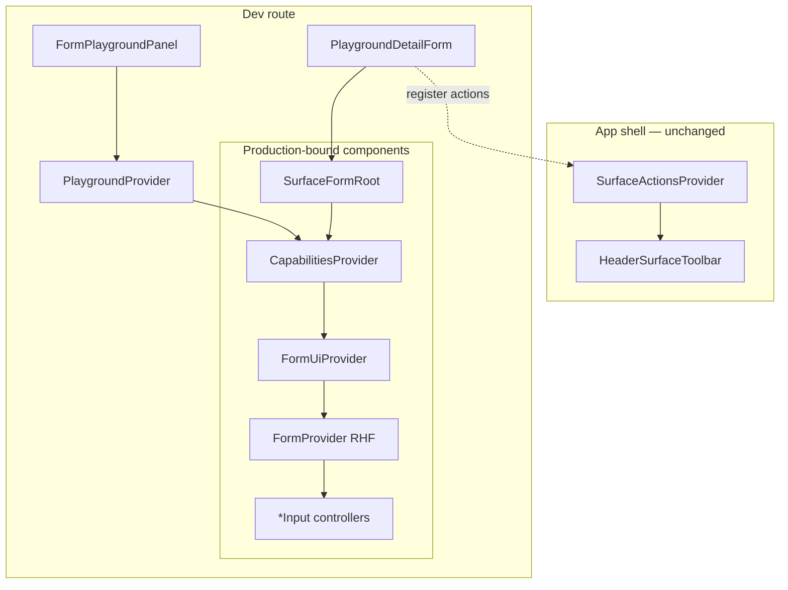

# Spike — surface form playground

> **Status:** PR 5 complete (2026-06-22). **Route:** `/dev/form-playground` (dev-only). **Next:** production `SiteDetailForm` (task 20 step 2.7) after [surface-form-prefetch](./surface-form-prefetch.md) Phase 3.
>
> **Blocks:** production `SiteDetailForm` (task 20 step 2.7) until **PR 5 verify** — layout shell + `Form.Item` field shell should land before the first production consumer. Core primitives (PR 3–4) are proven; extended gallery does not block sites UI alone.
>
> **Related:** [routing-and-libraries.md](../routing-and-libraries.md) · [task 20](../tasks/20-ui-discovery.md) · [latch-feedback L3](../latch-feedback.md)

## Goal

Prove the **reusable detail-form stack** in isolation before wiring `SiteDetailForm` or refactoring contacts. The playground is a **control gallery**: one sample of each manifest-aware antD + RHF controller, exercisable under every permission and UI state.

| # | Prove |
|---|--------|
| 1 | Toolbar actions render in **app header** via `useRegisterSurfaceActions` |
| 2 | Manifest drives field visibility and toolbar grants |
| 3 | Field controls return **`null`** when field `read` denied (`none`) |
| 4 | Toolbar buttons hidden when surface `write` / `delete` denied |
| 5 | **Loading** — label visible, control area skeleton |
| 6 | **Read-only** — field `read` ∧ ¬`write` (not `disabled`; control-specific static display) |
| 7 | **Saving** — write-mode controls `disabled`; read-only unchanged; Save shows spinner |
| 8 | Save → `handleSubmit` → patch body includes **writable fields only** |
| 9 | Each antD controller type follows the same manifest + `FormUi` contract |

Fixture manifest + DTO — **no DAL, no API**. Compact control panel in the list slot toggles grants and UI state live.

---

## Architecture (target)



### Layer responsibilities

| Layer | Package / path | Role |
|-------|----------------|------|
| **Playground harness** | `components/dev/*` | Mock manifest, fixture DTO, control panel — **not shipped** to production surfaces |
| **Form shell** | `components/form/` or `components/surface/` | `SurfaceFormRoot` — Capabilities + FormUi + FormProvider + reset + toolbar helper |
| **Form UI context** | `components/surface/FormUiProvider` | `loading`, `disabled` (saving) → all field controls |
| **Field mode** | `components/surface/useFieldMode` | `hidden` \| `read` \| `write` from manifest |
| **Form layout shell** | `components/surface/SurfaceFormLayout` + `components/form/formLayout` | antd `Form` (layout only): grid `labelCol`/`wrapperCol`, `labelAlign="right"`, `labelWrap`, `maxWidth` — **not** antd form state |
| **Field shell** | `components/form/FormFieldItem` (antd `Form.Item`) | Label + `validateStatus` + `help`; no `name` / `rules` — RHF owns values |
| **Collection editor** | `components/form/FieldArrayTable` | antd `Table` + RHF `useFieldArray`; column headers = sub-field labels; no `Form.Item` per cell |
| **Field controllers** | `components/form/*Input` | Built-in read gate + RHF `Controller` inside `Form.Item` + loading/read/write/saving display |
| **Layout** | `components/form/FormSection` | Section heading (production detail-form layout); optional `Row` / `Col` for multi-field rows |
| **Toolbar** | `components/shell/*` (existing) | Header toolbar filters by `surfaceAction` |

### Decision: playground before sites UI (2026-06-21)

**Choice:** Build and verify form primitives on `/dev/form-playground` before task 20 step 2.7 (`SiteDetailForm`).

**Rationale:** Contacts/IAM forms repeat permission, loading, and toolbar wiring by hand. A dev playground de-risks the consolidated stack without coupling to sites DAL/API. Spike code in `components/dev/` may be deleted or gated; `components/form/` and `components/surface/` are production-bound.

### Decision: control gallery scope (2026-06-22)

**Choice:** Expand the playground beyond `TextInput` to sample **every probable antD form control** used (or anticipated) in SubHub detail forms. Approved controllers ship in `components/form/` and replace legacy `Rhf*` wrappers in surface forms.

**Rationale:** Proving the manifest + loading + read-only contract once per control type avoids rediscovering edge cases when `SiteDetailForm`, catalog inline cells, or later slices add new widgets.

### Decision: production-like form chrome (2026-06-22)

**Choice:** The gallery form (right pane) looks like a real detail form — `FormSection` headings and field labels only. **No** playground page title or explanatory copy in the form area. Dev controls stay in the list slot panel.

### Decision: antD form layout, RHF form state (2026-06-22)

**Choice:** Reuse antd **`Form`**, **`Form.Item`**, and responsive **`labelCol` / `wrapperCol`** (grid spans) for label alignment and form width. **Do not** use antd form functionality where RHF is used — no `Form.useForm()`, `onFinish`, `initialValues`, or `Form.Item name` / `rules`. Scalar fields are **full-width** inside one horizontal `Form` so all labels share one column.

**Rationale:** antd horizontal forms align labels via a single form-level `labelCol`/`wrapperCol`. Wrapping individual `Form.Item`s in `Row`/`Col` breaks that shared column — labels and controls misalign across sections. Right-aligned, wrapping labels match antd registration/disabled demos.

**Pattern:**

```tsx
const formItemLayout = {
  labelCol: { xs: { span: 24 }, sm: { span: 6 } },
  wrapperCol: { xs: { span: 24 }, sm: { span: 18 } },
};

<form onSubmit={handleSubmit(onSubmit)}>
  <Form
    component="div"
    layout="horizontal"
    colon={false}
    labelAlign="right"
    labelWrap
    {...formItemLayout}
    style={{ width: "100%", maxWidth: 960, marginInline: "auto" }}
    disabled={saving}
  >
    <FormSection title="Profile">
      <TextInput field="display_name" name="display_name" label="Display name" />
      <SelectInput field="kind" name="kind" label="Kind" options={…} />
    </FormSection>
  </Form>
</form>
```

- **Submit:** Keep RHF `handleSubmit` on a single HTML `<form>` — **not** antd `onFinish`. Header toolbar `onClick: submit` remains valid.
- **Nested forms:** Layout `Form` uses `component="div"` to avoid nested `<form>` elements.
- **Per control:** RHF `Controller` inside presentational `Form.Item` (`label`, `validateStatus`, `help` only) via `FormFieldItem`.
- **Spacing:** antd `itemMarginBottom` (default 24px) — no custom CSS overrides.

### Decision: form width (2026-06-22, amended 2026-07-11)

**Choice:** **`SurfaceFormLayout`** fills the detail pane (`width: "100%"`, no default max). Readable scalar sections use **`FormSection`** with default **`maxWidth: 960`** (`SURFACE_SECTION_MAX_WIDTH`). Collection sections use **`FormSection width="full"`** so the section chrome does not constrain tables — **table / list caps live on the structure** (`FieldArrayTable maxWidth`, `CatalogTableSurface`, estimate Structure / Line items panels) via `TABLE_WIDTH_MD` (1150) / `LG` (1300) / `XL` (1500) / `XXL` (2200). Scalar controls stay capped at **`SURFACE_CONTROL_MAX_WIDTH` (480)** via `formItemLayout`. **Single-column** scalar layout — no `Row`/`Col` around labeled `*Input`s.

**Rationale:** Prevents scalar fields stretching across the full master-detail pane while allowing each table to stop at a content-appropriate width on large viewports.

### Decision: collection fields use FieldArrayTable (2026-06-22)

**Choice:** Child collection Fields (`phones`, `emails`, …) use **`FieldArrayTable`** — antd `Table` with column `title`s, RHF `useFieldArray`, add/remove gated by manifest. Cell editors are bare `Controller` + control (**not** `*Input` / `FormFieldItem`). Section chrome via `FormSection title`.

**Rationale:** Row sub-fields do not get scalar form labels; table headers are the labels. Avoids misalignment with the main form label column. Distinct from catalog **editable table Surfaces** (per-row API) — collections PATCH with the parent form.

### Decision: empty section headings deferred (2026-06-22)

**Choice:** When all fields in a section are `none`, the **section title may still render** (orphan heading). **Defer** auto-hiding empty sections — including field self-registration and manifest field-list gates.

**Rationale:** Playground grant toggling exposes the gap but is acceptable for the spike. Revisit before or during `SiteDetailForm` if orphan headings become painful. **Exception (as-is):** collection blocks may gate the whole section manually (e.g. `PlaygroundPhonesBlock` checks `useFieldMode("phones")`).

---

## Layout

Reuse `MasterDetailShell` — **compact control panel in list slot**, gallery form in content area.

```text
┌──────────────────────────────────────────────────────────────┐
│ Header: [Save] [Delete] …          ← HeaderSurfaceToolbar    │
├──────────────────┬───────────────────────────────────────────┤
│ Preset      [▼]  │ Profile                                   │
│ profile     [▼]  │ Display name  [Input]                     │
│ notes       [▼]  │ Kind          [Select]                    │
│ kind        [▼]  │ … (single-column scalars)                 │
│ …           [▼]  │ Notes         [TextArea]                  │
│ ☐ read ☐ write   │ Portfolio                                 │
│ ☐ delete         │   Customer        [Select]                │
│ ☐ loading        │ …                                         │
│ ☐ saving         │ Phones                                    │
│ {manifest…}      │   [FieldArrayTable — column headers]      │
└──────────────────┴───────────────────────────────────────────┘
```

Per-field dropdown values: **`write`** | **`read`** | **`none`**.

**Gate:** `notFound()` unless `NODE_ENV === 'development'` or `LATCH_DEV_PLAYGROUND=1`.

---

## Control panel UX (target — PR 3)

Replace PR 2 checkbox matrix with a **compact dev harness**. No section titles, intro copy, or bold labels in the panel — field ids and control names are sufficient.

| Control | UI | Effect |
|---------|-----|--------|
| **Preset** | `Select` | Shortcut: Admin, Read-only viewer, Mixed grants, Loading, Saving |
| **Per-field grant** | `Select` per gallery field id | `write` → `["read","write"]`; `read` → `["read"]`; `none` → omit key from `manifest.fields` |
| **Surface actions** | Compact checkboxes | Toggle `read` / `write` / `delete` on `manifest.actions` |
| **UI state** | Compact checkboxes | `loading`, `saving` |
| **Debug** | Collapsed / bottom | Manifest JSON, `isDirty`, last submit body — no "Debug" heading |

Presets set all field dropdowns + UI state in one action; manual dropdown edits override preset until preset is re-selected.

---

## Manifest-aware controllers (`components/form/`)

All controllers share the **`TextInput` contract**: props `field`, `name`, `label`; `useFormContext()`; `useFieldMode(field)`; `useFormUi()`; return `null` when read denied. **PR 5** wraps each control in antd `Form.Item` (replacing interim `FieldShell`).

| Component | antD | Gallery field id | v1 production use | PR |
|-----------|------|------------------|-------------------|-----|
| **`TextInput`** | `Input` | `display_name` | Site name, party names, catalog labels | 1 ✓ |
| **`TextAreaInput`** | `Input.TextArea` | `notes` | Long text on detail forms | 3 ✓ |
| **`SelectInput`** | `Select` | `kind`, `customer_party` | Enums, FK pickers, relation dropdown | 3 ✓ |
| **`CheckboxInput`** | `Checkbox` | `is_active` (scalar) | Boolean scalars | 4 ✓ |
| **`InputNumberInput`** | `InputNumber` | `sort_order` | Catalog `sort_order`; line qty later | 4 ✓ |
| **`RadioInput`** | `Radio.Group` | `kind_alt` *(optional second sample)* | Small fixed enums (alternative to Select) | 4 ✓ |
| **`SwitchInput`** | `Switch` | `is_active` | Boolean scalars (gallery; no v1 Field yet) | 4 ✓ |
| **`AutoCompleteInput`** | `AutoComplete` | `address_line` | **Deferred** — address verification slice | 4 ✓ |
| **`DatePickerInput`** | `DatePicker` | `effective_date` | **Deferred** — scheduling/billing slices | 4 ✓ |
| **`TimePickerInput`** | `TimePicker` | `start_time` | **Deferred** — `job_phase` v2 | 4 ✓ |
| **`TreeSelectInput`** | `TreeSelect` | `category_id` | **Deferred** — category / classification tree | 4 ✓ |
| **`SliderInput`** | `Slider` | `priority` | Gallery only | 4 ✓ |
| **`MentionsInput`** | `Mentions` | `body` | Gallery only; notes @-mentions deferred | 4 ✓ |
| **`TransferInput`** | `Transfer` | `assignee_ids` | Gallery only; IAM uses multi `SelectInput` | 4 ✓ |
| **`UploadInput`** | `Upload` | `attachment` | **Deferred** — attachments slice (#28) | 4 ✓ |

**Read-only display per control type** (PR 3+ decisions):

| Control | Read mode |
|---------|-----------|
| Text / TextArea / InputNumber | borderless `readOnly` or plain text |
| Select / TreeSelect / AutoComplete | selected label text |
| Checkbox / Switch | checked state, not grayed `disabled` |
| Radio | selected option label |
| DatePicker / TimePicker | formatted date/time text |
| Slider | static value or progress display |
| Transfer | static list of selected items |
| Upload | file name list / link, no upload button |
| Mentions | plain text |

**Saving:** write-mode controls get `disabled={true}` from `FormUiProvider`; read-only display unchanged.

**Loading:** label visible; control slot → appropriate `Skeleton.*` (or control-shaped skeleton).

### Collection pattern (not scalar `*Input`)

| Piece | Role | PR |
|-------|------|-----|
| **`FieldArrayTable`** | antd `Table` + `useFieldArray`; column headers; add/remove footer | 5+ |
| **`phones` gallery section** | `FormSection` + `FieldArrayTable`; manifest gate on `phones` Field id | 5+ |
| **Cell editors** | RHF `Controller` + bare control in column `render` — no `FormFieldItem` | 5+ |
| **Read-only collection** | Same table, read renders in cells; no footer/actions | 5+ |

### Legacy (migrate away; not playground targets)

| Component | Superseded by |
|-----------|---------------|
| `RhfInput` | `TextInput` |
| `RhfSelect` | `SelectInput` |
| `RhfPassword` | Stays for login/setup — no manifest gate |
| `ReadOnlyValue` | read mode inside `*Input` controllers |

---

## Fixture surface (playground only)

Fake surface id: `playground_detail` — **not** in policy registry or codegen.

Each gallery control maps to one manifest **Field id** so the panel dropdown can toggle it independently.

| Field id | Type | Gallery control | Section |
|----------|------|-----------------|---------|
| `display_name` | scalar | `TextInput` | Profile |
| `kind` | scalar | `SelectInput` | Profile |
| `kind_alt` | scalar | `RadioInput` *(optional)* | Profile |
| `notes` | scalar | `TextAreaInput` | Notes |
| `customer_party` | scalar | `SelectInput` (static options) | Portfolio |
| `property_owner_party` | scalar | `SelectInput` (static options) | Portfolio |
| `sort_order` | scalar | `InputNumberInput` | Misc |
| `is_active` | scalar | `SwitchInput` | Misc |
| `effective_date` | scalar | `DatePickerInput` | Misc |
| `start_time` | scalar | `TimePickerInput` | Misc |
| `address_line` | scalar | `AutoCompleteInput` | Misc |
| `category_id` | scalar | `TreeSelectInput` | Misc |
| `priority` | scalar | `SliderInput` | Misc |
| `body` | scalar | `MentionsInput` | Misc |
| `assignee_ids` | scalar | `TransferInput` | Misc |
| `attachment` | scalar | `UploadInput` | Files |
| `phones` | collection | field array + row inputs | Phones |

Initial manifest (Admin preset) — all scalar gallery fields `["read","write"]`, `phones` writable:

```json
{
  "surface": "playground_detail",
  "actions": ["read", "write", "delete"],
  "fields": {
    "display_name": ["read", "write"],
    "kind": ["read", "write"],
    "notes": ["read", "write"],
    "customer_party": ["read", "write"],
    "property_owner_party": ["read", "write"],
    "phones": ["read", "write"]
  }
}
```

PR 4 adds remaining field ids to manifest + fixture DTO as each controller lands. `buildPatchBody` includes only fields with write grant.

Zod: local `PlaygroundPatchSchema` under `components/dev/playground-fixtures.ts` (client import only).

---

## PR sequence

| PR | Scope | Exit |
|----|--------|------|
| **PR 1** | Playground shell + `FormUiProvider` + `TextInput` + Admin preset | § PR 1 verify |
| **PR 2** | Control panel + presets (checkbox field grants — **superseded by PR 3 panel UX**) | § PR 2 verify |
| **PR 3** | Panel dropdown UX + production form layout + `SurfaceFormRoot` + v1 controllers + collection stub | § PR 3 verify |
| **PR 4** | Extended antD gallery (remaining `*Input` controllers) | § PR 4 verify |
| **PR 5** | antD `Form` layout shell + `Form.Item` field shell + `maxWidth` + responsive rows | § PR 5 verify ✓ |
| **Follow-up** | Server prefetch + `HydrationBoundary` | [surface-form-prefetch.md](./surface-form-prefetch.md) |

---

## PR 1 — sensible first PR ✓

**Objective:** Clickable dev route that proves one happy path — Admin preset, two scalar fields, header Save, mock submit.

### In scope

| File | Action |
|------|--------|
| `app/(private)/dev/form-playground/layout.tsx` | `requireAuth` + `MasterDetailShell` + dev gate |
| `app/(private)/dev/form-playground/page.tsx` | Render `PlaygroundDetailForm` |
| `components/dev/PlaygroundProvider.tsx` | Fixture manifest + DTO + `{ loading, saving }` state |
| `components/dev/FormPlaygroundPanel.tsx` | Presets + field grants + UI state *(checkbox UX — revise in PR 3)* |
| `components/dev/playground-fixtures.ts` | Manifests, fixture DTO, `PlaygroundPatchSchema`, helpers |
| `components/dev/PlaygroundDetailForm.tsx` | RHF + providers + toolbar + mock save |
| `components/surface/FormUiProvider.tsx` | Context: `loading`, `disabled` |
| `components/surface/useFormUi.ts` | Hook |
| `components/surface/useFieldMode.ts` | `hidden` \| `read` \| `write` |
| `components/form/FormFieldItem.tsx` | Presentational `Form.Item` shell for scalar `*Input` controllers |
| `components/form/FieldArrayTable.tsx` | Collection editor: antd `Table` + `useFieldArray` |
| `components/form/formLayout.ts` | Shared `formItemLayout` + section/control/table width constants |
| `components/surface/SurfaceFormLayout.tsx` | antd layout `Form` wrapper (`component="div"`, saving `disabled`) |
| `components/form/TextInput.tsx` | Field gate + Controller + skeleton / write / read-only |
| `components/form/FormSection.tsx` | Section heading + optional width (`default` \| `full`) |

### `TextInput` API

```tsx
<TextInput
  field="display_name"
  name="display_name"
  label="Display name"
/>
```

- Reads manifest via `useManifest()` (`CapabilitiesProvider` ancestor).
- Reads `control` via `useFormContext()` (`FormProvider` ancestor).
- `fieldAllows(m, field, "read")` → `null`.
- `useFieldMode(field)` → write: normal `Input`; read: `readOnly` + `variant="borderless"`.
- `useFormUi().loading` → `Skeleton.Input` in control slot only; label stays.
- Optional prop overrides: `loading?: boolean`.

### PR 1 verify (stop gate)

- [x] `/dev/form-playground` loads in dev; 404 in production build without `LATCH_DEV_PLAYGROUND`
- [x] Admin preset: fields editable; Save in **header** submits form
- [x] Mock save shows patch body in debug area
- [x] Surface `write` denied → Save hidden
- [x] `FormUiProvider loading={true}` → skeleton in control slots, labels visible
- [x] Field read-only → borderless; excluded from submit body when not writable
- [x] Field removed from manifest → control renders nothing
- [x] No new dependencies; `npm run lint` / typecheck pass for subhub

---

## PR 2 — full control panel ✓

| Preset | Manifest | UI state |
|--------|----------|----------|
| **Admin** | Full read/write/delete; fields writable | `loading` off, `saving` off |
| **Read-only viewer** | Surface `read` only; fields read-only | Save and Delete hidden |
| **Profile editor** | Mixed field grants | patch omits read-only fields |
| **Loading** | Same as Admin | `loading` on |
| **Saving** | Same as Admin | `saving` on |

### PR 2 verify

- [x] All presets behave as documented
- [x] Live manifest edits re-render fields and toolbar without remount
- [x] Delete hidden when `delete` ∉ `manifest.actions`
- [x] Save disabled when `patchableFieldIds(manifest).length === 0`

**Note:** PR 2 uses checkbox groups per field. PR 3 replaces with **`write` | `read` | `none`** dropdowns per § Control panel UX.

---

## PR 3 — panel UX + v1 controllers + handoff

### In scope

| Item | Detail |
|------|--------|
| **Panel refactor** | Per-field grant dropdowns; strip panel titles/intro; compact surface + UI toggles |
| **Form layout** | Remove playground page title; expand sections (Profile, Notes, Portfolio, Phones); production-like labels |
| **`SurfaceFormRoot`** | Shared Capabilities + FormUi + FormProvider + reset-on-DTO + toolbar registration helper |
| **`TextAreaInput`** | Same layers as `TextInput` |
| **`SelectInput`** | Same layers; static fixture options for enum + FK samples |
| **`CheckboxInput`** | Same layers; used on collection row |
| **`phones` collection** | `useFieldArray` stub + `Can` on add/remove + read-only static list |
| **Fixtures** | Expand DTO, manifest field ids, `buildPatchBody` for new fields |

### Out of scope (PR 3)

- Extended gallery controllers (PR 4)
- Server prefetch — follow-up spike
- Refactoring `ContactDetailForm` / `SiteDetailForm` — after PR 5 verify
- Catalog table inline cells — separate pattern (see § Related UI, not form controllers)

### PR 3 verify (stop gate)

- [x] Panel: each gallery field has `write` | `read` | `none` dropdown; no extra panel headings
- [x] Form: no playground title; sections match production detail-form layout
- [x] `TextAreaInput`, `SelectInput`, `CheckboxInput` behave under write / read / none / loading / saving
- [x] `phones` collection: add/remove gated; read-only shows static list; omitted from patch when not writable
- [x] `SurfaceFormRoot` extracts boilerplate from `PlaygroundDetailForm`
- [ ] Task 20 step 2.7 may start `SiteDetailForm` using approved PR 3 controllers

---

## PR 4 — extended antD gallery

One PR or incremental merges — each controller proven in the gallery before promotion.

| Controller | Verify |
|------------|--------|
| `InputNumberInput` | write / read / none / loading / saving |
| `RadioInput` | same |
| `SwitchInput` | same |
| `AutoCompleteInput` | same |
| `DatePickerInput` | same |
| `TimePickerInput` | same |
| `TreeSelectInput` | same |
| `SliderInput` | same |
| `MentionsInput` | same |
| `TransferInput` | same |
| `UploadInput` | same; read mode shows file list without upload affordance |

### PR 4 verify (stop gate)

- [x] Every controller in § Manifest-aware controllers (PR 4 rows) mounted in gallery form
- [x] Each controller: write / read / none / loading / saving manually verified
- [x] Read-only display matches per-control table in § Manifest-aware controllers
- [x] No new dependencies without doc note; lint / typecheck pass

---

## PR 5 — antD form layout ✓

> **Status:** Complete (2026-06-22). Next: server prefetch — [surface-form-prefetch.md](./surface-form-prefetch.md).

**Objective:** Replace interim top-label `FieldShell` with antd layout primitives; prove horizontal labels, form `maxWidth`, and multi-column rows in the gallery before `SiteDetailForm`.

### In scope

| Item | Detail |
|------|--------|
| **Layout `Form` wrapper** | Shared grid `formItemLayout`; `layout="horizontal"`; `colon={false}`; `labelAlign="right"`; `labelWrap`; `maxWidth` + centered |
| **`Form.Item` field shell** | Scalar `*Input` only: `FormFieldItem` + RHF `Controller` |
| **Submit wiring** | Outer `<form onSubmit={handleSubmit(...)}>` + inner `Form component="div"` — no antd `onFinish` |
| **Scalar layout** | Single-column full-width fields — no `Row`/`Col` around `FormFieldItem` |
| **Collections** | `FieldArrayTable` under `FormSection` — not scalar `*Input` in grid cells |
| **`FormUiProvider` saving** | Optional `disabled` on layout `Form` to propagate saving state |
| **Playground verify** | Grant toggles, loading, read/write modes still pass PR 1–4 behaviors |

### Out of scope (PR 5)

- Auto-hiding empty `FormSection` titles when all fields are `none` (deferred — § Decision: empty section headings deferred)
- Server prefetch — [surface-form-prefetch.md](./surface-form-prefetch.md)
- `SiteDetailForm` / `ContactDetailForm` migration — after PR 5 verify
- Mobile breakpoint polish beyond antd `formItemLayout` `xs` stack

### PR 5 verify (stop gate)

- [x] Layout `Form` wraps gallery fields with shared grid `formItemLayout`; `maxWidth` applied and centered
- [x] Labels right-aligned on `sm+` with `labelWrap`; stack label above control on `xs`
- [x] Every scalar `*Input` uses `FormFieldItem` (no `FieldShell`, no per-item layout overrides)
- [x] Single-column scalars — shared label column across sections
- [x] `FieldArrayTable` for `phones` collection (not labeled `*Input` per row)
- [x] RHF submit unchanged: `handleSubmit` on HTML `<form>`; patch body still writable-fields only
- [x] write / read / none / loading / saving manually verified on a sample of controllers
- [x] `npm run lint` / typecheck pass for subhub

---

## Related UI — not form controllers

These are **out of scope** for the `*Input` gallery but documented so playground work is not confused with them.

### Customer hub tree (staff UI — not a form field)

| Piece | antD | Surface | Notes |
|-------|------|---------|-------|
| Portfolio / subsidiary tree | `Tree` | `customer_detail` `portfolio_tree` | Navigation chrome; drill-down to subsidiary or site — [customer hub](../decisions/party.md#decision-customer-hub--portal-tree-and-related-lists-2026-06-18) |
| Vendor / property-owner tree | `Tree` | `subsidiary_tree` | Org nodes only; no sites |

Distinct from **`TreeSelectInput`** (form FK picker).

### External customer portal (deferred)

`latch_users.user_class`, external row scope, and a separate portal app are **deferred** ([party identity](../decisions/party.md#decision-party-identity--party_person-login-link-2026-06-18)). When built, portal forms would reuse the same `components/form/*Input` stack under different manifests — not part of this spike.

### Cross-Surface modals / drawers (deferred v1)

Related records use **navigation to canonical routes**, not embedding a foreign Surface in a drawer ([cross-Surface nav](../decisions/general.md#decision-cross-surface-related-records--navigation-only-v1-2026-06-18)). Small modals (confirm delete, quick-create person) are orchestration only — not full Surface forms.

### Tables (separate UI family)

| Pattern | antD | Example | Write model |
|---------|------|---------|-------------|
| **List pane** | `Table` | `site_list`, `contact_list` | Row click → detail; not RHF detail form |
| **Catalog table page** | editable `Table` | `site_contact_relation_table` | Per-row POST/PATCH/DELETE — [catalog decision](../decisions/general.md#decision-catalog-tables--editable-table-page-not-master-detail-2026-06-16) |
| **IAM grant matrix** | `Table` + inline controls | `role_detail` | Matrix replace on Save |
| **Hub related lists** | read-only `Table` + links | `related_invoices` | Navigation only v1 |

Catalog inline cells may reuse `TextInput` / `InputNumberInput` render patterns in table cell editors (`CatalogTableSurface`) — follow-on to scalar gallery, not the same call sites as detail forms.

---

## Decisions captured

| Topic | Choice | Date |
|-------|--------|------|
| Read-only display (text) | borderless `readOnly` Input | 2026-06-22 |
| Read-only display (other controls) | static label/text per control type — not `disabled` | 2026-06-22 |
| Loading | skeleton replaces control only; label always shown | 2026-06-22 |
| Saving | write-mode controls `disabled`; read-only unchanged | 2026-06-22 |
| Field gate | built into `*Input`; no outer `FieldControl` at scalar call sites | 2026-06-22 |
| Field grant UI | panel dropdown `write` \| `read` \| `none` per field id | 2026-06-22 |
| Form chrome | production-like sections only; no playground title in form pane | 2026-06-22 |
| Controller home | approved `*Input` in `components/form/` — not `components/dev/` | 2026-06-22 |
| Toolbar outside form | keep `useRegisterSurfaceActions` + `handleSubmit` | 2026-06-22 |
| Zod location | client import from `playground-fixtures.ts` / domain `descriptors.ts` | 2026-06-22 |
| `useManifest` | exported from `@latch/react` for field components | 2026-06-22 |
| Gallery scope | all probable antD form controls; v1-deferred controls proven in gallery before product slice | 2026-06-22 |
| Form layout | antd `Form` + `Form.Item`; grid `labelCol`/`wrapperCol`; `labelAlign="right"`; `labelWrap`; RHF for state — no antd `onFinish` / `useForm` | 2026-06-22 |
| Form width | `maxWidth` 960; single-column scalars; centered in pane | 2026-06-22 |
| Collections | `FieldArrayTable` (antd `Table` + `useFieldArray`); no `FormFieldItem` in cells | 2026-06-22 |
| Empty sections | defer auto-hide when all fields `none`; orphan section titles acceptable in playground | 2026-06-22 |

---

## Out of scope (entire spike)

- Production DAL/API for `playground_detail`
- Pixel-perfect design system
- Mobile breakpoints (beyond antd `formItemLayout` `xs` stack)
- Auto-hiding empty `FormSection` titles (deferred — may revisit at `SiteDetailForm`)
- Hub `Tree`, list/catalog `Table`, IAM matrix — separate components (§ Related UI)
- External portal app
- Upstreaming `<SurfaceForm>` to `@latch/react` (L3) — log patterns only

---

## Reference

- [surface-form-prefetch.md](./surface-form-prefetch.md) — follow-up after PR 3
- [routing-and-libraries.md](../routing-and-libraries.md) — RHF, toolbar, master-detail, catalog tables
- [child-collections.md](../child-collections.md) — collection pattern
- [site.md](../surface-specs/site.md) — first production consumer (`SiteDetailForm`)
- [site-contact-relation.md](../surface-specs/site-contact-relation.md) — catalog table + `InputNumberInput` for `sort_order`
