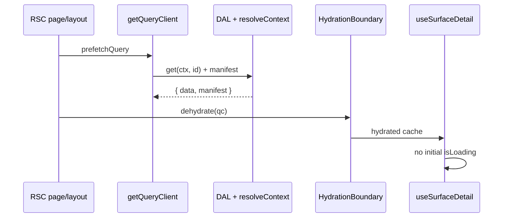
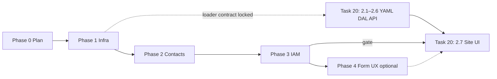

# Spike — server prefetch for surface list/detail

> **Status:** In progress (2026-06-22). **Prerequisite:** [surface-form-playground.md](./surface-form-playground.md) **PR 5 verify** ✓ (2026-06-22).
>
> **Next:** Phase 4 — Form loading UX (optional, per surface). **Gate cleared:** [task 20 step 2.7](../tasks/20-ui-discovery.md#step-27--site-ui-shell-list--detail-profile--portfolio) (`SiteDetailForm` + sites routes) — sites UI may ship with prefetch from day one.
>
> **Parallel with:** task 20 steps **2.1–2.6** (YAML, DAL, API) once loader contract is locked in § Shared loaders.

## Goal

Eliminate the first-paint loading flash on master-detail surfaces by **hydrating TanStack Query** from the server with the same `{ data, manifest }` shape client hooks expect — **one DAL read per request**, not `resolveContext` on the RSC page plus a second round-trip through `/api/*`.

Roll out on **existing** surfaces (contacts, IAM) before adding new UI (sites) so every list/detail route shares the same loading architecture.

---

## Decision: prefetch before sites UI (2026-06-22)

**Choice:** Fully plan and implement prefetch on **contacts + IAM** (users, roles) **before** [task 20](../tasks/20-ui-discovery.md) step **2.7** (`SiteDetailForm`). Task 20 backend steps **2.1–2.6** may proceed in parallel once the loader API is defined.

**Rationale:** Every shipped master-detail route today resolves manifest on the server, then client-fetches the same data through API handlers that call DAL again. Adding sites on that pattern duplicates debt across four surface families. Prefetch is orthogonal to form `*Input` controllers but pairs with the playground loading contract (initial skeleton vs transition overlay). IAM and contacts should adopt hydration **before** they are used as reference implementations for sites.

---

## Decision: prefetch ≠ form stack migration (2026-06-22)

**Choice:** Prefetch rollout **does not** require migrating `ContactDetailForm` / `UserDetailForm` / `RoleDetailForm` from `Rhf*` wrappers to playground `*Input` controllers. Remove the full-pane `<Spin />` gate when hydrated; adopt `SurfaceFormRoot` loading/overlay per surface in a follow-on pass.

**Rationale:** `RoleDetailForm` includes `GrantMatrix` — not a scalar `*Input`. Decouple data plumbing from form chrome migration.

---

## Why after form playground

| Reason | Detail |
|--------|--------|
| **Orthogonal concerns** | Prefetch is data-loading plumbing; playground proves permissions, toolbar, and field modes |
| **Shared shape dependency** | Prefetch `queryFn` must return identical DTO to `useSurfaceDetail` / `useSurfaceList` |
| **Provider change** | Requires `getQueryClient()` + `HydrationBoundary` — touches root `Providers`, not field components |
| **DAL path** | Server prefetch calls **DAL directly**, not loopback `fetch("/api/…")` |
| **Loading UX contract** | Playground models initial skeleton vs row-switch overlay vs save blocking — production forms should align when removing `<Spin />` gates |

---

## Current state (2026-06-22)

| Piece | Behavior |
|-------|----------|
| RSC page | `resolveContext` → passes **manifest only** to client form |
| RSC layout | No data prefetch — list panes are client-only |
| Client hooks | `useSurfaceDetail` / `useSurfaceList` → `fetchSurfaceDetail` / `fetchSurfaceList` via `/api/*` |
| Providers | Client `QueryClient` in `app/providers.tsx` — no dehydration |
| Detail hook | `placeholderData: keepPreviousData` — row switch shows previous row while refetching |
| Detail forms | `isLoading && !detail ? <Spin />` — full-pane spinner on first paint |
| API routes | `createSurfaceRouteHandlers` / `createSurfaceListRouteHandlers` — DAL + `resolveContextFresh` |

**Duplicate work today:** hard refresh on `/contacts/[id]` runs policy resolve on the page, then the client hits `GET /api/contacts/[id]` which resolves again and reads DAL.

---

## Surface inventory

Master-detail routes that **must** adopt prefetch in this spike. Query keys from [`lib/hooks/surface-query-keys.ts`](../../lib/hooks/surface-query-keys.ts).

| Surface id | UI route | List / detail component | API list | API detail | Prefetch site |
|------------|----------|-------------------------|----------|------------|---------------|
| `contact_list` | `/contacts` layout | `ContactList` | `GET /api/contacts` | — | `contacts/layout.tsx` |
| `contact_detail` | `/contacts/[id]` | `ContactDetailForm` | — | `GET /api/contacts/[id]` | `contacts/[id]/page.tsx` |
| `user_list` | `/users` layout | `UserListPane` | `GET /api/iam/users` | — | `users/layout.tsx` |
| `user_roles_detail` | `/users/[id]` | `UserDetailForm` | — | `GET /api/iam/users/[id]` | `users/[id]/page.tsx` |
| `role_list` | `/roles` layout | `RoleListPane` | `GET /api/iam/roles` | — | `roles/layout.tsx` + **`users/[id]/page.tsx`** (picker) |
| `role_detail` | `/roles/[id]` | `RoleDetailForm` | — | `GET /api/iam/roles/[id]` | `roles/[id]/page.tsx` |

### Deferred in this spike (API only, no list/detail UI yet)

| Surface id | API | Notes |
|------------|-----|-------|
| `customer_list` | `GET /api/customers` | `SURFACE_API` entry; no master-detail page |
| `vendor_list` | `GET /api/vendors` | same |
| `manufacturer_list` | `GET /api/manufacturers` | same |

Add to loader registry when party-lens UI ships; pattern is identical.

### Task 20 — sites (born with prefetch, not retrofitted)

| Surface id | Planned route | Prefetch site | Task 20 step |
|------------|---------------|---------------|--------------|
| `site_list` | `/sites` layout | `sites/layout.tsx` | [2.7](../tasks/20-ui-discovery.md#step-27--site-ui-shell-list--detail-profile--portfolio) |
| `site_detail` | `/sites/[id]` | `sites/[id]/page.tsx` | 2.7 |
| `site_contact_relation_table` | `/contact-relations` | Catalog table — **list-only** prefetch optional | [2.9](../tasks/20-ui-discovery.md#step-29--relation-catalog-ui-page) |

**Do not** implement sites routes until Phase 3 verify passes on contacts and IAM (§ Rollout). ✓ (2026-06-22)

### Out of inventory

| Route | Reason |
|-------|--------|
| `/dev/form-playground` | Mock `PlaygroundProvider` — not React Query |
| `/settings` | No surface list/detail hooks |

---

## Target pattern



### 1. Query client factory

```ts
// lib/query-client.ts
import { QueryClient } from "@tanstack/react-query";
import { cache } from "react";

export const getQueryClient = cache(
  () =>
    new QueryClient({
      defaultOptions: { queries: { staleTime: 30_000 } },
    }),
);
```

One client per RSC request (React `cache()`), not a global singleton across requests.

### 2. Shared server loaders

Extract from route handlers — **same function** for API GET and RSC prefetch:

```ts
// lib/surfaces/load-surface-detail.ts (sketch)
export const loadSurfaceDetailQuery = async (
  surfaceId: SurfaceId,
  entityId: string,
): Promise<SurfaceQueryResult<SurfaceDetailData>> => {
  const ctx = await resolveContext({ surfaceId, entityId });
  if (!surfaceAllows(ctx.manifest, "read")) {
    throw new SurfaceNotFoundError();
  }
  const data = await surfaceDalRegistry[surfaceId].get(ctx, entityId);
  return { data, manifest: ctx.manifest };
};
```

| Loader | `resolveContext` input | DAL call |
|--------|------------------------|----------|
| `loadSurfaceListQuery(surfaceId, query?)` | `{ surfaceId }` (list mode) | `dal.*.list(ctx, query)` |
| `loadSurfaceDetailQuery(surfaceId, entityId)` | `{ surfaceId, entityId }` | `dal.*.get(ctx, entityId)` |

**Registry:** map `SurfaceId` → DAL accessors (mirror `SURFACE_API` + route handler `dal` blocks). Single file `lib/surfaces/surface-loader-registry.ts` or per-domain re-exports — avoid N duplicate `ensureXxxDal` blocks.

**Do not** use `fetchSurfaceDetail` in RSC — relative URLs are unreliable server-side.

**Mutations:** PATCH/DELETE routes keep `resolveContextFresh`; only GET paths share loaders.

### 3. RSC page (detail)

```tsx
// app/(private)/contacts/[id]/page.tsx (sketch)
const queryClient = getQueryClient();
await queryClient.prefetchQuery({
  queryKey: surfaceDetailKey("contact_detail", id),
  queryFn: () => loadSurfaceDetailQuery("contact_detail", id),
});

return (
  <HydrationBoundary state={dehydrate(queryClient)}>
    <ContactDetailForm contactId={id} manifest={ctx.manifest} />
  </HydrationBoundary>
);
```

Keep server `manifest` prop as fallback until all detail forms drop the prop (Phase 2 verify).

### 4. RSC layout (list)

```tsx
// app/(private)/contacts/layout.tsx (sketch)
const queryClient = getQueryClient();
await queryClient.prefetchQuery({
  queryKey: surfaceListKey("contact_list"),
  queryFn: () => loadSurfaceListQuery("contact_list"),
});

return (
  <HydrationBoundary state={dehydrate(queryClient)}>
    <MasterDetailShell list={<ContactList />}>{children}</MasterDetailShell>
  </HydrationBoundary>
);
```

### 5. Nested layout + page dehydration

Next.js merges RSC trees: layout and page can each call `getQueryClient()` (same cached instance per request) and prefetch different keys. **Prefer:**

| Concern | Where to prefetch |
|---------|-------------------|
| List | `*/layout.tsx` |
| Detail | `*/[id]/page.tsx` |
| Secondary list (e.g. `role_list` on user detail) | Same `[id]/page.tsx` as primary detail |

Wrap **once** at the outermost boundary that owns all prefetched keys for that navigation, or nest `HydrationBoundary` (TanStack merges dehydrated state when using the same request-scoped client — verify against v5 App Router guide at implementation time).

**Avoid:** coupling detail prefetch into list layout via `params` — keeps layout stable.

### 6. Providers upgrade

```tsx
// app/providers.tsx — client shell unchanged for routes without server prefetch
<QueryClientProvider client={queryClient}>{children}</QueryClientProvider>
```

Per-route `HydrationBoundary` from RSC is sufficient for v1; root layout does **not** need a global dehydrated state prop unless we later centralize.

Follow TanStack Query v5 *Advanced Server Rendering* / Next.js app router guide when implementing.

---

## Interaction with form UI

| Topic | Behavior after prefetch |
|-------|-------------------------|
| **First paint (hydrated)** | `useSurfaceDetail` → `isLoading: false`, `data` present — **no** full-pane `<Spin />`; `FormUiProvider.loading` false |
| **First paint (prefetch miss / error)** | Keep `<Spin />` or skeleton fallback until client query settles |
| **Row switch** | Client refetch; `keepPreviousData` shows previous row; **transition overlay** after 500ms per [playground](./surface-form-playground.md) — not initial skeleton |
| **Save** | Unchanged — `disabled` on write controls; optional overlay on slow save |
| **Mutations** | `invalidateQueries` on patch/delete |
| **Manifest refresh** | PATCH response manifest → merge into query cache in mutation `onSuccess` |

### Decision: row-switch UX (2026-06-22)

**Choice:** After prefetch, **initial load** uses hydrated data (no skeleton). **In-app row switch** uses stale-while-revalidate + delayed overlay (`SurfaceFormRoot` `blocking`), matching the form playground — not a return to full-pane `<Spin />`.

**Rationale:** Prefetch fixes hard-refresh flash; client navigation still needs a deliberate transition state distinct from first visit.

---

## Rollout phases

### Phase 0 — Plan ✓

This document: inventory, loader contract, rollout order, task 20 gates.

- [x] Surface inventory (contacts, IAM, deferred party lists, task 20 sites)
- [x] Rollout phases and verify gates
- [x] Task 20 cross-links (§ Task 20 integration)
- [x] Form UI interaction + row-switch decision

### Phase 1 — Infrastructure ✓

**Deliverable:** Shared loading layer; no prefetch route changes yet.

> **Status:** Complete (2026-06-22). Next: [Phase 2 — Contacts proof](#phase-2--contacts-proof).

| Item | Path / action |
|------|----------------|
| Query client factory | `lib/query-client.ts` |
| Loader registry | `lib/surfaces/surface-loader-registry.ts` (name TBD) |
| `loadSurfaceListQuery` | Uses registry + `resolveContext` |
| `loadSurfaceDetailQuery` | Uses registry + `resolveContext` |
| Error type | `SurfaceNotFoundError` → `notFound()` in RSC / 404 in API |
| Unit test | Loader returns `{ data, manifest }` shape matching hooks |

**Exit:** Loaders callable from a test or script; no duplicate DAL logic between loader and one refactored API GET. ✓

- [x] `lib/query-client.ts` — `getQueryClient`
- [x] `lib/surfaces/surface-loader-registry.ts`
- [x] `loadSurfaceListQuery` / `loadSurfaceDetailQuery`
- [x] `SurfaceNotFoundError` → 404 via `mapLatchError` / `notFound()` in RSC (Phase 2+)
- [x] Unit test — `load-surface-detail.test.ts`
- [x] `GET /api/contacts/[id]` refactored to shared detail loader

### Phase 2 — Contacts proof ✓

**Deliverable:** End-to-end hydration on the reference master-detail slice.

> **Status:** Complete (2026-06-22). Next: [Phase 3 — IAM](#phase-3--iam-users--roles).

| Item | Action |
|------|--------|
| Refactor | `GET app/api/contacts/route.ts` → shared list loader |
| Refactor | `GET app/api/contacts/[id]/route.ts` → shared detail loader |
| Prefetch | `contacts/layout.tsx` — `contact_list` |
| Prefetch | `contacts/[id]/page.tsx` — `contact_detail` |
| Form | Remove or narrow `isLoading && !detail ? <Spin />` in `ContactDetailForm` |
| Verify | Hard refresh `/contacts/[id]` — fields populated; no empty spin |
| Verify | Manifest grants drive fields + header toolbar |
| Verify | List pane populated on hard refresh `/contacts` |
| Verify | Row switch still works; patch invalidates cache |
| Verify | 403/404 unchanged |

**Exit:** Phase 2 checklist complete — **gate for Phase 3**.

- [x] `GET /api/contacts` → `loadSurfaceListQuery`
- [x] `GET /api/contacts/[id]` → `loadSurfaceDetailQuery` (Phase 1)
- [x] `lib/surfaces/prefetch-surface-query.ts` — RSC prefetch helpers + `notFound()` mapping
- [x] `HydrationBoundary` on `contacts/layout.tsx` + `contacts/[id]/page.tsx`
- [x] `ContactDetailForm` — narrowed spin gate (`isLoading && !detail`); hydrated path skips spin
- [x] Build + loader unit tests pass

### Phase 3 — IAM (users + roles) ✓

**Deliverable:** Same pattern on IAM routes.

> **Status:** Complete (2026-06-22). Next: [Phase 4 — Form loading UX](#phase-4--form-loading-ux-optional-per-surface).

| Route file | Prefetch keys |
|------------|---------------|
| `users/layout.tsx` | `user_list` |
| `users/[id]/page.tsx` | `user_roles_detail`, **`role_list`** |
| `roles/layout.tsx` | `role_list` |
| `roles/[id]/page.tsx` | `role_detail` |

| Item | Action |
|------|--------|
| Refactor | `GET /api/iam/users`, `GET /api/iam/users/[id]` |
| Refactor | `GET /api/iam/roles`, `GET /api/iam/roles/[id]` |
| Form | Remove full-pane spin gates in `UserDetailForm`, `RoleDetailForm` |
| Verify | User detail role picker works without secondary list flash |
| Verify | Grant matrix + role catalog read-only paths unchanged |

**Exit:** Phase 3 checklist complete — **gate for task 20 step 2.7**.

- [x] `GET /api/iam/users` → `loadSurfaceListQuery`
- [x] `GET /api/iam/users/[id]` → `loadSurfaceDetailQuery`
- [x] `GET /api/iam/roles` → `loadSurfaceListQuery`
- [x] `GET /api/iam/roles/[id]` → `loadSurfaceDetailQuery`
- [x] `HydrationBoundary` on `users/layout.tsx`, `users/[id]/page.tsx`, `roles/layout.tsx`, `roles/[id]/page.tsx`
- [x] `prefetchSurfaceDetail` — optional `extraLists` for `role_list` on user detail
- [x] `UserDetailForm` + `RoleDetailForm` — narrowed spin gate (`isLoading && !detail`); hydrated path skips spin
- [x] Build + loader unit tests pass; manual UX verify ✓ (users + roles hard refresh, role picker, grant matrix)

### Phase 4 — Form loading UX (optional, per surface)

**Deliverable:** Align detail forms with playground `SurfaceFormRoot` contract.

| Surface | Scope |
|---------|-------|
| Contacts | Migrate scalars to `*Input` + `SurfaceFormRoot`; skeleton / overlay / save disable |
| Users | Scalar profile fields; keep role assignment UI as-is initially |
| Roles | **Defer** scalar migration where blocked by `GrantMatrix` |

**Not a gate** for task 20 sites if contacts proof uses `SurfaceFormRoot` in Phase 4 or sites ships fresh on new stack.

### Phase 5 — Task 20 sites (consumer)

Sites routes **must** use Phase 1 loaders from first commit — no client-only spin pattern.

See § Task 20 integration.

---

## Task 20 integration



| Task 20 step | Prefetch relationship |
|--------------|----------------------|
| [2.1 — YAML + codegen](../tasks/20-ui-discovery.md#step-21--surface-yaml--codegen--policy-registry) | No prefetch work; register `site_list` / `site_detail` surface ids in loader registry when DAL exists |
| [2.2 — Relation catalog DAL/API](../tasks/20-ui-discovery.md#step-22--relation-catalog-dal--api) | Add `site_contact_relation_table` list loader when API ships |
| [2.3–2.5 — Site DAL + API](../tasks/20-ui-discovery.md#step-23--site-dal--read-path) | **Refactor GET handlers to shared loaders** (same rule as contacts) — do not wait until 2.7 |
| [2.6 — Nav + routes](../tasks/20-ui-discovery.md#step-26--nav--routes) | Route files only; no prefetch until layout/page exist |
| **[2.7 — Site UI shell](../tasks/20-ui-discovery.md#step-27--site-ui-shell-list--detail-profile--portfolio)** | **Requires Phase 3 verify** — `sites/layout.tsx` + `sites/[id]/page.tsx` prefetch list + detail; `SiteDetailForm` uses hydrated hooks + playground form stack |
| [2.8 — Contacts collection](../tasks/20-ui-discovery.md#step-28--contacts-collection-ui--pickers) | May need extra picker prefetch (`party` list) — add loader keys when pickers wire |
| [2.9 — Relation catalog UI](../tasks/20-ui-discovery.md#step-29--relation-catalog-ui-page) | Editable table; optional list prefetch on catalog page |
| [Step 3 — Estimate spike](../tasks/20-ui-discovery.md#step-3--estimate-line-editor-spike) | Independent of prefetch unless estimate routes use `useSurfaceDetail` |

### Update task 20 step 2.7 prerequisite ✓ (2026-06-22)

Added alongside form playground in [task 20 step 2.7](../tasks/20-ui-discovery.md#step-27--site-ui-shell-list--detail-profile--portfolio):

> **Prefetch:** [surface-form-prefetch.md](../spikes/surface-form-prefetch.md) **Phase 3 verify** — sites routes use shared loaders + `HydrationBoundary`; no `isLoading && !detail ? <Spin />` pattern.

---

## Implementation checklist (master)

### Infrastructure

- [x] `lib/query-client.ts` — `getQueryClient`
- [x] `lib/surfaces/load-surface-list.ts` + `load-surface-detail.ts`
- [x] Surface → DAL registry covering inventory § Surface inventory
- [x] `SurfaceNotFoundError` mapped to `notFound()` / 404

### Contacts (proof)

- [x] Refactor `GET /api/contacts` + `GET /api/contacts/[id]` to shared loaders
- [x] `HydrationBoundary` on `contacts/layout.tsx` + `contacts/[id]/page.tsx`
- [x] `ContactDetailForm` — no full-pane spin when hydrated
- [x] Hard refresh + row switch + patch invalidation verified (build + loader tests; manual UX verify on running app)

### IAM

- [x] Refactor IAM GET routes to shared loaders
- [x] Prefetch on `users/*` and `roles/*` layouts + detail pages (incl. `role_list` on user detail)
- [x] `UserDetailForm` + `RoleDetailForm` — no full-pane spin when hydrated
- [x] Hard refresh + row switch verified on users and roles (build + loader tests; manual UX verify ✓)

### Task 20 sites (after Phase 3 gate)

- [ ] Register `site_list` / `site_detail` in loader registry (step 2.5)
- [ ] `sites/layout.tsx` + `sites/[id]/page.tsx` hydration (step 2.7)
- [ ] `SiteDetailForm` — hydrated + `SurfaceFormRoot` from day one

---

## Out of scope

- Prefetch on `/dev/form-playground` (mock provider, not React Query)
- `customer_list` / `vendor_list` / `manufacturer_list` UI (no pages yet)
- Streaming/Suspense boundaries per field
- Parallel route prefetch
- CDN / edge caching of API responses
- React Query prefetch on nav hover (see [routing-and-libraries.md](../routing-and-libraries.md))
- Full IAM form migration to `*Input` gallery (Phase 4 optional)

---

## Reference

- [surface-form-playground.md](./surface-form-playground.md) — form stack + loading UX prerequisite
- [task 20 — UI discovery](../tasks/20-ui-discovery.md) — sites slice; step 2.7 gated on this spike Phase 3
- [routing-and-libraries.md](../routing-and-libraries.md) — TanStack Query + master-detail conventions
- [task 13 — contact UI](../tasks/13-contact-ui.md) — interim pattern being superseded
- Code: [`use-surface-detail.ts`](../../lib/hooks/use-surface-detail.ts), [`use-surface-list.ts`](../../lib/hooks/use-surface-list.ts), [`surface-api.ts`](../../lib/surface-api.ts)
- TanStack Query docs: *Advanced Server Rendering* / Next.js app router
