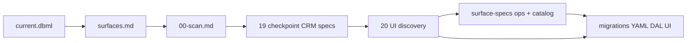

# Surface planning depth

> **Status:** Active (2026-06-23). **Planning:** [job wave 5](../decisions/job.md#decision-job-wave-5--implementation-order-2026-06-23) locked. **Next:** `job.md` spec + task 23 (5a shell).  
> **Implement specs:** [19-surface-implement-specs.md](./tasks/19-surface-implement-specs.md) — **14/27** (`estimate.md` ✅).  
> **Discovery:** [20-ui-discovery.md](./tasks/20-ui-discovery.md) — **complete**.

## Planning model (amended 2026-06-20)

| Layer | Artifact | When |
|-------|----------|------|
| **Data** | [`schema/current.dbml`](./schema/current.dbml) | Task 17 ✅ |
| **Field catalog** | [`surfaces.md`](./surfaces.md) — routes, Fields, waves | Task 18 ✅ |
| **Implement specs — CRM checkpoint** | `surface-specs` rows **#1–14** | Task 19 checkpoint ✅ |
| **UI discovery** | Migration + sites slice + estimate spike | **Task 20 — complete** (2026-06-23) |
| **Implement specs — ops/catalog** | Rows **#15–19**, **#21–28**; **`estimate.md`** ✅; **`job.md`** next | Job 5a spec after tabs spike |
| **Production code (ongoing)** | YAML → DAL → UI per wave | **5a** job shell → **3** catalog → **3e** line editor → **4d′** |

**Choice (2026-06-17):** Plan v1 Surfaces at implement depth holistically.

**Amendment (2026-06-20):** Do **not** finish all specs before any code. Pause task 19 at the **CRM checkpoint**, run [UI discovery](./tasks/20-ui-discovery.md), then write ops/finance specs **from proven UI**. See [decision](./decisions/general.md#decision-planning-model--ui-discovery-before-ops-specs-2026-06-20).

**Amendment (2026-06-23):** [Catalog-first line UI](./decisions/job.md#decision-job-wave-5--implementation-order-2026-06-23) — wave **3** before Scope grids on estimate/job/PO/invoice; estimate 4a line UI is interim.

**Discussion model:** Chat → spec + `decisions/` + DBML. For estimate/job/invoice, **spike first** when layout is the unknown; then capture A–K in the spec file.

---

## Where you are — quick map

| If STATUS says… | You are… | Open |
|-----------------|----------|------|
| Task 20 step 1 | Writing/applying `018`–`020` | [`site-migration.md`](./tasks/deferred/site-migration.md) |
| Task 20 step 2 | Sites YAML / DAL / UI | [`site.md`](./surface-specs/site.md) |
| Task 20 step 3 | Estimate line-editor spike | [`spikes/estimate-line-editor.md`](./spikes/estimate-line-editor.md) |
| Task 20 step 4 | **Complete** — `estimate.md` spec + wave 4a | [`estimate.md`](./surface-specs/estimate.md) |
| Resume task 19 | **`job.md`** spec — after `job_detail` tabs spike | [job wave 5 decision](./decisions/job.md#decision-job-wave-5--implementation-order-2026-06-23) |
| Task 23 (TBD) | Job **5a** shell code | [`01-task-index.md`](./tasks/01-task-index.md) |
| Wave 3 + 3e | Catalog + shared line editor | before **4d′** Scope UI |

---

## Surface planning depth checklist

Use one row per Surface (or matched list/detail pair). Tiers: **catalog** · **design** · **implement**.

| # | Area | Catalog (task 18) | Design | Implement (task 19) |
|---|------|-------------------|--------|---------------------|
| **A** | **Identity** | `surface_id`, route, nav group, anchor table(s), wave | — | Registry / manifest plan |
| **B** | **Fields** | List columns; detail Field ids | Collection element shape | Writable vs read-only; omit rules |
| **C** | **Policy** | Surface actions named | Role / tab visibility | Grant matrix; 403 vs 404 |
| **D** | **DAL — read** | Tables joined | DTO shape | `get` / list contracts |
| **E** | **DAL — write** | PATCH keys | Replace-array semantics | create/patch/delete/actions |
| **F** | **DAL — domain rules** | Decision pointers | Cross-Surface flows | Testable invariants |
| **G** | **UI — layout** | List+detail vs table | Tabs/sections | Component map — **spike may precede spec for ops Surfaces** |
| **H** | **UI — chrome** | — | Toolbar priorities | Actions + linked Surfaces |
| **I** | **UI — collections** | Field ids | Add/remove UX | Pickers, empty states |
| **J** | **Lifecycle** | — | Status enums | Transitions, create flow |
| **K** | **Edge cases** | — | Deferrals listed | Seeds, progressive setup |

**Task 19 final exit:** every row in [`surface-specs/00-scan.md`](./surface-specs/00-scan.md) at implement tier (A–K filled).

---

## Workflow

---

## Related

- [`tasks/20-ui-discovery.md`](./tasks/20-ui-discovery.md) — **active steps**
- [`surface-specs/00-scan.md`](./surface-specs/00-scan.md) — inventory + progress
- [`tasks/19-surface-implement-specs.md`](./tasks/19-surface-implement-specs.md)
- [`spikes/README.md`](./spikes/README.md)
- [`child-collections.md`](./child-collections.md)
