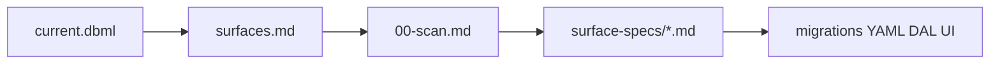

# Surface planning depth

> **Status:** Active (2026-06-17). **Active task:** [19-surface-implement-specs.md](./tasks/19-surface-implement-specs.md).  
> **Catalog (Field map):** [`surfaces.md`](./surfaces.md). **Implement specs:** [`surface-specs/`](./surface-specs/README.md).

## Planning model (locked 2026-06-17)

| Layer | Artifact | When |
|-------|----------|------|
| **Data** | [`schema/current.dbml`](./schema/current.dbml) | Task 17 ✅ |
| **Field catalog** | [`surfaces.md`](./surfaces.md) — routes, Fields, waves | Task 18 ✅ |
| **Implement specs** | [`surface-specs/*.md`](./surface-specs/README.md) — DAL, policy, UI, lifecycle per Surface | **Task 19 — in progress** |
| **Code** | migrations → YAML → DAL → UI | **After task 19** |

**Choice:** Fully plan **all v1 Surfaces** at implement depth before any implementation code. Not wave-by-wave at ship time — one scan, then one spec file at a time, entire v1 map.

**Rationale:** DBML alone does not specify screens. Task 18 alone did not specify DAL/UI. The project keeps recommending holistic planning without delivering implement-tier docs; task 19 is that delivery.

---

## Surface planning depth checklist

Use one row per Surface (or matched list/detail pair). Tiers: **catalog** · **design** · **implement**.

| # | Area | Catalog (task 18) | Design | Implement (task 19) |
|---|------|-------------------|--------|---------------------|
| **A** | **Identity** | `surface_id`, route, nav group, anchor table(s), wave | — | Registry / manifest plan |
| **B** | **Fields** | List columns; detail Field ids | Collection element shape | Writable vs read-only; omit rules |
| **C** | **Policy** | Surface actions named | Role / tab visibility | Grant matrix; 403 vs 404 |
| **D** | **DAL — read** | Tables joined | DTO shape | `get` / list contracts |
| **E** | **DAL — write** | PATCH keys | Replace-array semantics | create/patch/delete/actions |
| **F** | **DAL — domain rules** | Decision pointers | Cross-Surface flows | Testable invariants |
| **G** | **UI — layout** | List+detail vs table | Tabs/sections | Component map |
| **H** | **UI — chrome** | — | Toolbar priorities | Actions + linked Surfaces |
| **I** | **UI — collections** | Field ids | Add/remove UX | Pickers, empty states |
| **J** | **Lifecycle** | — | Status enums | Transitions, create flow |
| **K** | **Edge cases** | — | Deferrals listed | Seeds, progressive setup |

**Task 19 exit:** every row in [`surface-specs/00-scan.md`](./surface-specs/00-scan.md) at implement tier (A–K filled in spec file).

---

## Workflow

---

## Related

- [`surface-specs/00-scan.md`](./surface-specs/00-scan.md) — inventory + progress
- [`tasks/19-surface-implement-specs.md`](./tasks/19-surface-implement-specs.md)
- [`tasks/18-surface-catalog.md`](./tasks/18-surface-catalog.md) — catalog tier (complete)
- [`child-collections.md`](./child-collections.md)
