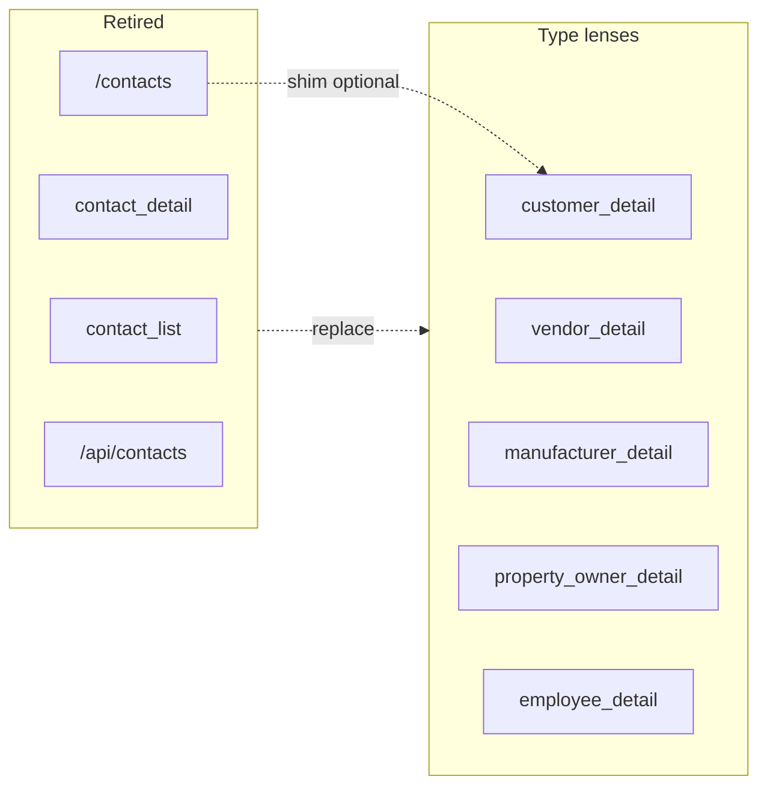

# Retire interim `contact_*` — Slice 1 → type lenses

> **Wave:** 1 · **Status:** target spec (2026-06-19) · **Not a Surface** — removal + migration spec for shipped interim UI · **Replaces with:** [`customer.md`](./customer.md), [`vendor.md`](./vendor.md), [`manufacturer.md`](./manufacturer.md), [`property-owner.md`](./property-owner.md), [`employee.md`](./employee.md) · **Decisions:** [party list/detail lens model](../decisions/party.md#decision-party-listdetail-surface-shape-2026-06-16-locked-2026-06-17), [party profile](../decisions/party.md#decision-party-profile-fields-on-type-lenses-2026-06-17) · **Catalog:** [`surfaces.md`](../surfaces.md#party-surface-pairs)

**Context:** Slice 1 shipped a **generic** address book (`contact_list` / `contact_detail` / `/contacts`) before type lens pairs existed. Wave 1 retires that path when matched `{role}_list` + `{role}_detail` routes, APIs, and shared `PartyDetailForm` are live.

---

## Locked product answers (2026-06-19)

| # | Topic | Choice |
|---|--------|--------|
| 1 | Retire what | **`contact_list`**, **`contact_detail`**, **`/api/contacts`**, **`/contacts`** UI, nav entry, policy registry entries, `modules/contact/contact_*.surface.yaml` + generated glue |
| 2 | Keep what | **`party` data** unchanged; shared **`lib/contacts/repository.ts`** helpers; list stores keyed by role tag; **`PhoneEmailFields`** (or successor); **`modules/contact/{customer,vendor,manufacturer}_list.surface.yaml`** until lists move per-type modules |
| 3 | Gate | Retire **only after** all five type pairs have **list + detail** routes, APIs, and DAL descriptors using kind extensions (`party_person` / `party_organization`) — see [prerequisites](#c--prerequisites-stop-gate) |
| 4 | Unified list | **No** replacement — operators use `customer_list`, `vendor_list`, etc. No global “all contacts” nav item in v1 |
| 5 | `/contacts` list URL | **Remove** — returns **404** (route deleted) |
| 6 | `/contacts/[id]` bookmarks | **Thin compat redirect** (not a Surface): resolve `party_role` tags → redirect to first `{role}_detail` URL principal may `read`; priority order below; **404** if no tag or no grant |
| 7 | `roles` form Field | **Never shipped** on type lenses — tags via create lens + `add_role` / `remove_role` actions only |
| 8 | Profile shape | Interim `contact_detail` used `party.display_name` + `party.notes`; type lenses use **kind-specific profile** — no back-compat edit path on retired Surface |
| 9 | IAM grants | Roles that reference `contact_list` / `contact_detail` must be **re-granted** to explicit `{role}_list` + `{role}_detail` pairs — document in role seed / migration note |
| 10 | `other` tag | Parties tagged `other` only — **no** list Surface; appear in pickers / future search — not reachable via `/contacts` |

**Redirect priority** (first tag with `read` on matching detail Surface wins):

`customer` → `vendor` → `manufacturer` → `property_owner` → `employee`

---

## A — Retired Surfaces (inventory)

### `contact_list` *(retire)*

| Key | Shipped value |
|-----|----------------|
| `surface_id` | `contact_list` |
| Route | `/contacts` (list pane) |
| API | `GET /api/contacts` |
| Nav | Contacts group — label “Contacts” |
| Anchor | `party` (no role filter — all parties) |
| Fields | `summary` → `party.id`, `display_name`, `kind` |

### `contact_detail` *(retire)*

| Key | Shipped value |
|-----|----------------|
| `surface_id` | `contact_detail` |
| Route | `/contacts/[id]` |
| API | `GET` / `PATCH` / `DELETE /api/contacts/[id]` |
| Anchor | `party` |
| Tables | `party`, `party_phone`, `party_email` |
| Fields | `profile` (interim `party` columns), `phones`, `emails` |

### Replacement map

| Retired | Replacement (per `party_role` tag) |
|---------|-------------------------------------|
| `contact_list` row | Same `party.id` on `{role}_list` when tagged |
| `contact_detail` edit | `{role}_detail` lens for each tag; multi-tag → multiple URLs + **Also:** chips |
| `GET /api/contacts` | `GET /api/{customers,vendors,…}` per type |
| `ContactDetailForm` | `PartyDetailForm` parameterized by `surfaceId` |

---

## B — Field migration (interim → lens)

No automatic Field mapping — operators use type lists. Data already lives on shared tables.

| Interim `contact_detail` Field | Type lens destination |
|------------------------------|------------------------|
| `profile.display_name` | **Dropped as edit field** — `party_person` / `party_organization` profile scalars; `party.display_name` DAL-maintained |
| `profile.legal_name` | Org: `party.legal_name` on `{role}_detail` `profile` |
| `profile.notes` | Wave 1 migration: `party.notes` → `note` rows ([cross-cutting](../decisions/cross-cutting.md)); no `notes` Field until notes slice |
| `phones` | Same `party_phone` — `{role}_detail` `phones` collection |
| `emails` | Same `party_email` — `{role}_detail` `emails` collection |
| *(none)* | `roles` multi-select — **not** on type lenses |

---

## C — Prerequisites (stop gate)

Do **not** delete interim Surfaces until **all** are true:

| # | Prerequisite |
|---|----------------|
| 1 | Party refactor migration — `party_person`, `party_organization`; `employee` → `party_person`; drop `party.notes` ([`deferred/site-migration.md`](../tasks/deferred/site-migration.md)) |
| 2 | **Detail APIs** — `GET` / `PATCH` / `POST` / `DELETE` for each: `/api/customers`, `/api/vendors`, `/api/manufacturers`, `/api/property-owners`, `/api/employees` |
| 3 | **Detail UI** — master-detail under `/customers`, `/vendors`, `/manufacturers`, `/property-owners`, `/employees` using shared `PartyDetailForm` |
| 4 | **List APIs** already shipped for customer, vendor, manufacturer; add `property_owner_list`, ensure `employee_list` aligned |
| 5 | **Descriptors** — per-Surface `*DetailDescriptor` factory (role tag + kind extensions); retire `contactDetailDescriptor` |
| 6 | **`SURFACE_API`** — detail paths for all five detail Surface ids |
| 7 | **Nav** — type list entries in `SURFACE_NAV_CATALOG`; `contact_list` entry removed |
| 8 | **Smoke** — create person + org on each lens; phones/emails PATCH; multi-tag party opens two detail URLs |

---

## D — Removal checklist (implementation)

### Surface YAML + codegen

| Path | Action |
|------|--------|
| `modules/contact/contact_list.surface.yaml` | **Delete** |
| `modules/contact/contact_detail.surface.yaml` | **Delete** |
| `modules/contact/generated/contact_list.*` | **Delete** (regenerate after YAML removal) |
| `modules/contact/generated/contact_detail.*` | **Delete** |
| `modules/contact/{customer,vendor,manufacturer}_list.surface.yaml` | **Keep** (or move to per-type module folders in later cleanup) |

### Policy + API registry

| Path | Action |
|------|--------|
| `lib/policy-registry.ts` | Remove `contactListSurfacePolicyDef`, `contactDetailSurfacePolicyDef` imports + registry entries |
| `lib/surface-api.ts` | Remove `contact_list`, `contact_detail` from `SURFACE_API` |
| `lib/contacts/dal.ts` | Remove `contactList`, `contactDetail` from `ContactsDal`; drop `createContactDetailStore` wiring for contact surfaces |
| `lib/contacts/descriptors.ts` | Remove `contactListDescriptor`, `contactDetailDescriptor`, `ContactDetailPatchSchema`, `projectContactDetailRow` |

### Routes + UI

| Path | Action |
|------|--------|
| `app/api/contacts/route.ts` | **Delete** |
| `app/api/contacts/[id]/route.ts` | **Delete** |
| `app/(private)/contacts/layout.tsx` | **Delete** |
| `app/(private)/contacts/page.tsx` | **Delete** |
| `app/(private)/contacts/[id]/page.tsx` | **Replace** with compat redirect shim (see § G) or **Delete** if redirect lives elsewhere |
| `components/contacts/ContactList.tsx` | **Delete** — use parameterized list shell |
| `components/contacts/ContactDetailForm.tsx` | **Delete** — use `PartyDetailForm` |

### Nav + route helpers

| Path | Action |
|------|--------|
| `lib/nav.ts` | Remove `contact_list` entry from `SURFACE_NAV_CATALOG` |
| `lib/nav-routes.ts` | Remove `contacts` object; add `manufacturers`, `propertyOwners`, `employees` as needed |

### Docs (post-implementation)

| Path | Action |
|------|--------|
| `docs/routing-and-libraries.md` | Replace `contact_*` examples with `customer_*` |
| `docs/child-collections.md` | Mark `contact_detail` decision as **superseded** by type lenses |

---

## E — Refactor checklist (keep / generalize)

| Asset | Target |
|-------|--------|
| `lib/contacts/repository.ts` | Keep `loadPartyPhones`, `replacePartyPhones`, email helpers, `createPartyListStore(pool, roleTag?)` |
| `lib/contacts/descriptors.ts` | `createPartyListDescriptor(surfaceId, roleTag)` + `createPartyDetailDescriptor(surfaceId, roleTag, extraFields?)` |
| `lib/contacts/dal.ts` | Rename optional later to `lib/party/` — not required for retirement |
| `components/contacts/PhoneEmailFields.tsx` | Move to `components/party/` or keep path — reused by all lenses |
| `ensureContactsDal()` | Wire only type list + detail DALs |

**Codegen L1/L2:** hand-written detail descriptors remain until collection codegen lands ([`latch-feedback.md`](../latch-feedback.md)).

---

## F — IAM grants

v1 uses `system_iam` synthesized grants for bootstrap; future **app roles** must not reference retired Surface ids.

| Retired grant | Replace with |
|---------------|--------------|
| `contact_list` `read` | `{role}_list` `read` per type the role needs |
| `contact_detail` `read` / `write` / `delete` | Matching `{role}_detail` grants |

**`sales` role (planned):** Contacts group = `customer_*`, `vendor_*`, `manufacturer_*`, `property_owner_*` — not `contact_*`.

**Audit:** no `latch_audit` migration — Surface id strings in historical audit rows may still say `contact_detail`; acceptable for v1.

---

## G — Compat redirect shim (`/contacts/[id]`)

Optional **non-Surface** route retained one wave for bookmarks:

```text
GET /contacts/[id]
  → load party_role rows for party.id
  → for tag in [customer, vendor, manufacturer, property_owner, employee]:
        if PolicyService grants read on {tag}_detail:
           redirect 307 to /{route-prefix}/[id]
  → else 404
```

| Rule | Choice |
|------|--------|
| List URL `/contacts` | **No shim** — delete route |
| Auth | `requireAuth('/contacts/[id]')` before redirect |
| Multi-tag | First tag in priority order with grant wins — UI chips show other lenses |
| `other` only | 404 — no lens |
| Permanent? | **v1:** keep redirect route; **v2:** remove after telemetry shows zero hits (optional) |

---

## H — UI / nav after retirement

### Contacts nav group (target)

| Entry | `surfaceId` | Route |
|-------|-------------|-------|
| Customers | `customer_list` | `/customers` |
| Vendors | `vendor_list` | `/vendors` |
| Manufacturers | `manufacturer_list` | `/manufacturers` |
| Property owners | `property_owner_list` | `/property-owners` |
| Employees | `employee_list` | `/employees` |

**Removed:** single “Contacts” item (`contact_list`).

### Create flow

- **New customer** → POST on `customer_detail` (toolbar on `/customers`)
- No “create contact then add role” — create on the target lens; **`add_role`** for additional tags

---

## I — Implementation sequence

```text
1. Party refactor SQL (018) + kind-extension DAL
2. Per-type detail YAML (if not already) + descriptors + API routes
3. Per-type detail UI (PartyDetailForm branches per spec)
4. property_owner_list + nav entries for manufacturers / property-owners / employees
5. Grant / policy smoke on all five pairs
6. Remove contact_* per § D
7. Add /contacts/[id] redirect shim (§ G)
8. codegen --check + manual regression on phones/emails PATCH per lens
```

**Same PR vs follow-up:** retirement (steps 6–7) may land in the **same PR** as the last type detail Surface or immediately after — do not merge removal before step 5 passes.

---

## J — Edge cases

| Topic | Handling |
|-------|----------|
| Party with **no** `party_role` row | Was visible on `contact_list`; after retirement **orphan** — only admin SQL or future global search; not in any list |
| Party tagged `other` only | Pickers only; `/contacts/[id]` shim → 404 |
| Multi-tag party | Each lens editable independently; shared phones/emails |
| User bookmarked `/contacts/abc` | Shim → `/customers/abc` if customer tag + grant |
| Deep links in docs/tests | Update to `/customers/…` |
| `ensureContactsDal` import sites | `app/api/customers/route.ts`, etc. — remain; drop contact handlers only |
| Employee anchor | `employee_detail` anchor `employee` — list still filters `party_role.employee`; redirect uses `/employees/[id]` |
| Delete party | From any granted `{role}_detail` DELETE — same hard delete as interim `contact_detail` |

---

## K — Wiring (before → after)



---

## Verify (stop gate)

- [x] Locked answers (2026-06-19) — retirement scope, gate, redirect, grants
- [x] A–K complete — removal inventory + prerequisites + sequence
- [ ] All five type detail pairs implemented (prerequisite § C)
- [ ] `contact_*` removed from registry, nav, API, YAML
- [ ] `routing-and-libraries.md` examples updated
- [ ] No `contact_list` / `contact_detail` in `SURFACE_NAV_CATALOG` or `policy-registry`
