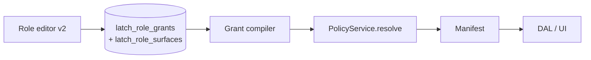
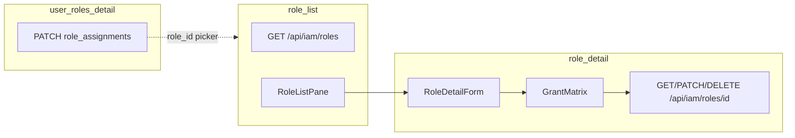

# IAM — `role_list` · `role_detail`

> **Wave:** 0 · **Status:** target spec (2026-06-18) — **shipped interim:** read/write matrix; no create; system rows fully RO; P8 gap · **Grant model:** [v2 target](../decisions/iam.md#decision-grant-authoring-model-v2-target-2026-06-18) § [L](#l--target-grant-model-v2-platform) · **Catalog:** [`surfaces.md`](../surfaces.md#wave-0--iam-shipped) · **DBML:** `latch_roles` + bindings + grants · **Decisions:** [iam.md](../decisions/iam.md), [cross-cutting delete blockers](../decisions/cross-cutting.md#decision-delete-blocked-by-referential-use--structured-errors-2026-06-18)

**Related:** Role **assignments** on [`user_roles_detail`](./iam-user.md#role_assignments-collection) ([`iam-user.md`](./iam-user.md)). **Not this Surface:** `latch_role_delegations` (Phase 08); scoped `scope_id` on assignments (Phase 08 — column on assignment row, deferred in v1 UI).

**Boundary:** This spec owns role **definitions** (catalog + sparse grants + per-surface `row_scope`). `user_roles_detail` owns who holds which roles.

---

## A — Identity

### `role_list`

| Key | Value |
|-----|-------|
| `surface_id` | `role_list` |
| Pair | list only (detail pane is `role_detail`) |
| Route | `/roles` — `roles/layout.tsx` |
| API | `GET /api/iam/roles` · **target:** `POST /api/iam/roles` (create) |
| Nav group | IAM (`lib/nav.ts`) |
| Anchor table | `latch_roles` |
| All tables (DAL) | `latch_roles` |
| Shipped vs target | **Shipped:** list only. **Target:** list + create app role. |

### `role_detail`

| Key | Value |
|-----|-------|
| `surface_id` | `role_detail` |
| Pair | detail pane for `role_list` |
| Route | `/roles/[id]` — `id` = `latch_roles.id` (UUID) |
| API | `GET` / `PATCH` / `DELETE /api/iam/roles/[id]` |
| Anchor table | `latch_roles` |
| All tables (DAL) | `latch_roles`, `latch_role_surfaces`, `latch_role_grants` |
| Shipped vs target | **Shipped:** patch/delete app roles; system rows UI read-only. **Target:** system `display_name` editable; P8 self-grant guard; create flow. |

---

## B — Fields

### `role_list`

| Field id | Type | Writable | Columns | Notes |
|----------|------|----------|---------|-------|
| `summary` | scalar (list projection) | read | `latch_roles.id`, `role_class`, `display_name` | |

**List DTO row:**

```json
{
  "id": "<uuid>",
  "summary": {
    "id": "<uuid>",
    "role_class": "app",
    "display_name": "Office admin"
  }
}
```

**List query:** `limit` (max 100), `offset`; default sort `display_name`. Search TBD.

### `role_detail`

| Field id | Type | Writable | Columns | Notes |
|----------|------|----------|---------|-------|
| `catalog` | scalar | read; write `display_name` only | `latch_roles.id`, `role_class`, `display_name` | `role_class` always read-only |
| `surface_bindings` | collection | read + write | `latch_role_surfaces.surface_id`, `row_scope` | `app` only — **omit from UI** for system classes |
| `grants` | collection | read + write | `latch_role_grants.*` | `app` only — **omit from UI** for system classes; `mode` always `null` in v1 |

**`catalog` DTO:**

```json
{
  "catalog": {
    "id": "<uuid>",
    "role_class": "app",
    "display_name": "Office admin"
  }
}
```

**`surface_bindings` element:**

```json
{ "surface_id": "job_detail", "row_scope": "own" }
```

**`grants` element (allow-only):**

```json
{ "surface_id": "job_detail", "field_id": "financial_terms", "action": "read", "mode": null }
```

`surface_id` + `field_id: null` = surface-level action grant.

**Omit rules:** No `created_at` on catalog ([P11](../../../../packages/policy/docs/tasks/00-decisions-needed.md#p11--role-catalog-shape-uuid--role_class-2026-06-08)).

---

## C — Policy

| Surface | Action | Granted when | Re-auth |
|---------|--------|--------------|---------|
| `role_list` | `read` | `system_iam` (synthesized) | Each GET |
| `role_list` | `create` | `system_iam` | Each POST *(target)* |
| `role_detail` | `read` | `system_iam` | Each GET |
| `role_detail` | `write` | `system_iam` on writable fields | Each PATCH |
| `role_detail` | `delete` | `system_iam`; target `role_class = app`; no assignments | Each DELETE |

**System rows (`system_data`, `system_iam`):**

| Field / action | Rule |
|----------------|------|
| `catalog.display_name` | Writable ([decision](../decisions/iam.md#decision-iam-role-catalog--app-crud-system-cosmetic-edit-2026-06-18)) |
| `catalog.role_class` | Read-only; DB trigger |
| `surface_bindings`, `grants` | **Not shown in UI** — synthesized; no stored rows to edit |
| `delete` | Forbidden (DB trigger) |

**P8 — self grant edit:** Reject `surface_bindings` / `grants` PATCH when `entityId ∈ principal.roles`. `catalog.display_name` still allowed on held roles. *(Target — not in shipped SubHub DAL.)*

**Field visibility:** IAM surfaces use 404 hide for non-`system_iam` principals (`assertIamSurfaceRead`).

---

## D — DAL read

### `role_list`

- **`list(ctx, { limit, offset })`** — project `summary` from `latch_roles`.

### `role_detail`

- **`get(ctx, roleId)`** — anchor row + related `surface_bindings` + `grants` via `loadRoleDetailRelated`.
- Hand-written descriptor: [`lib/iam/descriptors.ts`](../../lib/iam/descriptors.ts) (multi-table glue skipped).

---

## E — DAL write

| Surface | Operation | Body keys | Notes |
|---------|-----------|-----------|-------|
| `role_list` | `create` *(target)* | `{ catalog: { display_name } }` strict | Insert `role_class = 'app'`; sparse — no grant rows |
| `role_detail` | `patch` | `{ catalog?, surface_bindings?, grants? }` strict | Replace-array for collections |
| `role_detail` | `delete` | — | `app` only; pre-check assignments → `ConflictError` *(target UX)* |

**Collection semantics:** `surface_bindings` and `grants` — delete all rows for role, re-insert body ([replace-array](../child-collections.md)). Single transaction; `bumpPolicyVersion` on grant/binding change.

**Grant validation:** `validateGrantTuple` against codegen registry; unknown `(surface_id, field_id, action)` → `ValidationError`. IAM `kind` surfaces excluded from matrix (business surfaces only).

**Delete guards:**

1. `role_class ∈ {system_data, system_iam}` → `ForbiddenError`
2. Any `latch_user_roles` row → `ConflictError` `in_use` with blocker count *(target — today FK RESTRICT may surface as generic error)*
3. On success: grants/bindings cascade (DB); bump policy version

**Create flow *(target)*:** POST list → navigate `/roles/[newId]` for grant editing.

---

## F — Domain rules

- **Catalog:** [P11](../../../../packages/policy/docs/tasks/00-decisions-needed.md#p11--role-catalog-shape-uuid--role_class-2026-06-08) — UUID PK, `role_class` enum, template seeds two system rows.
- **Synthesis:** [P4](../../../../packages/policy/docs/tasks/00-decisions-needed.md#decision-synthesize-both-built-ins-in-code-2026-06-06) — no `latch_role_grants` rows for system classes.
- **Sparse grants:** [P2a](../../../../packages/policy/docs/tasks/00-decisions-needed.md#p2a--sparse-grants-default-deny) — default deny; allow-only editor ([decision](../decisions/iam.md#decision-iam-role-editor--allow-only-grants-2026-06-18)).
- **`row_scope`:** On `latch_role_surfaces` per (role × surface) — v1 UI `own` | `all`; `scope` deferred Phase 08.
- **`mode`:** Column nullable; editor writes `null` (all modes) — [P7 deferred](../../../../packages/policy/docs/tasks/00-decisions-needed.md#p7--mode-column-in-v1).
- **Audit:** Role create/update/delete and grant/binding replace → `latch_audit`.
- **Assignments:** Revoke via `user_roles_detail` before role delete ([P2 RESTRICT](../../../../packages/policy/docs/tasks/00-decisions-needed.md#p2--fk-latch_user_rolesrole_id--latch_rolesid)).

### Manifest `read` vs `write` (shipped interim)

**Superseded for role-editor authoring by [grant model v2](#l--target-grant-model-v2-platform)** ([decision](../decisions/iam.md#decision-grant-authoring-model-v2-target-2026-06-18)). Shipped `GrantMatrix` still uses independent read/write checkboxes.

| Layer | What it gates | `write` without `read` |
|-------|----------------|---------------------------|
| **Manifest** on `role_detail` Fields | IAM admin form sections | **Detail/edit:** no. **Create** (`role_list` POST): yes under `mode: create`. |
| **Grant matrix (shipped)** | What an `app` role grants on business Surfaces | Storable but discouraged — v2 `grantLevel` removes this. |

---

## G — UI layout

**Pattern:** Master-detail nested layout ([decision](../decisions/general.md#decision-master-detail-via-nested-layout-not-parallel-routes-2026-06-12)) — same as users.

### Target UI by `role_class`

| `role_class` | Create (list) | `display_name` | Grant matrix | Save | Delete |
|--------------|---------------|----------------|--------------|------|--------|
| `app` | Via **New role** on list *(target)* | Editable input | Shown — editable | Yes | Yes when unassigned |
| `system_data`, `system_iam` | No | Editable input *(target)* | **Hidden** — not empty/read-only matrix | `display_name` only | No |

System rows: short note under catalog — e.g. “Permissions are synthesized from role class; grants are not stored.”

### `role_list` (`RoleListPane`)

- Ant Design `Table`: columns **Role** (display name link), **Class** (`role_class`).
- Row links to `/roles/[id]`; selected row highlight via `usePathname`.
- Empty center pane: `SelectFromListPlaceholder` ("Select a role").
- **New role** *(target)* — toolbar on list layout (`surfaceAction: create`): modal or inline prompt for `display_name` → `POST /api/iam/roles` → `router.push(/roles/[newId])` to configure grants.

**Shipped gap:** no New toolbar, no POST — after `/setup` only the two system rows exist; operators cannot add `app` roles yet.

### `role_detail` (`RoleDetailForm`)

1. **Title** — `catalog.display_name`
2. **Catalog row** — `display_name` + read-only `role_class` (see table above)
3. **Grants** — `GrantMatrix` **only when `role_class === 'app'`** ([decision](../decisions/iam.md#decision-iam-role-detail-ui--grant-matrix-app-only-2026-06-18))

Do **not** render `<FieldControl field="grants">` / matrix for system classes — synthesis owns permissions; an empty read-only matrix is misleading.

**`GrantMatrix` rules (`app` roles only) — shipped interim:**

- Surfaces from registry where `kind !== 'iam'`
- **Shipped:** independent read/write checkboxes per surface/field row
- Row scope `Select` on surface-level rows: `all` | `own` | clear
- Empty registry message: "No business surfaces in the policy catalog yet."
- **Target (v2):** replace with [`grantLevel`](#l--target-grant-model-v2-platform) + surface capability flags — see § L

### Shipped vs target (UI)

| Behavior | Shipped | Target |
|----------|---------|--------|
| Create `app` role | Missing | New role + POST |
| `app` `display_name` | Editable when an `app` row exists | Same |
| System `display_name` | Read-only (`!systemRole` blocks save) | Editable + Save |
| Grant matrix on system rows | Shown read-only (empty) | **Hidden** |
| Grant matrix control model | read/write checkboxes | **grantLevel v2** (§ L) |

---

## L — Target grant model v2 (platform)

> **Canonical decision:** [`decisions/iam.md`](../decisions/iam.md#decision-grant-authoring-model-v2-target-2026-06-18) · **Platform:** [`access-control.md`](../../../../packages/policy/docs/access-control.md#decision-grant-authoring-model-v2-target-2026-06-18)

Replaces read/write checkbox authoring in `role_detail` grant matrix. `PolicyService.resolve` may be refactored to compile v2 grants → `Manifest` (not required to keep sparse `latch_role_grants` tuple shape forever).

### Authoring model (per `app` role)

#### Per surface block

| Control | Values | Compiles to |
|---------|--------|-------------|
| `grantLevel` | `none` \| `readOnly` \| `update` | Surface + field read; `update` adds write |
| `canCreate` | bool | Surface create / INSERT path |
| `canDelete` | bool | `hard_delete` only |
| `canRestore` | bool | Surface `restore` |
| `row_scope` | `own` \| `all` \| `scope` | `latch_role_surfaces.row_scope` |

**Examples:**

| Scenario | Surface grants |
|----------|----------------|
| Timesheet entry | `grantLevel: readOnly`, `canCreate: true` |
| Full CRUD | `grantLevel: update`, `canCreate`, `canDelete` |
| Auditor + restore | `grantLevel: readOnly`, `canRestore: true` |

#### Per field row (under surface)

| Control | Values | Rule |
|---------|--------|------|
| `grantLevel` | `none` \| `readOnly` \| `update` | **≤ surface `grantLevel`** (UI caps select; DAL rejects on save) |
| `canPropose` | bool | Only if Surface YAML `requires_verification: true` — pending field **update** |
| `canApprove` | bool | Accept/reject pending **updates** on that field |

**Target extension (pending kinds):** `canProposeCreate`, `canProposeDelete` on surface; `canApprove` also finalizes pending create/delete ([Phase 05 pending store](../../../../packages/_docs/phases/05-verification/decisions.md) — field PATCH only today).

### Grant matrix UI (target)

Per surface (collapsible block):

```
Surface: job_list
  grantLevel:    [ none | readOnly | update ]
  canCreate:     [ ]
  canDelete:     [ ]
  canRestore:    [ ]
  row_scope:     [ own | all | — ]

  Fields:
    summary          [ none | readOnly | update ]  (capped)
    financial_terms  [ none | readOnly | update ]  canPropose [ ] canApprove [ ]
```

- Surface `grantLevel` change → clamp field levels downward in UI.
- No explicit deny toggles (allow-only / P2a).

### Compile path



| v2 `grantLevel` | Compiled field actions |
|-----------------|------------------------|
| `none` | — |
| `readOnly` | `read` |
| `update` | `read`, `write` |

Surface flags compile to `manifest.actions` (`create`, `hard_delete`, `restore`). Verification flags compile to `submit` / `approve` per existing [pending routing](../../../../packages/dal/src/pending-routing.ts).

### Deleted-list lens (business list Surfaces)

Not part of `role_detail` — consumer of **`canRestore`** at runtime:

1. List Surface filter dropdown: normal scopes + **Deleted**.
2. **Deleted** → query scoped `latch_audit` (`action = delete`, matching `module_id`, anchor not in live table) + `row_scope`.
3. Row select + **Restore** toolbar when `canRestore` → `restoreFromAuditEntry(auditId)`.
4. Rows without full `before` snapshot (delete without restore grant) — show or hide per product; **Restore** disabled.

### Role editor scope

| `role_class` | v2 matrix |
|--------------|-----------|
| `app` | Full authoring |
| `system_data`, `system_iam` | Hidden — synthesis ([decision](../decisions/iam.md#decision-iam-role-detail-ui--grant-matrix-app-only-2026-06-18)) |

### Implementation waves

| Wave | Deliverable |
|------|-------------|
| **A** | `grantLevel` + surface flags + field ≤ surface; compile to current manifest; replace checkbox UI |
| **B** | Deleted-list lens + restore toolbar on list Surfaces |
| **C** | `canPropose` / `canApprove` (field updates — platform Phase 05) |
| **D** | `canProposeCreate` / `canProposeDelete` + pending kinds |

SubHub **deferred** verification (no approval UI) — wave A–B still apply; C–D when product needs them.

---

## H — UI chrome

| Surface | Priority | Action | Notes |
|---------|----------|--------|-------|
| `role_list` | 1 | **New role** *(target)* | `surfaceAction: create` → modal or inline name → POST → navigate to detail |
| `role_detail` | 1 | Save | Patch catalog + collections |
| `role_detail` | 2 | Delete | Confirm modal; map `ConflictError` to blocker message *(target)* |

**Linked Surfaces:**

| From | Link | Surface |
|------|------|---------|
| List row | `/roles/[id]` | `role_detail` |
| User assignments | `/users` | `user_list` — picker uses `role_list` for role ids |
| — | — | Assignments edited on `user_roles_detail` only |

Toolbar via `useRegisterSurfaceActions` + manifest gating ([SurfaceToolbar decision](../decisions/general.md#decision-surfacetoolbar--priority-actions--overflow-menu-2026-06-13)).

---

## I — Collections UX

**Shipped:** read/write checkbox matrix. **Target:** § L grant-level selects.

| Field | Add row | Pickers | Empty state |
|-------|---------|---------|-------------|
| `grants` | v2: per-field `grantLevel` + optional propose/approve | Surface/field from registry | Omitted for system roles |
| `surface_bindings` | v2: implicit via surface block `row_scope` | `all` / `own` | No binding = no row filter |

No separate "add grant row" modal — matrix is the editor. Patch sends full replacement arrays on Save.

---

## J — Lifecycle

| Event | Behavior |
|-------|----------|
| **Provision DB** | Template inserts `system_data` + `system_iam` catalog rows (no grant rows) |
| **First admin** | `/setup` assigns both system classes to setup user |
| **Create app role** | POST `role_list` *(target)* → empty grants until configured |
| **Assign role** | `user_roles_detail` — not this Surface |
| **Delete app role** | Requires zero assignments; cascades grants/bindings |

---

## K — Edge cases

| Topic | Handling |
|-------|----------|
| Delete while assigned | `ConflictError` + blocker count; link to users *(target UX)* |
| Unknown grant tuple | 4xx validation — strict body, not strip |
| Self grant edit (P8) | `ForbiddenError` on grants/bindings when editing own role *(target)* |
| System role delete | DB trigger + UI disabled |
| `deny` effect | **Out of v1** — allow-only; v2 `grantLevel` is allow-only ([decision](../decisions/iam.md#decision-grant-authoring-model-v2-target-2026-06-18)) |
| Shipped: no create | POST + **New role** on list — deferred ([decision](../decisions/iam.md#decision-iam-role-create--list-post--new-toolbar-2026-06-18)) |
| Shipped: system fully RO | Relax to `display_name` + hide matrix ([decisions](../decisions/iam.md)) |
| Grant matrix on system rows | Hide, do not show empty matrix |

---

## Wiring diagram



---

## Shipped interim (implementation wave)

| Area | Shipped | Target |
|------|---------|--------|
| Grant authoring | read/write checkboxes | **grantLevel v2** (§ L) |
| Create app role | No POST, no New toolbar | POST + New role on list |
| System `display_name` | Read-only UI + DAL rejects patch | Editable + Save |
| Grant matrix on system rows | Empty read-only matrix shown | **Omit section** |
| Deleted list + restore UI | — | List filter + `canRestore` (§ L) |
| P8 self-grant guard | Missing | DAL wrapper |
| Delete blocker UX | Raw FK error | `ConflictError` + message |

---

## Verify (stop gate)

- [x] A–K filled for **target** model (2026-06-18)
- [x] **L** grant model v2 (platform target) documented (2026-06-18)
- [x] Decisions recorded in [`iam.md`](../decisions/iam.md) + cross-cutting delete blockers
- [x] Boundary with `user_roles_detail` / `iam-user.md` clear
- [x] Shipped gaps documented
- [ ] Implementation wave: v2 grant matrix, create, P8, system display_name, deleted lens, delete UX — **deferred post–task 19**
