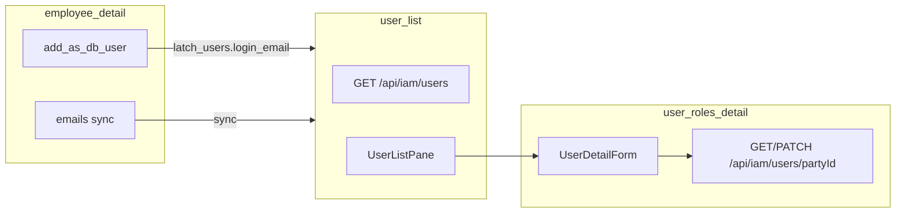

# IAM — `user_list` · `user_roles_detail`

> **Wave:** 0 · **Status:** target spec (2026-06-18) — **shipped code interim** (`latch_users` anchor, `employee.latch_user_id`) until identity implementation wave after task 19 · **Catalog:** [`surfaces.md`](../surfaces.md#wave-0--iam-shipped) · **DBML:** `party_person` + `latch_users` · **Decisions:** [party identity](../decisions/party.md#decision-party-identity--party_person-login-link-2026-06-18), [login email sync](../decisions/party.md#decision-login-email--app-sync-to-latch_userslogin_email-2026-06-18)

**Related:** **`user_detail`** (orphan `latch_users` profile Surface) retires when identity wave lands — profile edits move to person lenses; IAM pane is roles + password actions only. Role **definitions** — [`iam-role.md`](./iam-role.md).

---

## A — Identity

### `user_list`

| Key | Value |
|-----|-------|
| `surface_id` | `user_list` |
| Pair | list only (detail pane is `user_roles_detail`) |
| Route | `/users` (layout); list pane in `users/layout.tsx` |
| API | `GET /api/iam/users` *(target: list linked persons)* |
| Nav group | IAM (`lib/nav.ts` → `SURFACE_NAV_CATALOG`) |
| Anchor table | **`party_person`** |
| DAL lens | `party_person.latch_user_id IS NOT NULL` |
| All tables (DAL) | `party_person`, `party`, `latch_users` |
| Shipped vs target | **Shipped:** anchor `latch_users`. **Target:** anchor `party_person` + lens above. |

### `user_roles_detail`

| Key | Value |
|-----|-------|
| `surface_id` | `user_roles_detail` |
| Pair | detail pane for `user_list` |
| Route | `/users/[id]` — `id` = **`party_person.party_id`** (target) |
| API | `GET` / `PATCH /api/iam/users/[id]` |
| Anchor table | **`party_person`** |
| All tables (DAL) | `party_person`, `latch_users`, `latch_user_roles` |
| Shipped vs target | **Shipped:** `id` = `latch_users.id`. **Target:** `id` = `party_id` of linked person. |

**Bootstrap exception:** `/setup` master may exist as `latch_users` without `party_person` link — optional union row in IAM list or exclude until linked.

**Not on this Surface:** create user, delete user, unlink login, set login email — those live on **`employee_detail`** / `{role}_detail` via **`add_as_db_user`** and `emails` collection sync.

---

## B — Fields

### `user_list`

| Field id | Type | Writable | Columns | Notes |
|----------|------|----------|---------|-------|
| `summary` | scalar (list projection) | read | `party_person.party_id`, `display_name`, `nick_name`, `avatar_url`, `latch_users.login_name`, `latch_users.login_email` | Join via `latch_user_id` |

**List DTO row (target):**

```json
{
  "id": "<party_id>",
  "summary": {
    "party_id": "<party_id>",
    "display_name": "Alex Kim",
    "nick_name": null,
    "avatar_url": null,
    "login_name": "alex.kim",
    "login_email": "alex@example.com"
  }
}
```

`login_email` is **`latch_users.login_email`** (platform column) — populated by app sync from designated `party_email`, not joined at read time.

**List query:** `limit` (max 100), `offset`; lens `latch_user_id IS NOT NULL`. Search TBD (login_name, display_name, login_email).

### `user_roles_detail`

| Field id | Type | Writable | Columns | Notes |
|----------|------|----------|---------|-------|
| `profile` | scalar | read | `party_person` chrome + `latch_users.login_name`, `latch_users.login_email` | Read-only on IAM pane |
| `role_assignments` | collection | read + write | `latch_user_roles` | v1: flat `role_id[]`; whole-array replace — [§ role_assignments](#role_assignments-collection) |

**Omit rules:** No `password_hash`. Login email is **not** writable on IAM pane — change via person Surface `emails` + `is_login_email` sync.

#### `role_assignments` collection

| Topic | v1 target |
|-------|-----------|
| **PATCH shape** | `{ "role_assignments": ["<role_uuid>", …] }` strict — array of `latch_roles.id` |
| **Read DTO** | Same flat `string[]` of role ids (shipped `UserDetailForm` + `role_list` labels) |
| **Patch semantics** | [Replace collection](../child-collections.md#v1-patch-semantics-replace-collection) — DELETE all `latch_user_roles` for target `user_id`, INSERT one row per id |
| **Picker** | All roles from `role_list` (including `system_data` / `system_iam`) — [decision](../decisions/iam.md#decision-role_assignments--v1-flat-picker-all-roles-2026-06-18) |
| **`scope_id`** | **Deferred** — v1 writes `scope_id = NULL` (company-wide) only; scope qualifies the **assignment** row, not the role catalog — [decision](../decisions/iam.md#decision-role_assignments--v1-flat-picker-all-roles-2026-06-18) |
| **Self-patch** | Denied — `ForbiddenError` when `principal.id ===` target `latch_users.id` |
| **Last system holder** | Cannot remove last `system_data` or `system_iam` assignment company-wide |
| **Unknown role id** | `ValidationError` on PATCH |
| **Role delete blocked** | `ON DELETE RESTRICT` on `role_id` — revoke here before `role_detail` delete |

**Scope model (not v1 UI):** `latch_user_roles.scope_id` → `latch_scopes` qualifies **user × role** (“Jordan holds Field Tech **in Branch A**”). It is **not** on `latch_roles`. Distinct from `latch_role_surfaces.row_scope` on the role **definition** (how that role filters business rows when `row_scope = scope`). System classes stay unscoped (`scope_id = NULL`) per [Phase 08](../../../../packages/_docs/phases/08-scoped-access/README.md). Future assignment UX may expose `scope_id` per row; unique key `(user_id, role_id, scope_id)` allows the same app role in multiple scopes.

**Internal key:** PATCH/GET `[id]` resolves to `latch_users.id` via `party_person.latch_user_id` at target; assignment rows always keyed by `user_id` → `latch_users.id`.

---

## C — Policy

| Surface | Action | Granted when | Re-auth |
|---------|--------|--------------|---------|
| `user_list` | `read` | IAM grant | Each GET list |
| `user_roles_detail` | `read` | IAM grant | Each GET |
| `user_roles_detail` | `write` | IAM grant on `role_assignments` | Each PATCH |
| `user_roles_detail` | `change_password` | Self only (`principal` matches linked `latch_users.id`) | Each action |
| `user_roles_detail` | `reset_password` | IAM grant and **not** self | Each action |

**No** `create` / `delete` on `user_list` / `user_roles_detail` in v1 target.

---

## D — DAL read

### `user_list` (target)

- **`list(ctx, { limit, offset })`** — join `party_person` → `party` → `latch_users`; lens linked persons only; project `summary` including `login_email` from `latch_users`.

### `user_roles_detail` (target)

- **`get(ctx, partyId)`** — load `party_person` by `party_id`; require `latch_user_id`; join `latch_users` + roles.

---

## E — DAL write

| Surface | Operation | Body keys | Notes |
|---------|-----------|-----------|-------|
| `user_list` | — | — | List-only |
| `user_roles_detail` | `patch` | `{ role_assignments: … }` strict | Roles only on IAM pane |
| `user_roles_detail` | `change_password` | `{ current_password, new_password }` | Self only |
| `user_roles_detail` | `reset_password` | `{ new_password }` | Admin; not self |

**Provision login (not this Surface):** `add_as_db_user` on person detail — creates `latch_users`, sets `party_person.latch_user_id`, sets `party_email.is_login_email`, copies `address` → `latch_users.login_email`.

**Login email sync (person Surfaces — `emails` collection):**

- At most one `is_login_email` per party when `latch_user_id` is set.
- On designate login row or patch login row `address`: sync `latch_users.login_email` in same transaction.
- **`latch_users.login_email` UNIQUE** is the platform login guarantee ([decision](../decisions/party.md#decision-login-email--app-sync-to-latch_userslogin_email-2026-06-18)).

---

## F — Domain rules

- **Auth principal:** `latch_users` — `login_name`, `password_hash`, `login_email` (nullable UNIQUE). **No FK** to `party_email`.
- **Session chrome:** `party_person.display_name`, `nick_name`, `avatar_url`.
- **Sign-in:** `resolveLatchUserId` — `login_name` OR `latch_users.login_email` only.
- **App sync:** person DAL owns copy from `party_email` → `login_email`; must run on provision and login-email edits.
- **Termination:** HR updates `employee`; IAM suspends roles — do not delete `latch_users` for payroll/history access.

---

## G — UI layout

### `user_list`

- List shows linked persons: display name, login name, login email (from `latch_users`).

### `user_roles_detail`

- **Profile:** read-only (avatar, display name, login identifiers).
- **Roles:** editable assignments.
- **Password:** toolbar actions when manifest grants.

---

## H — UI chrome

| Surface | Priority | Action | Notes |
|---------|----------|--------|-------|
| Detail pane | 1 | Save | Role assignments |
| Detail pane | 2 | Change password / Reset password | Self vs admin |

**Linked Surfaces:**

| From | Link | Surface |
|------|------|---------|
| List row | `/users/[partyId]` | `user_roles_detail` |
| Person HR | `/employees/[id]` | `employee_detail` — `add_as_db_user`, `emails` |
| — | `/roles` | `role_list` |

---

## I — Collections UX

### `role_assignments`

- **Control:** `RhfSelect` `mode="multiple"`; options from `useSurfaceList("role_list")` (`display_name` label, `id` value).
- **Save:** toolbar **Save** sends only `role_assignments` when Field is writable; profile keys omitted.
- **Read-only:** multi-select disabled when manifest denies `write` on `role_assignments` (self-view or read-only grant).

Login email UX lives on person **`emails`** collection (`is_login_email` checkbox / picker) — not this Surface.

---

## J — Lifecycle

| Event | Behavior |
|-------|----------|
| **Create app user** | `add_as_db_user` on person Surface |
| **Set login email** | `emails` collection on person Surface — sync to `latch_users.login_email` |
| **First master** | `/setup` — `login_email` optional until person linked |
| **Employee terminated** | IAM adjusts roles; `login_email` row may persist |

---

## K — Edge cases

| Topic | Handling |
|-------|----------|
| Shipped vs target IDs | Route/API use `latch_users.id` today; migrate to `party_id` at identity wave |
| Duplicate login email | `latch_users.login_email` UNIQUE rejects second principal; app pre-check for UX |
| Same address on two parties as contact | Allowed on `party_email`; only one may sync to `login_email` |
| Login email edit | Person DAL syncs `party_email.address` → `latch_users.login_email` same txn |
| Orphan bootstrap user | List union or hide until `party_person` linked |
| Empty `role_assignments` PATCH | Valid — removes all app-role bindings; last-system-holder guard still applies to `system_*` removals |
| Assign `system_*` via UI | Allowed — picker lists all roles; use sparingly; `/setup` seeds first master |
| Scoped assignment | **Deferred** — v1 always `scope_id NULL`; Phase 08+ may add per-row scope on assignment |

---

## Wiring diagram (target)



---

## Shipped interim (identity wave)

- YAML/DAL anchor `latch_users`; `login_name`, `login_email` already on platform table.
- `employee.latch_user_id` + `account_link` in shipped YAML — retire with identity wave.
- No `party_email.is_login_email` or sync logic in shipped DAL yet.

---

## Verify (stop gate)

- [x] A–K filled for **target** model (2026-06-18; `role_assignments` depth merged 2026-06-18)
- [x] DBML: no `email_id`; `login_email` + `party_email.is_login_email`
- [x] Shipped interim documented; implementation deferred post–task 19
- [ ] Identity wave: `is_login_email`, sync DAL, YAML, UI — **deferred**
