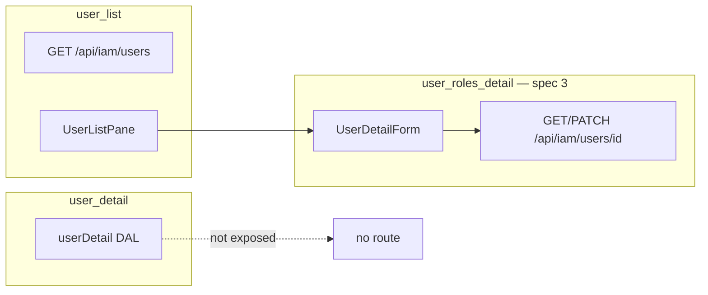

# IAM — `user_list` · `user_detail`

> **Wave:** 0 · **Status:** shipped (backfill spec) · **Catalog:** [`surfaces.md`](../surfaces.md#wave-0--iam-shipped) · **DBML:** `latch_users` (platform)

**Related:** Detail **pane** at `/users/[id]` uses [`user_roles_detail`](./iam-user-roles.md) (spec #3), not `user_detail`. This file covers the list Surface and the standalone profile Surface.

---

## A — Identity

### `user_list`

| Key | Value |
|-----|-------|
| `surface_id` | `user_list` |
| Pair | list only (detail pane is `user_roles_detail`) |
| Route | `/users` (layout); list pane in `users/layout.tsx` |
| API | `GET /api/iam/users` |
| Nav group | IAM (`lib/nav.ts` → `SURFACE_NAV_CATALOG`) |
| Anchor table | `latch_users` |
| All tables (DAL) | `latch_users` |
| Shipped | ✅ |

### `user_detail`

| Key | Value |
|-----|-------|
| `surface_id` | `user_detail` |
| Pair | detail-only Surface (no dedicated page/API today) |
| Route | — *(no route; not in `SURFACE_API`)* |
| Nav group | — |
| Anchor table | `latch_users` |
| All tables (DAL) | `latch_users` |
| Shipped | YAML + DAL + registry only; **unwired** |

**Catalog fix:** `surfaces.md` listed `/iam/users` — actual routes are `/users` ([`nav-routes.ts`](../../lib/nav-routes.ts)).

---

## B — Fields

### `user_list`

| Field id | Type | Writable | Columns | Notes |
|----------|------|----------|---------|-------|
| `summary` | scalar (list projection) | read in list context | `latch_users.id`, `login_name`, `login_email` | YAML Field id is `summary`, not separate list columns |

**List DTO row:**

```json
{
  "id": "<uuid>",
  "summary": {
    "id": "<uuid>",
    "login_name": "admin",
    "login_email": null
  }
}
```

**List query:** `limit` (max 100), `offset`, optional `status` (schema present; unused on `latch_users` today).

**Default sort:** store adapter / PG default (typically insertion order; no explicit sort in UI).

### `user_detail`

| Field id | Type | Writable | Columns | Notes |
|----------|------|----------|---------|-------|
| `profile` | scalar | `read` + `write` in YAML | `id`, `login_name`, `login_email` | No `password_hash` Field — auth layer only |

**Detail DTO:**

```json
{
  "id": "<uuid>",
  "profile": {
    "id": "<uuid>",
    "login_name": "admin",
    "login_email": null
  }
}
```

**Omit rules:** No `created_at` / `created_by` (platform P11 + [timestamps decision](../decisions/general.md#decision-row-timestamps-vs-audit--ddl-vs-surface-fields-2026-06-13)). No `password_hash` in any Surface DTO.

---

## C — Policy

| Surface | Action | Granted when | Re-auth |
|---------|--------|--------------|---------|
| `user_list` | `read` | Principal has `user_list` + `read` via role grants | Each GET list |
| `user_list` | `write` | Field-level on `summary` — list Surface is read-only in UI | — |
| `user_detail` | `read`, `write` | IAM role grants on `user_detail` | Each get/patch |

**IAM gate:** All IAM DAL methods call `assertIamSurfaceRead` — missing grant → **404** (hide), not 403 ([`gate.ts`](../../lib/iam/gate.ts)).

**Typical grant:** `system_iam` role → full IAM Surfaces for master user after `/setup`.

**Self-service:** Role assignment edits blocked on self via `user_roles_detail` (spec #3); profile on this user is read-only in UI today.

---

## D — DAL read

### `user_list`

- **`list(ctx, { limit, offset })`** — `createUserListStore` → `SELECT` from `latch_users`; project via `projectUserListRow`; omit `summary` if no field read grant.
- **No `get`** — list capability only.

### `user_detail`

- **`get(ctx, id)`** — `createUserDetailStore` → single row `latch_users`; project `profile` per manifest.
- **Wired in `createIamDal`** but no HTTP handler exposes this Surface yet.

---

## E — DAL write

| Surface | Operation | Body keys | Notes |
|---------|-----------|-----------|-------|
| `user_list` | — | — | List-only in practice |
| `user_detail` | `patch` | `{ profile: { login_name?, login_email? } }` strict | Generated `UserDetailPatchSchema`; audit via store adapter |
| `user_detail` | `delete` | — | Allowed only if manifest includes `delete` action (not seeded today) |

**Transactions:** Single-table upsert on `latch_users` via `@latch/adapter-pg-store`.

**Validation:**

- `login_name` unique (DB constraint)
- `login_email` unique when non-null (DB constraint)
- Writable schema `.strict()` — reject unknown keys

**Party link (future):** `user_roles_detail` store `upsert` is intentionally no-op — identity columns read-only until `party_user` / `party_email` → `login_email` promotion (task 10+ / identity slice).

---

## F — Domain rules

- **Credentials vs profile:** `latch_users` holds login identifiers + `password_hash` (Better Auth). Surfaces expose only `login_name` / `login_email`.
- **First user:** Created only via `/setup` — no SQL user seed ([first-run setup](../decisions/general.md#decision-first-run-setup--no-sql-user-seed-2026-06-13)).
- **System role holders:** Last `system_data` / `system_iam` assignment cannot be removed (DB trigger + DAL `assertNotLastSystemRoleHolder`) — applies to `user_roles_detail`, not `user_list`.
- **Audit:** Mutations on `latch_users` via store adapter produce `latch_audit` rows (platform).
- **Display name:** Not on `latch_users` (dropped migration `014`); session display moves to `party_user` when identity slice lands.

---

## G — UI layout

### `user_list`

- **Pattern:** Master-detail shell — [`MasterDetailShell`](../../components/shell/MasterDetailShell.tsx) + [`UserListPane`](../../components/iam/UserListPane.tsx) in left column.
- **Table columns:** Login (link to detail), Login email — rendered from `row.summary`, not manifest-driven column defs yet.
- **Selection:** `pathname === routes.users.detail(id)` → `ant-table-row-selected`.

### `user_detail`

- **No standalone page.** Profile fields shown read-only inside [`UserDetailForm`](../../components/iam/UserDetailForm.tsx) under `user_roles_detail` manifest/Field `profile`.

**Target (when wired):** Optional split — profile edits on `user_detail` PATCH; role edits on `user_roles_detail`. Until party link, keep profile read-only on combined screen.

---

## H — UI chrome

| Surface | Priority | Action | Notes |
|---------|----------|--------|-------|
| `user_list` | — | — | No list toolbar; nav entry only |
| Detail pane | 1 | Save | Registers on `user_roles_detail` manifest — patches `role_assignments` only today |

**Linked Surfaces:**

| From | Link | Surface |
|------|------|---------|
| List row | `/users/[id]` | `user_roles_detail` |
| — | `/roles` | `role_list` (role picker options) |

---

## I — Collections UX

N/A — no collection Fields on `user_list` or `user_detail`.

---

## J — Lifecycle

| Event | Behavior |
|-------|----------|
| **Create user** | v1: `/setup` only (first master). No `user_list` create action. Future: invite flow out of scope. |
| **Delete user** | Not exposed in UI; `user_detail`/`user_list` descriptors allow delete if manifest grants — not used. |
| **Login identifier** | `login_name` required at setup; `login_email` optional until party link. |

---

## K — Edge cases

| Topic | Handling |
|-------|----------|
| Empty user table | Redirect to `/setup` ([`needsSetup()`](../../lib/setup.ts)) |
| Non-IAM principal | IAM Surfaces return 404 on DAL read |
| `user_detail` vs `user_roles_detail` | Registry includes both; UI/API use `user_roles_detail` only — document in spec #3; consider deprecating duplicate profile projection or wiring `user_detail` PATCH for profile-only edits when `login_email` is party-linked |
| Dev stub | `LATCH_STUB_USER` optional local shortcut — not production path |

---

## Wiring diagram (shipped)



---

## Verify (stop gate)

- [x] A–K filled; shipped behavior documented
- [x] DBML `latch_users` accounted for
- [x] Catalog route corrected (`/users` not `/iam/users`)
- [x] `user_detail` unwired state explicit; detail pane → spec #3
