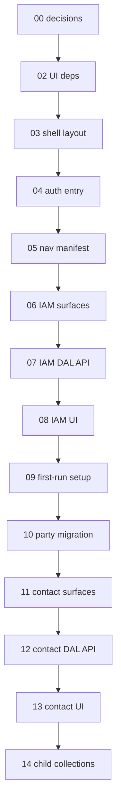
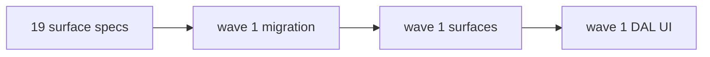

# 01 — Task index

> Read once. **Do not implement in this file.**

## Goal

Orient the SubHub delivery slices and task chain. Global status: [`../../STATUS.md`](../../STATUS.md).

## Prerequisites

- [00-decisions.md](./00-decisions.md) complete.
- Platform scaffold applied (`migrations/001`–`012`, `.env.local`, auth smoke test).
- Skim [`../architecture.md`](../architecture.md) and [`../decisions/README.md`](../decisions/README.md).

## Execution order (Slice 0 → 1 → …)

```
00-decisions
  → 02-ui-deps → 03-shell-layout → 04-auth-entry → 05-nav-manifest
  → 06-iam-surfaces → 07-iam-dal-api → 08-iam-ui → 09-dev-roles-seed
  → 10-party-migration → 11-contact-surfaces → 12-contact-dal-api
  → 13-contact-ui → 14-contact-child-collections
  → 15-entity-flow → 16-slice2-planning-gate → 17-schema-design-pass
  → 18-surface-catalog → 19-surface-implement-specs → (implementation waves — see below)
```

## Dependency diagram (Slice 0–1)



---

## Slice 00 — App shell

**Exit criteria:** Complete `/setup`; log in with `login_name`; nav shows permitted Surfaces; IAM users/roles CRUD for master (`system_iam`).

| # | Task | Delivers |
|---|------|----------|
| 02 | [02-ui-dependencies.md](./02-ui-dependencies.md) | antd, RHF, React Query, registry |
| 03 | [03-app-shell-layout.md](./03-app-shell-layout.md) | `(public)` / `(app)` groups, sidebar shell |
| 04 | [04-auth-entry.md](./04-auth-entry.md) | `/login` (public); `requireAuth(path)` gate; `callbackUrl`; no proxy |
| 05 | [05-nav-manifest.md](./05-nav-manifest.md) | Sidebar: chrome flat + Surface groups; `next/link`; app header / page toolbar documented |
| 06 | [06-iam-surfaces.md](./06-iam-surfaces.md) | IAM `*.surface.yaml` |
| 07 | [07-iam-dal-api.md](./07-iam-dal-api.md) | IAM DAL + explicit API routes |
| 08 | [08-iam-ui.md](./08-iam-ui.md) | Users + roles master-detail; `SurfaceToolbar` (priority + overflow) |
| 09 | [09-dev-roles-seed.md](./09-dev-roles-seed.md) | `/setup` wizard — `login_name` + token; platform `013` identity guards |

---

## Slice 01 — Party / contacts

**Exit criteria:** CRUD contacts with phones/emails; filtered customer/vendor/manufacturer lists.

| # | Task | Delivers |
|---|------|----------|
| 10 | [10-party-migration.md](./10-party-migration.md) | `party`, `party_phone`, `party_email`, `party_role`, `employee` |
| 11 | [11-contact-surfaces.md](./11-contact-surfaces.md) | Surface YAML + codegen + registry |
| 12 | [12-contact-dal-api.md](./12-contact-dal-api.md) | Repository, DAL, `/api/contacts` routes |
| 13 | [13-contact-ui.md](./13-contact-ui.md) | `/contacts` master-detail + forms |
| 14 | [14-contact-child-collections.md](./14-contact-child-collections.md) | Phones/emails field arrays |

---

## Schema design (pre-migration)

**Exit criteria:** [`current.dbml`](../schema/current.dbml) covers Slices 2–6 at column level; decisions locked.

| # | Task | Delivers |
|---|------|----------|
| 17 | [17-schema-design-pass.md](./17-schema-design-pass.md) | DBML through catalog, estimates, jobs, financial; schema-first decision |

---

## Surface & Field catalog (pre-implementation)

**Exit criteria:** [`surfaces.md`](../surfaces.md) design-complete at Field level; open decisions O1–O7 resolved; implementation waves re-cut. **Complete 2026-06-17.**

| # | Task | Delivers |
|---|------|----------|
| 18 | [18-surface-catalog.md](./18-surface-catalog.md) | Canonical Surface/Field catalog; resolve open UI decisions — **complete** |

**Deferred migration spec (preserved):** [deferred/site-migration.md](./deferred/site-migration.md) — wave 1 DDL; **starts after task 19**.

---

## Surface implement specs (pre-code)

**Exit criteria:** Every v1 Surface has implement-tier spec in [`surface-specs/`](../surface-specs/README.md); [`00-scan.md`](../surface-specs/00-scan.md) all ✅. **No SQL/YAML/DAL/UI until exit.**

| # | Task | Delivers |
|---|------|----------|
| 19 | [19-surface-implement-specs.md](./19-surface-implement-specs.md) | Full v1 DAL/UI/policy spec per Surface |

---

## Implementation waves

Delivery order **after** task **19** exits. Slices remain useful labels; waves are the ship sequence.

### Wave 1 — Sites (+ party refactor migration)

**Exit criteria:** CRUD flat sites; standing contacts; relation catalog table. DDL per [`deferred/site-migration.md`](./deferred/site-migration.md). **Requires task 19 complete.**

| # | Task | Delivers |
|---|------|----------|
| *TBD* | `deferred/site-migration.md` | `018`–`020` SQL — party refactor + sites |
| *TBD* | site surfaces | `site_list`, `site_detail`, `site_contact_relation_table` YAML |
| *TBD* | site DAL/UI | `/sites` master-detail + contact-relations catalog |

**Deferred within wave 1 UI:** `parent_site_id` picker; `site_section` / `site_location` on `site_detail` (wave 2b).



### Wave 2 — Party addresses + site geography

| # | Task | Delivers |
|---|------|----------|
| *TBD* | | `addresses` on `{role}_detail` lenses |
| *TBD* | | `sections`, `locations` on `site_detail` |

### Waves 3–7

| Wave | Exit criteria | Surfaces (headline) |
|------|---------------|---------------------|
| 3 Catalog | Parts, items, vendor pricing | `part_*`, `item_*`, `category_table`, `labor_class_table`, `phase_table` |
| 4 Estimates | Quote + snapshot lines | `estimate_*`, `job_party_relation_table` |
| 5 Jobs | Sold scope, field status, COs | `job_*`, `change_order_*` |
| 6a Procurement | Requisition → PO → receipts | `requested_order_*`, `purchase_order_*`, `material_receipt_*` |
| 6b Billing | Billable staging → invoice | `invoice_*`, `billable_items` + `sov_milestones` on `job_detail` |
| 7 Reports | Job progress aggregates | Custom SQL pages |

Field detail: [`surfaces.md`](../surfaces.md). DBML: [`current.dbml`](../schema/current.dbml).

---

## Slice 02 — Sites *(legacy label → wave 1)*

> **Superseded by [Implementation waves](#implementation-waves)** (2026-06-17). Kept for decision traceability.

**Exit criteria:** CRUD flat sites (`name`); standing contacts on `site_detail`; editable `site_contact_relation` catalog table page. DDL includes `address` + `party_address` junction + `site_section` / `site_location` (no UI for geography in wave 1); **no** party-address UI or site hierarchy UI in wave 1 ([decision](../decisions/site.md#decision-slice-2-ui-scope--planning-gate-2026-06-16).

| # | Task | Delivers |
|---|------|----------|
| 15 | [15-entity-flow.md](./15-entity-flow.md) | Cross-slice entity flow in `architecture.md` (docs only) |
| 16 | [16-slice2-planning-gate.md](./16-slice2-planning-gate.md) | Lock Slice 2 open choices; align migration before DDL |
| — | [deferred/site-migration.md](./deferred/site-migration.md) | Migration spec (was task 18) |

---

## Slice 03 — Catalog

**Exit criteria:** Parts with vendor pricing; items composed of parts.

| # | Task | Delivers |
|---|------|----------|
| 21–23 | *TBD* | `manufacturer_part`, `item`, surfaces, UI — **DBML drafted** ([`schema/current.dbml`](../schema/current.dbml)) |

---

## Slice 04 — Estimates

**Exit criteria:** Estimate with snapshot line items.

| # | Task | Delivers |
|---|------|----------|
| 24–26 | *TBD* | `estimate`, `estimate_line`, UI — **DBML drafted** |

---

## Slice 05 — Jobs & change orders

**Exit criteria:** Job from estimate with exploded lines; progress tracking.

| # | Task | Delivers |
|---|------|----------|
| 27–30 | *TBD* | `job`, `job_line`, `change_order`, UI — **DBML drafted** |

---

## Slice 06 — Financial

**Exit criteria:** Billable staging → invoice from job; PO from job parts; SOV milestones for progress jobs.

| # | Task | Delivers |
|---|------|----------|
| 31–33 | *TBD* | `billable_line`, `invoice`, `purchase_order`, SOV + `sov_allocation` — **DBML drafted** |

---

## Slice 07 — Reports

**Exit criteria:** Job progress view (PO + line tracking).

| # | Task | Delivers |
|---|------|----------|
| 34 | *TBD* | Read-only report pages (custom SQL) |

---

## STATUS discipline

When a task completes:

1. Add **Status** line under the task title with date and next link.
2. Check every item in **Verify (stop gate)**.
3. Update [`../../STATUS.md`](../../STATUS.md): **Right now**, **Recently completed**, **Updated** line.

## Reuse from platform

| Artifact | Location |
|----------|----------|
| `createResolveContext`, route factories | `@latch/app-kit` |
| `<Can>`, `<FieldControl>` | `@latch/react` |
| IAM sketch | [`user_roles_detail`](../../../../packages/_docs/phases/03-identity-iam/decisions.md) |
| CRM master-detail precedent | Phase 02 task 16 (patterns only — SubHub uses `/[id]` paths) |
| Scaffold runbook | [`scaffold-runbook.md`](../../../../packages/codegen/docs/scaffold-runbook.md) |

## Out of scope (all slices)

- Approval / verification workflow
- Optimistic React Query updates
- Mobile layout
- Catch-all `[surface]` routes
