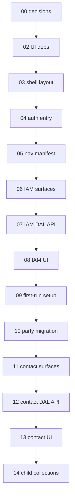
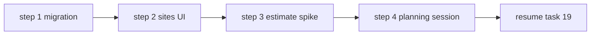
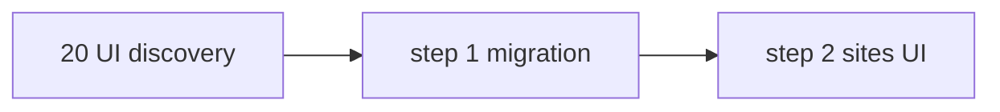
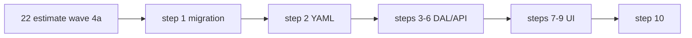
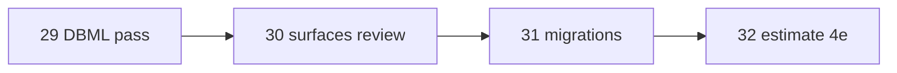

# 01 — Task index

> Read once. **Do not implement in this file.**

## Goal

Orient the SubHub delivery slices and task chain. Global status: [`../../STATUS.md`](../../STATUS.md).

## Prerequisites

- [00-decisions.md](./00-decisions.md) complete.
- Platform scaffold applied (`migrations/001`–`012`, `.env.local`, auth smoke test).
- Skim [`../architecture.md`](../architecture.md) and [`../decisions/README.md`](../decisions/README.md).

## Execution order (Slice 0 → 1 → …)

```
00-decisions
  → 02-ui-deps → 03-shell-layout → 04-auth-entry → 05-nav-manifest
  → 06-iam-surfaces → 07-iam-dal-api → 08-iam-ui → 09-dev-roles-seed
  → 10-party-migration → 11-contact-surfaces → 12-contact-dal-api
  → 13-contact-ui → 14-contact-child-collections
  → 15-entity-flow → 16-slice2-planning-gate → 17-schema-design-pass
  → 18-surface-catalog → 19-surface-implement-specs (checkpoint)
  → 20-ui-discovery → resume 19 → 22-estimate-wave-4a → 23-job-wave-5a → 24-part-wave-3a → 25-manufacturer-detail → implementation waves
  → **29-backbone-dbml-pass** → **30-backbone-surfaces-review** → **31-estimate-backbone-migrations** → **32-estimate-wave-4e** (estimate finish on backbone)
  → 21-bundler-import-convention (parallel — Turbopack / import paths)
```

## Dependency diagram (Slice 0–1)



---

## Slice 00 — App shell

**Exit criteria:** Complete `/setup`; log in with `login_name`; nav shows permitted Surfaces; IAM users/roles CRUD for master (`system_iam`).

| # | Task | Delivers |
|---|------|----------|
| 02 | [02-ui-dependencies.md](./02-ui-dependencies.md) | antd, RHF, React Query, registry |
| 03 | [03-app-shell-layout.md](./03-app-shell-layout.md) | `(public)` / `(app)` groups, sidebar shell |
| 04 | [04-auth-entry.md](./04-auth-entry.md) | `/login` (public); `requireAuth(path)` gate; `callbackUrl`; no proxy |
| 05 | [05-nav-manifest.md](./05-nav-manifest.md) | Sidebar: chrome flat + Surface groups; `next/link`; app header / page toolbar documented |
| 06 | [06-iam-surfaces.md](./06-iam-surfaces.md) | IAM `*.surface.yaml` |
| 07 | [07-iam-dal-api.md](./07-iam-dal-api.md) | IAM DAL + explicit API routes |
| 08 | [08-iam-ui.md](./08-iam-ui.md) | Users + roles master-detail; `SurfaceToolbar` (priority + overflow) |
| 09 | [09-dev-roles-seed.md](./09-dev-roles-seed.md) | `/setup` wizard — `login_name` + token; platform `013` identity guards |

---

## Slice 01 — Party / contacts

**Exit criteria:** CRUD contacts with phones/emails; filtered customer/vendor/manufacturer lists.

| # | Task | Delivers |
|---|------|----------|
| 10 | [10-party-migration.md](./10-party-migration.md) | `party`, `party_phone`, `party_email`, `party_role`, `employee` |
| 11 | [11-contact-surfaces.md](./11-contact-surfaces.md) | Surface YAML + codegen + registry |
| 12 | [12-contact-dal-api.md](./12-contact-dal-api.md) | Repository, DAL, `/api/contacts` routes |
| 13 | [13-contact-ui.md](./13-contact-ui.md) | `/contacts` master-detail + forms |
| 14 | [14-contact-child-collections.md](./14-contact-child-collections.md) | Phones/emails field arrays |

---

## Schema design (pre-migration)

**Exit criteria:** [`current.dbml`](../schema/current.dbml) covers Slices 2–6 at column level; decisions locked.

| # | Task | Delivers |
|---|------|----------|
| 17 | [17-schema-design-pass.md](./17-schema-design-pass.md) | DBML through catalog, estimates, jobs, financial; schema-first decision |

---

## Surface & Field catalog (pre-implementation)

**Exit criteria:** [`surfaces.md`](../surfaces.md) design-complete at Field level; open decisions O1–O7 resolved; implementation waves re-cut. **Complete 2026-06-17.**

| # | Task | Delivers |
|---|------|----------|
| 18 | [18-surface-catalog.md](./18-surface-catalog.md) | Canonical Surface/Field catalog; resolve open UI decisions — **complete** |

**Migration spec:** [deferred/site-migration.md](./deferred/site-migration.md) — **complete** (task 20 step 1, 2026-06-20).

---

## Surface implement specs

| **Checkpoint (2026-06-29):** Backbone DDL shipped — tasks **29**–**31** complete (`current.dbml` amend, surfaces review, `028`–`031` migrations applied to dev). **Next:** task **32** estimate 4e (finish estimates on backbone). Manufacturer task **25** paused — not blocking estimate track.

| # | Task | Delivers |
|---|------|----------|
| 19 | [19-surface-implement-specs.md](./19-surface-implement-specs.md) | Implement specs — **`part.md`** ✅ (row #14); rows **#15–18** before 3b/3c |
| 20 | [20-ui-discovery.md](./20-ui-discovery.md) | Migration + sites UI + estimate spike + planning — **complete** (2026-06-23) |
| 21 | [21-bundler-import-convention.md](./21-bundler-import-convention.md) | Extensionless imports; Turbopack-first dev — **complete** (2026-06-20) |
| 22 | [22-estimate-wave-4a.md](./22-estimate-wave-4a.md) | Wave 4a — estimate migration, DAL, flat production UI — **complete** (legacy schema) |
| 23 | [23-job-wave-5a.md](./23-job-wave-5a.md) | Wave 5a — job shell, Overview + stub tabs — **complete** |
| 24 | [24-part-wave-3a.md](./24-part-wave-3a.md) | Wave 3a — part MPN catalog + vendor pricing — **complete** |
| **29** | [29-backbone-dbml-pass.md](./29-backbone-dbml-pass.md) | Planning → amended `current.dbml` — **complete** (2026-06-29) |
| **30** | [30-backbone-surfaces-review.md](./30-backbone-surfaces-review.md) | `codegen:check` + impact matrix + schema README — **complete** (2026-06-29) |
| **31** | [31-estimate-backbone-migrations.md](./31-estimate-backbone-migrations.md) | Estimate-minimal DDL + discussed dev seeds (`028`–`031`) — **complete** (2026-06-29) |
| **32** | [32-estimate-wave-4e.md](./32-estimate-wave-4e.md) | Estimate `estimate_system` tabs + backbone DAL/UI — **complete** |
| **33** | [33-estimate-site-anchor.md](./33-estimate-site-anchor.md) | Site anchor — gate lines, immutable site, Add site picker return — **complete** (immutability **superseded** by [44](./44-site-anchor-warn-and-clear.md)) |

---

## Task 21 — Bundler import convention

**Exit criteria:** Turbopack dev works without webpack `extensionAlias`; codegen + packages + SubHub use extensionless relative imports; CI guardrail; decision documented.

| Step | Delivers |
|------|----------|
| 1 | Platform decision — bundler monorepo import convention ✅ |
| 2 | Codegen + scaffold template emit extensionless paths |
| 3 | `packages/*/src` codemod |
| 4 | `apps/subhub` codemod + `next.config` Turbopack default |
| 5 | CI lint + remove transitional webpack/debug cruft ✅ |

**Parallel with task 20** — no domain dependency. Prefer early if dev compile speed blocks discovery.

---

## Task 20 — UI discovery

**Exit criteria:** Wave 1 migration applied; `site_list` / `site_detail` shipped; estimate line-editor spike reviewed; planning session captured in decisions + `estimate.md`; STATUS names next wave.

| Step | Delivers | Spec / doc |
|------|----------|------------|
| **1** ✅ | `018`–`020` SQL | [deferred/site-migration.md](./deferred/site-migration.md) |
| **2** ✅ | Sites YAML, DAL, UI | [site.md](../surface-specs/site.md), [site-contact-relation.md](../surface-specs/site-contact-relation.md) |
| **3** ✅ | Estimate line-editor spike | [spikes/estimate-line-editor.md](../spikes/estimate-line-editor.md) |
| **4** ✅ | Planning session | [estimate.md](../surface-specs/estimate.md); wave **4a** named in STATUS |



**Parallel:** Step 3 may use fixture routes before step 2 completes; wire live `site_id` after sites ship.

---

## Implementation waves

Delivery order **after task 20 step 4** (planning session names exact next wave). Task 19 final exit may overlap with waves 2+.

### Wave 1 — Sites (+ party refactor migration) — **task 20 steps 1–2** ✅

**Exit criteria:** CRUD flat sites; standing contacts; relation catalog table. DDL per [`deferred/site-migration.md`](./deferred/site-migration.md). **Complete 2026-06-22** (step 2.10 stop gate).

| # | Task | Delivers |
|---|------|----------|
| 20.1 | `deferred/site-migration.md` | `018`–`020` SQL — party refactor + sites ✅ |
| 20.2 | site surfaces + DAL/UI | `site_list`, `site_detail`, `site_contact_relation_table` ✅ |

**Deferred within wave 1 UI:** `parent_site_id` picker; `site_section` / `site_location` on `site_detail` (wave 2b — promote if estimate spike selects grouped mode).



### Wave 2 — Party addresses + site geography

| # | Task | Delivers |
|---|------|----------|
| **34** | [34-site-geography-ui.md](./34-site-geography-ui.md) | `systems` + `default_areas` DAL + Geography tab (**table** interim UI) ✅ |
| **35** | [35-site-geography-drop-area-metadata.md](./35-site-geography-drop-area-metadata.md) | Drop `site_area.area_type` / `code`; name-only PATCH ✅ |
| **36** | [36-site-geography-tree-ui.md](./36-site-geography-tree-ui.md) | **antd `Tree`** editor; deleted `SiteGeographyTreeTable` — **complete** |
| *TBD* | | `addresses` on `{role}_detail` lenses |
| *TBD* | | `parent_site`, `physical_address` on `site_detail` — remainder of legacy [`site-geography.md`](../surface-specs/site-geography.md) |

### Wave 4 — Estimates (flat) — **task 22** — **complete**

**Exit criteria:** CRUD draft estimates with flat `line_items` + stakeholders; job party relation catalog. Spec: [`estimate.md`](../surface-specs/estimate.md). **Deferred in 4a:** grouped editor, `quote_sections`, `win`/`lose`.

| # | Task | Delivers |
|---|------|----------|
| 22.1 | [22-estimate-wave-4a.md](./22-estimate-wave-4a.md) step 1 | `021` estimate DDL migration |
| 22.2 | step 2 | `estimate_*` + `job_party_relation_table` YAML + codegen |
| 22.3 | step 3 | Job party relation catalog DAL + API |
| 22.4–22.6 | steps 4–6 | Estimate DAL + API |
| 22.7–22.9 | steps 7–9 | Nav + list/detail UI + flat line editor |
| 22.10 | step 10 | Stop gate |



**Follow-on (not 4a):** wave **4e** backbone alignment ([task 32](./32-estimate-wave-4e.md)) — **complete**; **category scope** ([37a](./37a-category-scope-decision-dbml-migration.md) ✅ → [37b](./37b-category-scope-migration-apply.md) ✅ → **37c** site → 37d–37h); wave **4b** `win`/`lose`; wave **4c** grouped editor polish; wave **4d′** shared line editor retrofit — [job wave 5 decision](../decisions/job.md#decision-job-wave-5--implementation-order-2026-06-23).

### Category scope — tasks 37a–37h

| # | Task | Delivers |
|---|------|----------|
| **37a** | [37a-category-scope-decision-dbml-migration.md](./37a-category-scope-decision-dbml-migration.md) | Decision + DBML + `033` migration plan — **complete** |
| **37b** | [37b-category-scope-migration-apply.md](./37b-category-scope-migration-apply.md) | Apply `033` on dev; FK smoke — **complete** |
| **37c** | [37c-site-scopes-zones.md](./37c-site-scopes-zones.md) | Site `site_scope` / `site_zone` DAL + Scopes & zones UI — **complete** |
| **37d** | [37d-category-catalog-dal-surfaces.md](./37d-category-catalog-dal-surfaces.md) | `category_list` / `category_detail` — tree list pane, spec DAL — **complete** |
| **37d2** | [37d2-category-spec-inheritance.md](./37d2-category-spec-inheritance.md) | Spec participation tables + scope panel union — **complete** (superseded by 37d3) |
| **37d3** | [37d3-category-spec-participation-simplify.md](./37d3-category-spec-participation-simplify.md) | Assign-once participation + UI; migration `037` — **complete** (visibility superseded by 37d4) |
| **37d4** | [37d4-category-spec-visibility.md](./37d4-category-spec-visibility.md) | Owner-branch spec visibility + category UI — **complete** (storage superseded by 37d5) |
| **37d5** | [37d5-category-spec-owner-column.md](./37d5-category-spec-owner-column.md) | `spec_def.category_id` owner column; drop `category_spec_def`; migration `038` — **complete** |
| **37e** | [37e-estimate-scope-tab.md](./37e-estimate-scope-tab.md) | Estimate Scope tab DAL/UI + migration 035 + minimal line retarget — **complete** |
| **37f** | [37f-estimate-line-costing.md](./37f-estimate-line-costing.md) | Scope required; zone parents; TreeSelect; part filter; material snapshot — **complete** |
| **37i** | [37i-unified-item-tree-apply.md](./37i-unified-item-tree-apply.md) | Migration **040a**; unified `item` tree; catalog rename; branch picker — **complete** |
| **37g** | [37g-commercial-costing.md](./37g-commercial-costing.md) | Org rate tables; commercial engine; migration **040b** (after **37i**) — **complete** |
| **37j** | [37j-catalog-part-authoring.md](./37j-catalog-part-authoring.md) | `item_links` + `part_specs` on `part_detail` — **complete** (2026-07-06) |
| **37k** | [37k-part-spec-lifecycle.md](./37k-part-spec-lifecycle.md) | Prune `manufacturer_part_spec` on link shrink; diff `spec_option` writes; part/item warnings — **complete** (2026-07-06) |
| **37l** | [37l-leaf-quotable-item-model.md](./37l-leaf-quotable-item-model.md) | `item.node_type` (scope/category/item); leaf-only estimate selection; drop `descendantMax`; migration `044` — **complete** (2026-07-06) |
| **37m** | [37m-item-tree-dnd-ui.md](./37m-item-tree-dnd-ui.md) | Item list tree DnD (reorder + reparent); chip cleanup; immediate PATCH + toast — **complete** (2026-07-07) |
| **37n** | [37n-labor-phase-inclusion.md](./37n-labor-phase-inclusion.md) | `labor_phase` inclusion on estimate scope/zone; item inherit/override UI; `scope_phase` seed; migration `045` — **complete** (2026-07-07) |
| **37o** | [37o-spec-participation-flatten.md](./37o-spec-participation-flatten.md) | Flat `item_spec_participation`; `spec_definitions` on scope `item_detail` Specs tab; `/specs` retired; migrations `046` + `048` — **complete** (manual smoke pending, 2026-07-08) |
| **37p** | [37p-spec-value-types-ddl.md](./37p-spec-value-types-ddl.md) | `spec_unit` + number/range DDL; drop `text`; type/unit locks; migration `049` — **complete** (2026-07-08) |
| **37q** | [37q-spec-units-defs-ui.md](./37q-spec-units-defs-ui.md) | `spec_unit_table` Surface; defs UI (unit picker, options popover) — **complete** (2026-07-08) |
| **37r** | [37r-spec-number-range-consumers.md](./37r-spec-number-range-consumers.md) | Part + estimate number/range inputs; resolver exact + range-contains — **complete** (2026-07-08) |
| **37s** | [37s-spec-defs-ui-drop-range.md](./37s-spec-defs-ui-drop-range.md) | Drop def `range` type; Specs Name·Type·Details popover; part band match via optional max — **complete** (2026-07-08) |
| **37t** | [37t-spec-def-type-roundtrip.md](./37t-spec-def-type-roundtrip.md) | Spec def type round-trip — preserve Details (options / unit / dp) before save — **complete** (2026-07-08) |
| **37u** | [37u-part-leaf-links-specs-ui.md](./37u-part-leaf-links-specs-ui.md) | Part `item_links` leaf-only + multi TreeSelect; Specs Spec·Value (checkbox / number band / enum) — **complete** (2026-07-08) |
| **37v** | [37v-estimate-structure-tab.md](./37v-estimate-structure-tab.md) | Merge Scope into **Line Items** tab (Add scope/zone dropdowns, Configure popover; kits UI removed); no schema change — **complete** (2026-07-08); **UI superseded by 37w** |
| **37w** | [37w-estimate-line-items-panels.md](./37w-estimate-line-items-panels.md) | Line Items **three-panel layout** (S + C left, LI flat right); **W1–W9** — **complete** (2026-07-08); **S/C amended by 37x** |
| **37x** | [37x-estimate-conditions-allocations.md](./37x-estimate-conditions-allocations.md) | Estimate **conditions** + line **allocations**; S = commercial tree; complexity on condition only — **complete** (2026-07-09); **superseded for roots by 37y** |
| **37y** | [37y-condition-only-commercial-tree.md](./37y-condition-only-commercial-tree.md) | Drop `estimate_scope`; condition-only forest; lines require condition; C inherit checkbox (Y1–Y5) — **complete** (2026-07-09) |
| **37z** | [37z-item-commercial-inherit-ui.md](./37z-item-commercial-inherit-ui.md) | Item F/I/M inherit checkbox on all nodes; no schema change (Z1–Z5) — **complete** (2026-07-09) |
| **37aa** | [37aa-estimate-line-live-preview.md](./37aa-estimate-line-live-preview.md) | Live line preview (item/part/config); `sales_locked` + `material_locked`; drop `lock` enum — **complete** (2026-07-11) |
| **37ab** | [37ab-item-placement-mount-axis.md](./37ab-item-placement-mount-axis.md) | `item_placement` browse tree + mount labor/margin axis override (M1–M7, L1–L6) — **superseded/reverted** (2026-07-11), see 37ac |
| **37ac** | [37ac-item-placement-mount-axis-revert.md](./37ac-item-placement-mount-axis-revert.md) | Revert 37ab — drop `item_placement`/`item_cost_override`/`commercial_axis`; mount variance = leaf-per-location (R1–R6) — **complete** (2026-07-11) |
| **37ad** | [37ad-labor-phase-per-row-override.md](./37ad-labor-phase-per-row-override.md) | Labor phase resolution merges per `labor_phase_id` across full ancestry (was atomic group); catalog UI per-row inherit/override; no schema change — **complete** (2026-07-12) |
| **37ae** | [37ae-spec-threshold-presets-ddl.md](./37ae-spec-threshold-presets-ddl.md) | Threshold presets + bucket `value_number_max` / `spec_threshold_preset_id` DDL (A1–T10) — **complete** (2026-07-12); presets dropped by **41ao** |
| **37af** | [37af-spec-threshold-presets-catalog-ui.md](./37af-spec-threshold-presets-catalog-ui.md) | Author presets on scope Specs Details popover — **complete** (2026-07-12); superseded by **41ao** |
| **37ag** | [37ag-spec-threshold-presets-matcher.md](./37ag-spec-threshold-presets-matcher.md) | Interval-overlap + enum preset set match; bucket DAL — **complete** (2026-07-12); presets dropped by **41ao** |
| **37ah** | [37ah-spec-threshold-presets-estimate-ui.md](./37ah-spec-threshold-presets-estimate-ui.md) | Estimate C panel preset / range controls — **complete** (2026-07-12); superseded by **41ao** |
| **37ai** | [37ai-spec-participation-removal.md](./37ai-spec-participation-removal.md) | Drop `item_spec_participation`; item narrows via scope-root namespace; part-row absence = wildcard match (V1–V8) — **complete** (2026-07-12) |
| **37aj** | [37aj-estimate-part-select-and-seed.md](./37aj-estimate-part-select-and-seed.md) | Part column always Select; draft-bucket options; notification mount `part_item` parity seed (W2a) — **complete** |
| **41ak** | [41ak-part-discontinued-filter.md](./41ak-part-discontinued-filter.md) | `discontinued` on parts; C panel include toggle; resolver/picker filter (W2b) — **complete** |
| **41al** | [41al-estimate-boolean-spec-select.md](./41al-estimate-boolean-spec-select.md) | Boolean C panel Select (True/False, allowClear) — **complete** (2026-07-13) |
| **41am** | [41am-part-boolean-spec-select.md](./41am-part-boolean-spec-select.md) | Part Specs boolean Select (True/False, allowClear → omit row) — **complete** (2026-07-13) |
| **41an** | [41an-candela-low-high.md](./41an-candela-low-high.md) | Candela enum Low/High; rewrite seeds + migration 070; strobe parts Low — **complete** (2026-07-13) |
| **41ao** | [41ao-drop-threshold-presets.md](./41ao-drop-threshold-presets.md) | Drop threshold presets; estimate number popover parity — **complete** (2026-07-13) |
| **37h** | *(cancelled 2026-07-15)* | Job FK renames — **obsolete** (033/045). Win/copy → [46](./46-estimate-win-lose-job-copy.md) |

### Site / estimate zone unification — tasks 42a–42c

**Planning:** [14-site-estimate-zone-unification.md](../planning/14-site-estimate-zone-unification.md). Asset-level history explicitly deferred — not part of this series.

| # | Task | Delivers |
|---|------|----------|
| **42a** | [42a-site-zone-tree-unification.md](./42a-site-zone-tree-unification.md) | Collapse `site_scope` + `site_zone` into one self-referencing tree; single FK on `site_asset` / `job_scope_group` — **complete** (2026-07-14) |
| **42b** | [42b-estimate-condition-zone-link.md](./42b-estimate-condition-zone-link.md) | Estimate root condition → root `site_zone` link (hybrid); Add-root zone picker; Line Items zone icon replaces Places column — **complete** (2026-07-14) |
| **42c** | [42c-estimate-line-zone-tree-popover.md](./42c-estimate-line-zone-tree-popover.md) | Zone icon popover: checkable root-scoped tree, cascade + parent bulk qty, leaf-only allocations; exclusive qty ↔ places (amends G3/X3) — **complete** (2026-07-14) |
| **43** | [43-estimate-labor-only.md](./43-estimate-labor-only.md) | Condition **Labor only** (L1–L12); Y4 inherit for labor-only + discontinued; force M/F/I = 0; hide LI material columns — **complete** (2026-07-14) |
| **44** | [44-site-anchor-warn-and-clear.md](./44-site-anchor-warn-and-clear.md) | Site warn-and-clear (S1–S9) — drop immutability; confirm clears conditions/lines; estimate + job parity — **complete** (2026-07-14) |
| **45** | [45-job-costing-and-change-order-reconciliation.md](./45-job-costing-and-change-order-reconciliation.md) | Job costing (budget/committed/actual/margin rollups + `job_line_cost_revision` re-budget) + CO ↔ BOM ↔ scope_phase reconciliation (C1–C6) — **complete** (2026-07-14); migration **075** |
| **46** | [46-estimate-win-lose-job-copy.md](./46-estimate-win-lose-job-copy.md) | Wave **5b** thick — Win/Lose/Create-job; estimate-parity Job Scope — **complete** (2026-07-15) |
| **47** | [47-job-line-items-parity.md](./47-job-line-items-parity.md) | Job LI parity (**JLI-1…7**) — **complete** (2026-07-15) |
| **48** | [48-job-create-front-doors-condition-drift.md](./48-job-create-front-doors-condition-drift.md) | JC1–JC2/JC5 — Jobs New + as-sold path; complexity at-win drift — **complete** (2026-07-15) |
| **50** | [50-job-scope-on-create.md](./50-job-scope-on-create.md) | Job Scope editable on create (estimate parity) — **complete** (2026-07-15) |
| **49** | [49-change-order-surfaces.md](./49-change-order-surfaces.md) | Wave **5d** CO Surfaces + Approve — **ready** (2026-07-15) |
| **52** | [52-requisition-surfaces.md](./52-requisition-surfaces.md) | Wave **6a′** requisitions (R1–R8 subset) — **complete** (2026-07-16); migration **084** |
| **53** | [53-purchase-order-workbench.md](./53-purchase-order-workbench.md) | Wave **6a″** PO workbench (R5) + cancel lifecycle (PO1–PO9) — **complete** (2026-07-20); chrome fold → [58](./58-requisitions-po-pool-ux.md) |
| **55** | [55-field-progress-reports-zone-order.md](./55-field-progress-reports-zone-order.md) | Field progress reports + zone ☐ Order → requisition snapshots — **complete** (2026-07-18); migration **085** |
| **56** | [56-job-material-request-migration.md](./56-job-material-request-migration.md) | Collapse requisition header → flat `job_material_request` + `purchase_order_line_source` — **complete** (2026-07-18) |
| **57** | [57-zone-issues-and-field-adhoc.md](./57-zone-issues-and-field-adhoc.md) | Zone issues + Field-direct ad-hoc material, batched Save — **complete** (2026-07-20); AH1 + ISS3 UI superseded by [60](./60-field-issues-table-revert-adhoc.md) |
| **58** | [58-requisitions-po-pool-ux.md](./58-requisitions-po-pool-ux.md) | Fold PO workbench into `/requisitions` open pool (RQ-UI1–RQ-UI8) — **complete** (2026-07-20); no All-jobs view |
| **59** | [59-material-request-item-id-and-descriptions.md](./59-material-request-item-id-and-descriptions.md) | Snapshot `item_id` on JMR + PO line; pool Item + mfr Description; PO description seed + override (IT1–IT8) — **complete** (2026-07-20); migration **088** |
| **60** | [60-field-issues-table-revert-adhoc.md](./60-field-issues-table-revert-adhoc.md) | Field Issues table (FI1–FI12) + revert Field-direct ad-hoc; Scope Line Items for plan entry — **complete** (2026-07-20) |

### Backbone pass (estimate finish) — tasks 29–32

**Exit criteria:** Estimates CRUD on `estimate_system` + backbone line FKs; legacy `estimate_section` / `site_location_id` retired in app code.

| # | Task | Delivers |
|---|------|----------|
| 29 | [29-backbone-dbml-pass.md](./29-backbone-dbml-pass.md) | Amended `current.dbml` per [planning/09-migration-notes.md](../planning/09-migration-notes.md) — **complete** |
| 30 | [30-backbone-surfaces-review.md](./30-backbone-surfaces-review.md) | Pre-migration gate — impact matrix, `codegen:check`, schema README — **complete** |
| 31 | [31-estimate-backbone-migrations.md](./31-estimate-backbone-migrations.md) | DDL + discussed dev seeds (site rename, `system`, `estimate_system`, …) — **complete** (`028`–`031`) |
| 32 | [32-estimate-wave-4e.md](./32-estimate-wave-4e.md) | DAL + UI — system tabs, specs, backbone line columns — **complete** |



### Wave 5a — Jobs shell — **task 23** — **complete**

**Exit criteria:** CRUD jobs with profile + stakeholders; tabbed `/jobs` shell; DAL `line_items` for win-copy; **no Scope line grid**. Spec: [`job.md`](../surface-specs/job.md). **Decision:** [job wave 5](../decisions/job.md#decision-job-wave-5--implementation-order-2026-06-23).

| # | Task | Delivers |
|---|------|----------|
| 23.1 | [23-job-wave-5a.md](./23-job-wave-5a.md) step 1 | `023` job DDL migration |
| 23.2 | step 2 | `job_*` YAML + codegen |
| 23.3 | step 3 | `job_party` InUseError on relation catalog |
| 23.4–23.6 | steps 4–6 | Job DAL + API |
| 23.7–23.9 | steps 7–9 | Nav + list/detail UI + stakeholders + tabs |
| 23.10 | step 10 | Stop gate |

**Follow-on:** wave **3** catalog → **3e** line editor → **4d′** Scope UI → **5b** win/lose → **5c** field + complete → **5d** COs.

### Wave 3a — Parts catalog — **task 24** — **complete**

**Exit criteria:** CRUD parts with MPN profile + vendor pricing replace-array; manufacturer delete blocker. Spec: [`part.md`](../surface-specs/part.md). **Decision:** [catalog-first line UI](../decisions/job.md#decision-job-wave-5--implementation-order-2026-06-23).

| # | Task | Delivers |
|---|------|----------|
| 24.1 | [24-part-wave-3a.md](./24-part-wave-3a.md) step 1 | `024` part DDL migration |
| 24.2 | step 2 | `part_*` YAML + codegen |
| 24.3 | step 3 | `manufacturer_part` InUseError on manufacturer delete |
| 24.4–24.6 | steps 4–6 | Part DAL + API |
| 24.7–24.9 | steps 7–9 | Nav + list/detail UI + vendor pricing grid |
| 24.10 | step 10 | Stop gate |

**Follow-on:** task **25** manufacturer detail → wave **3b** `item_*` → **3c** catalog tables → **3e** line editor → **4d′** Scope UI.

### Task 25 — Manufacturer detail — **paused** (not blocking estimate track)

**Exit criteria:** CRUD `manufacturer_detail` (kind-specific profile, phones/emails); `add_role` / `remove_role`; picker return-context from `part_detail`; `/manufacturers` master-detail; `LinkedSelectInput` on part manufacturer picker. Spec: [`manufacturer.md`](../surface-specs/manufacturer.md). **Resume after task 32 or in parallel.**

| # | Task | Delivers |
|---|------|----------|
| 25.1 | [25-manufacturer-detail.md](./25-manufacturer-detail.md) step 1 | `manufacturer_detail` YAML + codegen |
| 25.2 | step 2 | Picker return-context helper |
| 25.3–25.4 | steps 3–4 | Manufacturer DAL read/write + role actions |
| 25.5–25.6 | steps 5–6 | API + surface plumbing |
| 25.7–25.8 | steps 7–8 | Nav + `PartyDetailForm` + list UI |
| 25.9 | step 9 | Part form picker integration (return context; interim link UI) |
| 25.10 | step 10 | Stop gate |
| 25.11 | step 11 | `LinkedSelectInput` + dirty navigate confirm — [spec](./25-manufacturer-detail.md#step-11--linked-picker-control-linkedselectinput) |

### Waves 3b–7 (remaining)

| Wave | Exit criteria | Surfaces (headline) |
|------|---------------|---------------------|
| 3a Parts | MPN + vendor pricing | `part_*` — **task 24 complete** |
| — Manufacturer detail | Party lens + picker return | `manufacturer_detail` — **task 25 active** |
| — IAM role CRUD | Create/save/delete app roles | `role_list` / `role_detail` — **task 26 complete** |
| — Employee detail | Staff lens + identity provision | `employee_*` — **task 28 complete** |
| 3b Items | Items composed of parts | `item_*` — **after task 25** |
| 3c Catalog tables | Progressive setup | `category_list` / `category_detail`, `labor_class_table`, `phase_table` |
| 3e Line editor | Shared line-item component spike | estimate + job Scope; later PO/invoice |
| 5 Jobs | Shell → Scope → field → COs | `job_*` wave **5a**–**5d** ([decision](../decisions/job.md#decision-job-wave-5--implementation-order-2026-06-23)) |
| 6a Procurement | Requisition → PO → receipts | `requested_order_*`, `purchase_order_*`, `material_receipt_*` |
| 6b Billing | Billable staging → invoice | `invoice_*`, `billable_items` + `sov_milestones` on `job_detail` |
| 7 Reports | Job progress aggregates | Custom SQL pages |

Field detail: [`surfaces.md`](../surfaces.md). DBML: [`current.dbml`](../schema/current.dbml).

---

## Slice 02 — Sites *(legacy label → wave 1)*

> **Superseded by [Implementation waves](#implementation-waves)** (2026-06-17). Kept for decision traceability.

**Exit criteria:** CRUD flat sites (`name`); standing contacts on `site_detail`; editable `site_contact_relation` catalog table page. DDL includes `address` + `party_address` junction + `site_section` / `site_location` (no UI for geography in wave 1); **no** party-address UI or site hierarchy UI in wave 1 ([decision](../decisions/site.md#decision-slice-2-ui-scope--planning-gate-2026-06-16).

| # | Task | Delivers |
|---|------|----------|
| 15 | [15-entity-flow.md](./15-entity-flow.md) | Cross-slice entity flow in `architecture.md` (docs only) |
| 16 | [16-slice2-planning-gate.md](./16-slice2-planning-gate.md) | Lock Slice 2 open choices; align migration before DDL |
| — | [deferred/site-migration.md](./deferred/site-migration.md) | Migration spec (was task 18) |

---

## Slice 03 — Catalog

**Exit criteria:** Parts with vendor pricing (3a); items composed of parts (3b).

| # | Task | Delivers |
|---|------|----------|
| 24 | [24-part-wave-3a.md](./24-part-wave-3a.md) | Wave **3a** — `manufacturer_part`, `vendor_part`, `part_*` surfaces — **complete** |
| 25 | [25-manufacturer-detail.md](./25-manufacturer-detail.md) | `manufacturer_detail` + picker return — **active** |
| 26 | [26-iam-role-crud.md](./26-iam-role-crud.md) | IAM `app` role create/save/delete — **complete** (2026-06-25) |
| 27 | [27-create-route-retrofit.md](./27-create-route-retrofit.md) | `/new` + DB-assigned id retrofit — **complete** (2026-06-25) |
| 28 | [28-employee-detail.md](./28-employee-detail.md) | Staff lens CRUD + provision retrofit (`/users/new`) — **complete** (2026-06-25) |
| 29 | [29-backbone-dbml-pass.md](./29-backbone-dbml-pass.md) | Backbone DBML amend — **complete** (2026-06-29) |
| 30–32 | [30](./30-backbone-surfaces-review.md) · [31](./31-estimate-backbone-migrations.md) · [32](./32-estimate-wave-4e.md) | **Estimate finish** on backbone — **active** |
| 33+ | *TBD* | 3b `item_*`, 3c catalog tables; resume task **25** manufacturer stop gate |

---

## Slice 04 — Estimates

**Exit criteria:** Estimate with snapshot line items — **wave 4a** via task 22.

| # | Task | Delivers |
|---|------|----------|
| 22 | [22-estimate-wave-4a.md](./22-estimate-wave-4a.md) | Migration, YAML, DAL, API, flat `/estimates` UI — **complete** |

---

## Slice 05 — Jobs & change orders

**Exit criteria:** Job shell (5a) → win copy (5b) → field status (5c) → change orders (5d). **Planning locked** 2026-06-23.

| # | Task | Delivers |
|---|------|----------|
| 23 | [23-job-wave-5a.md](./23-job-wave-5a.md) | Job wave **5a** shell — migration, YAML, DAL, API, Overview UI — **complete** |
| 45 | [45-job-costing-and-change-order-reconciliation.md](./45-job-costing-and-change-order-reconciliation.md) | CO ↔ BOM ↔ scope_phase reconciliation (C1–C6) + job costing model — **complete** (2026-07-14); 5d mounts Surfaces on approve DAL |
| **46** | [46-estimate-win-lose-job-copy.md](./46-estimate-win-lose-job-copy.md) | Wave **5b** thick — Win/Lose/Create-job; one job per catalog scope; estimate-parity Job Scope (Scope-U1/E1/F1/S1) — **complete** (2026-07-15) |
| **47** | [47-job-line-items-parity.md](./47-job-line-items-parity.md) | Job LI parity — dual sold/working qty; Item/Part; zone icon + job unplaced danger; amend Scope-F1 (**JLI-1…7**) — **complete** (2026-07-15) |
| **48** | [48-job-create-front-doors-condition-drift.md](./48-job-create-front-doors-condition-drift.md) | JC1–JC2/JC5 — keep Jobs New; as-sold via estimate Win; `complexity_factor_id_at_win` + C drift badge — **complete** (2026-07-15) |
| **50** | [50-job-scope-on-create.md](./50-job-scope-on-create.md) | Job Scope editable on create (estimate parity); nested collections on POST — **complete** (2026-07-15) |
| **49** | [49-change-order-surfaces.md](./49-change-order-surfaces.md) | Wave **5d** — `change_order_*` Surfaces; shared commercial helpers; Approve on [45](./45-job-costing-and-change-order-reconciliation.md) DAL (**JC3/JC4/JC6**) — **ready** (2026-07-15) |
| **51** | [51-job-field-progress.md](./51-job-field-progress.md) | Wave **5c** — Field boolean zone×phase snapshot; `field_progress`; hours-weighted derived % + lifecycle (**F1–F9**) — **complete** (2026-07-16) |
| **52** | [52-requisition-surfaces.md](./52-requisition-surfaces.md) | Wave **6a′** — Requisition Surfaces (R1–R4, R6–R8); BOM+ad-hoc; job-wide remaining — **complete** (2026-07-16); migration **084** |
| **53** | [53-purchase-order-workbench.md](./53-purchase-order-workbench.md) | Wave **6a″** — PO workbench (R5) + full cancel lifecycle (PO1–PO9) — **complete** (2026-07-20); chrome fold → [58](./58-requisitions-po-pool-ux.md) |
| **55** | [55-field-progress-reports-zone-order.md](./55-field-progress-reports-zone-order.md) | Field progress reports + zone Order compose — **complete** (2026-07-18) |
| **56** | [56-job-material-request-migration.md](./56-job-material-request-migration.md) | Collapse `requested_order`/`requested_order_line` → flat `job_material_request`; `purchase_order_line_source` join table (RQ1–RQ4, PO7–PO9) — **complete** (2026-07-18) |
| **57** | [57-zone-issues-and-field-adhoc.md](./57-zone-issues-and-field-adhoc.md) | Zone issues (`job_issue`, ISS1–ISS7) + Field-direct ad-hoc (AH1–AH3) — **complete** (2026-07-20); migration **089**; **partial supersede** → [60](./60-field-issues-table-revert-adhoc.md) |
| **58** | [58-requisitions-po-pool-ux.md](./58-requisitions-po-pool-ux.md) | `/requisitions` = open PO pool; delete `/purchase-orders/workbench` (RQ-UI1–RQ-UI8) — **complete** (2026-07-20) |
| **59** | [59-material-request-item-id-and-descriptions.md](./59-material-request-item-id-and-descriptions.md) | `item_id` snapshot + pool/PO descriptions (IT1–IT8) — **complete** (2026-07-20); migration **088** |
| **60** | [60-field-issues-table-revert-adhoc.md](./60-field-issues-table-revert-adhoc.md) | Field Issues table + revert AH1 (FI1–FI12) — **complete** (2026-07-20) |

---

## Slice 06 — Financial

**Exit criteria:** Billable staging → invoice from job; PO from job parts; SOV milestones for progress jobs.

| # | Task | Delivers |
|---|------|----------|
| 31–33 | *TBD* | `billable_line`, `invoice`, `purchase_order`, SOV + `sov_allocation` — **DBML drafted** |

---

## Slice 07 — Reports

**Exit criteria:** Job progress view (PO + line tracking).

| # | Task | Delivers |
|---|------|----------|
| 34 | *TBD* | Read-only report pages (custom SQL) |

---

## STATUS discipline

When a task completes:

1. Add **Status** line under the task title with date and next link.
2. Check every item in **Verify (stop gate)**.
3. Update [`../../STATUS.md`](../../STATUS.md): **Right now**, **Recently completed**, **Updated** line.

## Reuse from platform

| Artifact | Location |
|----------|----------|
| `createResolveContext`, route factories | `@latch/app-kit` |
| `<Can>`, `<FieldControl>` | `@latch/react` |
| IAM sketch | [`user_roles_detail`](../../../../packages/_docs/phases/03-identity-iam/decisions.md) |
| CRM master-detail precedent | Phase 02 task 16 (patterns only — SubHub uses `/[id]` paths) |
| Scaffold runbook | [`scaffold-runbook.md`](../../../../packages/codegen/docs/scaffold-runbook.md) |

## Cross-cutting — UI chrome

| # | Task | Delivers |
|---|------|----------|
| 38 | [38-master-detail-chrome.md](./38-master-detail-chrome.md) | Shared toolbar + `returnTo` create navigation — **complete** |
| 39 | [39-toolbar-chrome-slots.md](./39-toolbar-chrome-slots.md) | Slot-based list/form → toolbar; category **New child** parent fix |
| **40** | [40-detail-tab-persistence.md](./40-detail-tab-persistence.md) | URL `?tab=` on all tabbed details; `buildDetailHref` + availability fallback — **complete** |

**Planning:** [12-master-detail-chrome.md](../planning/12-master-detail-chrome.md) · [13-toolbar-chrome.md](../planning/13-toolbar-chrome.md).
**Decision:** [detail tab persistence](../decisions/general.md#decision-detail-tab-persistence--url-tab--availability-fallback-2026-07-13).

---

## Out of scope (all slices)

- Approval / verification workflow
- Optimistic React Query updates
- Mobile layout
- Catch-all `[surface]` routes
