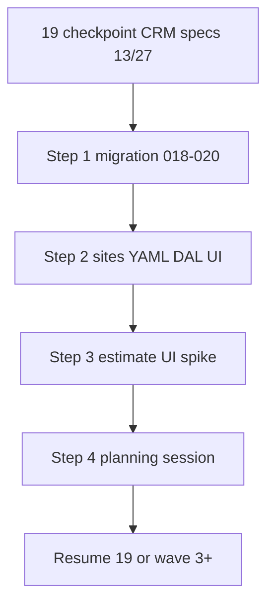
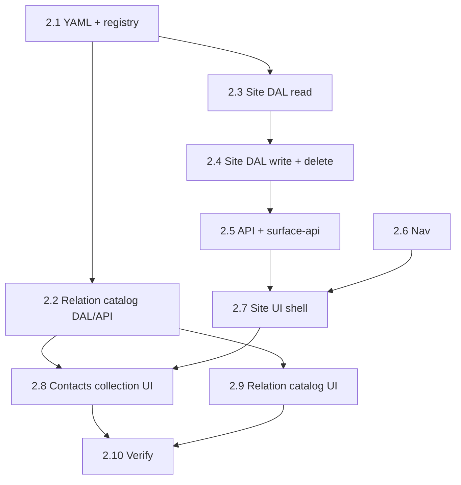

# 20 — UI discovery (CRM slice + estimate spike)

> **Status:** Active (2026-06-20). **Next:** [Step 2.1 — Surface YAML + codegen + policy registry](#step-21--surface-yaml--codegen--policy-registry).
>
> **Supersedes for implementation order:** task [19](./19-surface-implement-specs.md) “no code until all specs” gate — see [planning model](../decisions/general.md#decision-planning-model--ui-discovery-before-ops-specs-2026-06-20).

## Goal

Validate **list/detail + collections** on real Surfaces and **de-risk estimate/job UX** with working UI — before writing implement specs for catalog depth (`item`, `category`, …) and ops/finance (`estimate`, `job`, `invoice`, …).

**Outcomes:**

1. **CRM confidence** — `site_list` / `site_detail` (+ relation catalog) prove migration → YAML → DAL → UI on a specced Surface.
2. **Estimate UX** — `estimate_detail` line editor (fixture or wired) answers flat vs grouped-by-location, grid density, kit shape — inform spec rows **#20–21**, **#26–27**.
3. **Clear resume point** — when discovery exits, return to task 19 for remaining ⬜ rows **informed by what shipped**.

## Prerequisites

- Task [19](./19-surface-implement-specs.md) **checkpoint** — CRM hub + sites implement specs ✅ (scan rows **#1–14**; see [00-scan](../surface-specs/00-scan.md)).
- [`current.dbml`](../schema/current.dbml) + [`surfaces.md`](../surfaces.md) stable for wave 1 tables.
- Shipped app shell + IAM (slice 00).

## What is paused (not abandoned)

| Artifact | State |
|----------|--------|
| Task 19 rows **#15–28** | ⬜ **Deferred** until after discovery planning session — especially `item`, `estimate`, `job`, `invoice` |
| Full CRM (all party lenses, addresses, geography UI) | **Phased** — sites first; wave 2 after estimate spike informs geography need |
| Production estimate DAL | **After** spike + `estimate.md` spec |

---

## Process overview

**Parallelism:** Step 3 may start on **fixture routes** while Step 2 is in progress. Wire live `site_id` / `site_location` pickers only after Step 2 (and wave 2b geography if grouped mode wins).

---

## Step 1 — Wave 1 migration

> **Status:** Complete (2026-06-20). **Next:** [Step 2 — sites CRM slice](#step-2--sites-crm-slice-thin-vertical).

**Deliverable:** Business DDL per [`deferred/site-migration.md`](./deferred/site-migration.md).

| File | Contents |
|------|----------|
| `migrations/018_party_refactor.sql` | `party_person`, `party_organization`, `note`; backfill; `employee` retarget |
| `migrations/019_site.sql` | `address`, `site`, `site_section`, `site_location`, `party_address`, `site_contact_relation`, `site_contact` |
| `migrations/020_site_contact_relation_dev_seed.sql` | Optional dev seed for relation catalog |

**Exit:** Migrations apply cleanly on fresh + existing dev DB; `current.dbml` unchanged or patched if drift found.

**Do not** in this step: Surface YAML, DAL, UI.

---

## Step 2 — Sites CRM slice (thin vertical)

**Deliverable:** First **production** list/detail Surfaces after IAM/contacts interim.

| Layer | Surfaces | Spec |
|-------|----------|------|
| YAML + codegen | `site_list`, `site_detail`, `site_contact_relation_table` | [`site.md`](../surface-specs/site.md), [`site-contact-relation.md`](../surface-specs/site-contact-relation.md) |
| DAL + API | Repository, `/api/sites`, relation catalog route | Same specs § D–E |
| UI | `/sites` master-detail; relation catalog page | Same specs § G–I |

**In scope (v0 ship):** `profile`, `contacts` collection, relation catalog table.

**Defer to wave 2 / 2b** (unless spike blocks): `parent_site`, `physical_address`, `sections`, `locations` — specs exist ([`site-geography.md`](../surface-specs/site-geography.md), [`party-addresses.md`](../surface-specs/party-addresses.md)); land when estimate grouping needs real `site_location` rows.

**Exit:** CRUD sites + standing contacts; nav shows Sites group; manifest grants work; delete rules per site spec (A+).

**Execution order:** 2.1 → 2.2 → 2.3 → 2.4 → 2.5 → 2.6 + 2.7 (parallel once GET works) → 2.8 → 2.9 (anytime after 2.2) → 2.10.

### Step 2.1 — Surface YAML + codegen + policy registry

**What:** Declare the three Surfaces in YAML so permissions, Zod schemas, and glue are generated — same pattern as [task 11](./11-contact-surfaces.md) for contacts.

| Deliverable | Spec ref |
|-------------|----------|
| `site_list.surface.yaml` | [`site.md`](../surface-specs/site.md) §A–B |
| `site_detail.surface.yaml` | §A–B (`profile`, portfolio scalars, `contacts` with `columns: []`) |
| `site_contact_relation_table.surface.yaml` | [`site-contact-relation.md`](../surface-specs/site-contact-relation.md) §A–B |
| Register defs in `lib/policy-registry.ts` | §C |
| `npm run codegen:check` passes | — |

**Exit:** All three `surface_id`s in registry; generated schemas match spec field ids.

**Out of scope:** Hand-written collection logic (stub `contacts` in codegen is expected; see spec §K).

---

### Step 2.2 — Relation catalog DAL + API

**What:** Ship the **master catalog** first so site detail contact rows have relation labels to pick from.

| Layer | Work |
|-------|------|
| DAL | `lib/sites/` — `list`, `create`, `patch`, `delete` on `site_contact_relation` |
| Delete rule | Pre-check `site_contact.relation_id` → `ConflictError` ([relation spec](../surface-specs/site-contact-relation.md) §E) |
| API | `GET` / `POST /api/sites/contact-relations`, `PATCH` / `DELETE /api/sites/contact-relations/[id]` |
| Picker | Reuse `list` for relation dropdown (§D) |

**Exit:** CRUD on relation rows via API; duplicate `display_name` rejected; delete blocked when in use.

**Why first:** [`site.md`](../surface-specs/site.md) §I — empty catalog disables **Add contact** on site detail.

---

### Step 2.3 — Site DAL — read path

**What:** Read sites through the DAL with manifest-narrowed projection (no raw DB in routes).

| Method | Behavior |
|--------|----------|
| `list(ctx, { limit, offset, q? })` | `site` anchor only; sort `name` asc; search on `name` (§D) |
| `get(ctx, id)` | `profile` + portfolio FKs + joins to `party.display_name` (§D) |
| `contacts` (read) | Join `site_contact` + `site_contact_relation` + `party` → element DTO (§B) |

| Files | Pattern |
|-------|---------|
| `lib/sites/repository.ts`, `descriptors.ts`, `dal.ts` | Mirror `lib/contacts/` |

**Exit:** `get` returns correct DTO shape for a seeded site; forbidden fields omitted per manifest.

**Defer:** PATCH, create, delete, portfolio validation.

---

### Step 2.4 — Site DAL — write + delete

**What:** Mutations with strict schemas and business rules from [`site.md`](../surface-specs/site.md) §E–F.

| Operation | Rules |
|-----------|-------|
| `create` | `name` required; optional portfolio FKs; optional `contacts` |
| `patch` | Profile, portfolio (`null` = unlink), `contacts` **replace-array** |
| Portfolio validation | Customer = org + `customer` tag; property owner = `property_owner` tag |
| `delete` | Hard delete; `ConflictError` for `estimate`, `job`, **child_site** (app pre-check) |

**Exit:** Transactional writes + audit; delete blockers return structured errors.

---

### Step 2.5 — Site API routes + `surface-api` wiring

**What:** Wire HTTP to DAL via existing surface route helpers ([task 12](./12-contact-dal-api.md) pattern).

| Route | Surface |
|-------|---------|
| `GET /api/sites` | `site_list` |
| `GET` / `PATCH` / `POST` / `DELETE /api/sites/[id]` | `site_detail` |
| `GET /api/sites/pickers/parties` (if needed) | Tag-filtered party picker for portfolio + contacts |

Add entries to `lib/surface-api.ts` for React Query hooks.

**Exit:** API returns `{ data, manifest }`; 403/404 per platform default.

---

### Step 2.6 — Nav + routes

**What:** Make Sites discoverable in the shell.

| Item | Spec |
|------|------|
| `lib/nav-routes.ts` | `/sites`, `/sites/[id]`, `/sites/contact-relations` |
| `lib/nav.ts` / `SURFACE_NAV_CATALOG` | **Sites** group: Sites list, Contact relations |
| `SideNav.tsx` | Highlight rules for nested paths |

**Exit:** Sidebar shows Sites group; paths match spec §A routes.

**Also:** Grant `read` / `write` on new Surfaces for a dev role (seed or manual) so QA is not blocked.

---

### Step 2.7 — Site UI shell (list + detail, profile + portfolio)

**What:** Master-detail layout **without** contacts yet — prove list/detail + save/delete on scalars ([task 13](./13-contact-ui.md) pattern).

| File | Role |
|------|------|
| `app/(private)/sites/layout.tsx` | List pane |
| `app/(private)/sites/page.tsx` | List landing |
| `app/(private)/sites/[id]/page.tsx` | Detail |
| `app/(private)/sites/new/page.tsx` | Create flow (optional if create via list → new id) |
| `components/sites/SiteList.tsx` | `useSurfaceList('site_list')` |
| `components/sites/SiteDetailForm.tsx` | Profile + Portfolio sections (§G) |
| `SurfaceToolbar` | New / Save / Delete |

**Exit:** List → detail navigation; create site with name; PATCH portfolio pickers; hub links when FK + grant (§H).

**Out of scope:** `contacts` field array, quick-create person.

---

### Step 2.8 — Contacts collection UI + pickers

**What:** Replace-array on Save ([task 14](./14-contact-child-collections.md) + [`site.md`](../surface-specs/site.md) §I).

| Piece | Behavior |
|-------|----------|
| DAL | Wired in 2.4 — verify replace-array round-trips in UI |
| `SiteFields` / contact rows | `useFieldArray`; party picker (any party) + relation dropdown |
| Empty catalog | Disable Add; CTA → `/sites/contact-relations` |
| Quick-create person | Modal → creates party + row (client orchestration → PATCH) |
| Save model | Contacts saved with profile/portfolio on Save, not per-row API |

**Exit:** Add/edit/remove standing contacts; reload persists; duplicate `(party, relation)` shows inline error.

---

### Step 2.9 — Relation catalog UI page

**What:** Editable table page (not master-detail) per [catalog table decision](../decisions/general.md#decision-catalog-tables--editable-table-page-not-master-detail-2026-06-16).

| File | Role |
|------|------|
| `app/(private)/sites/contact-relations/page.tsx` | Single-page table |
| `components/sites/SiteContactRelationTable.tsx` | Per-row POST / PATCH / DELETE |

**Exit:** Admin can maintain relation labels; pickers on site detail reflect changes.

**Parallelism:** Can run alongside 2.7 once 2.2 is done.

---

### Step 2.10 — Step 2 stop gate

**What:** Confirm Step 2 exit criteria above and spec verify sections.

| Check | Source |
|-------|--------|
| CRUD sites + standing contacts | Step 2 exit |
| Nav shows Sites group | Step 2 exit |
| Manifest grants work (read-only vs write vs delete) | [`site.md`](../surface-specs/site.md) §C |
| Delete: cascade contacts OK; block on estimate / job / child_site | §E |
| Relation catalog delete blocked when in use | [relation spec](../surface-specs/site-contact-relation.md) §E |
| Task 20 verify row for sites | [Verify](#verify-task-exit) below |

**Explicitly deferred (do not block Step 2):** `parent_site`, `physical_address`, `sections`, `locations` (wave 2 / 2b).

---

## Step 3 — Estimate UI spike

**Deliverable:** Clickable `estimate_detail` that answers **line-editor** questions — **fixture DTO acceptable**; production DAL optional.

**Route (suggested):** `/estimates/[id]` with `id = demo` or seed row — document choice in spike PR.

**Prototype (minimum):**

| Topic | Locked catalog ref | Spike must exercise |
|-------|-------------------|---------------------|
| Flat line grid | [O3 flat mode](../decisions/estimate.md) | Add/edit/remove lines; description, qty, unit, cost, sell columns |
| Grouped by place | [O3 grouped mode](../decisions/estimate.md) | UI shell keyed by `site_location` (fixture locations OK) |
| Line kinds | DBML `line_kind` | Product vs labor row shape; `phase_id` on labor |
| Kits | DBML `parent_line_id` / `line_role` | Optional — header + component rows or single rolled-up line |
| Pickers | Deferred catalog | Static `Select` for item/part until wave 3 |

**Fixture data:** Use realistic trades lines (e.g. horn/strobes, pull stations, FACP, cable) — see item/estimate design threads.

**Not in spike:** Win → job, snapshots persistence, `estimate_party`, sections, pricing engine, catalog migrations.

**Exit:** Written spike notes in [`docs/spikes/estimate-line-editor.md`](../spikes/estimate-line-editor.md) (create on first spike) — decisions made, screenshots or route path, open forks.

---

## Step 4 — Planning session (stop gate)

**When:** Step 3 spike reviewed (solo or short review). **Do not** start wave 3 catalog code or full estimate migration until this session completes.

**Agenda — lock or defer each:**

1. **Line editor** — flat only, grouped only, or both (toggle)? Default for new quotes?
2. **Geography** — promote wave 2b (`sections` / `locations` on `site_detail`) before estimate ship?
3. **Kits** — kit_header/components on quote vs single rolled-up line?
4. **Next spike** — `job_detail` tabs (Scope / Field / Billing) before or after `estimate.md` spec?
5. **Task 19 resume order** — recommended: `estimate.md` → `job.md` → `item.md` (minimal) → remaining catalog tables → procurement/billing specs.

**Outputs (required):**

| Output | Location |
|--------|----------|
| Dated **Decision** blocks | [`decisions/estimate.md`](../decisions/estimate.md), [`decisions/job.md`](../decisions/job.md) as needed |
| Implement spec(s) from spike | [`surface-specs/estimate.md`](../surface-specs/estimate.md) (+ optional `job.md` stub) |
| Spike artifact | [`spikes/estimate-line-editor.md`](../spikes/estimate-line-editor.md) |
| STATUS + task index | [`../../STATUS.md`](../../STATUS.md), [01-task-index.md](./01-task-index.md) — repoint **Right now** |

**Exit:** Next implementation wave named explicitly (e.g. “wave 2b geography + estimate migration” or “resume task 19 rows #15–18”).

---

## Verify (task exit)

- [x] `018`–`020` migrations applied in dev
- [ ] `site_list` / `site_detail` + relation catalog **shipped** (YAML, DAL, UI)
- [ ] Estimate line-editor spike **runnable** + spike notes doc exists
- [ ] Planning session completed; decisions + `estimate.md` spec started or ✅
- [ ] [`../../STATUS.md`](../../STATUS.md) points at named next wave (not “task 19 row 15” blindly)
- [ ] Task [19](./19-surface-implement-specs.md) status reflects checkpoint + resume plan

## Out of scope

- Full party lens refactor (`/customers`, retire `/contacts`) — can trail sites or run as wave 1b; not blocking spike
- Catalog wave (`part` UI, `item`, migrations for `manufacturer_part`) — after planning session unless spike demands `part` picker sooner
- Procurement, billing, reports
- Pixel-perfect design system / marketing polish

## Reference

- [Planning model](../decisions/general.md#decision-planning-model--ui-discovery-before-ops-specs-2026-06-20)
- [surface-planning-depth.md](../surface-planning-depth.md)
- [site migration spec](./deferred/site-migration.md)
- [19-surface-implement-specs.md](./19-surface-implement-specs.md) — checkpoint + resume
