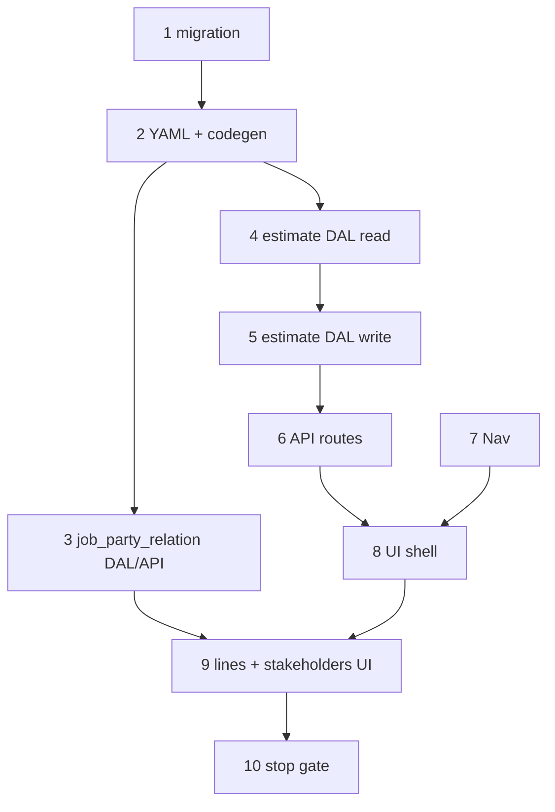

# 22 — Estimate wave 4a (flat production)

> **Status:** Active (2026-06-23). **Next:** [Step 10 — Stop gate](#step-10--stop-gate).
>
> **Spec:** [`estimate.md`](../surface-specs/estimate.md) · **Decisions:** [line editor](../decisions/estimate.md#decision-estimate-line-editor--expand-on-add-and-grouped-table-ui-2026-06-23), [wave 4 order](../decisions/estimate.md#decision-estimate-wave-4--implementation-order-2026-06-23) · **Spike reference:** [`estimate-line-editor.md`](../spikes/estimate-line-editor.md), `EstimateLineEditorSpike.tsx`

## Goal

Ship **production** `estimate_list` / `estimate_detail` with real DAL + API — **flat** `line_items` antd `Table`, stakeholders, Save/Revert. Replace dev-only `/estimates/demo` when `[id]` serves real rows.

**Out of scope (later waves):** grouped-by-place toggle (4c + wave 2b geography), `quote_sections`, `win`/`lose` → job (4b), full catalog pickers (4d), drag reorder.

## Prerequisites

- Task [20](./20-ui-discovery.md) complete — sites slice + estimate spike + planning session.
- [`estimate.md`](../surface-specs/estimate.md) implement spec ✅.
- Wave 1 sites shipped — `site_id` FK target exists ([`site.md`](../surface-specs/site.md)).
- DBML estimate tables in [`current.dbml`](../schema/current.dbml) — Slice 4.

## What ships in 4a

| Layer | Deliverable |
|-------|-------------|
| DDL | `021_*` migration — `job_party_relation`, `estimate`, `estimate_party`, `estimate_line` (+ `estimate_section` DDL only; no Surface Field v1) |
| Surfaces | `estimate_list`, `estimate_detail`, `job_party_relation_table` YAML + policy registry |
| DAL | `lib/estimates/` — list, get, create, patch, delete; `line_items` + `stakeholders` replace-array |
| API | `GET/POST /api/estimates`, `GET/PATCH/POST/DELETE /api/estimates/[id]`; job party relation catalog routes |
| UI | `/estimates` master-detail; `EstimateDetailForm` — profile, stakeholders, flat line grid |
| Nav | Sales group — `estimate_list` |

**Exit:** CRUD draft estimates with inline line editing; site picker; stakeholder rows; delete rules per spec; `codegen:check` passes.

**Execution order:** 1 → 2 → 3 (catalog before stakeholder UX) → 4 → 5 → 6 → 7 + 8 (parallel once GET works) → 9 → 10.

---

## Step 1 — Estimate DDL migration

> **Status:** Complete (2026-06-23). **Next:** [Step 2 — Surface YAML + codegen](#step-2--surface-yaml--codegen--policy-registry).

**What:** Add Slice 4 business tables per [`current.dbml`](../schema/current.dbml) `TableGroup estimate`.

| Table | Notes |
|-------|--------|
| `job_party_relation` | Engagement stakeholder role catalog (parallel `site_contact_relation`) |
| `estimate` | Anchor; `site_id` FK → `site`; status CHECK |
| `estimate_party` | Composite PK; FK `relation_id` → `job_party_relation` |
| `estimate_line` | Flat lines; kit `parent_line_id`; nullable `site_location_id` |
| `estimate_section` | DDL for future `quote_sections`; **no UI in 4a** |

| Files | Action |
|-------|--------|
| `migrations/021_estimate.sql` | CREATE tables, indexes, FKs, CHECK constraints |
| Dev seed (optional) | `022_job_party_relation_dev_seed.sql` — suggested default relations |

**Exit:** Migration applies in dev; `site` delete blocker path for `estimate.site_id` remains valid.

**Reference:** [`site-migration.md`](./deferred/site-migration.md) pattern; geography tables already in `019_site.sql`.

---

## Step 2 — Surface YAML + codegen + policy registry

> **Status:** Complete (2026-06-23). **Next:** [Step 3 — Job party relation catalog DAL + API](#step-3--job-party-relation-catalog-dal--api).

**What:** Declare Surfaces in YAML — same pattern as [task 20 step 2.1](./20-ui-discovery.md#step-21--surface-yaml--codegen--policy-registry).

| Deliverable | Spec ref |
|-------------|----------|
| `estimate_list.surface.yaml` | [`estimate.md`](../surface-specs/estimate.md) §A–B |
| `estimate_detail.surface.yaml` | §A–B (`profile`, `stakeholders`, `line_items`; omit `quote_sections` v1) |
| `job_party_relation_table.surface.yaml` | Catalog table — mirror [`site-contact-relation.md`](../surface-specs/site-contact-relation.md); columns `display_name`, `sort_order` |
| Register defs in `lib/policy-registry.ts` | §C — include `win` / `lose` actions on `estimate_detail` (handlers may 501 until 4b) |
| `npm run codegen:check` passes | — |

**Exit:** All three `surface_id`s in registry; generated schemas match spec field ids.

---

## Step 3 — Job party relation catalog DAL + API

> **Status:** Complete (2026-06-23). **Next:** [Step 4 — Estimate DAL — read path](#step-4--estimate-dal--read-path).

**What:** Ship stakeholder **relation catalog** before estimate detail add-row UX (same rationale as [site contact relation](./20-ui-discovery.md#step-22--relation-catalog-dal--api)).

| Layer | Work |
|-------|------|
| DAL | `lib/estimates/` or `lib/job-party-relations/` — CRUD on `job_party_relation` |
| Delete rule | Pre-check `estimate_party.relation_id` → `InUseError` |
| API | `GET` / `POST /api/estimates/party-relations`, `PATCH` / `DELETE …/[id]` (path per [`surfaces.md`](../surfaces.md)) |
| Picker | `list` for stakeholder relation dropdown |

**Exit:** CRUD on relation rows via API; duplicate `display_name` rejected; delete blocked when in use.

---

## Step 4 — Estimate DAL — read path

> **Status:** Complete (2026-06-23). **Next:** [Step 5 — Estimate DAL — write + delete](#step-5--estimate-dal--write--delete).

**What:** Read estimates through DAL with manifest-narrowed projection.

| Method | Behavior |
|--------|----------|
| `list(ctx, { limit, offset, q? })` | `estimate` anchor; join `site.name`; sort `estimate_date` desc, `title` asc (§D) |
| `get(ctx, id)` | `profile` + joins; `stakeholders` collection; `line_items` ordered by `sort_order` (§D) |

| Files | Pattern |
|-------|---------|
| `lib/estimates/repository.ts`, `descriptors.ts`, `dal.ts` | Mirror `lib/sites/` |

**Exit:** `get` returns DTO shape from spec §B; forbidden fields omitted per manifest.

**Defer:** PATCH, create, delete, line validation.

---

## Step 5 — Estimate DAL — write + delete

> **Status:** Complete (2026-06-23). **Next:** [Step 6 — Estimate API routes](#step-6--estimate-api-routes--surface-api-wiring).

**What:** Mutations per [`estimate.md`](../surface-specs/estimate.md) §E–F.

| Operation | Rules |
|-----------|-------|
| `create` | `title` + `site_id` required; status `draft`; optional `stakeholders`, `line_items` |
| `patch` | `profile`, `stakeholders`, `line_items` replace-array; **block line PATCH when `status = won`** |
| `line_items` | Kit integrity; `site_location_id` on estimate's site; reindex `sort_order` / `line_number` |
| `delete` | Hard delete `draft` when allowed; `ConflictError` when `won` + job exists |

**Exit:** Transactional writes + audit; structured delete blockers.

**Defer:** `win` / `lose` action implementations (4b).

---

## Step 6 — Estimate API routes + `surface-api` wiring

> **Status:** Complete (2026-06-23). **Next:** [Step 7 — Nav + routes](#step-7--nav--routes).

| Route | Surface |
|-------|---------|
| `GET /api/estimates` | `estimate_list` |
| `GET` / `PATCH` / `POST` / `DELETE /api/estimates/[id]` | `estimate_detail` |
| `GET /api/estimates/pickers/sites` (if needed) | Site picker for `profile.site_id` |

Register surface loaders in shared surface-api pattern ([task 20 step 2.5](./20-ui-discovery.md#step-25--site-api-routes--surface-api-wiring)).

**Exit:** Postman/curl smoke — list, create, get, patch lines, delete draft.

---

## Step 7 — Nav + routes

> **Status:** Complete (2026-06-23). **Next:** [Step 8 — Estimate UI shell](#step-8--estimate-ui-shell).

| Item | Work |
|------|------|
| `lib/nav-routes.ts` | `routes.estimates.list`, `routes.estimates.detail(id)` |
| `SURFACE_NAV_CATALOG` | **Sales** group — `estimate_list` |
| App routes | `app/(private)/estimates/layout.tsx`, `page.tsx`, `[id]/page.tsx` |
| `requireAuth` | Per-page paths |

**Exit:** Nav shows Estimates; longest-prefix highlight for `/estimates/[id]`.

**Note:** Keep `/estimates/demo` dev-gated until step 9 ships production detail — then retire or 404 non-demo ids only on demo route.

---

## Step 8 — Estimate UI shell

> **Status:** Complete (2026-06-23). **Next:** [Step 9 — Stakeholders + flat line editor](#step-9--stakeholders--flat-line-editor).

**What:** Master-detail shell without full line grid yet.

| Component | Work |
|-----------|------|
| `EstimateList` | Columns per spec §B; New → create flow |
| `EstimateDetailForm` | `profile` — title, site picker, dates, status display |
| Chrome | `SurfaceFormRoot`, `SurfaceToolbar` Save/Revert pattern ([`SiteDetailForm`](../../components/sites/SiteDetailForm.tsx)) |

**Exit:** Create estimate from list; edit title + site; Save persists profile.

**Defer:** `line_items`, `stakeholders` tables.

---

## Step 9 — Stakeholders + flat line editor

> **Status:** Complete (2026-06-23). **Next:** [Step 10 — Stop gate](#step-10--stop-gate).

**What:** Production line editor — refactor spike into manifest-driven form.

| Area | Work |
|------|------|
| `stakeholders` | Field array — party picker + relation dropdown; empty-catalog CTA → party-relations catalog |
| `line_items` | antd `Table` `size="small"` — columns per [decision](../decisions/estimate.md#decision-estimate-line-editor--expand-on-add-and-grouped-table-ui-2026-06-23): kind, description, qty, unit, cost, sell, ext sell; part/phase columns description-first until catalog |
| Add actions | Add line; Add kit (header + components); assembly expand-on-add when catalog exists |
| Kits | Cascade delete header → components; indent + role tags |
| Spike | Port patterns from `EstimateLineEditorSpike.tsx`; wire to real PATCH |

**Grouped mode:** **Do not ship** in 4a — Segmented toggle hidden until wave 4c.

**Exit:** Full quote edit on production route; `/estimates/demo` retired or documented as superseded.

---

## Step 10 — Stop gate

> **Status:** Complete (2026-06-23). Wave 4a shipped — `/estimates` production CRUD with stakeholders + flat line editor. Next wave: **4b** (`win`/`lose` + job copy) once job slice (#21) lands.

**What:** Confirm 4a exit criteria and spec verify rows.

| Check | Source |
|-------|--------|
| Migration applied | Step 1 |
| `codegen:check` | Step 2 |
| Relation catalog CRUD | Step 3 |
| Estimate CRUD + line replace-array | Steps 4–6 |
| Nav + list/detail UI | Steps 7–8 |
| Flat line grid + stakeholders | Step 9 |
| Manifest grants | [`estimate.md`](../surface-specs/estimate.md) §C |
| Delete blockers | §E |
| Task 22 verify below | — |

**Explicitly deferred (do not block 4a):** `quote_sections`, grouped editor, `win`/`lose`, catalog `item_id` picker, drag reorder.

**Verify (exit):**

- [x] `021` migration applied in dev
- [x] `estimate_list` / `estimate_detail` / `job_party_relation_table` YAML + registry; `codegen:check` passes
- [x] Job party relation catalog — API CRUD + InUseError on delete
- [x] Estimate DAL list/get/create/patch/delete
- [x] API routes wired via surface-api
- [x] Sales nav — `/estimates`, `/estimates/[id]`
- [x] Flat `line_items` — add/edit/remove; kit header + components; Save/Revert
- [x] `stakeholders` replace-array on Save
- [x] [`estimate.md`](../surface-specs/estimate.md) verify rows for 4a checked
- [x] [`../../STATUS.md`](../../STATUS.md) repointed — 4b or next wave

---

## Reference

- [`estimate.md`](../surface-specs/estimate.md) — implement spec A–K
- [`20-ui-discovery.md`](./20-ui-discovery.md) — sites slice pattern (steps 2.1–2.10)
- [`site-contact-relation.md`](../surface-specs/site-contact-relation.md) — catalog table precedent
- [`CatalogTableSurface.tsx`](../../components/catalog/CatalogTableSurface.tsx) — relation catalog UI pattern
