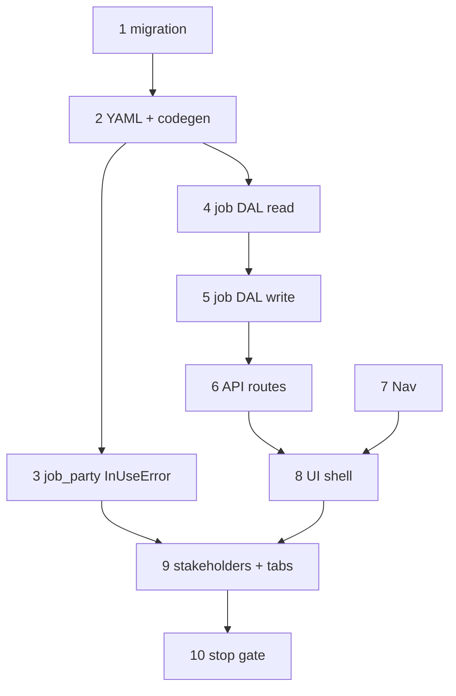

# 23 — Job wave 5a (shell + Overview)

> **Status:** Complete (2026-06-24). **Next:** [24-part-wave-3a.md](./24-part-wave-3a.md) — wave **3a** parts catalog.
>
> **Spec:** [`job.md`](../surface-specs/job.md) · **Decisions:** [wave 5 order](../decisions/job.md#decision-job-wave-5--implementation-order-2026-06-23), [tabbed layout](../decisions/job.md#decision-job_detail-layout--tabbed-2026-06-17) · **Stakeholder pattern:** [`EstimateStakeholderFields`](../../components/estimates/EstimateStakeholderFields.tsx), [`job-party-relation.md`](../surface-specs/job-party-relation.md)

## Goal

Ship **production** `job_list` / `job_detail` with real DAL + API — **Overview** tab live (`profile` + `stakeholders`); **Scope / Field / Billing tabs stubbed**. Internal `line_items` DAL for **5b** win-copy; **no Scope line grid** until wave **4d′** (after catalog + shared line editor).

**Out of scope (later waves):** Scope line UI (4d′), `win`/`lose` → job (5b), Field tab (5c), change orders (5d), Billing (6b), delete route, `parent_job_id` UI, list search/sort.

## Prerequisites

- Task [22](./22-estimate-wave-4a.md) complete — estimates + `job_party_relation` catalog shipped.
- [`job.md`](../surface-specs/job.md) implement spec ✅ (planning session 2026-06-23).
- Wave 1 sites shipped — `site_id` FK target exists ([`site.md`](../surface-specs/site.md)).
- DBML job tables in [`current.dbml`](../schema/current.dbml) — Slice 5 TableGroup.

## What ships in 5a

| Layer | Deliverable |
|-------|-------------|
| DDL | `023_*` migration — `job`, `job_party` (+ `sort_order`), `job_line` only; defer `job_line_part`, `job_work_item`, `change_order_*` |
| Surfaces | `job_list`, `job_detail` YAML + policy registry (`complete` action declared; no `delete`, no `line_items` Field) |
| DAL | `lib/jobs/` — list, get, create, patch; `stakeholders` replace-array; **internal** `line_items` read/write for 5b (omitted from manifest GET/PATCH) |
| Catalog patch | `job_party_relation` delete pre-check adds `job_party` to `InUseError` |
| API | `GET/POST /api/jobs`, `GET/PATCH/POST /api/jobs/[id]` — **no DELETE** |
| UI | `/jobs` master-detail; `JobDetailForm` — tabbed shell; Overview live; stub tabs |
| Nav | Operations group — `job_list` |

**Exit:** CRUD jobs (create, read, patch profile + stakeholders); tabbed detail shell; DAL ready for win-copy; `codegen:check` passes.

**Execution order:** 1 → 2 → 3 (catalog blocker before stakeholder UX) → 4 → 5 → 6 → 7 + 8 (parallel once GET works) → 9 → 10.

### Decision: 5a DDL scope (locked in this task)

**Choice:** Migration `023_job.sql` creates **`job`**, **`job_party`**, **`job_line`** only.

| Table | 5a | Rationale |
|-------|-----|-----------|
| `job` | ✅ | Anchor + billing column defaults (no YAML Field) |
| `job_party` | ✅ | Overview stakeholders; include `sort_order` |
| `job_line` | ✅ | Internal DAL + 5b win-copy target |
| `job_line_part` | defer | Engineering explosion — procurement wave |
| `job_work_item` | defer | Field tab — 5c |
| `change_order`, `change_order_line` | defer | 5d |

**Catalog FKs on `job_line`:** `phase_id`, `item_id`, `part_id`, `vendor_part_id`, `change_order_line_id` as nullable `TEXT` **without** `REFERENCES` until catalog / CO tables exist — same pattern as [`021_estimate.sql`](../../migrations/021_estimate.sql) `estimate_line`.

**DBML patch:** add `job_party.sort_order` when migration lands.

---

## Step 1 — Job DDL migration

> **Status:** Complete (2026-06-24). **Next:** [Step 2 — Surface YAML + codegen + policy registry](#step-2--surface-yaml--codegen--policy-registry).

**What:** Add Slice 5 core tables per [`current.dbml`](../schema/current.dbml) and [DDL scope](#decision-5a-ddl-scope-locked-in-this-task) above.

| Table | Notes |
|-------|--------|
| `job` | `site_id` FK → `site`; nullable `estimate_id` FK → `estimate`; `job_kind`, `status`, billing columns with CHECK defaults |
| `job_party` | Composite PK; `sort_order int NOT NULL DEFAULT 0`; FK `relation_id` → `job_party_relation` |
| `job_line` | Mirror `estimate_line` shape + job ledger columns (`source`, `status`, `estimate_line_id`, …) |

| Files | Action |
|-------|--------|
| `migrations/023_job.sql` | CREATE tables, indexes, FKs, CHECK constraints |
| `docs/schema/current.dbml` | Add `job_party.sort_order` |

**Exit:** Migration applies in dev; `site` delete blocker path for `job.site_id` valid; `estimate` FK optional.

**Reference:** [`021_estimate.sql`](../../migrations/021_estimate.sql) pattern.

---

## Step 2 — Surface YAML + codegen + policy registry

> **Status:** Complete (2026-06-24). **Next:** [Step 3 — `job_party_relation` delete blocker extension](#step-3--job_party_relation-delete-blocker-extension).

**What:** Declare Surfaces in YAML — same pattern as [task 22 step 2](./22-estimate-wave-4a.md#step-2--surface-yaml--codegen--policy-registry).

| Deliverable | Spec ref |
|-------------|----------|
| `job_list.surface.yaml` | [`job.md`](../surface-specs/job.md) §A–B |
| `job_detail.surface.yaml` | §A–B (`profile`, `stakeholders` only; declare `complete` surface action; **omit** `line_items`, `work_items`, billing Fields) |
| Register defs in `lib/policy-registry.ts` | §C — `complete` handler may 501 until 5c |
| `npm run codegen:check` passes | — |

**Exit:** Both `surface_id`s in registry; generated schemas match spec field ids.

---

## Step 3 — `job_party_relation` delete blocker extension

> **Status:** Complete (2026-06-24). **Next:** [Step 4 — Job DAL — read path](#step-4--job-dal--read-path).

**What:** Extend existing catalog DAL so delete/replace-omit checks **`job_party`** references (in addition to `estimate_party`).

| Layer | Work |
|-------|------|
| DAL | Patch `lib/estimates/repository/party-relations.ts` (or shared catalog module) — `InUseError` payload includes `{ type: "job_party", count }` |
| Spec | [`job-party-relation.md`](../surface-specs/job-party-relation.md) §E edge case already documents this |

**Exit:** Delete blocked when `job_party.relation_id` references row; rename still allowed.

---

## Step 4 — Job DAL — read path

> **Status:** Complete (2026-06-24). **Next:** [Step 5 — Job DAL — write path](#step-5--job-dal--write-path).

**What:** Read jobs through DAL with manifest-narrowed projection.

| Method | Behavior |
|--------|----------|
| `list(ctx, { limit, offset })` | `job` anchor; join `site.name` as `site_display_name`; sort `title` asc (§D) |
| `get(ctx, id)` | `profile` + joins (`site_display_name`, `estimate_display_title`); `stakeholders` ordered by `sort_order` (§D) |

| Files | Pattern |
|-------|---------|
| `lib/jobs/repository.ts`, `descriptors.ts`, `dal.ts` | Mirror `lib/estimates/` |

**Exit:** `get` returns DTO shape from spec §B; forbidden fields omitted per manifest; **`line_items` not in response** when Field absent from manifest.

**Defer:** PATCH, create, internal line load for win-copy.

---

## Step 5 — Job DAL — write path

> **Status:** Complete (2026-06-24). **Next:** [Step 6 — Job API routes + `surface-api` wiring](#step-6--job-api-routes--surface-api-wiring).

**What:** Mutations per [`job.md`](../surface-specs/job.md) §E–F.

| Operation | Rules |
|-----------|--------|
| `create` | `title` + `site_id` required; defaults `job_kind = project`, `status = planned` |
| `patch` | `profile`, `stakeholders` replace-array; **reject entire PATCH when `status = cancelled`** |
| `profile` | Writable: `title`, `site_id`, `status`, `job_kind`; block `site_id` change when `estimate_id` set or any `job_line` rows |
| `stakeholders` | Unique `(party_id, relation_id)`; `sort_order` from array order |
| `line_items` *(internal)* | Implement replace-array + kit integrity mirroring estimate DAL — **not** accepted on client PATCH in 5a |
| `delete` | **Not exposed** in 5a |

**Exit:** Transactional writes + audit; `ConflictError` on cancelled PATCH; client PATCH with `line_items` key → strict schema rejection.

**Defer:** `complete` action (5c); win-copy orchestration (5b).

---

## Step 6 — Job API routes + `surface-api` wiring

> **Status:** Complete (2026-06-24). **Next:** [Step 7 — Nav + routes](#step-7--nav--routes).

| Route | Surface |
|-------|---------|
| `GET /api/jobs` | `job_list` |
| `POST /api/jobs` | `job_detail` `write` (create) |
| `GET` / `PATCH` / `POST /api/jobs/[id]` | `job_detail` |

Register surface loaders in shared surface-api pattern ([task 22 step 6](./22-estimate-wave-4a.md#step-6--estimate-api-routes--surface-api-wiring)). Reuse site picker pattern from estimates if needed.

**Exit:** Postman/curl smoke — list, create, get, patch profile + stakeholders.

---

## Step 7 — Nav + routes

> **Status:** Complete (2026-06-24). **Next:** [Step 8 — Job UI shell](#step-8--job-ui-shell).

| Item | Work |
|------|------|
| `lib/nav-routes.ts` | `routes.jobs.list`, `routes.jobs.detail(id)` |
| `SURFACE_NAV_CATALOG` | **Operations** group — `job_list` |
| App routes | `app/(private)/jobs/(master-detail)/layout.tsx`, `page.tsx`, `[id]/page.tsx` |
| `requireAuth` | Per-page paths |

**Exit:** Nav shows Jobs; longest-prefix highlight for `/jobs/[id]`.

---

## Step 8 — Job UI shell

> **Status:** Complete (2026-06-24). **Next:** [Step 9 — Stakeholders + tabbed shell](#step-9--stakeholders--tabbed-shell).

**What:** Master-detail shell without stakeholders or tabs polish yet.

| Component | Work |
|-----------|------|
| `JobList` | Columns: `title`, `site_display_name` only (§B); New → create flow |
| `JobDetailForm` | `profile` — title, site picker, `job_kind`, `status`, estimate link when set |
| Chrome | `SurfaceFormRoot`, `SurfaceToolbar` Save/Revert; disable Save when `status = cancelled` |

**Exit:** Create job from list; edit profile fields; Save persists.

**Defer:** `stakeholders`, tabbed layout.

---

## Step 9 — Stakeholders + tabbed shell

> **Status:** Complete (2026-06-24). **Next:** [Step 10 — Stop gate](#step-10--stop-gate).

**What:** Overview stakeholders + Ant Design `Tabs` with stub panes.

| Area | Work |
|------|------|
| `stakeholders` | `JobStakeholderFields` — mirror `EstimateStakeholderFields`; party + relation pickers; empty-catalog CTA → `/party-relations` |
| Tabs | **Overview** (profile + stakeholders), **Scope** (empty state + link to source estimate when `estimate_id`), **Field** ("ships in wave 5c"), **Billing** ("ships in wave 6b") |
| Save | Whole-job — one toolbar PATCHes `profile` + `stakeholders` |

**Exit:** Full Overview edit on production route; stub tabs visible; cross-nav to site + estimate when grants allow.

---

## Step 10 — Stop gate

> **Status:** Complete (2026-06-24). **Next:** [24-part-wave-3a.md](./24-part-wave-3a.md).

**What:** Confirm 5a exit criteria and spec verify rows.

| Check | Source |
|-------|--------|
| Migration applied | Step 1 |
| `codegen:check` | Step 2 |
| `job_party` InUseError on relation delete | Step 3 |
| Job CRUD (no delete) | Steps 4–6 |
| Nav + list/detail UI | Steps 7–8 |
| Stakeholders + tabbed shell | Step 9 |
| Manifest grants | [`job.md`](../surface-specs/job.md) §C |
| PATCH rules | §E (`cancelled`, `site_id` freeze) |
| Task 23 verify below | — |

**Explicitly deferred (do not block 5a):** Scope line grid, `win`/`lose`, Field/Billing tabs, delete, `complete` handler, `parent_job_id`, list search/sort.

**Verify (exit):**

- [x] `023` migration applied in dev; `job_party.sort_order` in DBML
- [x] `job_list` / `job_detail` YAML + registry; `codegen:check` passes
- [x] `job_party_relation` delete blocked when `job_party` references row
- [x] Job DAL list/get/create/patch (profile + stakeholders)
- [x] Internal `line_items` DAL methods exist (not in client PATCH manifest)
- [x] API routes wired via surface-api
- [x] Operations nav — `/jobs`, `/jobs/[id]`
- [x] Tabbed shell — Overview live; Scope/Field/Billing stubbed
- [x] `stakeholders` replace-array on Save
- [x] [`job.md`](../surface-specs/job.md) verify rows for 5a checked
- [x] [`../../STATUS.md`](../../STATUS.md) repointed — [24-part-wave-3a.md](./24-part-wave-3a.md) active

---

## Reference

- [`job.md`](../surface-specs/job.md) — implement spec A–K
- [`22-estimate-wave-4a.md`](./22-estimate-wave-4a.md) — parallel implementation pattern
- [`job-party-relation.md`](../surface-specs/job-party-relation.md) — stakeholder catalog
- [`EstimateDetailForm`](../../components/estimates/EstimateDetailForm.tsx) — master-detail + Save/Revert precedent
