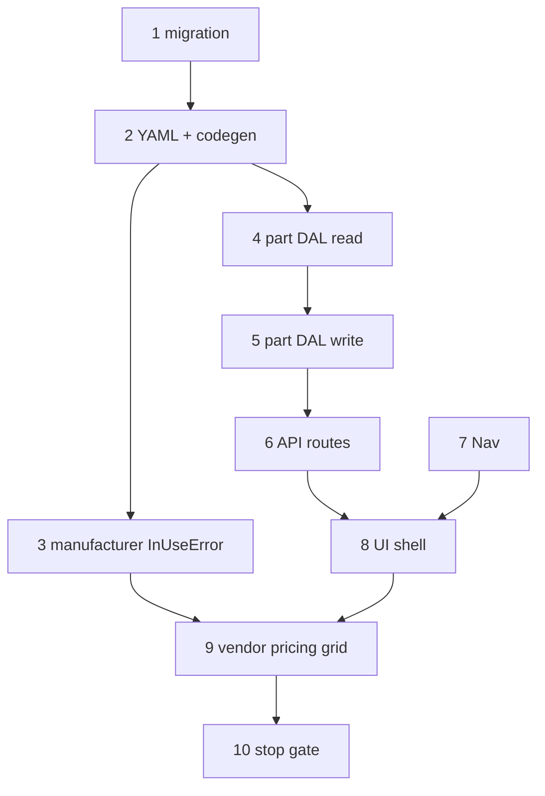

# 24 — Part wave 3a (MPN catalog + vendor pricing)

> **Status:** Complete (2026-06-24). **Next:** [25 — manufacturer detail](./25-manufacturer-detail.md) → wave **3b** `item_*` ([`item.md`](../surface-specs/item.md)).
>
> **Spec:** [`part.md`](../surface-specs/part.md) · **Decisions:** [MPN catalog](../decisions/catalog.md#decision-part_detail--mpn-catalog-and-vendor-pricing-2026-06-19), [catalog simplified](../decisions/catalog.md#decision-catalog--simplified-parts-items-categories-2026-06-16), [catalog-first line UI](../decisions/job.md#decision-job-wave-5--implementation-order-2026-06-23) · **Collection pattern:** [`child-collections.md`](../child-collections.md), [`EstimateStakeholderFields`](../../components/estimates/EstimateStakeholderFields.tsx)

## Goal

Ship **production** `part_list` / `part_detail` with real DAL + API — MPN header (`profile`) + `vendor_pricing` replace-array grid. First wave **3** catalog slice; unlocks part pickers for **3e** line editor and **4d′** Scope retrofit.

**Out of scope (later waves):** `estimate_line` / `job_line` FK backfill (defer until **3e** / **4d′** line UI); `item_*` (3b), `category_table` / `labor_class_table` / `phase_table` (3c), `specs` / `cut_sheet_url` / requirements graph, price history, manufacturer list filter, related-item panels, `vendor_detail` pricing rollup, picker return context from foreign Surfaces (→ [task 25](./25-manufacturer-detail.md) for manufacturer; other pickers follow same protocol).

## Prerequisites

- Task [23](./23-job-wave-5a.md) complete — job shell shipped; `estimate_line` / `job_line` `part_id` / `vendor_part_id` columns exist (nullable TEXT).
- [`part.md`](../surface-specs/part.md) implement spec ✅ (scan row **#14**, 2026-06-19).
- Wave 0→1 party lenses shipped — `manufacturer_list`, `vendor_list` picker anchors exist ([`manufacturer.md`](../surface-specs/manufacturer.md), [`vendor.md`](../surface-specs/vendor.md)).
- DBML catalog tables in [`current.dbml`](../schema/current.dbml) — Slice 3 TableGroup (`manufacturer_part`, `vendor_part`).

## What ships in 3a

| Layer | Deliverable |
|-------|-------------|
| DDL | `024_*` migration — `manufacturer_part`, `vendor_part` only (line-table FK ALTERs deferred) |
| Surfaces | `part_list`, `part_detail` YAML + policy registry (`profile`, `vendor_pricing`; `delete` on detail) |
| Catalog patch | Manufacturer delete blocker — `manufacturer_part` → `InUseError` on manufacturer delete |
| DAL | `lib/parts/` — list (search + sort), get, create, patch, delete; `vendor_pricing` replace-array; `is_preferred` exclusivity |
| API | `GET/POST /api/parts`, `GET/PATCH/POST/DELETE /api/parts/[id]` |
| UI | `/parts` master-detail; `PartDetailForm` — profile + vendor pricing grid |
| Nav | **Catalog** group — `part_list` |

**Exit:** CRUD parts (create, read, patch profile + vendor pricing, delete with blockers); `codegen:check` passes.

**Execution order:** 1 → 2 → 3 (manufacturer blocker before part UX) → 4 → 5 → 6 → 7 + 8 (parallel once GET works) → 9 → 10.

### Decision: 3a DDL scope (locked in this task)

**Choice:** Migration `024_part.sql` creates **`manufacturer_part`** and **`vendor_part`** only. **`estimate_line` / `job_line` stay nullable `TEXT`** (no `REFERENCES`) until a follow-on migration lands with **3e** / **4d′** when line pickers wire `part_id` — keeps `024` focused on catalog UI.

| Table / change | 3a | Rationale |
|----------------|-----|-----------|
| `manufacturer_part` | ✅ | Anchor — MPN header + UOM |
| `vendor_part` | ✅ | `vendor_pricing` collection |
| `estimate_line` FKs | defer | ALTER before line pickers ship (**3e** / **4d′**) |
| `job_line` FKs | defer | same |
| `item`, `item_part_link` | defer | wave **3b** |
| `category`, `labor_class`, `phase` | defer | wave **3c** |
| `job_line_part`, procurement tables | defer | waves **5c** / **6a** |

**DDL-only columns (no YAML Field v1):** `manufacturer_part.specs`, `cut_sheet_url`; `vendor_part.currency` (default `USD`).

**Module layout:** `modules/part/*.surface.yaml` + `lib/parts/` (mirror `modules/job/` + `lib/jobs/`).

**Delete blockers at 3a:** Implement `loadPartDeleteBlockers` for tables that **exist** after migration. At launch, no `RESTRICT` dependents exist yet (`item_part_link`, `job_line_part`, `material_receipt_line`, `job_material_movement` deferred) — delete succeeds when only `vendor_part` children remain; wire blocker queries so later migrations extend the same helper.

---

## Step 1 — Part DDL migration

> **Status:** Complete (2026-06-24). **Next:** [Step 2 — Surface YAML + codegen + policy registry](#step-2--surface-yaml--codegen--policy-registry).

**What:** Add Slice 3 part tables per [`current.dbml`](../schema/current.dbml) and [DDL scope](#decision-3a-ddl-scope-locked-in-this-task) above.

| Table | Notes |
|-------|--------|
| `manufacturer_part` | `manufacturer_party_id` FK → `party` `ON DELETE RESTRICT`; unique `(manufacturer_party_id, mpn)` |
| `vendor_part` | `vendor_party_id` FK → `party` `ON DELETE CASCADE`; `manufacturer_part_id` FK `ON DELETE CASCADE`; unique `(vendor_party_id, vendor_pn)`; `is_preferred` default false |

**Not in `024`:** `estimate_line` / `job_line` `part_id` + `vendor_part_id` remain plain `TEXT` (same as [`021_estimate.sql`](../../migrations/021_estimate.sql) / [`023_job.sql`](../../migrations/023_job.sql)). Follow-on migration when **3e** / **4d′** line UI connects pickers — add FKs `ON DELETE SET NULL` per DBML.

| Files | Action |
|-------|--------|
| `migrations/024_part.sql` | CREATE `manufacturer_part` + `vendor_part` only |
| `docs/schema/current.dbml` | No structural change expected — confirm matches migration |

**Exit:** Migration applies in dev; estimate/job lines unchanged.

**Reference:** [`023_job.sql`](../../migrations/023_job.sql), [`021_estimate.sql`](../../migrations/021_estimate.sql).

---

## Step 2 — Surface YAML + codegen + policy registry

> **Status:** Complete (2026-06-24). **Next:** [Step 3 — Manufacturer delete blocker extension](#step-3--manufacturer-delete-blocker-extension).

**What:** Declare Surfaces in YAML — same pattern as [task 23 step 2](./23-job-wave-5a.md#step-2--surface-yaml--codegen--policy-registry).

| Deliverable | Spec ref |
|-------------|----------|
| `modules/part/part_list.surface.yaml` | [`part.md`](../surface-specs/part.md) §A–B |
| `modules/part/part_detail.surface.yaml` | §A–B (`profile`, `vendor_pricing`; surface actions `read`, `write`, `delete`) |
| Hand-written glue | `lib/parts/descriptors.ts` — `vendor_pricing` collection (§K codegen L1/L2) |
| Register defs in `lib/policy-registry.ts` | §C — independent Field grants on `profile` / `vendor_pricing` |
| `npm run codegen:check` passes | — |

**Exit:** Both `surface_id`s in registry; generated schemas match spec field ids; descriptor overrides collection element shape.

---

## Step 3 — Manufacturer delete blocker extension

> **Status:** Complete (2026-06-24). **Next:** [Step 4 — Part DAL — read path](#step-4--part-dal--read-path).

**What:** Extend manufacturer (party lens) DAL so delete checks **`manufacturer_part.manufacturer_party_id`** references.

| Layer | Work |
|-------|------|
| DAL | `lib/contacts/repository.ts` (or shared party module) — `loadManufacturerDeleteBlockers` includes `{ type: "manufacturer_part", count, samples }` |
| Spec | [`manufacturer.md`](../surface-specs/manufacturer.md) §F already documents this |

**Exit:** Delete manufacturer blocked when parts reference party; structured `InUseError` payload with MPN sample labels.

---

## Step 4 — Part DAL — read path

> **Status:** Complete (2026-06-24). **Next:** [Step 5 — Part DAL — write path](#step-5--part-dal--write-path).

**What:** Read parts through DAL with manifest-narrowed projection.

| Method | Behavior |
|--------|----------|
| `list(ctx, { limit, offset, q? })` | Join `party` for manufacturer `display_name`; search `mpn` + `description`; sort manufacturer name, `mpn` (§D) |
| `get(ctx, id)` | `profile` + manufacturer label; `vendor_pricing` rows with vendor `display_name` when Field readable (§D) |

| Files | Pattern |
|-------|---------|
| `lib/parts/repository.ts`, `descriptors.ts`, `dal.ts` | Mirror `lib/jobs/` |

**Exit:** `get` returns DTO shape from spec §B; forbidden fields omitted per manifest.

**Defer:** create, patch, delete, delete blockers.

---

## Step 5 — Part DAL — write path

> **Status:** Complete (2026-06-24). **Next:** [Step 6 — Part API routes + `surface-api` wiring](#step-6--part-api-routes--surface-api-wiring).

**What:** Mutations per [`part.md`](../surface-specs/part.md) §E–F.

| Operation | Rules |
|-----------|--------|
| `create` | `profile` required: `manufacturer_party_id`, `mpn`, `description`; optional `vendor_pricing`; validate manufacturer tag |
| `patch` | `profile`, `vendor_pricing` replace-array; strict schemas |
| `profile` | Writable: all manifest-granted scalars; uniqueness on `(manufacturer_party_id, mpn)` → 409 |
| `vendor_pricing` | replace-array; `(vendor_party_id, vendor_pn)` unique; vendor must have `party_role.vendor` |
| `is_preferred` | At most one `true` per part — clear siblings in same transaction |
| `delete` | `loadPartDeleteBlockers` → `InUseError` on RESTRICT deps; else cascade `vendor_part` |

**Exit:** Transactional writes + audit; duplicate MPN / vendor PN validation; preferred exclusivity.

---

## Step 6 — Part API routes + `surface-api` wiring

> **Status:** Complete (2026-06-24). **Next:** [Step 7 — Nav + routes](#step-7--nav--routes).

| Route | Surface |
|-------|---------|
| `GET /api/parts` | `part_list` — supports `q` search param |
| `POST /api/parts` | `part_detail` `write` (create) |
| `GET` / `PATCH` / `POST` / `DELETE /api/parts/[id]` | `part_detail` |

Register surface loaders in shared surface-api pattern ([task 23 step 6](./23-job-wave-5a.md#step-6--job-api-routes--surface-api-wiring)).

**Exit:** Postman/curl smoke — list (with search), create, get, patch profile + pricing, delete.

---

## Step 7 — Nav + routes

> **Status:** Complete (2026-06-24). **Next:** [Step 8 — Part UI shell](#step-8--part-ui-shell).

| Item | Work |
|------|------|
| `lib/nav-routes.ts` | `routes.parts.list`, `routes.parts.detail(id)` |
| `SURFACE_NAV_CATALOG` | **Catalog** group — `part_list` (first Catalog nav entry) |
| App routes | `app/(private)/parts/(master-detail)/layout.tsx`, `page.tsx`, `[id]/page.tsx` |
| `requireAuth` | Per-page paths |

**Exit:** Nav shows Parts under Catalog; longest-prefix highlight for `/parts/[id]`.

---

## Step 8 — Part UI shell

> **Status:** Complete (2026-06-24). **Next:** [Step 9 — Vendor pricing grid + pickers](#step-9--vendor-pricing-grid--pickers).

**What:** Master-detail shell with `profile` only — pricing grid deferred to step 9.

| Component | Work |
|-----------|------|
| `PartList` | Columns: `mpn`, `description`, manufacturer label (§B); list search if manifest grants; New → create flow |
| `PartDetailForm` | `profile` — manufacturer picker, `mpn`, `description`, `unit`, `purchase_unit`, `units_per_purchase` |
| Chrome | `SurfaceFormRoot`, `SurfaceToolbar` Save/Revert + Delete |

**Exit:** Create part from list; edit profile fields; Save persists.

**Defer:** `vendor_pricing` grid, UOM conversion hint.

---

## Step 9 — Vendor pricing grid + pickers

> **Status:** Complete (2026-06-24). **Next:** [Step 10 — Stop gate](#step-10--stop-gate).

**What:** `vendor_pricing` collection UX + manufacturer/vendor pickers.

| Area | Work |
|------|------|
| Pickers | `useManufacturerPicker` / `useVendorPicker` (thin wrappers on list APIs or dedicated routes); prefetch on detail page |
| `vendor_pricing` | Field-array grid — vendor picker, `vendor_pn`, `vendor_description`, `unit_price`, **Preferred** checkbox (exclusive) |
| UOM hint | When `purchase_unit` ≠ `unit`, show `units_per_purchase` conversion above grid (§G) |
| Cross-nav | Links to `/manufacturers/[id]`, `/vendors/[id]` when grants allow (§H) |
| Save | Whole-part — one toolbar PATCHes `profile` + `vendor_pricing` |

**Exit:** Full part edit on production route; preferred vendor behavior matches DAL; empty pricing state.

---

## Step 10 — Stop gate

> **Status:** Complete (2026-06-24). **Next:** wave **3b** `item_*` — task TBD.

**What:** Confirm 3a exit criteria and spec verify rows.

| Check | Source |
|-------|--------|
| Migration applied | Step 1 |
| `codegen:check` | Step 2 |
| Manufacturer `InUseError` on part refs | Step 3 |
| Part CRUD + delete | Steps 4–6 |
| Nav + list/detail UI | Steps 7–8 |
| Vendor pricing grid | Step 9 |
| Manifest grants | [`part.md`](../surface-specs/part.md) §C |
| PATCH / delete rules | §E–F |
| Task 24 verify below | — |

**Explicitly deferred (do not block 3a):** `estimate_line` / `job_line` FK ALTERs (**3e** / **4d′**), `item_*`, catalog tables, `specs` / cut sheets, list manufacturer filter, related panels, picker return context, procurement RESTRICT blockers until those tables exist.

**Verify (exit):**

- [x] `024` migration applied in dev — `manufacturer_part` + `vendor_part` only
- [x] `part_list` / `part_detail` YAML + registry; `codegen:check` passes
- [x] Manufacturer delete blocked when `manufacturer_part` references party
- [x] Part DAL list/get/create/patch/delete
- [x] `is_preferred` exclusivity; duplicate MPN / vendor PN validation
- [x] API routes wired via surface-api
- [x] Catalog nav — `/parts`, `/parts/[id]`
- [x] `profile` + `vendor_pricing` on Save
- [x] [`part.md`](../surface-specs/part.md) verify row for implementation checked
- [x] [`../../STATUS.md`](../../STATUS.md) repointed — wave **3b** `item` next

---

## Reference

- [`part.md`](../surface-specs/part.md) — implement spec A–K
- [`23-job-wave-5a.md`](./23-job-wave-5a.md) — parallel implementation pattern
- [`manufacturer.md`](../surface-specs/manufacturer.md) — manufacturer picker + delete blocker
- [`child-collections.md`](../child-collections.md) — replace-array semantics
- [`JobDetailForm`](../../components/jobs/JobDetailForm.tsx) — master-detail + Save/Revert precedent
