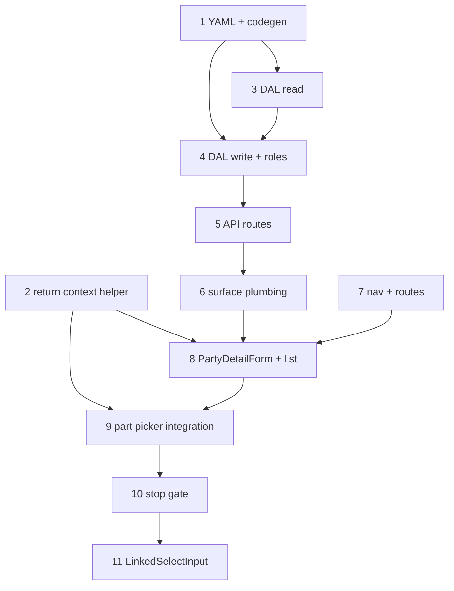

# 25 — Manufacturer detail (party lens + picker return)

> **Status:** Paused (2026-06-29) — estimate finish track (tasks 30–32) takes priority; stop gate not blocking. **Resume:** after [32-estimate-wave-4e.md](./32-estimate-wave-4e.md) or in parallel. **Next when resumed:** [Step 10 — Stop gate](#step-10--stop-gate).
>
> **Spec:** [`manufacturer.md`](../surface-specs/manufacturer.md) · **Decisions:** [manufacturer hub](../decisions/party.md#decision-manufacturer-hub--base-lens-only-2026-06-18), [party profile](../decisions/party.md#decision-party-profile-fields-on-type-lenses-2026-06-17), [picker return context](../decisions/general.md#decision-picker-return-context--url-protocol-2026-06-24) · **Pattern:** [`child-collections.md`](../child-collections.md), [`contact-retire.md`](../surface-specs/contact-retire.md)

## Goal

Ship **production** `manufacturer_detail` with real DAL + API + UI — base party lens (`profile`, `phones`, `emails`), `add_role` / `remove_role`, and the **first** cross-Surface picker return-context flow (part form → **Add new manufacturer**). Unblocks `/manufacturers/[id]` links from [`part_detail`](../surface-specs/part.md) and manufacturer picker create.

**Out of scope (later waves):** `addresses` (wave 2 [`party-addresses.md`](../surface-specs/party-addresses.md)); `related_parts` / MPN list on manufacturer; manufacturer filter on `/parts`; `notes` Field; retire `/contacts` ([`contact-retire.md`](../surface-specs/contact-retire.md)); DDL migration (party tables exist; `manufacturer_part` delete blocker shipped in task 24); foreign-Surface modals/drawers; vendor/customer/property_owner detail lenses.

## Prerequisites

- Task [24](./24-part-wave-3a.md) complete — `manufacturer_list`, `GET /api/manufacturers`, `loadManufacturerDeleteBlockers`, part cross-nav to `/manufacturers/[id]`.
- [`manufacturer.md`](../surface-specs/manufacturer.md) implement spec ✅ (scan row **#6**, 2026-06-18).
- Party refactor DDL applied — `party_person`, `party_organization` ([`018_party_refactor.sql`](../../migrations/018_party_refactor.sql)).

## Locked planning decisions (2026-06-24)

| # | Topic | Choice |
|---|--------|--------|
| 1 | Sequencing | **Manufacturer-first** — own task before wave **3b** `item_*` |
| 2 | UI component | Extract minimal **`PartyDetailForm`** (`profile` + `phones` + `emails`; manufacturer branch omits hub sections) |
| 3 | Module placement | `manufacturer_detail.surface.yaml` in **`modules/contact/`** (alongside `manufacturer_list`) |
| 4 | Role management | Ship **`add_role` / `remove_role`** + read-only multi-tag chips (prototype cross-lens flow) |
| 5 | Picker return | **Navigate + return context** — [URL protocol](../decisions/general.md#decision-picker-return-context--url-protocol-2026-06-24); **Cancel** on create (not Revert) |
| 6 | Task tracking | Task **25** + STATUS repoint until stop gate |
| 7 | Out of scope | See [Goal](#goal) — all confirmed out |
| 8 | Linked picker UI | **`LinkedSelectInput`** — dropdown `… Add {entity}` + open icon; replaces separate add link + **Open:** row ([step 11](#step-11--linked-picker-control-linkedselectinput)) |
| 9 | Unsaved navigate | **v1:** confirm when form dirty before add-new or open-link navigation (same tab); **v2:** new tab (deferred) |

## What ships in task 25

| Layer | Deliverable |
|-------|-------------|
| Surfaces | `manufacturer_detail` YAML + policy registry (`profile`, `phones`, `emails`; actions `read`, `write`, `delete`, `add_role`, `remove_role`) |
| Shared UI | `PartyDetailForm` — kind-specific profile, phones/emails collections; create **Cancel** vs edit **Revert** |
| Return context | `lib/picker-return-context.ts` (or equivalent) — `returnTo`, `returnField`, `selectedId`, `create=1` |
| DAL | Extend `lib/contacts/` — `get` / `create` / `patch` / `delete` with `manufacturer` lens; kind extensions; `add_role` / `remove_role` |
| API | `GET/PATCH/POST/DELETE /api/manufacturers/[id]` |
| UI | `/manufacturers` master-detail; **Contacts** nav entry |
| Integration | `PartDetailForm` — manufacturer picker + return with `selectedId` (step 9 link UI; step 11 `LinkedSelectInput`) |
| Linked picker | `LinkedSelectInput` + dirty-navigate confirm — [step 11](#step-11--linked-picker-control-linkedselectinput) |

**Exit:** CRUD manufacturers (create person/org, patch profile + collections, delete with `manufacturer_part` blocker); add/remove role actions; part create flow returns with new manufacturer selected; linked picker control on part manufacturer (+ vendor grid open icon); `codegen:check` passes.

**Execution order:** 1 → 2 → 3 → 4 → 5 → 6 → 7 → 8 → 9 → 10 → 11.

---

## Step 1 — Surface YAML + codegen + policy registry

**What:** Declare `manufacturer_detail` in YAML — same module as list ([`manufacturer_list.surface.yaml`](../../modules/contact/manufacturer_list.surface.yaml)).

| Deliverable | Spec ref |
|-------------|----------|
| `modules/contact/manufacturer_detail.surface.yaml` | [`manufacturer.md`](../surface-specs/manufacturer.md) §A–B |
| Hand-written glue | `lib/contacts/descriptors/` — kind-specific `profile`; `phones` / `emails` collections |
| Register in `lib/policy-registry.ts` | §C — surface actions incl. `add_role`, `remove_role` |
| `npm run codegen:check` passes | — |

**Exit:** `manufacturer_detail` in registry; field ids match spec; collection descriptors follow [`child-collections.md`](../child-collections.md).

---

## Step 2 — Picker return-context helper

> **Status:** Complete (2026-06-24). **Next:** [Step 3 — Manufacturer DAL read path](#step-3--manufacturer-dal-read-path).

**What:** Shared URL + redirect helpers per [picker return decision](../decisions/general.md#decision-picker-return-context--url-protocol-2026-06-24).

| Param | Role |
|-------|------|
| `create=1` | Detail pane create mode |
| `returnTo` | Encoded path to origin (include origin query, e.g. `/parts/[id]?create=1`) |
| `returnField` | RHF path to set on return (e.g. `profile.manufacturer_party_id`) |
| `selectedId` | Appended on successful Save redirect back to origin |

| Files | Action |
|-------|--------|
| `lib/picker-return-context.ts` | **Create** — `buildPickerCreateUrl`, `parseReturnContext`, `redirectAfterCreate`, `redirectOnCancel` |
| Consumer hook (optional) | `useApplyPickerReturn` — on mount, read `selectedId` + `returnField`, set form value, invalidate picker query |

**Exit:** Unit-testable helpers; part → manufacturer URL builds correctly; origin applies `selectedId` on return.

---

## Step 3 — Manufacturer DAL read path

> **Status:** Complete (2026-06-24). **Next:** [Step 4 — Manufacturer DAL write path + role actions](#step-4--manufacturer-dal-write-path--role-actions).

**What:** `manufacturer_detail` GET — verify `party_role.manufacturer`; project manifest Fields only.

| Method | Behavior |
|--------|----------|
| `get(ctx, id)` | Kind-specific `profile` (`party_person` / `party_organization`); `phones`, `emails` when readable; multi-tag chips for **Also:** links (read other `party_role` rows) |
| Lens guard | 404 when party exists but lacks `manufacturer` tag (unless create flow) |

**Omit:** `manufacturer_part` aggregates, `related_*`, `addresses`.

**Exit:** GET returns spec §D shape; forbidden Fields omitted server-side.

---

## Step 4 — Manufacturer DAL write path + role actions

> **Status:** Complete (2026-06-24). **Next:** [Step 5 — API routes](#step-5--api-routes).

**What:** Create, patch, delete, `add_role`, `remove_role`.

| Operation | Behavior |
|-----------|----------|
| `create` | Insert `party`, extension row, `party_role.manufacturer`; optional `phones` / `emails`; org `parent_party_id` **must stay null** |
| `patch` | Manifest-narrowed `profile`, replace-array `phones` / `emails`; `party.kind` immutable |
| `delete` | `deleteManufacturerParty` — `InUseError` when `manufacturer_part` refs ([task 24 step 3](./24-part-wave-3a.md#step-3--manufacturer-delete-blocker-extension)) |
| `add_role` | Insert `party_role` row for requested role; validate party exists |
| `remove_role` | Delete `party_role` row; **do not** delete `party` if other tags remain; block/warn when lens blockers exist (e.g. cannot remove `manufacturer` while `manufacturer_part` rows reference party) |

**Profile:** Person — `first_name`, `last_name`; org — `legal_name`, `dba_name`; DAL maintains `party.display_name`.

**Exit:** Strict writable schemas; audit on mutations; role actions match spec §E–F.

---

## Step 5 — API routes

> **Status:** Complete (2026-06-24). **Next:** [Step 7 — Nav + routes](#step-7--nav--routes).

**What:** Detail route handlers for manufacturer lens.

| Route | Surface |
|-------|---------|
| `GET/PATCH/POST/DELETE /api/manufacturers/[id]` | `manufacturer_detail` |
| Role actions | POST sub-routes or manifest action handlers per existing app-kit pattern |

Wire `SURFACE_API`, `surface-loader-registry`, prefetch in same step or step 6.

**Exit:** Routes call DAL with `PermissionContext`; re-auth per request.

---

## Step 6 — Surface plumbing

> **Status:** Complete (2026-06-24). **Next:** [Step 7 — Nav + routes](#step-7--nav--routes).

**What:** Loader registry, `surface-api`, prefetch, query keys for `manufacturer_detail`.

| File | Action |
|------|--------|
| `lib/surface-api.ts` | Add `manufacturer_detail` detail path |
| `lib/surfaces/surface-loader-registry.ts` | Detail loader |
| `lib/surfaces/prefetch-surface-query.ts` | Prefetch detail + create |
| `lib/hooks/surface-query-keys.ts` | Detail keys if needed |

**Exit:** `useSurfaceDetail('manufacturer_detail', id)` works from client forms.

---

## Step 7 — Nav + routes

> **Status:** Complete (2026-06-24). **Next:** [Step 8 — `PartyDetailForm` + manufacturer list UI](#step-8--partydetailform--manufacturer-list-ui).

**What:** Master-detail under `/manufacturers` ([`routing-and-libraries.md`](../routing-and-libraries.md)).

| File | Action |
|------|--------|
| `app/(private)/manufacturers/(master-detail)/layout.tsx` | List pane + outlet |
| `app/(private)/manufacturers/(master-detail)/page.tsx` | Empty detail / select prompt |
| `app/(private)/manufacturers/(master-detail)/[id]/page.tsx` | Detail — `create=1` + return params |
| `components/shell/SideNav.tsx` / nav catalog | **Contacts** group — `manufacturer_list` entry |
| `routes.manufacturers` | Already defined — confirm longest-prefix highlight |

**Exit:** List loads; row click → detail; **New** → `?create=1`; nav highlights `/manufacturers/[id]`.

---

## Step 8 — `PartyDetailForm` + manufacturer list UI

> **Status:** Complete (2026-06-24). **Next:** [Step 9 — Part form picker integration](#step-9--part-form-picker-integration).

**What:** Shared form + manufacturer list shell.

| Component | Notes |
|-----------|--------|
| `PartyDetailForm` | `surfaceId` prop; manufacturer branch — profile, phones, emails only; kind toggle on create |
| `ManufacturerList` | Reuse list pattern from `PartList` / `ContactList` — `display_name`, `kind`; search `q` |
| Toolbar | Create: **Save** + **Cancel** (navigate `returnTo` or list); Edit: **Save** + **Revert** + **Delete** |
| Role UX | **Also:** chips (read-only links); **Add as …** / **Remove manufacturer tag** when manifest grants |

**Exit:** Full manufacturer CRUD on production route; multi-tag party shows chips + role actions.

---

## Step 9 — Part form picker integration

> **Status:** Complete (2026-06-24). **Next:** [Step 10 — Stop gate](#step-10--stop-gate). **UI follow-on:** [Step 11](#step-11--linked-picker-control-linkedselectinput) replaces interim add link + **Open:** row.

**What:** Wire picker return on [`PartDetailForm`](../../components/parts/PartDetailForm.tsx) — return context + `selectedId` apply (interim UI: link below select + **Open:** row).

| Behavior | Detail |
|----------|--------|
| Visibility | When `manufacturer_detail` `write` granted (create path) **and** `profile` field writable |
| Navigate | `buildPickerCreateUrl({ target: 'manufacturer', returnTo, returnField: 'profile.manufacturer_party_id' })` |
| On return | Apply `selectedId` to manufacturer picker field; invalidate `useManufacturerPicker` |

**Consumer pattern:** Merge `selectedId` into `defaultValues` **and** `useApplyPickerReturn` — [SurfaceFormRoot picker return](../decisions/general.md#decision-picker-return-on-surfaceformroot-forms--merge-selectedid-into-defaults-2026-06-24). Reference: `PartDetailForm.tsx`.

**Exit:** Part create (`?create=1`) → add manufacturer → save → back on part with manufacturer selected.

---

## Step 10 — Stop gate

> **Status:** Pending. **Next:** verify exit criteria below; step 11 complete.

**What:** Confirm exit criteria and spec verify rows.

| Check | Source |
|-------|--------|
| `codegen:check` | Step 1 |
| Return-context protocol | Step 2 + [decision](../decisions/general.md#decision-picker-return-context--url-protocol-2026-06-24) |
| Manufacturer CRUD + role actions | Steps 3–5 |
| Nav + UI | Steps 7–8 |
| Part picker integration | Step 9 |
| [`manufacturer.md`](../surface-specs/manufacturer.md) verify | — |

**Verify (exit):**

- [ ] `manufacturer_detail` YAML + registry; `codegen:check` passes
- [ ] `GET/PATCH/POST/DELETE /api/manufacturers/[id]` wired
- [ ] Kind-specific profile read/write; phones/emails replace-array
- [ ] `add_role` / `remove_role` + multi-tag chips
- [ ] Delete blocked when `manufacturer_part` references party (`InUseError`)
- [ ] `/manufacturers` master-detail + Contacts nav
- [ ] Create **Cancel** / edit **Revert** toolbar behavior
- [ ] Part form **Add new manufacturer** + return with `selectedId`
- [ ] [`manufacturer.md`](../surface-specs/manufacturer.md) implementation verify row checked
- [ ] [`../../STATUS.md`](../../STATUS.md) repointed — wave **3b** `item_*` next (after step 11)

---

## Step 11 — Linked picker control (`LinkedSelectInput`)

> **Status:** Complete (2026-06-24). **Next:** Task 25 [step 10 stop gate](#step-10--stop-gate) if not yet verified.

**What:** Standardize foreign-record **Select** controls — combined dropdown + optional open icon + optional add-new in dropdown. Replaces interim step 9 UI (separate **Add new manufacturer** link and **Open:** row). First consumer: `part_detail` manufacturer picker; second: vendor column in `PartVendorPricingFields`.

**Decision:** [linked picker control](../decisions/general.md#decision-linked-picker-control-linkedselectinput--2026-06-24) · [unsaved navigate warn](../decisions/general.md#decision-picker-navigate-away--dirty-form-confirm-v1-2026-06-24).

### Locked UX (2026-06-24)

| # | Topic | Choice |
|---|--------|--------|
| 1 | Add-new affordance | Last dropdown option: **`… Add {entity}`** (ellipsis prefix). **Omit** option when user cannot create (not disabled — absent). Gate: target `*_detail` `write` (create path) **and** origin field writable. |
| 2 | Open affordance | **Icon button** immediately after the Select (`Space.Compact`). **Hidden** when principal lacks read on target Surface (`canLink` false). **Disabled** when no value selected. Shown in read-only field mode when `canLink` and value present. |
| 3 | Navigation | **Same tab** for v1 (`router.push` / `Link`). **New tab** deferred v2. |
| 4 | Unsaved form | **v1:** modal confirm when `formState.isDirty` before **add-new** or **open** navigation — *"Leave without saving? Unsaved changes will be lost."* No `localStorage` / `sessionStorage` draft. **v2:** open in new tab (origin tab keeps in-memory state). |
| 5 | Picker return | Unchanged — `buildPickerCreateUrl`, `useApplyPickerReturn`, `defaultValues` merge stay in consumer forms; component only handles chrome + navigate intercept. |
| 6 | Vendor grid | Same inline layout: `[ Select ] [ open icon ]` in `VendorCell`; drop read-only inline `Link` label pattern. Add-new for vendor deferred until vendor create + return context exist. |

### Component sketch

| Item | Detail |
|------|--------|
| Name | `LinkedSelectInput` — sibling to [`SelectInput`](../../components/form/SelectInput.tsx) |
| Location | `components/form/LinkedSelectInput.tsx` |
| Props | All `SelectInput` props + `canLink?`, `linkHref?: (id) => string`, `canAddNew?`, `addNewHref?`, `addNewLabel?` (default `Add {entity}`) |
| Add-new mechanics | Sentinel option value (e.g. `__picker_add_new__`); `onChange` intercept → navigate to `addNewHref`; never persist sentinel as field value. Pin add option at bottom; exclude from search filter. |
| Dirty guard | Shared hook e.g. `useConfirmDirtyNavigate({ isDirty })` — used by component before `router.push` on add-new and open icon click |
| Read mode | Text label + optional open icon (same as write when `canLink`) |

### Deliverables

| File | Action |
|------|--------|
| `components/form/LinkedSelectInput.tsx` | **Create** — compact select + icon; sentinel add-new option |
| `lib/hooks/use-confirm-dirty-navigate.ts` (or inline in component) | **Create** — Ant Design `Modal.confirm` when dirty |
| `components/parts/PartDetailForm.tsx` | **Update** — replace `SelectInput` + link rows with `LinkedSelectInput` |
| `components/parts/PartVendorPricingFields.tsx` | **Update** — `VendorCell` open icon after select |
| `docs/decisions/general.md` | **Update** — linked picker + dirty confirm decisions |
| `docs/surface-specs/part.md` §I | **Update** — picker control column |

### Rollout (after part manufacturer)

| Surface | Control | Add-new | Open link |
|---------|---------|---------|-----------|
| `part_detail` | Manufacturer | ✅ step 11 | ✅ |
| `part_detail` | Vendor (grid) | deferred | ✅ step 11 |
| `job_detail` | Site | — | follow-on |
| `estimate_detail` | Site | — | follow-on |

**Verify (exit):**

- [x] `LinkedSelectInput` matches locked UX table above
- [x] Part manufacturer: `… Add manufacturer` when create granted; open icon hidden without read; disabled without selection
- [x] Dirty form: confirm before add-new and before open navigation
- [x] Picker return flow still works (`selectedId`, defaults merge, picker invalidation)
- [x] Vendor grid: open icon after select; read-only row shows label + icon (not inline link text)
- [x] [`general.md`](../decisions/general.md) + [`part.md`](../surface-specs/part.md) updated
- [x] Job / estimate site pickers tracked as follow-on (not blocking step 11 exit)

---

## Reference

- [`manufacturer.md`](../surface-specs/manufacturer.md) — implement spec A–K
- [`24-part-wave-3a.md`](./24-part-wave-3a.md) — parallel implementation pattern; delete blocker
- [`13-contact-ui.md`](./13-contact-ui.md) · [`14-contact-child-collections.md`](./14-contact-child-collections.md) — interim contact UI (superseded by type lenses)
- [`SiteDetailForm`](../../components/sites/SiteDetailForm.tsx) — `isCreate` + toolbar precedent
- [`part.md`](../surface-specs/part.md) §I — manufacturer picker + add-new
