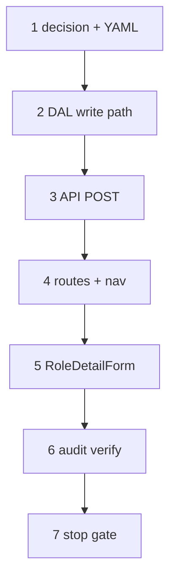

# 26 — IAM role CRUD (create · save · delete)

> **Status:** Complete (2026-06-25). **Next:** [27 — Create route retrofit](./27-create-route-retrofit.md).
>
> **Spec:** [`iam-role.md`](../surface-specs/iam-role.md) · **Decisions:** [iam.md](../decisions/iam.md), [cross-cutting.md](../decisions/cross-cutting.md), [create route `/new`](../decisions/general.md#decision-surface-create-route--new--db-assigned-id-2026-06-25) · **Pattern:** [`child-collections.md`](../child-collections.md)

## Goal

Ship full **`app` role** lifecycle: create via **`/roles/new`**, edit grants + `display_name` on detail, delete when unassigned. Relax system-row over-blocking (cosmetic `display_name` save). Document app-wide **`/new` + DB-assigned id** create convention in [`general.md`](../decisions/general.md). Retrofit of surfaces that shipped with client UUID + `?create=1` is **[task 27](./27-create-route-retrofit.md)**.

**Out of scope (later waves):** grant model v2 (`grantLevel`, compiler); user create/delete (`add_as_db_user` on person surfaces); `user_roles_detail` assignment UX changes; deleted-list lens + `canRestore` UI.

## Prerequisites

- Slice 00 IAM shipped (tasks [06](./06-iam-surfaces.md)–[09](./09-dev-roles-seed.md)): `role_detail` PATCH/DELETE, `GrantMatrix`, IAM DAL.
- [`iam-role.md`](../surface-specs/iam-role.md) target spec ✅ (2026-06-18).
- Task [25](./25-manufacturer-detail.md) stop gate complete (or parallel if unblocked).

## Locked planning decisions (2026-06-25)

| # | Topic | Choice |
|---|--------|--------|
| 1 | Grant matrix | **Defer v2** — keep shipped read/write `GrantMatrix` |
| 2 | Catalog row ops | **`app`** full CRUD; **`system_*`** rows: cosmetic `display_name` only (restrictions are per catalog row, not per principal — `system_iam` holders manage **app** roles) |
| 3a | Create UX | **`/roles/new`** blank form (name + grants) → Save when required fields complete → POST |
| 3b | Create id | **DB assigns UUID** on POST; `router.replace(/roles/[id])` after save; no client id in URL or body for standalone create |
| 3c | App-wide create | Document in [`general.md`](../decisions/general.md) — `<surface>/new`; DB id; client **temp id** for inline child rows only |
| 3d | Retrofit | **[Task 27](./27-create-route-retrofit.md)** — parts, manufacturers, sites, jobs, estimates off client UUID + `?create=1` |
| 4 | System role UI | **Hide** `GrantMatrix` for `system_data` / `system_iam`; optional synthesis note |
| 5 | Grant authoring | **Allow-only** — affirm shipped sparse default deny (P2a); no deny toggles |
| 6 | Delete when assigned | Pre-check → **`ConflictError`** `in_use` with assignment count; actionable UI |
| 7 | Collection PATCH | Replace-array for `grants` + `surface_bindings`; `bumpPolicyVersion`; first Save POST may include full form state |
| 8 | P8 self-grant | **In scope** — deny `grants` / `surface_bindings` PATCH when `role_id ∈ principal.roles`; `display_name` still allowed |

## What ships in task 26

| Layer | Deliverable |
|-------|-------------|
| Decision | Amend [`general.md`](../decisions/general.md) — `/new` route + DB-assigned id ([step 1](#step-1--decision-doc--yaml--codegen)) |
| YAML | `role_list.surface.yaml` — `create` surfaceAction; codegen |
| DAL | `insertAppRole`; `roleList.create`; system `display_name` save; delete pre-check; P8 guard |
| API | `POST /api/iam/roles` |
| Routes | `/roles/new` + `routes.roles.new` |
| UI | `RoleListPane` **New role**; `RoleDetailForm` create mode + system/matrix fixes; delete blocker message |

**Exit:** Create app role → configure grants → assign on `/users/[id]` → delete when unassigned; system row rename works; delete blocked with count when assigned; P8 blocks self grant edit; `codegen:check` passes.

**Execution order:** 1 → 2 → 3 → 4 → 5 → 6 → 7.

---

## Step 1 — Decision doc + YAML + codegen

**What:** Lock create-route convention; enable `role_list` create in policy vocabulary.

| Deliverable | Action |
|-------------|--------|
| [`general.md`](../decisions/general.md) | **Edit** — [Decision: Surface create route — `/new` + DB-assigned id](../decisions/general.md#decision-surface-create-route--new--db-assigned-id-2026-06-25); amend list+detail create + picker return examples |
| [`decisions/README.md`](../decisions/README.md) | **Edit** — index row for new decision |
| `modules/iam/role_list.surface.yaml` | **Edit** — `surfaceActions: [read, create]` |
| `npm run codegen` + `codegen:check` | — |

**Exit:** Registry grants `create` on `role_list`; decision doc records `/new` convention and points retrofit to task 27.

---

## Step 2 — DAL: create + system display_name + delete blocker + P8

> **Complete** (2026-06-25). Delivered in `lib/iam/repository.ts`, `lib/iam/dal.ts`, `lib/iam/descriptors.ts`.

**What:** Hand-written IAM write path extensions in `lib/iam/`.

| Change | File |
|--------|------|
| `insertAppRole(pool, actorId, body)` — `gen_random_uuid()`, `role_class = 'app'`; optional grants/bindings in same txn | `repository.ts` |
| `loadRoleDeleteBlockers(pool, roleId)` — count `latch_user_roles` rows | `repository.ts` |
| `extendRoleListDal` — `create(ctx, body)`; manifest-narrowed strict schema | `dal.ts` |
| `createRoleDetailStore.upsert` — call `updateRoleDisplayName` for **system** rows | `dal.ts` |
| `wrapRoleDetailPatch` — allow system `catalog.display_name` only; **P8** — `ForbiddenError` when `id ∈ principal.roles` and body has `grants` or `surface_bindings` | `dal.ts` |
| `deleteAppRole` — pre-check blockers → `ConflictError` `in_use` | `repository.ts` |

**Exit:** Tests or manual verify — create app role; system rename; delete blocked with count; P8 on held app role.

---

## Step 3 — API routes

> **Complete** (2026-06-25). **Next:** [Step 4 — Routes + nav](#step-4--routes--nav).

**What:** `POST` on role list endpoint; wire create in surface loader.

| Route | Method | Notes |
|-------|--------|-------|
| `/api/iam/roles` | `POST` | Strict body — no client `id`; returns row + manifest |
| `surface-loader-registry` | — | `roleList.create` |

**Exit:** `POST /api/iam/roles` with `{ catalog: { display_name }, grants?, surface_bindings? }` creates `app` role.

---

## Step 4 — Routes + nav

> **Complete** (2026-06-25). **Next:** [Step 5 — RoleDetailForm create + system UI fixes](#step-5--roledetailform-create--system-ui-fixes).

**What:** Canonical **`/roles/new`** create route (first Surface on new convention).

| Deliverable | Action |
|-------------|--------|
| `lib/nav-routes.ts` | `routes.roles.new` → `/roles/new` |
| `app/(private)/roles/new/page.tsx` | Create mode — `prefetchSurfaceCreate("role_detail", "new")` |
| `RoleListPane` | **New role** toolbar → `router.push(routes.roles.new)` |
| `roles/layout.tsx` | Prefetch create manifest for list toolbar when needed |

**Exit:** **New** opens blank form at `/roles/new`; no client UUID in URL.

---

## Step 5 — RoleDetailForm create + system UI fixes

> **Complete** (2026-06-25). **Next:** [Step 6 — Audit verify](#step-6--audit-verify).

**What:** Create-mode form; fix system/app save and delete UX.

| Change | Notes |
|--------|-------|
| `isCreate` / `/roles/new` | Empty defaults; **POST** on first Save; `router.replace(/roles/[id])` on success; subsequent saves **PATCH** |
| System rows | **Omit** `GrantMatrix`; Save enabled for `display_name` only; optional synthesis note |
| `app` rows | Save grants + `display_name`; Delete when manifest grants |
| Delete error | Parse 409 `in_use` → show assignment count (pattern: manufacturer delete blocker) |

**Exit:** Full create/edit/delete UX per locked decisions #2–#4, #6, #8.

---

## Step 6 — Audit verify

> **Complete** (2026-06-25). **Next:** [Step 7 — Stop gate](#step-7--stop-gate).

**What:** Confirm mutations produce `latch_audit` rows.

| Event | Expected | Verified |
|-------|----------|----------|
| Role create | `insert` on `latch_roles` | `roleList.create` → `writeAudit` in `lib/iam/dal.ts` |
| Grant/binding replace | audit via existing DAL path | `roleDetail.patch` → `createSurfaceDal` `update` on `latch_roles` |
| Role delete | `delete` on `latch_roles` | `roleDetail.delete` → `deleteRowWithAudit` |

**Exit:** Audit rows visible in DB for create/update/delete smoke test. ✅ DB smoke (2026-06-25): `insert` (`module_id: role_list`), `update` + `delete` (`module_id: role_detail`) on same `entity_id`.

---

## Step 7 — Stop gate

**Verify (exit):**

- [x] `/roles` — **New role** visible when manifest grants `create` (`RoleListPane` + `SurfaceToolbar` `surfaceAllows(create)`)
- [x] `/roles/new` — blank form; `display_name` required; grants optional (`RoleDetailForm` create mode)
- [x] First **Save** → POST → lands on `/roles/[id]` (DB-assigned id)
- [x] Grant edits persist after reload; policy version bumps
- [x] Assign role on `/users/[id]` → delete role blocked with assignment count (`InUseError` + `formatRoleDeleteError`)
- [x] Unassign all users → delete succeeds
- [x] `system_data` / `system_iam` — matrix hidden; `display_name` save works
- [x] User holding an **app** role cannot PATCH own `grants` / `surface_bindings` (P8)
- [x] `npm run codegen:check`

**Smoke:** `node --env-file=.env.local --import tsx scripts/iam-role-crud-smoke.mjs` (2026-06-25).

---

## Reference

- [`iam-role.md`](../surface-specs/iam-role.md) — implement spec A–K, § L deferred
- [`iam.md`](../decisions/iam.md) — role catalog, create, matrix app-only, P8
- [`cross-cutting.md`](../decisions/cross-cutting.md) — delete `in_use` blockers
- [`27-create-route-retrofit.md`](./27-create-route-retrofit.md) — migrate shipped surfaces to `/new`
- [`PartList`](../../components/parts/PartList.tsx) — **shipped interim** client UUID create (superseded by `/new` decision)
- [`RoleDetailForm`](../../components/iam/RoleDetailForm.tsx) · [`lib/iam/dal.ts`](../../lib/iam/dal.ts) — starting points
