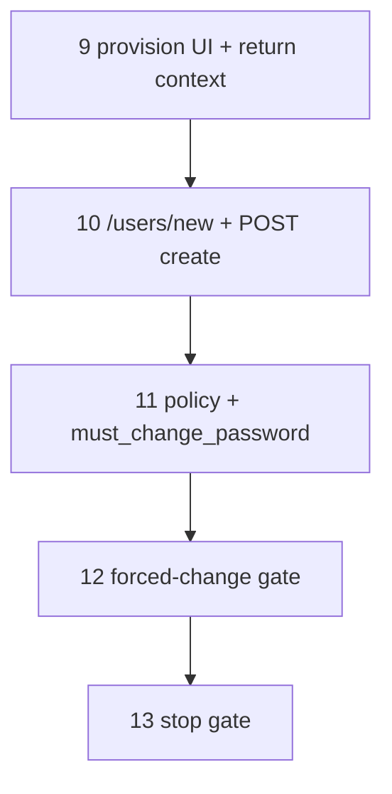

# 28 — Employee detail (staff lens + identity provision)

> **Status:** Complete (2026-06-25). Next: [25-manufacturer-detail.md](./25-manufacturer-detail.md#step-10--stop-gate) stop gate (catalog slice).
>
> **Spec:** [`employee.md`](../surface-specs/employee.md) · **Decisions:** [provision from person](../decisions/party.md#decision-provision-app-user-from-person-surface-2026-06-25), [provision return context](../decisions/general.md#decision-provision-user-return-context-2026-06-25), [employee wave 0](../decisions/party.md#decision-employee-wave-0--implementation-2026-06-25), [party identity](../decisions/party.md#decision-party-identity--party_person-login-link-2026-06-18), [create route `/new`](../decisions/general.md#decision-surface-create-route--new--db-assigned-id-2026-06-25) · **Pattern:** [`child-collections.md`](../child-collections.md), task [25](./25-manufacturer-detail.md)

## Goal

Ship production **`employee_list` + `employee_detail`**: person-only party lens (`profile`, `phones`, `emails`, `staff` marker), CRUD via **`/employees/new`** + DB-assigned id, and **identity provision** — shared party-person link + login-email sync; person surface **Add User** → **`/users/new`**. **`user_list` / `user_roles_detail` stay interim** on `latch_users.id` routes (no IAM anchor migration in this task).

**Out of scope:** HR scalars; `default_labor_class`; `add_role` / `remove_role`; delete/unlink app user; email invite; orphan `/users/new` without `linkPartyId`; IAM `party_id` route migration; retire `/contacts`; wave **3b** `item_*`.

## Prerequisites

- Party refactor DDL applied — [`018_party_refactor.sql`](../../migrations/018_party_refactor.sql).
- Task [25](./25-manufacturer-detail.md) patterns — `PartyDetailForm`, contacts repository.
- [`employee.md`](../surface-specs/employee.md) implement spec ✅ (2026-06-19).
- Task [26](./26-iam-role-crud.md) `/new` convention.

## Locked planning decisions

### Wave 0 (2026-06-25)

| # | Topic | Choice |
|---|--------|--------|
| 1 | Identity | `add_as_db_user`, `is_login_email` migration, login-email sync |
| 2a | YAML module | **`modules/employee/`** |
| 2b | Identity code | Shared `lib/contacts/identity/`; per-surface `add_as_db_user` grant |
| 3 | Role actions | **Omit** `add_role` / `remove_role` on employee |
| 4 | Form | **Extend** `PartyDetailForm` — employee branch |
| 5 | Delete | **Allow** — attribution FKs `SET NULL` |
| 6 | Cross-nav | **App user** → `/users/[latch_user_id]` (interim) |
| 7 | Kind | **Person only** |

### Provision retrofit (2026-06-25)

| # | Topic | Choice |
|---|--------|--------|
| 1 | UX | **Add User** under title → `/users/new`; not toolbar modal |
| 2 | Return | `linkPartyId` + `returnTo`; Save → `replace(returnTo)` |
| 3 | Email | Optional at provision; **Login email** on person `emails` when linked/writable |
| 4 | Auth | `add_as_db_user` + `user_list` `create` on POST; fix `system_data` custom action synthesis |
| 5 | Password | Optional on create; `must_change_password` + `/change-password-required` |
| 6 | Roles | On `/users/new` form; empty allowed |
| 7 | Entry | No **New** on `/users` list; invalid `linkPartyId` → `/users` |

## What ships

| Layer | Steps 1–8 (shipped) | Steps 9–13 (retrofit) |
|-------|---------------------|------------------------|
| Migration | `party_email.is_login_email` | `latch_users.must_change_password` |
| YAML | `employee_*` surfaces | `user_list` `create` |
| Identity DAL | `addAsDbUser`, `syncLoginEmailFromEmails` | Relax email-required; internal create from user POST |
| API | Employee CRUD; interim `POST …/add-as-db-user` | `POST /api/iam/users`; retire public employee provision route |
| Routes | `/employees`, `/employees/new` | `/users/new` |
| UI | `EmployeeList`, `PartyDetailForm` interim modal | **Add User** under title; `UserCreateForm`; forced-change gate |

**Execution order:** 1–8 ✅ → 9 → 10 → 11 → 12 → 13.

---

## Steps 1–8 — complete

Steps 1–8 delivered employee CRUD, `is_login_email` migration, shared identity DAL, and interim modal provision. See git history (2026-06-25). Verify items for 1–8 remain `[x]` in the stop gate below.

---

## Step 9 — Provision UI + email login checkbox (retrofit) ✅

**What:** Replace interim modal/toolbar with navigation + collection UX per [provision decision](../decisions/party.md#decision-provision-app-user-from-person-surface-2026-06-25).

| Change | Notes |
|--------|-------|
| `PartyDetailForm` employee branch | Under title: **Add User** when `add_as_db_user` + no link; **App user** when linked |
| Remove | Toolbar **Add as DB user**; modal `login_name`; `useEmployeeAddAsDbUser` as primary path |
| `buildProvisionUserUrl` | `lib/provision-user-context.ts` — `linkPartyId`, `returnTo`, `sanitizeReturnTo` |
| Dirty navigate | Confirm before **Add User** when employee form dirty |
| `PhoneEmailFields` | **Login email** when linked or `emails` writable — not gated on `add_as_db_user` |

**Exit:** **Add User** navigates to `/users/new` with valid query params.

---

## Step 10 — `/users/new` + user create API ✅

**What:** IAM create route and POST per [`iam-user.md`](../surface-specs/iam-user.md).

| Deliverable | Action |
|-------------|--------|
| `user_list.surface.yaml` | Add `create` to `surfaceActions` |
| `POST /api/iam/users` | Body: `linkPartyId`, `login_name`, optional `password`, optional `role_assignments[]` |
| GET `/users/new` | Validate `linkPartyId`; else redirect `/users`; prefetch person banner |
| `UserCreateForm` | Save → POST → `replace(returnTo)`; Cancel → `push(returnTo)` |
| `lib/nav-routes.ts` | `routes.users.new` |
| DAL | Create `latch_users`, link `party_person`, insert roles; optional email sync |

**Authorization:** `user_list` `create` + `add_as_db_user` on server-resolved person lens for `linkPartyId`.

**Exit:** End-to-end provision from employee returns with **App user** link visible.

---

## Step 11 — Policy synthesis + `must_change_password` ✅

| Deliverable | Action |
|-------------|--------|
| `@latch/policy` | `synthesizeDataMasterBinding` includes custom `surfaceActions` from registry |
| Migration | `latch_users.must_change_password BOOLEAN NOT NULL DEFAULT false` |
| Create / reset | Set `true` when admin sets password; `false` on `/setup` master |
| Retire | Public `POST /api/employees/[id]/add-as-db-user` |

**Exit:** Setup master sees **Add User**; POST provision works for `system_data` + `system_iam` holder.

---

## Step 12 — Forced password change gate ✅

| Deliverable | Action |
|-------------|--------|
| `/change-password-required` | Authenticated; new password + confirm; no current password |
| `POST /api/account/change-password-required` | Clear `must_change_password`; update hash |
| `requireAuth` | Redirect when flag set (allowlist route + logout) |
| Login | After success, redirect to forced-change when flag set |

**Exit:** User with admin-set temp password must change before using the app.

---

## Step 13 — Stop gate

**Verify (exit):**

- [x] Steps 1–8 (employee CRUD, migration, interim identity DAL)
- [x] `/employees/[id]` — **Add User** under title (not toolbar) when `add_as_db_user` granted
- [x] **Add User** → `/users/new?linkPartyId=…&returnTo=…`; invalid/missing `linkPartyId` → `/users`
- [x] `/users/new` — `login_name`; optional password; optional roles (empty OK); person banner
- [x] Save → POST → `replace(returnTo)`; **App user** link on employee
- [x] Email optional at provision; **Login email** checkbox when linked or `emails` writable
- [x] Email PATCH on login row syncs `latch_users.login_email`
- [x] `must_change_password` + first-login redirect to `/change-password-required`
- [x] No **New** on `/users` list
- [x] `npm run codegen:check`

**Post–stop gate fix (2026-06-25):** Manual test found `employee_list` search (`q`) ignored — `createSurfaceDal` validated `q` but did not forward it to the store; fixed in `@latch/dal` (forwards all `listQuerySchema` fields).

## Reference

- [`employee.md`](../surface-specs/employee.md) · [`iam-user.md`](../surface-specs/iam-user.md)
- [`25-manufacturer-detail.md`](./25-manufacturer-detail.md) — picker return precedent
- [`26-iam-role-crud.md`](./26-iam-role-crud.md) — `/roles/new` create pattern
- [`PartyDetailForm`](../../components/parties/PartyDetailForm.tsx) · [`lib/contacts/`](../../lib/contacts/)
