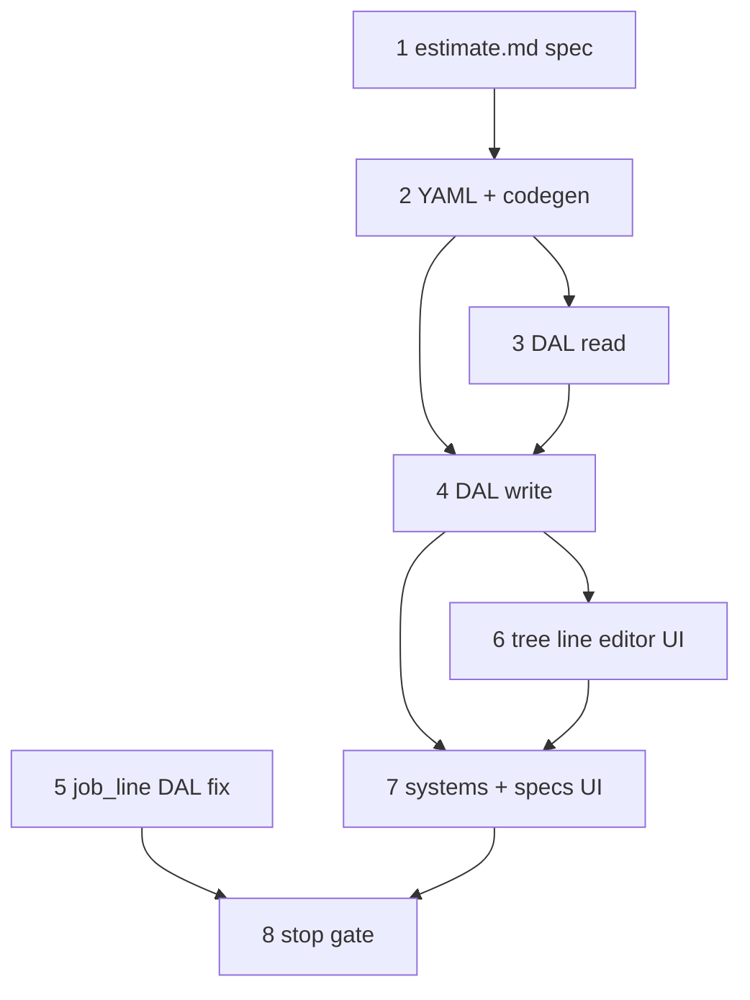

# 32 — Estimate wave 4e (backbone alignment)

> **Status:** Complete (2026-06-29). **Next:** estimate wave **4c′** (`estimate_area` DDL + area parents) or **4b** (win → job).
>
> **Spec:** [`estimate.md`](../surface-specs/estimate.md) (amend for backbone) · **Planning:** [`02-estimates.md`](../planning/02-estimates.md) · **Impact:** [30-backbone-surfaces-review.md](./30-backbone-surfaces-review.md) § Shipped app code

## Locked planning decisions (2026-06-29)

| # | Topic | Choice |
|---|--------|--------|
| 1 | **System blocks** | Optional. Flat `line_items` without any `estimate_system` always valid (ROM/mobilization). Same quote may mix flat lines + one or more system blocks. |
| 2 | **UI chrome** | **Ant Design `Table` with `treeData`** — parent rows for **General**, each **system** block, and (4c′) **area**; line rows are leaves. Parent rows use **full-row `colSpan`**; not row-selectable; collapsible. *(Supersedes “tabs optional” — tree table is the 4e layout.)* |
| 3 | **Site geography on Save** | Estimate DAL **does not write** `site_area` / `site_asset` while quoting. |
| 4 | **Quote geography (B)** | **`estimate_area` only** (4c′ DDL). Lines FK `estimate_area_id`; no `estimate_asset` on quote. |
| 5 | **No quote-level assets** | **`site_asset`** is site as-built only. Device identity on quote = line `part_id` / description. |
| 6 | **Win → job** | Reconcile quote **areas** → `site_area` at win (4b). `site_asset` on site at install / `job.complete`. |
| 7 | **Job complete** | A2 unchanged: `proposed` → `active`. |
| 8 | **Copy site areas (4c′)** | **Explicit “Import from site”** — no auto-copy on add system. V2: modal on site attach. |
| 9 | **Spec panel (4e)** | **Hidden** when zero `system_spec_def` for catalog `system`. When visible: inline in **expanded parent row** (system), not a separate tab. |
| 10 | **Remove parent row** | Client-only until Save. Delete parent ⇒ remove descendant **line** rows from form state; PATCH omit ⇒ DAL hard-deletes block + lines. |
| 11 | **One block per catalog system** | Max one `estimate_system` per `system_id` per estimate. |
| 12 | **`systems` PATCH shape** | **Nested** `systems[].specs[]`. Top-level PATCH: `profile`, `stakeholders`, `systems`, `line_items`. |
| 13 | **`material_status` (4e)** | DAL column only; no UI. Values when set: `generic` \| `suggested` \| `verified`. |
| 14 | **`estimate_system.site_system_id` (4e)** | Always **`null`** on create/patch. Link/copy deferred to 4c′ / win. |
| 15 | **Catalog `system` picker** | Read-only list from `system` table (seeded in `031`); no `system_table` Surface yet. `GET` detail enrichment or small picker query in estimate DAL. |

**4e scope boundary:** systems + specs + **tree line editor (system parents only)** + retire legacy DAL. **Not in 4e:** `estimate_area` DDL/UI, import-from-site, win (4b), area parent rows (4c′).

---

## Goal

Repair estimates on backbone DDL (`028`–`031`): `estimate_system` + specs, tree `line_items` editor, `estimate_system_id` + `material_status` on lines. Retire `estimate_section_id` / `site_location_id`. **No site writes** on estimate Save.

**Exit:** CRUD estimates; 0+ system blocks; ROM + mixed quotes; `codegen:check`; job_line DAL no longer references `site_location`.

**Execution order:** 1 → 2 → 3 ∥ 4 (read before write) → 5 → 6 + 7 (UI + job DAL) → 8.



---

## UI — tree table (locked)

### Row kinds (4e)

| `rowKind` | Backing | Parent? | Columns |
|-----------|---------|---------|---------|
| `general` | Synthetic — not persisted | Yes | Label “General”; `colSpan` all columns; collapse |
| `system` | `estimate_system` + nested `specs` | Yes | System name; optional expanded spec fields; `colSpan` when collapsed |
| `line` | `estimate_line` | Leaf | Full line column set (kind, description, qty, …) |

**4c′ adds:** `area` parent rows under `system` (`estimate_area`); lines may attach to `system` or `area`.

### Tree shape (4e example)

```text
▼ General                          [colSpan — chrome only]
    line: Mobilization
▼ Fire Alarm                       [colSpan — specs in expanded row when defs exist]
    line: Pull station  qty 10
    line: Horn/strobe   qty 4
▼ CCTV
    line: Camera        qty 6
```

Persisted: `systems[]` + flat `line_items[]` with `estimate_system_id` (null = General).

### Add / delete (client until Save)

| Action | Control | Behavior |
|--------|---------|----------|
| **Add system** | Toolbar **“Add system”** → catalog picker (excludes systems already on quote) | Insert `system` parent row at root; empty children |
| **Add line** | **“+ Line” on focused parent** — parent row has actions column (or overflow menu): *Add line here* | Append leaf under that `general` or `system` parent; set `estimate_system_id` from parent |
| **Add area** | *(4c′)* Parent row menu on `system`: *Add area* | Insert `area` child parent under system |
| **Delete parent** | Row delete on parent | Remove parent + all descendant lines from RHF state |
| **Delete line** | Row delete on leaf | Remove line only |
| **Focus parent** | Click parent row (highlight, not checkbox) | “Add line” targets last-focused parent; default General when none focused |

**Not used in 4e:** row selection checkboxes; multi-select bulk delete (defer).

### Specs in tree

When `system_spec_def` rows exist for catalog `system`: **expand** system parent → spec `Select`s in expanded area above child lines. PATCH nested in `systems[].specs`. When zero defs: no expand content for specs (panel hidden per #9).

---

## API / DTO contracts (4e)

### `GET estimate_detail` — additions

```json
{
  "systems": [
    {
      "id": "<uuid>",
      "system_id": "<catalog system id>",
      "system_name": "Fire Alarm",
      "sort_order": 1,
      "specs": [
        {
          "system_spec_def_id": "<uuid>",
          "def_display_name": "SLC Protocol",
          "value_type": "enum",
          "system_spec_option_id": "<uuid>",
          "option_display_name": "LiteSpeed",
          "value_text": null,
          "value_boolean": null
        }
      ]
    }
  ],
  "line_items": [
    {
      "id": "<uuid>",
      "estimate_system_id": null,
      "line_kind": "expense",
      "description": "Mobilization",
      "material_status": null
    }
  ]
}
```

Read path merges catalog defs with saved `estimate_system_spec` (defs with no saved row = null value).

### `PATCH` — writable keys

```json
{
  "systems": [
    {
      "id": "<uuid optional on create>",
      "system_id": "<catalog>",
      "sort_order": 1,
      "specs": [
        {
          "system_spec_def_id": "<uuid>",
          "system_spec_option_id": "<uuid>",
          "value_text": null,
          "value_boolean": null
        }
      ]
    }
  ],
  "line_items": [ "…existing flat element + estimate_system_id, material_status…" ]
}
```

**Replace-array rules:**

1. `systems` — upsert by `id`; delete omitted `estimate_system` rows + their `estimate_system_spec`; reject duplicate `system_id`.
2. `systems[].specs` — replace per block; one row per `system_spec_def_id`.
3. `line_items` — replace all lines; each `estimate_system_id` must match a block in payload or be null; reindex `line_number` / `sort_order` from array order (flat persist; tree is UI-only).

---

## Prerequisites

- Task [31](./31-estimate-backbone-migrations.md) complete.
- Task [22](./22-estimate-wave-4a.md) complete (DAL/UI exists — **broken** on `site_location_id` / `estimate_section_id` until 4e).
- Task [24](./24-part-wave-3a.md) complete — optional `part_id` picker.

## What ships in 4e

| Layer | Deliverable |
|-------|-------------|
| **Spec** | [`estimate.md`](../surface-specs/estimate.md) — `systems` Field, tree UI §G, DTOs above, 4c′ deferral |
| **YAML** | `estimate_detail` — `systems` logical Field + `line_items` |
| **DAL** | `estimate-systems.ts` read/write; extend `estimate-lines*`; catalog `system` + `system_spec_def` read helpers |
| **Job DAL** | Minimal `job_line` column fix (`site_area_id` / `site_asset_id`; drop `site_location`) |
| **UI** | `EstimateLineTreeTable` (or refactor `EstimateLineItemsField`) — tree parents + line leaves |
| **API** | Existing routes; PATCH accepts `systems` |

---

## Step 1 — Amend estimate implement spec

**What:** Rewrite [`estimate.md`](../surface-specs/estimate.md) backbone sections per locked decisions + DTO contracts above.

| Section | Updates |
|---------|---------|
| §A | `systems` in All tables (DAL) |
| §B | `systems` collection Field; `line_items` element — drop `estimate_section_id`, `site_location_id`; add `estimate_system_id`, `material_status` |
| §D–E | Read/write `systems` replace-array; nested specs; no site geography writes |
| §G | Tree table UX (this task § UI — tree table) |
| §K | 4e verify row; defer `estimate_area` to 4c′ |
| Locked answers | Amend geography / grouping vocabulary |

**Exit:** Spec is implementable without task file; cross-links `02-estimates.md`.

---

## Step 2 — Surface YAML + codegen

| File | Action |
|------|--------|
| `modules/estimate/estimate_detail.surface.yaml` | Add `systems` Field (`columns: []` logical) |
| `lib/estimates/descriptors/estimate-detail.ts` | `EstimateSystemPatchElementSchema`, nested `specs`; update line schema |
| `lib/policy-registry.ts` | Unchanged unless new actions |
| `npm run codegen:check` | Pass |

**Exit:** Generated glue includes `systems` field id.

---

## Step 3 — Estimate DAL (read)

| File | Work |
|------|------|
| `lib/estimates/repository/estimate-systems.ts` | **New** — `loadEstimateSystems(pool, estimateId)` with specs + catalog labels |
| `lib/estimates/repository/estimate-lines.ts` | SELECT `estimate_system_id`, `material_status`; drop legacy columns |
| `lib/estimates/repository/estimate.ts` | `get()` composes `systems` + `line_items` |
| `lib/estimates/descriptors/estimate-detail.ts` | Read DTO types |

| Method | Behavior |
|--------|----------|
| `get(ctx, id)` | `systems` ordered by `sort_order`; merge spec defs for each `system_id`; `line_items` flat ordered |

**Exit:** GET returns DTO contract above.

---

## Step 4 — Estimate DAL (write)

| File | Work |
|------|------|
| `lib/estimates/repository/estimate-systems-write.ts` | **New** — replace-array `estimate_system` + `estimate_system_spec` |
| `lib/estimates/repository/estimate-lines-write.ts` | `estimate_system_id`, `material_status`; remove `site_location` guard; drop `estimate_section_id` |
| `lib/estimates/repository/estimate-write.ts` | `patch()` orchestrates `systems` then `line_items` in one transaction |

| Validation | Rule |
|------------|------|
| Duplicate `system_id` | `ValidationError` |
| `estimate_system_id` on line | Null or id in payload `systems` |
| Site tables | No INSERT/UPDATE |

**Exit:** PATCH persists systems + specs + lines; audit on registered tables.

---

## Step 5 — Job line DAL (minimal)

| File | Work |
|------|------|
| `lib/jobs/repository/job-lines.ts` | SELECT `site_area_id`, `site_asset_id`; remove `site_location_id` |
| `lib/jobs/repository/job-lines-write.ts` | Same; remove `site_location` table guard |
| `lib/jobs/descriptors/job-detail.ts` | Zod + types |

**Exit:** Job detail load/save does not reference dropped `site_location` table.

---

## Step 6 — Tree line editor UI

| File | Work |
|------|------|
| `components/estimates/EstimateLineTreeTable.tsx` | **New** — `treeData` from `systems` + `line_items`; parent `colSpan`; collapse |
| `components/estimates/EstimateLineItemsField.tsx` | Refactor to tree or replace |
| `components/estimates/EstimateDetailForm.tsx` | Form shape: `systems`, `line_items`; map GET → RHF; PATCH ← RHF |
| `components/estimates/estimate-line-tree.ts` | **New** — pure helpers: flat ↔ tree, add parent/line, delete subtree |

| UX | 4e |
|----|-----|
| General parent | Always present when `line_items` has null `estimate_system_id` or as default add target |
| Add system | Toolbar picker |
| Add line | Parent row action |
| part_id | Existing picker on line rows when manifest grants |

**Exit:** ROM + mixed quotes editable; Save/Revert round-trip.

---

## Step 7 — System specs in expanded row

| File | Work |
|------|------|
| `components/estimates/EstimateSystemSpecFields.tsx` | **New** — enum/boolean/text controls per def |
| Wire into expanded `system` parent row | Hidden when defs.length === 0 |

**Exit:** When defs exist (future seed), spec values persist via nested PATCH.

---

## Step 8 — Stop gate

**Verify:**

- [x] Tree UI: General + system parents; lines as leaves; parent `colSpan`; collapse
- [x] Add system / add line / delete parent (cascades lines) — client until Save
- [x] `systems` + nested `specs` persist; one `system_id` per estimate
- [x] `line_items`: `estimate_system_id`, `material_status`; no legacy columns
- [x] No `site_area` / `site_asset` writes from estimate PATCH
- [x] `job_line` DAL fixed
- [x] ROM (General only) + mixed quote
- [x] `codegen:check` passes
- [x] [`estimate.md`](../surface-specs/estimate.md) verify rows for 4e `[x]`
- [x] [`../../STATUS.md`](../../STATUS.md) → 4c′ or 4b

---

## Follow-on (not 4e)

| Wave | Deliverable |
|------|-------------|
| **4c′** | `estimate_area` DDL; `area` parent rows; Import from site; `estimate_area_id` on lines |
| **4b** | Win + area reconcile → `site_area` |
| **4c** | Deeper grouped editor polish |
| **4d′** | Shared line editor + `item` pickers |
| **Site 2b** | `site_detail` geography admin |

## Reference

- [22-estimate-wave-4a.md](./22-estimate-wave-4a.md)
- [31-estimate-backbone-migrations.md](./31-estimate-backbone-migrations.md)
- [spikes/estimate-line-editor.md](../spikes/estimate-line-editor.md) — prior grouped spike (reference only)
- [02-estimates.md](../planning/02-estimates.md) · [01-site-as-built.md](../planning/01-site-as-built.md)
