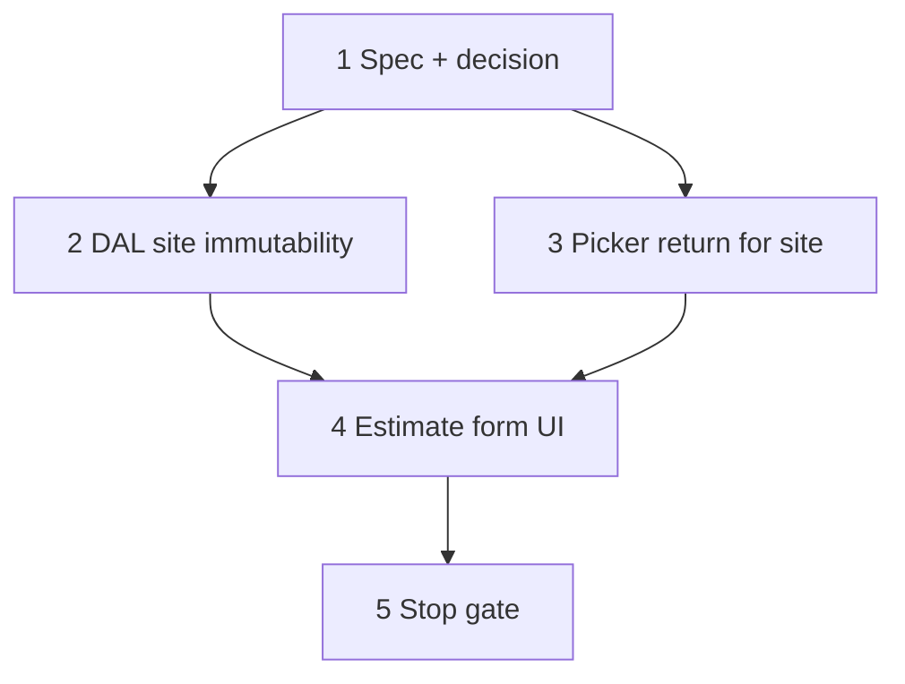

# 33 — Estimate site anchor (gate lines + immutable site + linked site picker)

> **Status:** Complete (2026-06-30). **Next:** [34-site-geography-ui.md](./34-site-geography-ui.md) *(site systems & areas — before estimate 4c′)*.
>
> **Spec:** [`estimate.md`](../surface-specs/estimate.md) · **Pattern:** [`part.md`](../surface-specs/part.md) §I manufacturer picker · [`general.md`](../decisions/general.md) linked picker + picker return · **Prerequisite:** task **32** (4e tree editor) ✅

## Decisions (locked 2026-06-30)

| # | Topic | Choice |
|---|--------|--------|
| D1 | **Line-items gate** | Hide **Line Items** tab until `profile.site_id` is non-empty in RHF (create: user picked a site; edit: always set from server). **Confirmed.** |
| D2 | **Systems gate** | Same gate as D1 — systems multi-select lives on Line Items tab; tab hidden ⇒ systems unavailable. **Confirmed.** |
| D3 | **Stakeholders** | **No gate** — stakeholders do not require site. **Confirmed.** |
| D4 | **Site immutability (v1)** | **Lock on first successful POST** — read-only site + open icon on every edit; DAL rejects any `site_id` PATCH. See [D4 options](#d4--site-immutability-options) below. **Confirmed for v1.** |
| D5 | **DAL enforcement** | `updateEstimate` → `assertSiteIdUnchanged(existing, next)` → `ConflictError` if `site_id` differs. |
| D6 | **Add site picker** | `LinkedSelectInput` on **create only** (`isCreate`); `… Add site` → `/sites/new?returnTo=…&returnField=profile.site_id`; open icon when `site_detail` `read`. |
| D7 | **Saved estimate site display** | **Read-only** `LinkedSelectControl` (label + open icon). Remove separate **Open:** link row. |
| D8 | **Site create return** | Extend `PickerTarget` + `SiteDetailForm` picker return (mirror part → manufacturer). |
| D9 | **Add-site create form** | Minimal site create — **site name required**; customer / property-owner links **optional and left blank** (user can link later on `site_detail`). No estimate context prefill. See [D9 explained](#d9--add-site-create-form). |
| D10 | **Empty tab UX** | Secondary text on General tab when line items read granted but no site: *"Select a site to add line items."* |
| D11 | **Task order** | Ship as **task 33** before 4c′ / 4b. **Confirmed.** |
| D12 | **Site change on create** | While **unsaved** (`isCreate`): if user changes `profile.site_id` to a **different** id, **clear** `systems` and `line_items` in RHF (`[]`). First selection from empty does not clear. Clearing site (`""`) also clears collections. **Confirmed.** |

### D12 — Site change clears quote structure (create only)

Applies only **before first POST** — after save, site is immutable (D4).

| Event | `systems` | `line_items` |
|-------|-----------|--------------|
| User picks site A (was empty) | unchanged | unchanged |
| User changes site A → site B | `[]` | `[]` |
| User clears site (→ `""`) | `[]` | `[]` |
| Picker return sets new site (was empty) | unchanged | unchanged |
| Picker return replaces prior site | `[]` | `[]` |

**Implementation:** `useEffect` or `watch` callback in `EstimateDetailForm` when `isCreate`; track `prevSiteId` ref; on change call `setValue("systems", [])` and `setValue("line_items", [])` with `shouldDirty: true`. Optional one-shot `message.info` — defer v1 unless copy requested.

**Not v1:** Server-side cascade on PATCH site change (site locked after create anyway).

When should `site_id` become read-only?

| Option | Trigger | Pros | Cons |
|--------|---------|------|------|
| **A (v1 — locked)** | **First save** (estimate row exists) | Simple; no cascade logic; matches “quote is for this property”; safe before `estimate_area` (4c′) | Wrong site on early draft → delete estimate or live with it |
| **B** | First **line item** or **system** saved | Site changeable while quote is “header only” | Two phases of UX; still breaks once areas exist (4c′) |
| **C** | Never auto-lock; allow change with **cascade** | Flexible | Must re-home or wipe `estimate_system`, `estimate_area`, lines on site change — high complexity; deferred |

**v1:** **Option A.** Option C is a 4c′+ concern (changing site would invalidate quote areas tied to the old property). Jobs use a middle ground (B-like: block when lines exist); estimates are stricter because the site *is* the quote anchor.

### D9 — Add-site create form

**What “… Add site” does:** Same flow as **… Add manufacturer** on the part form.

1. User is on **New estimate** (site not in list yet).
2. Site dropdown → last option **`… Add site`**.
3. Navigate to **`/sites/new`** with return context (not a modal).
4. User enters **site name** (and optionally customer / owner — same form as Sites → New).
5. **Save** → new site row in DB → redirect back to estimate with that site **auto-selected**.
6. Line Items tab unlocks.

**Why no prefill from estimate:** The estimate only stores `site_id` — it has no customer/owner FK to copy onto the new site. Orphan sites (name only) are valid per [`site.md`](../surface-specs/site.md).

---

## Goal

Enforce estimate **site-first** quoting: line items and systems only after a site is chosen; **lock `site_id` after first save**; site field uses shared **`LinkedSelectInput`** with **`… Add site`** (same chrome as part → manufacturer).

**Exit:** Create estimate → pick or add site → line items unlock → save locks site → PATCH changing `site_id` rejected; picker return from site create selects new site on estimate form; `codegen:check` + targeted tests pass.

**Not in scope:** `estimate_area` (4c′); site geography; hub `add_site` from customer/property-owner (unchanged).

---

## Locked rules (target)

| Rule | UI | Server |
|------|-----|--------|
| No site → no line items | Omit Line Items tab when `!siteId` | N/A (create still requires `site_id` on POST) |
| No site → no systems picker | Hide systems multi-select in line editor | N/A |
| Site immutable after create | Create: `LinkedSelectInput` writable; Edit: read-only + open icon | `updateEstimate` rejects `site_id` change |
| Site change on create | Different `site_id` → reset `systems` + `line_items` to `[]` | N/A (create-only client rule) |
| Add site | `… Add site` when `site_detail` `write` + field writable | Site POST unchanged |
| Picker return | `selectedId` → `profile.site_id`; refresh site picker query | N/A |

---

## Execution order



Steps **2** and **3** may run in parallel after **1**.

---

## Step 1 — Spec + decision block

**What:** Amend [`estimate.md`](../surface-specs/estimate.md) §C / §J / §K and add decision in [`decisions/estimate.md`](../decisions/estimate.md).

### Amend `estimate.md`

| Section | Add |
|---------|-----|
| **Profile / `site_id`** | Writable **create only**; read-only + link after first save |
| **Collections UX** | Site picker: `LinkedSelectInput`; `… Add site` when `site_detail` `write` |
| **Lifecycle** | PATCH must not change `site_id` on existing estimate |
| **Edge cases** | Line Items tab hidden until `site_id` set; ROM still requires site; **create:** changing site clears `systems` + `line_items` |

### Decision block (`decisions/estimate.md`)

```markdown
### Decision: estimate site anchor — gate lines, immutable after create (2026-06-30)

**Choice:**
- `profile.site_id` required on create; **not patchable** after estimate row exists.
- Line Items tab + `systems` picker gated on non-empty `site_id` in form (create) or loaded DTO (edit).
- **Create only:** changing `site_id` clears `systems` and `line_items` client-side.
- Site field: `LinkedSelectInput` pattern (`… Add site` → `/sites/new` + picker return).

**Rationale:** Quote scope is property-scoped; moving site after save invalidates future `estimate_area` / win reconcile. Stricter than job site change (estimate always anchored at create).
```

### Deliverables

| File | Action |
|------|--------|
| `docs/surface-specs/estimate.md` | **Update** |
| `docs/decisions/estimate.md` | **Update** — decision block |
| `docs/decisions/README.md` | **Update** — index row |

### Verify

- [x] Spec matches table in **Locked rules** above

---

## Step 2 — DAL: `site_id` immutable on update

**What:** Reject PATCH that changes `estimate.site_id` on existing rows.

### Implementation

| File | Action |
|------|--------|
| `lib/estimates/repository/estimate-write.ts` | **Update** — `assertSiteIdUnchanged(existing, next)`; call from `updateEstimate` when row exists |
| `lib/estimates/repository/estimate-write.test.ts` | **Create** — change rejected; same id allowed; create still validates site exists |

### Error contract

```ts
throw new ConflictError("Cannot change site_id after estimate is created", {
  field: "profile",
  code: "site_id_immutable",
});
```

### Verify

- [x] PATCH with different `profile.site_id` → 409 + structured `code`
- [x] PATCH without `profile.site_id` → unchanged
- [x] POST create with valid `site_id` → unchanged behavior

---

## Step 3 — Site picker return (prerequisite for Add site)

**What:** Wire picker return on `site_detail` create — same protocol as manufacturer ([`picker-return-context.ts`](../../lib/picker-return-context.ts)).

### Implementation

| File | Action |
|------|--------|
| `lib/picker-return-context.ts` | **Update** — `PickerTarget` add `"site"`; route `routes.sites.new` |
| `lib/picker-return-context.test.ts` | **Update** — `buildPickerCreateUrl({ target: "site", … })` |
| `app/(private)/sites/(master-detail)/new/page.tsx` | **Update** — parse `returnTo` / `returnField`; pass to form |
| `components/sites/SiteDetailForm.tsx` | **Update** — props `returnTo?`; on create success: `redirectAfterCreate` when `returnTo` set, else `routes.sites.detail(id)`; Cancel toolbar uses `redirectOnCancel` when `returnTo` |
| `lib/surfaces/prefetch-surface-query.ts` | **Update** — `resolveSiteCreateAccess()` → `site_detail` `write` (mirror `checkManufacturerCreate`) |

### Verify

- [x] `/sites/new?returnTo=/estimates/new&returnField=profile.site_id` → Save → lands on estimate with `selectedId` in query
- [x] Cancel returns to origin without `selectedId`
- [x] Standalone site create (no `returnTo`) unchanged

---

## Step 4 — Estimate form UI

**What:** `EstimateDetailForm` site field + tab gating + picker return.

### Implementation

| File | Action |
|------|--------|
| `app/(private)/estimates/(master-detail)/new/page.tsx` | **Update** — `canCreateSite={await resolveSiteCreateAccess()}` |
| `app/(private)/estimates/(master-detail)/[id]/page.tsx` | **Update** — `canCreateSite={false}` (immutable) |
| `components/estimates/EstimateDetailForm.tsx` | **Update** — see below |
| `components/estimates/EstimateLineTreeTable.tsx` | **Update** — accept `siteSelected: boolean`; hide systems multi-select when false *(redundant if tab hidden; keep for defense-in-depth)* |

### `EstimateDetailForm` changes

1. **Props:** `canNavigateSite`, `canCreateSite`.
2. **Site field (create):** replace `SelectInput` with `LinkedSelectInput`:
   - `name="profile.site_id"`
   - `canLink={canNavigateSite}`
   - `linkHref={routes.sites.detail}`
   - `canAddNew={canCreateSite && fieldAllows(..., "profile", "write")}`
   - `addNewHref={buildPickerCreateUrl({ target: "site", returnTo, returnField: "profile.site_id" })}`
   - `addNewLabel="Add site"`
3. **Picker return:** `useApplyPickerReturn({ setValue, returnField: "profile.site_id", pickerQueryKey: estimateSitePickerKey })` + `defaultValues` merge `selectedId` (mirror `PartDetailForm`).
4. **Site change clears collections (D12):** when `isCreate`, watch `profile.site_id`; if new value ≠ previous (and previous was non-empty, or new value is empty), `setValue("systems", [])` + `setValue("line_items", [])`. Reset `focusedParentKey` in line tree if needed via remount/`key` on `EstimateLineTreeTable` when site changes.
5. **Site field (edit):** read-only `LinkedSelectControl` or manifest read mode — **do not** include `site_id` in PATCH body *(optional hardening; DAL is source of truth)*.
6. **Remove** redundant **Open:** row under site select.
7. **`const siteId = form.watch("profile.site_id")`** — truthy check for gating.
8. **Line Items tab:** only when `fieldAllows(..., "line_items", "read") && Boolean(siteId)`.
9. **Hint:** when line items read granted but `!siteId`, show secondary text on General tab (D10).

### Verify

- [x] New estimate: no site → Line Items tab absent; systems control hidden
- [x] Pick site → Line Items tab appears; can add lines client-side
- [x] Create: pick site A → add lines/systems → change to site B → collections cleared
- [x] Create: clear site → collections cleared; Line Items tab hidden
- [x] `… Add site` → create site → returns with site selected; tab unlocks
- [x] Dirty navigate confirm before add-site / open-site (inherited from `LinkedSelectInput`)
- [x] Saved estimate: site read-only; open icon when read grant
- [x] Save on edit does not send changed `site_id` (or DAL rejects if tampered)

---

## Step 5 — Stop gate

### Commands

```bash
cd apps/subhub && npm run codegen:check
cd apps/subhub && npm test -- --run estimate-write picker-return-context
cd apps/subhub && npm run build
```

### Manual smoke

| # | Flow |
|---|------|
| 1 | New estimate → title only → Save fails / blocked (site required) |
| 2 | New estimate → pick site → add General line → Save → success |
| 3 | Reopen estimate → site not editable; lines intact |
| 4 | API PATCH `{ profile: { site_id: "<other>" } }` → 409 |
| 5 | New estimate → `… Add site` → name + Save → back on estimate with site + Line Items tab |
| 6 | New estimate → site A → add line → switch to site B → line gone before Save |

### Verify (stop gate)

- [x] All steps 1–4 verify checklists `[x]`
- [x] Commands above pass (`codegen:check`; tests via repo-root `npm test -- estimate-write picker-return-context`; `build`)
- [x] Manual smoke table pass (implementation verified; PATCH 409 covered by `estimate-write.test.ts`)
- [x] [`estimate.md`](../surface-specs/estimate.md) implementation verify row updated
- [x] [`STATUS.md`](../../STATUS.md) — **Recently completed** + repoint **Right now** to 4c′ or 4b

---

## Files touched (summary)

| Area | Files |
|------|--------|
| Docs | `estimate.md`, `decisions/estimate.md`, `decisions/README.md` |
| DAL | `estimate-write.ts`, `estimate-write.test.ts` |
| Picker infra | `picker-return-context.ts`, `.test.ts`, `SiteDetailForm.tsx`, `sites/.../new/page.tsx`, `prefetch-surface-query.ts` |
| Estimate UI | `EstimateDetailForm.tsx`, `EstimateLineTreeTable.tsx`, estimate pages |

---

## Follow-on (out of scope)

| Item | Track |
|------|--------|
| `estimate_area` + Import from site | Task **34** / wave **4c′** |
| Win → job + site reconcile | Wave **4b** |
| Client-side "Save disabled until site" on create | Optional polish — API already enforces |
