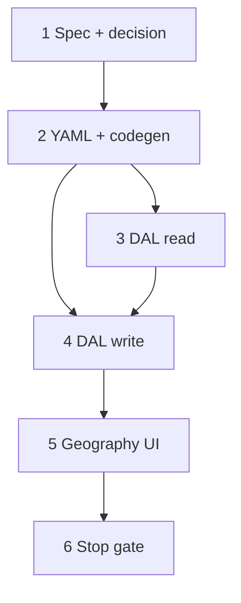

# 34 — Site geography UI (`site_system` + `site_area` tree table)

> **Status:** Complete (2026-06-30). **Amended (2026-06-30):** [35](./35-site-geography-drop-area-metadata.md) drops `area_type`/`code` — name-only areas. **UI superseded by [36](./36-site-geography-tree-ui.md)** — antd `Tree` replaces interim `SiteGeographyTreeTable`; DAL/PATCH steps in this task remain valid.
>
> **Spec:** [`site.md`](../surface-specs/site.md) · **Decisions:** [`10-site-geography-ui-decisions.md`](../planning/10-site-geography-ui-decisions.md) (SG1–SG16) · **Model:** [`01-site-as-built.md`](../planning/01-site-as-built.md) · **Pattern:** [`EstimateLineTreeTable`](../../components/estimates/EstimateLineTreeTable.tsx) · **Prerequisite:** backbone DDL `029` (`site_system`, `site_area`) ✅ · wave 1 `site_detail` shell ✅

## Decisions (locked 2026-06-30)

| # | Topic | Choice |
|---|--------|--------|
| D1 | **Field shape (SG1)** | `systems[]` nested `areas[]` + sibling `default_areas[]` for General bucket (`site_system_id` null) |
| D2 | **General bucket (SG2)** | Synthetic **General** parent row always visible; areas persist `site_system_id` null |
| D3 | **Duplicate systems (SG3)** | Multiple `site_system` per catalog `system_id` allowed — disambiguate by `name` (SG4) |
| D4 | **System name (SG4)** | Default catalog `system.name`; user may override; validate distinct names among same `system_id` on Save |
| D5 | **New row status (SG5)** | Rows created on `site_detail` default **`active`** |
| D6 | **PATCH (SG6)** | Single PATCH replace-array with profile, portfolio, contacts |
| D7 | **Delete subtree (SG7–SG9)** | Cascade delete unreferenced areas/systems; **409** if referenced |
| D8 | **Referenced omit (SG8)** | `ConflictError` — `estimate` / `job` / `asset` blocker codes |
| D9 | **Placement (SG10)** | **Geography** tab on `site_detail`; General tab unchanged |
| D10 | **Editor (SG11)** | Ant Design **`Table` + `treeData`** — `SiteGeographyTreeTable` |
| D11 | **DnD (SG12)** | `@dnd-kit` sibling reorder only; **General fixed first**, not draggable |
| D12 | **Add chrome (SG13)** | Single toolbar **Add ▾** |
| D13 | **Add behavior (SG16)** | No focus → catalog **system** dropdown → root system row; General/system/area focused → add **area** child + focus name |
| D14 | **Init (SG14)** | Load: General parent only (+ hint); no systems until added |
| D15 | **Grants (SG15)** | Existing `site_detail` `write` — no new Field grant |
| D16 | **Catalog picker** | Reuse shared `system` list API; rename hook **`useCatalogSystemPicker`** when touched |
| D17 | **Out of scope** | `site_asset` UI; estimate `estimate_area`; `parent_site`; `physical_address` |

**Estimate follow-on (not this task):** SG3 amends estimate “one block per `system_id`” — remove duplicate rejection in estimate DAL when quote geography ships ([`35-estimate-wave-4c-prime.md`](./35-estimate-wave-4c-prime.md)).

---

## Goal

Ship **systems & areas** editing on `site_detail`: DAL read/write for `site_system` + nested `site_area`; Geography tab with tree **Table**, Add ▾, sibling DnD, inline editors, cascade delete.

**Exit:** Open saved site → Geography tab → add catalog systems and nested areas → Save round-trip → delete unreferenced subtree → referenced row delete blocked (UI + 409); `codegen:check` + targeted tests + build pass.

**Not in scope:** `site_asset` CRUD; estimate import; amending estimate duplicate-`system_id` rule.

---

## Locked rules (target)

| Rule | UI | Server |
|------|-----|--------|
| General bucket | Synthetic parent; not deletable | `default_areas[]` → `site_area` with `site_system_id` null |
| Add unfocused | Dropdown → catalog `system` | Insert `site_system` at root |
| Add focused system/area/General | Insert area child | Nested `areas[]` flatten to `site_area` + `parent_area_id` |
| Delete system | Trash cascades areas | Replace-array omit + reference pre-check |
| Delete referenced | Trash disabled | `ConflictError` on PATCH omit |
| DnD | Siblings only; General pinned | `sort_order` from sibling index (1-based) |
| Create site | Geography tab on **edit only** (after first save) | POST unchanged (no geography required) |
| Status on create | Hidden in UI | Persist `active` for site_detail-created rows |

---

## PATCH / read DTO shape

```json
{
  "systems": [
    {
      "id": "<uuid optional>",
      "system_id": "<catalog>",
      "system_name": "Fire Alarm",
      "name": "Fire Alarm — Building A",
      "sort_order": 1,
      "status": "active",
      "areas": [
        {
          "id": "<uuid optional>",
          "name": "Floor 1",
          "sort_order": 1,
          "status": "active",
          "areas": []
        }
      ]
    }
  ],
  "default_areas": [
    {
      "id": "<uuid optional>",
      "name": "Mobilization",
      "sort_order": 1,
      "status": "active",
      "areas": []
    }
  ]
}
```

**Read:** include `system_name` from catalog join on `systems[]`. **Write:** omit read-only `system_name`; validate `system_id` exists.

**Flatten:** DAL walks nested `areas[]` → `site_area` rows with `parent_area_id`; max depth validated (reasonable cap e.g. 20 — task implementation).

---

## Execution order



Steps **3** and **4** may be planned together; **read before write** merge.

---

## Step 1 — Spec + decision block

**What:** Amend [`site.md`](../surface-specs/site.md); supersede note on [`site-geography.md`](../surface-specs/site-geography.md); decision in [`decisions/site.md`](../decisions/site.md).

### Deliverables

| File | Action |
|------|--------|
| `docs/surface-specs/site.md` | **Update** — `systems` + `default_areas` Fields; §D–§I |
| `docs/surface-specs/site-geography.md` | **Update** — superseded banner → `site.md` |
| `docs/decisions/site.md` | **Update** — decision block |
| `docs/decisions/README.md` | **Update** — index row |

### Verify

- [x] Spec matches **Locked rules** table above
- [x] SG1–SG16 reflected in spec edge cases

---

## Step 2 — YAML + codegen

**What:** Add logical Fields on `site_detail`; register tables in surface YAML.

### Implementation

| File | Action |
|------|--------|
| `modules/site/site_detail.surface.yaml` | **Update** — `systems`, `default_areas` logical Fields (`columns: []`); tables `site_system`, `site_area` |
| `npm run codegen` | Regenerate manifests |

### Verify

- [x] `codegen:check` passes
- [x] Manifest lists `systems` / `default_areas` on `site_detail`

---

## Step 3 — DAL read

**What:** Load `site_system` + `site_area` for site; nest into PATCH-shaped DTO.

### Implementation

| File | Action |
|------|--------|
| `lib/sites/repository/site-geography.ts` | **Create** — `loadSiteGeography(pool, siteId)` |
| `lib/sites/descriptors/site-detail.ts` | **Update** — types, `projectSiteDetailRow`, related normalization |
| `lib/sites/repository/site.ts` / `dal.ts` | **Update** — wire related load on `get` |

### Read rules

- `systems` ordered by `sort_order`, `id`
- `default_areas` = root `site_area` where `site_system_id` IS NULL (nested by `parent_area_id`)
- Each `systems[]` entry includes nested `areas[]` for that `site_system_id`
- Join catalog `system.name` → `system_name`

### Verify

- [x] GET detail returns empty `systems: []`, `default_areas: []` for site with no geography
- [x] Round-trip shape matches § PATCH / read DTO

---

## Step 4 — DAL write

**What:** Replace-array sync `site_system` + `site_area` in site PATCH transaction (after contacts).

### Implementation

| File | Action |
|------|--------|
| `lib/sites/repository/site-geography-write.ts` | **Create** — `replaceSiteGeographyTx` |
| `lib/sites/repository/site-geography-write.test.ts` | **Create** — reference blocker, cascade, nested areas, duplicate name validation |
| `lib/sites/descriptors/site-detail.ts` | **Update** — PATCH schema strict nested shape |
| `lib/sites/repository/site.ts` | **Update** — orchestrate geography after contacts |

### Write rules

| Step | Rule |
|------|------|
| Validate | `system_id` exists; nested area tree acyclic; distinct `name` per `system_id` among siblings (SG4) |
| Reference check | Before delete omit: `estimate_line.site_area_id`, `job_line.site_area_id`, `site_asset.site_area_id` (and system if areas underneath referenced) |
| Delete omitted | Hard-delete unreferenced `site_area` then `site_system` |
| Upsert | `site_system` by id; flatten nested `areas[]` with `sort_order` = 1-based sibling index |
| Status | New rows from this path → `active` (SG5) |
| Error | `ConflictError` `{ field: 'systems' \| 'default_areas', code: 'referenced', blocker: 'estimate' \| 'job' \| 'asset' }` |

### Verify

- [x] PATCH replace inserts systems + nested areas
- [x] Omit referenced area → 409
- [x] Omit system with referenced area in subtree → 409
- [x] Cascade delete unreferenced subtree succeeds

---

## Step 5 — Geography UI

**What:** Tabs on `SiteDetailForm`; Geography tab hosts `SiteGeographyTreeTable`.

### Implementation

| File | Action |
|------|--------|
| `components/sites/SiteDetailForm.tsx` | **Update** — tabs General / Geography; extend RHF values + PATCH body |
| `components/sites/SiteGeographyTreeTable.tsx` | **Create** — Table `treeData`, Add ▾, DnD, inline fields, delete |
| `components/sites/site-geography-tree.ts` | **Create** — `buildGeographyTree`, focus keys, flatten for PATCH (mirror `estimate-line-tree.ts`) |
| `lib/hooks/use-catalog-system-picker.ts` | **Create** or rename from `use-estimate-system-picker` |

### UI checklist (SG10–SG16, D11)

- [x] Geography tab hidden on **create** until site row exists (or show read-only hint — prefer hidden/disabled until after first POST)
- [x] Hint: *Optional. Define systems and areas for quoting and jobs.*
- [x] **General** row fixed first; no trash; not draggable
- [x] **Add ▾** — unfocused → catalog dropdown; focused → add area + focus name `Input`
- [x] System row: editable `name`, trash, drag handle (among systems)
- [x] Area row: `name`, trash, drag (sibling scope) — *task 35 removed `area_type` / `code`*
- [x] Click row → set `focusedRowKey` (pattern `EstimateLineTreeTable`)
- [x] Trash disabled when referenced (optional GET flag `can_delete: false` from DAL or client-side known ids after load)

### Verify

- [x] Add system from dropdown → appears below General
- [x] Add second system with same catalog id → allowed; distinct names enforced on Save
- [x] Add area under system / General / nested area
- [x] DnD reorder systems and sibling areas; no cross-parent drop
- [x] Delete system removes area subtree in form state
- [x] Save / Revert across tab switch preserves dirty state

---

## Step 6 — Stop gate

### Commands

```bash
cd apps/subhub && npm run codegen:check
cd apps/subhub && npm test -- --run site-geography-write
cd apps/subhub && npm run build
```

### Manual smoke

| # | Flow |
|---|------|
| 1 | New site (name only) → Save → Geography tab → General only → add system → add areas → Save |
| 2 | Reopen site → tree matches |
| 3 | DnD reorder → Save → order persists |
| 4 | Delete unreferenced area branch → Save |
| 5 | Site with `estimate_line.site_area_id` (fixture) → delete disabled or 409 on Save |
| 6 | Two FA systems same `system_id` different names → Save OK |

### Verify (stop gate)

- [x] Steps 1–5 verify checklists `[x]`
- [x] Commands pass
- [x] [`site.md`](../surface-specs/site.md) implementation verify row updated
- [x] [`STATUS.md`](../../STATUS.md) — repoint **Right now** to estimate 4c′ or next slice

---

## Files touched (summary)

| Area | Files |
|------|-------|
| Docs | `site.md`, `site-geography.md`, `decisions/site.md`, `decisions/README.md` |
| YAML | `site_detail.surface.yaml` |
| DAL | `site-geography.ts`, `site-geography-write.ts`, `site-detail.ts`, `site.ts` |
| UI | `SiteDetailForm.tsx`, `SiteGeographyTreeTable.tsx`, `site-geography-tree.ts` |
| Hooks | `use-catalog-system-picker.ts` |

---

## Follow-on (out of scope)

| Item | Track |
|------|-------|
| `site_asset` editor | Job / complete slice |
| Estimate import + `estimate_area` | [35-estimate-wave-4c-prime.md](./35-estimate-wave-4c-prime.md) |
| Estimate duplicate `system_id` rejection removal | Same as 35 |
| `parent_site`, `physical_address` | Wave 2b remainder |
