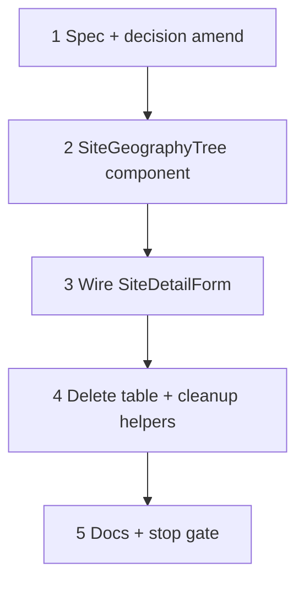

# 36 — Site geography: antd `Tree` editor

> **Status:** Complete (2026-06-30). Next: estimate wave **4c′** (quote geography) or alternate in [`STATUS.md`](../../STATUS.md).
>
> **Spec:** [`site.md`](../surface-specs/site.md) · **Amends:** [34-site-geography-ui.md](./34-site-geography-ui.md) (UI chrome only — DAL/PATCH unchanged) · **Decision gate:** [`10-site-geography-ui-decisions.md`](../planning/10-site-geography-ui-decisions.md) — **SG11, SG12, SG13, SG16**

## Decisions (lock before implement)

| # | Topic | Choice |
|---|--------|--------|
| D1 | **Editor (amends SG11)** | antd **`Tree`** + `titleRender` — **not** `Table` + `treeData`. Name-only `Input` with **`readOnly` + `variant="borderless"`** until click/focus; reverts on blur; new rows start editing. **Name** label + control width matches `SurfaceFormLayout` (not full tree width). No columns, no side panel. |
| D2 | **Selection** | `selectedKeys` / `onSelect` (`type` implied single). **No** default selection on load. Native antd selected-row styling (`nodeSelectedBg`). |
| D3 | **Toolbar (amends SG13)** | **Two controls:** **Add system ▾** (catalog dropdown) + **Add area** (button). Replaces task 34 single **Add ▾**. |
| D4 | **Add system** | Catalog dropdown → append `site_system` after last root row (below General). Focus new system row. |
| D5 | **Add area** | Inserts child under **selected** row. **Enabled** when selection is **General**, **`system`**, or **`area`**. **Disabled** when nothing selected. |
| D6 | **DnD (amends SG12)** | antd Tree **`draggable`** + **`allowDrop`** — sibling reorder only; **no** reparent. Wire `onDrop` → existing `reorderSystems` / `reorderAreaSiblings`. **Remove** `@dnd-kit` from geography UI (keep `FieldArrayTable` usage). |
| D7 | **Delete / cascade** | Unchanged from task 34 — trash per system/area; General not deletable; `can_delete: false` disables trash; Save 409 on referenced omit. |
| D8 | **RHF / PATCH** | Unchanged — `site-geography-tree.ts` helpers + `stripGeographyForPatch`; no DAL changes. |
| D9 | **Cleanup** | **Delete** `SiteGeographyTreeTable.tsx` and all table-only code paths listed in § Remove. |

**Out of scope:** `area_type` / `code` (removed task 35); side panel; `site_asset` UI; estimate `estimate_area`.

---

## Goal

Replace the interim **table** geography editor (tasks 34–35) with a **name-only antd Tree** on the Geography tab. Remove superseded table/`@dnd-kit` UI code.

**Exit:** Geography tab uses `SiteGeographyTree`; old table component deleted; task 34 manual smoke still passes; `npm run build` + `site-geography-write` tests pass.

---

## Locked rules (unchanged server / form)

| Rule | UI | Server |
|------|-----|--------|
| General bucket | Synthetic root; not deletable | `default_areas[]` → `site_system_id` null |
| Add system | Dropdown → root system | `systems[]` append |
| Add area | Child of selected system/area | `insertAreaChild` |
| Delete | Cascade in form; trash disabled when referenced | 409 on PATCH omit |
| DnD | Sibling-only | `sort_order` 1-based on Save |
| Name-only | Single `name` field per area/system | No `area_type` / `code` (task 35) |

---

## Target layout

```text
┌─ Geography tab ─────────────────────────────────────────────┐
│  Optional. Define systems and areas for quoting and jobs.    │
│  [ Add system ▾ ]  [ Add area ]                            │
│  ┌ Tree (defaultExpandAll) ─────────────────────────────┐ │
│  │ ▼ General                                              │ │
│  │ ▼ Name  Fire Alarm (borderless; click → edit)   [🗑]   │ │
│  │     ▼ Name  1st Floor                           [🗑]   │ │
│  │         Name  East wing                         [🗑]   │ │
│  └────────────────────────────────────────────────────────┘ │
└────────────────────────────────────────────────────────────┘
```

- **General:** static label in `titleRender` (not deletable).
- **System / area:** **Name** label (Form.Item, aligns with General tab fields) + `Input` capped to form control width; **`readOnly` + `variant="borderless"`** until click/focus; outlined editable on blur revert; new rows auto-focus into edit.
- **Delete** when `can_delete`.
- **`stopPropagation`** on inputs/buttons inside `titleRender` so typing/deleting does not toggle expand/select unexpectedly.

---

## Execution order



---

## Step 1 — Spec + decision amend

| File | Action |
|------|--------|
| `docs/decisions/site.md` | Amend geography UI decision — `Tree` not `Table`; toolbar D3–D5 |
| `docs/planning/10-site-geography-ui-decisions.md` | Amend SG11, SG12, SG13, SG16 + layout sketch |
| `docs/surface-specs/site.md` | UX line + wireframe → `SiteGeographyTree` |

### Verify

- [x] Decisions match **Locked rules** and D1–D9 above

---

## Step 2 — `SiteGeographyTree` component

**Create** `components/sites/SiteGeographyTree.tsx`.

### Behavior

| Concern | Implementation |
|---------|----------------|
| Data | `useWatch` `systems` / `default_areas`; normalize `areas: []` on systems |
| Tree data | Reuse `buildGeographyTree` → map to antd `treeData` (`key`, `children`, carry `rowKind`, `areaId`, `systemIndex` on node or parallel map) |
| Selection | `useState<string[]>([])` for `selectedKeys`; `onSelect` updates; drive **Add area** disabled state (D5 — General / system / area) |
| Add system | `Dropdown` + `useCatalogSystemPicker`; `appendSystem(makeSystemRow(...))`; select new system key |
| Add area | `insertAreaChild` + `applyGeography`; focus new area name (`focusNameRef` pattern from table) |
| Edit name | Area: `updateAreaById`; System: RHF `Controller` on `systems.{i}.name`. **`readOnly` + `variant="borderless"`** until click/focus; revert on blur; new rows start in edit |
| Delete | `removeArea` / `removeSystemAt`; clear selection if deleted row was selected |
| DnD | `draggable`, `allowDrop` (same parent only), `onDrop` → reorder helpers |
| Permissions | `fieldAllows` for `systems` / `default_areas` write — same as table |
| Read-only | Hide toolbar / disable inputs when not writable |

### `titleRender` contract

```tsx
// Pseudocode — one render path per rowKind
general  → <Typography.Text strong>General</Typography.Text>
system   → Form.Item label="Name" + borderless Input (click → edit) + Delete
area     → Form.Item label="Name" + borderless Input (click → edit) + Delete
```

### Verify

- [x] Tree renders General + systems + nested areas from form state
- [x] Selection highlight uses antd default (no custom `FOCUSED_ROW_STYLE`)
- [x] Add system / Add area match D4–D5
- [x] New area name input receives focus after add

---

## Step 3 — Wire `SiteDetailForm`

| File | Action |
|------|--------|
| `components/sites/SiteDetailForm.tsx` | Import `SiteGeographyTree`; replace `<SiteGeographyTreeTable />` on Geography tab |

### Verify

- [x] Geography tab hidden on create (unchanged from task 34)
- [x] Save / Revert across tab switch preserves dirty state

---

## Step 4 — Remove superseded code (tasks 34–35)

**Delete entirely:**

| File | Reason |
|------|--------|
| `components/sites/SiteGeographyTreeTable.tsx` | Replaced by `SiteGeographyTree.tsx` |

**Remove from geography UI (do not leave dead exports):**

| Artifact | Location (today) |
|----------|------------------|
| `@dnd-kit` (`DndContext`, `SortableContext`, `useSortable`, …) | `SiteGeographyTreeTable.tsx` |
| `useClientMounted` / `dndReady` gate | geography component only — **keep** hook for `FieldArrayTable` |
| `Table`, `ColumnsType`, column defs, `colSpan` / `hiddenCellProps` | table component |
| `PARENT_ROW_STYLE`, `FOCUSED_ROW_STYLE`, `focusedRowKey` | table component |
| `SortableRow`, `DragHandle`, `RowContext` | table component |
| `columnCount`, area Type/Code columns | removed in 35; table file delete finishes cleanup |

**Keep / adapt in `site-geography-tree.ts`:**

| Keep | Notes |
|------|-------|
| `buildGeographyTree`, `GENERAL_TREE_KEY`, mutation helpers | Core form logic — unchanged |
| `SiteGeographyTreeNode`, `GeographyRowKind` | Reuse in Tree `treeData` mapping or rename to `SiteGeographyNode` if clearer |
| `stripGeographyForPatch`, `makeAreaRow`, `makeSystemRow` | Unchanged |

**Optional refactor (only if Tree mapping is cleaner):**

- Add `toAntdTreeData(nodes: SiteGeographyTreeNode[]): TreeDataNode[]` in `site-geography-tree.ts`
- Do **not** duplicate reorder/insert logic in the component

**Grep cleanup after delete:**

```bash
rg SiteGeographyTreeTable apps/subhub
rg focusedRowKey apps/subhub/components/sites
```

### Verify

- [x] No imports of `SiteGeographyTreeTable`
- [x] No `@dnd-kit` under `components/sites/`
- [x] `use-client-mounted.ts` still used by `FieldArrayTable` (do not delete hook)

---

## Step 5 — Docs + STATUS

| File | Action |
|------|--------|
| `docs/tasks/34-site-geography-ui.md` | Add note: UI superseded by 36; DAL steps remain valid |
| `docs/tasks/01-task-index.md` | Add task **36** row |
| `apps/subhub/STATUS.md` | On complete: mark 36 done; repoint **Right now** |

### Verify

- [x] No doc still says `SiteGeographyTreeTable` as the active editor (except historical task 34 body)

---

## Stop gate

### Commands

```bash
cd apps/subhub && npm test -- --run site-geography-write
cd apps/subhub && npm run build
rg SiteGeographyTreeTable apps/subhub   # expect no matches
```

### Manual smoke (carry forward from task 34)

| # | Flow |
|---|------|
| 1 | New site → Save → Geography → add system → add areas → Save |
| 2 | Reopen site → tree matches |
| 3 | DnD reorder systems and sibling areas; no cross-parent drop |
| 4 | Delete unreferenced area branch → Save |
| 5 | Referenced area → trash disabled or 409 on Save |
| 6 | Two FA systems same `system_id`, different names → Save OK |
| 7 | **Add area** disabled with no selection; enabled on General / system / area select |
| 8 | Selection clears when deleted row was selected |

### Verify (stop gate)

- [x] Steps 1–5 verify checklists `[x]`
- [x] Commands pass
- [x] Manual smoke 1–8 pass
- [x] `STATUS.md` updated

---

## Files touched (summary)

| Area | Create | Delete | Update |
|------|--------|--------|--------|
| UI | `SiteGeographyTree.tsx` | `SiteGeographyTreeTable.tsx` | `SiteDetailForm.tsx`, `site-geography-tree.ts` (optional mapper) |
| Docs | — | — | `site.md`, `decisions/site.md`, `10-site-geography-ui-decisions.md`, `STATUS.md`, task index |

**Not touched:** DAL (`site-geography*.ts`), migration `032`, `use-catalog-system-picker.ts`, YAML/codegen.
