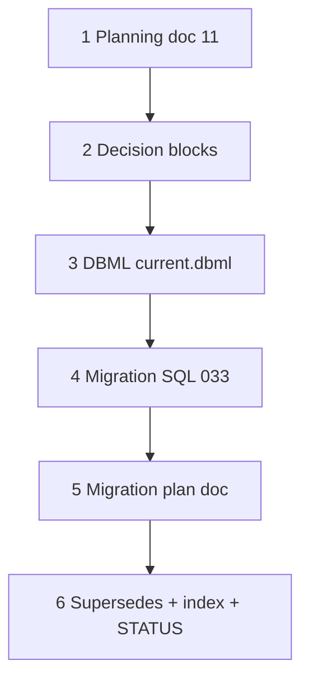

# 37a — Category scope: decision + DBML + migration plan

> **Status:** Complete (2026-06-30). **Next:** [37b-category-scope-migration-apply.md](./37b-category-scope-migration-apply.md) ✅ → **37c** site DAL/UI.
>
> **Planning:** [11-categories-scope-model.md](../planning/11-categories-scope-model.md) · **Migration plan:** [033-category-scope-plan.md](../migrations/033-category-scope-plan.md) · **SQL:** [`033_category_scope.sql`](../../migrations/033_category_scope.sql) · **Supersedes:** wave **4c′** (`estimate_area` snapshots), catalog **`system`** model (C2 as implemented)

## Decisions (locked 2026-06-30)

| # | Topic | Choice |
|---|--------|--------|
| D1 | **Remove `system`** | Catalog scope = **`category`** tree; **`parent_id IS NULL`** = scope root (Fire Alarm, Intrusion, HVAC, …) |
| D2 | **Site structure** | **`site_scope`** (root category instance, renamable) + **`site_zone`** tree; General = `site_scope_id` null |
| D3 | **Estimate scope** | Live site tree + checkboxes; **`estimate_scope`** / **`estimate_zone_spec`**; no `estimate_area` copies |
| D4 | **Items / parts** | M:N **`item_category`**, **`part_category`**; shared tree; **`category_spec_def`** (leaf-heavy) |
| D5 | **Specs** | **`spec_def.root_category_id`**; bucket values on scope/zone; merged category expectations filter parts |
| D6 | **Lines** | **`item_id`** + optional **`part_id`** pin; **`unit_material` / `unit_labor` / `unit_incidental`** on line |
| D7 | **Labor / incidental** | **Not** separate estimate lines — internal $ rollups (engine task 37f) |
| D8 | **Commercial types** | **`labor_context_type`**, **`labor_rate_type`**, **`incidental_rate_type`**, **`markup_type`** — dollar rates (+ markup %); on scope bucket; **no zone override** |
| D9 | **Item picker** | Scoped bucket → root subtree **TreeSelect**; Estimate General → full catalog |
| D10 | **Wire** | Quotable under site General **or** under a root scope bucket |
| D11 | **`trade`** | **Not** on scope path v1; table retained until job costing pass |
| D12 | **Migration** | **Big-bang `033`** — no backward compatibility |
| D13 | **UI labels** | Site **Scopes & zones**; estimate **Scope** |
| D14 | **Checkbox cascade** | Check zone → auto-check parent scope; check scope → **not** auto-check zones |
| D15 | **Deferred** | `spec_def.filter_mode` required vs prefer behavior (Q11); full costing engine (37f) |

### Decision block (paste into docs)

```markdown
### Decision: category-only scope — roots replace catalog system (2026-06-30)

**Choice:**

- Drop catalog **`system`**. Scope roots = **`category.parent_id IS NULL`**.
- Site: **`site_scope`** + **`site_zone`** (rename from `site_system` / `site_area`).
- Estimate: **`estimate_scope`** + checkbox selection on live site tree; **`spec_def`** per root; **`category_spec_def`** on nested categories.
- Lines: **`item_id`** + optional **`part_id`**; material/labor/incidental $ on line; not separate labor rows.
- Big-bang migration **`033_category_scope.sql`**.

**Supersedes:** C2 `system` + `site_system` + `estimate_system` implementation path; estimate 4c′ `estimate_area` snapshot model.

**Planning:** [11-categories-scope-model.md](../planning/11-categories-scope-model.md) · **Task:** 37a · **Apply:** 37b.
```

---

## Goal

Lock the **categories-only scope model**, amend **DBML**, and ship an **executable breaking migration plan** (`033`) so task **37b** can apply DDL on dev and tasks **37c+** can refactor DAL/UI.

**Exit:** Planning doc + decisions + amended `current.dbml` + `033_category_scope.sql` + migration plan doc; task index + STATUS repoint to **37b**; **no app code changes** in this task.

**Not in scope:** Applying migration (37b), DAL/UI refactors (37c–37h), estimate Scope tab UI, costing engine.

---

## Follow-on chain (37b–37h)

| Task | Deliverable |
|------|-------------|
| **[37b](./37b-category-scope-migration-apply.md)** | Apply `033` on dev DB; FK smoke; document breakage list |
| **37c** | Site DAL/UI — `site_scope` / `site_zone`; Scopes & zones tab; root category picker |
| **[37d](./37d-category-catalog-dal-surfaces.md)** | Catalog — `category_list` / `category_detail` (tree list pane), DAL, `spec_def` / `category_spec_def` |
| **37e** | Estimate scope DAL + Scope tab (checkboxes, spec panel, labor context) |
| **37f** | Line items — TreeSelect, part resolution, costing snapshots |
| **37g** | [Commercial costing](../tasks/37g-commercial-costing.md) — org rate tables, category defaults, full engine |
| **37h** | Job line / win path column renames; amend job DBML refs |

---

## Execution order



---

## Step 1 — Planning doc

| File | Action |
|------|--------|
| [`docs/planning/11-categories-scope-model.md`](../planning/11-categories-scope-model.md) | **Create** — locked C1–C17 + follow-on table |

### Verify

- [x] All D1–D15 reflected in planning doc

---

## Step 2 — Decision blocks

| File | Action |
|------|--------|
| [`docs/decisions/catalog.md`](../decisions/catalog.md) | **Add** category-only scope decision; mark C2 **superseded** |
| [`docs/decisions/estimate.md`](../decisions/estimate.md) | **Add** scope checkbox + item-first lines decision; mark 4c′ superseded |
| [`docs/decisions/site.md`](../decisions/site.md) | **Add** site_scope / site_zone rename decision |
| [`docs/decisions/README.md`](../decisions/README.md) | **Add** index row |
| [`docs/planning/08-supersedes.md`](../planning/08-supersedes.md) | **Add** supersession note for `system` / 4c′ |

### Verify

- [x] Decision blocks dated 2026-06-30
- [x] Cross-links to task 37a + planning 11

---

## Step 3 — DBML pass

| File | Action |
|------|--------|
| [`docs/schema/current.dbml`](../schema/current.dbml) | **Amend** — see rename matrix below |

### Table rename matrix (target DBML)

| Remove / rename | Target |
|-----------------|--------|
| `system` | **Removed** — roots on `category` |
| `system_spec_def` | **`spec_def`** (`root_category_id`) |
| `system_spec_option` | **`spec_option`** |
| `site_system` | **`site_scope`** |
| `site_area` | **`site_zone`** |
| `estimate_system` | **`estimate_scope`** |
| `estimate_system_spec` | **`estimate_scope_spec`** |
| `estimate_area_spec` | **`estimate_zone_spec`** |

### Add tables

`category_spec_def`, `item_category`, `part_category`, `labor_context_type`, `labor_rate_type`, `incidental_rate_type`, `markup_type`

### Column highlights

| Table | Columns |
|-------|---------|
| `category` | `default_phase_template_id` |
| `estimate_line` | `estimate_scope_id`, `site_zone_id`, `unit_material`, `unit_labor`, `unit_incidental` |
| `estimate_scope` | `root_category_id`, `site_scope_id`, `labor_context_type_id`, `markup_type_id` |
| `job_line` | `site_zone_id` |
| `job_scope_group` | `root_category_id`, `site_scope_id`, `site_zone_id` (when present) |

Update **`Ref:`** block for all renamed FKs.

### Verify

- [x] No remaining `Ref:` to `system` or `site_system` / `site_area` in DBML
- [x] TableGroup `catalog` lists new tables; `system` removed

---

## Step 4 — Migration SQL

| File | Action |
|------|--------|
| [`migrations/033_category_scope.sql`](../../migrations/033_category_scope.sql) | **Create** — full breaking migration (see plan) |

**Critical behaviors:**

1. **`category` / `item` stubs** if missing (dev baseline).
2. **Preserve `system.id`** when inserting category roots.
3. **Rename** spec, site, estimate, job columns in one transaction.
4. **`DROP TABLE system`** last.
5. **Grants** on new tables.

### Verify

- [x] SQL matches migration plan step order
- [x] Idempotent stubs (`IF NOT EXISTS`) for category/item

---

## Step 5 — Migration plan doc

| File | Action |
|------|--------|
| [`docs/migrations/033-category-scope-plan.md`](../migrations/033-category-scope-plan.md) | **Create** — baseline, steps, smoke queries, breakage list |

### Verify

- [x] Points to `033_category_scope.sql`
- [x] Documents expected app breakage until 37c

---

## Step 6 — Task index + STATUS

| File | Action |
|------|--------|
| [`docs/tasks/01-task-index.md`](./01-task-index.md) | **Add** tasks 37a (complete) + 37b (next) |
| [`STATUS.md`](../../STATUS.md) | **Repoint** Right now → 37b; update finish chain |

### Verify

- [x] STATUS **Right now** → task 37b
- [x] Recently completed → task 37a

---

## Stop gate (37a)

```bash
cd apps/subhub
# Docs-only task — no migration apply yet
test -f docs/planning/11-categories-scope-model.md
test -f docs/migrations/033-category-scope-plan.md
test -f migrations/033_category_scope.sql
test -f docs/tasks/37b-category-scope-migration-apply.md
# Optional: validate SQL parses (requires DB) — 37b
```

### Verify checklist

- [x] [`11-categories-scope-model.md`](../planning/11-categories-scope-model.md) complete
- [x] Decisions in catalog / estimate / site + README index
- [x] [`current.dbml`](../schema/current.dbml) amended
- [x] [`033_category_scope.sql`](../../migrations/033_category_scope.sql) + plan doc
- [x] [`37b-category-scope-migration-apply.md`](./37b-category-scope-migration-apply.md) stub for next agent
- [x] [`STATUS.md`](../../STATUS.md) → **37b**
- [x] Supersedes 4c′ / `system` documented

---

## Risk notes

| Risk | Mitigation |
|------|------------|
| App broken after 033 | Expected; 37b documents; 37c+ refactors in order |
| Empty `system` table on dev | `INSERT` is no-op; roots added when systems seeded later |
| `item` stub minimal | 37d expands when catalog 3b ships |
| Estimate/site UI still says “system” | 37c renames chrome to scope / root category |

---

## Related

- [33-estimate-site-anchor.md](./33-estimate-site-anchor.md) — site_id gate **still valid**
- [36-site-geography-tree-ui.md](./36-site-geography-tree-ui.md) — Tree UX pattern reused in 37c/e
- [32-estimate-wave-4e.md](./32-estimate-wave-4e.md) — `estimate_system` DAL **superseded** by 37e
