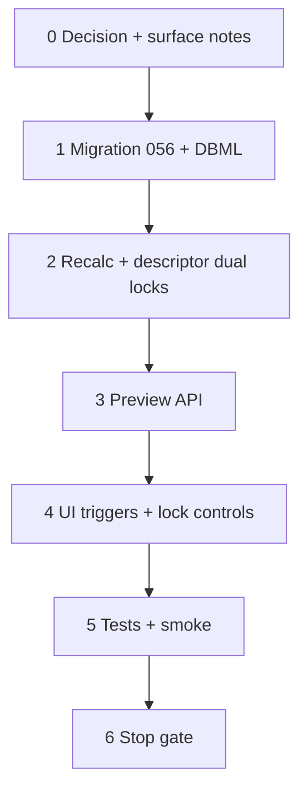

# 37aa — Estimate line live preview + dual locks

> **Status:** Complete (2026-07-11). Next: [37h](./37a-category-scope-decision-dbml-migration.md) job FK renames (parallel OK) / G4 win-copy (deferred).
>
> **Decision:** [dual line locks + live preview](../decisions/estimate.md#decision-estimate-dual-line-locks-and-live-preview-2026-07-11) (**P1–P7**). **Supersedes:** save-only column refresh ([37f](./37f-estimate-line-costing.md) UX note); draft `lock` enum ([D6b](../decisions/catalog.md#estimate-line-locking-d6b--locked-2026-07-05)). **Builds on:** [37g](./37g-commercial-costing.md) recalc engine, [37y](./37y-condition-only-commercial-tree.md) condition tree. **Schema change.**

## Goal

When an estimator selects/reselects an **item**, picks/clears a **part**, or changes **condition configuration**, refresh line columns (part + material through ext sell) **before Save** via a **server preview** that reuses the existing commercial engine. Replace `estimate_line.lock` with independent **`sales_locked`** and **`material_locked`**.

**Exit:** Migration applied; preview API + UI wiring; save-path recalc honors dual locks; PN pick no longer sets a “freeze all costing” state; tests + smoke; STATUS + index updated.

**Not in scope:** Client-side formula port; kit/assembly lines; win→job copy; changing estimate `sent`+ freeze rules.

---

## Locked summary (do not re-litigate)

| # | Choice |
|---|--------|
| **P1** | Server preview — reuse `recalcProductLine` / part resolver; **no persist** |
| **P2** | Triggers: item, part, condition **config**. Qty does **not** drive unit costing |
| **P3** | Fan-out: item/part → **one line**; config → **all lines** on **selected condition** |
| **P4** | Qty → local **ext sell** only |
| **P5** | Preview **never writes** lock flags |
| **P6** | `sales_locked` + `material_locked` booleans; drop `lock` |
| **P7** | Backfill: `none`→both false; `sell`→sales; `line`→**both true** |

| Flag | On | While on | Off |
|------|----|----------|-----|
| **Sales** | Manual sell edit or explicit lock | Keep `unit_price` (still **editable**); costs + target still update | Unlock → `unit_price = unit_price_target` |
| **Material** | Manual PN pick or explicit lock (not auto single-match) | Freeze **item + part**; costing still runs | Unlock → re-resolve part |

---

## Implementation steps



### Step 0 — Docs

| Action |
|--------|
| Decision P1–P7 in [estimate.md](../decisions/estimate.md) *(authored with this task)* |
| Amend surface-spec `line_items` element: dual lock fields; preview route note |
| Pointer from [37f](./37f-estimate-line-costing.md) “recalc on Save only” → this task |

### Verify (Step 0)

- [x] Decision linked; surface-spec notes dual locks + preview

### Step 1 — Migration + DBML

| File | Action |
|------|--------|
| `migrations/056_estimate_line_dual_locks.sql` | **Create** — add `sales_locked` / `material_locked`; backfill per P7; drop `lock` + CHECK |
| [`docs/schema/current.dbml`](../schema/current.dbml) | Amend `estimate_line` |

```sql
-- sketch
ALTER TABLE estimate_line
  ADD COLUMN sales_locked boolean NOT NULL DEFAULT false,
  ADD COLUMN material_locked boolean NOT NULL DEFAULT false;

UPDATE estimate_line SET sales_locked = true WHERE lock IN ('sell', 'line');
UPDATE estimate_line SET material_locked = true WHERE lock = 'line';

ALTER TABLE estimate_line DROP CONSTRAINT IF EXISTS estimate_line_lock_check; -- name per 040b
ALTER TABLE estimate_line DROP COLUMN lock;
```

### Verify (Step 1)

- [x] Migration applied on dev; DBML matches
- [x] No remaining `estimate_line.lock` reads in app code after Step 2

### Step 2 — DAL / descriptor / save recalc

| File | Action |
|------|--------|
| `lib/estimates/descriptors/estimate-detail.ts` | Replace `lock` enum with two booleans on line schema / DTO / PATCH |
| `lib/estimates/repository/estimate-line-recalc.ts` | Honor P5 apply rules (material keep pin; sales keep sell; always update costs in draft) |
| `lib/estimates/repository/estimate-lines.ts` / `estimate-lines-write.ts` | SELECT/INSERT new columns; reject item change when `material_locked` |
| `estimate-line-tree.ts` + form map | Default both false; drop `lock` |

### Verify (Step 2)

- [x] Save recalc: sales-locked keeps sell, updates target/costs
- [x] Save recalc: material-locked keeps part/item, updates costs
- [x] Both true: independent behavior
- [x] Non-draft: no recalc (D6a unchanged)

### Step 3 — Preview API

| File | Action |
|------|--------|
| `app/api/estimates/[id]/line-preview/route.ts` *(or equivalent)* | **Create** — auth via `estimate_detail` write/read; draft only |
| Shared preview helper | Accept condition draft config + `lines[]` (1..n); call same recalc path; return parallel results; **no write** |

**Request (sketch):** `{ condition_id, condition_draft?, lines: [{ id, item_id, part_id, sales_locked, material_locked, quantity, unit_price, … }] }`  
**Response (sketch):** `{ lines: [{ id, part_id, vendor_part_id, unit_material, unit_freight, unit_incidental, unit_labor, unit_cost, unit_price_target, unit_price }] }`

### Verify (Step 3)

- [x] Single-line and multi-line preview return consistent with save-path math
- [x] Flags in request are respected; flags not returned as mutations (or ignored if echoed)

### Step 4 — UI

| File | Action |
|------|--------|
| `estimate-line-cells.tsx` | Item/part `onChange` → preview that line; apply fields; **stop** PN→`lock=line` |
| Condition **C** config panel | On config change → debounce (~300ms) → preview all lines for selected condition |
| Lock controls | Replace cycle button: sales lock + material lock (or equivalent); sell edit → `sales_locked`; PN pick → `material_locked`; unlocks per decision |
| Ext sell | Qty change updates ext sell locally only |
| Loading | Per-line or batch busy state while preview in flight |

### Verify (Step 4)

- [x] Item pick updates part + cost columns without Save
- [x] Config change updates all lines under selected condition
- [x] Sales-locked line: costs move, sell sticky, sell still editable
- [x] Material-locked line: item/part sticky, costs move; item picker disabled
- [x] Unlock sales restores target sell; unlock material re-resolves PN

### Step 5 — Tests + smoke

```bash
cd apps/subhub
npm test -- --run estimate-line-recalc estimate-lines-write
# + preview route / helper tests as added
```

Manual:

1. Draft estimate — pick item → columns fill before Save; Save matches.
2. Override sell → sales lock on → change config → costs/target move, sell sticks.
3. Unlock sales → sell = target.
4. Many-match PN pick → material lock → config change keeps PN, costs update.
5. Unlock material → PN may change to resolver suggestion.
6. Qty change → ext sell only.

### Verify (Step 5)

- [x] Targeted tests pass
- [x] Manual smoke 1–6 pass on draft

### Step 6 — Stop gate

| Action |
|--------|
| Mark this task **Complete** + verify checklists `[x]` |
| Update [`STATUS.md`](../../STATUS.md) + [`01-task-index.md`](./01-task-index.md) |

### Verify (stop gate)

- [x] All step verify boxes `[x]`
- [x] STATUS points next work
- [x] Decision + migration + preview + UI shipped

---

## Dependencies

| Upstream | Provides |
|----------|----------|
| **37g** | `recalcProductLine`, commercial catalog |
| **37y** | Condition-only tree; config panel |
| **37w** | Line Items panels |

| Downstream | Needs |
|------------|-------|
| Estimator UX | Live columns + correct lock semantics |
| **37h** / G4 | Unblocked (parallel) |

---

## Risk notes

| Risk | Mitigation |
|------|------------|
| Preview vs save drift | Same helper; tests assert parity |
| Config fan-out chatty | Debounce; batch one request |
| Old `line` rows | Both locks true on backfill — unlock explicitly |
| Unsaved condition config | POST draft config in preview body |

---

## Deliverables (summary)

| Area | Deliverable |
|------|-------------|
| Decision | P1–P7 in estimate.md |
| DDL | Migration **056** dual locks |
| DAL | Recalc + PATCH honor booleans |
| API | Batch line-preview (no persist) |
| UI | Triggers, lock controls, apply preview |
| Tests | Recalc + preview + smoke |
