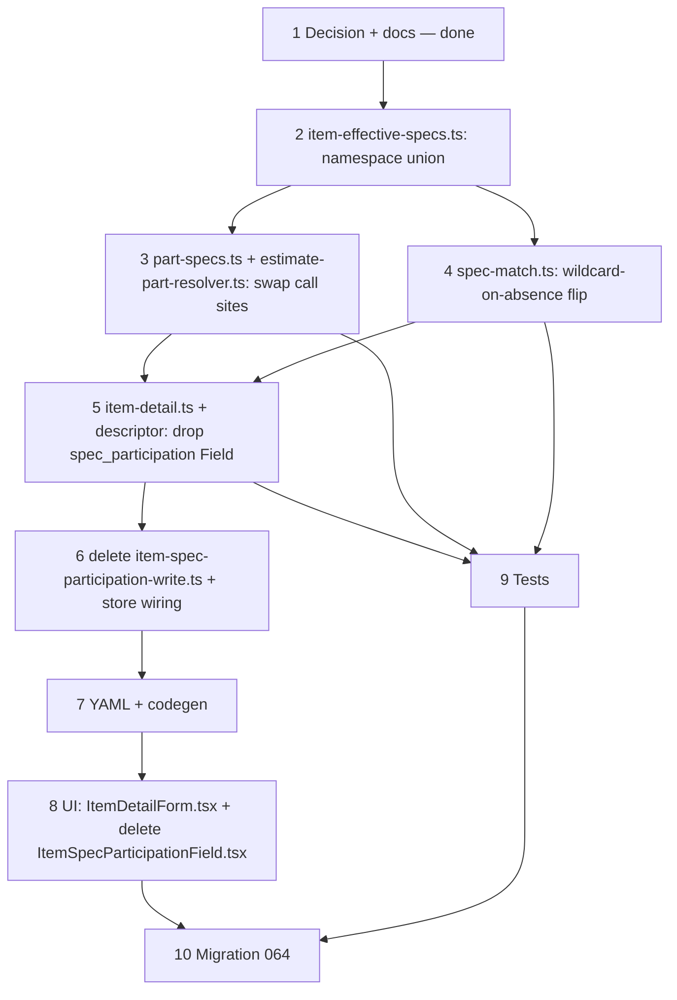

# 37ai — Spec participation removal (namespace narrowing, part-row wildcard matching)

> **Status:** Complete (2026-07-12). Next: [37h — job FK renames](./37a-category-scope-decision-dbml-migration.md).
>
> **Decision:** [spec participation removed (V1–V8)](../decisions/catalog.md#decision-spec-participation-removed--narrow-by-scope-root-namespace-part-row-presence-is-the-filter-2026-07-12). **Amends/supersedes:** [37o](./37o-spec-participation-flatten.md) S3/S6/S8/S9/S10 only — S1/S2/S4/S5/S7 (flat `spec_def` namespace per scope root, edited on the scope's Specs tab; categories carry no spec Fields; no `item_spec_exclude`; estimate scope panel = whole root namespace) are **untouched**. **Builds on:** [37k](./37k-part-spec-lifecycle.md) (prune-on-link-save — mechanism kept, query source changes), [37j](./37j-catalog-part-authoring.md) (`part_specs` contextual union — simplified further here), [37ag](./37ag-spec-threshold-presets-matcher.md) (matcher shape — semantic flip only, not restructured). **Touches:** [`item.md`](../surface-specs/item.md), [`part.md`](../surface-specs/part.md), [`spec.md`](../surface-specs/spec.md) *(historical, pointer note only)*.

## Problem

The flat, no-inheritance participation model (S1–S10, [37o](./37o-spec-participation-flatten.md)) still requires every leaf item to be individually opted into every spec dimension it should be filtered on. Worked example: **Notification Appliances** → 3 sub-categories × 5 leaves = 15 leaves all genuinely needing `Notification Color`, `Notification Series`, `Candela` — 45 individual picks, repeated for every new spec or new leaf. Category-level inheritance (ancestry-merge, mirroring [37ad](./37ad-labor-phase-per-row-override.md)'s labor-phase merge) was evaluated and rejected — it reopens the cross-subtree blast-radius problem S9 was written to close. Full trade-off discussion: [decision doc](../decisions/catalog.md#decision-spec-participation-removed--narrow-by-scope-root-namespace-part-row-presence-is-the-filter-2026-07-12).

**Resolution:** drop participation entirely. An item's effective spec set becomes a pure computation — its scope root's entire `spec_def` namespace, no opt-in step. The signal for "does this dimension actually apply to this device" moves to where it already exists for free: whether the **part** has a `manufacturer_part_spec` row for that def. Absence of a row is now a matched wildcard (skip), not a match failure.

## Locked decisions (V1–V8)

See [catalog.md § spec participation removed](../decisions/catalog.md#decision-spec-participation-removed--narrow-by-scope-root-namespace-part-row-presence-is-the-filter-2026-07-12). Summary:

| # | Deliverable |
|---|-------------|
| V1 | Drop `item_spec_participation` table. No replacement junction anywhere. Leaf `item_detail` has zero spec Fields. |
| V2 | "Effective defs" for an item = `scopePanelDefs(item's scope root)` — the whole namespace, same function S7 already uses for the estimate scope panel. |
| V3 | Part contextual union = `⋃ scopePanelDefs(root)` across the distinct scope root(s) of a part's linked leaves — replaces S6's participation join. |
| V4 | Guardrail removed (accepted trade-off) — `assertValidPartSpecs` validates against the wider namespace, not a curated subset. |
| V5 | **Matcher semantic flip** — zero `manufacturer_part_spec` rows for a def = wildcard pass, not fail. Applies to enum, number, and boolean checks in `spec-match.ts`. |
| V6 | Line-level narrowing = bucket vs. the item's whole namespace (V2); no more `bucket ∩ participation(item)` intersection step. |
| V7 | Orphan risk lower than before — namespace only widens what's allowed; no existing `manufacturer_part_spec` row becomes invalid. `prunePartSpecsToContextTx` (K1) unchanged in mechanism, fires less often. |
| V8 | Drop `in_use_participation_count` from `spec_definitions[]` DTO and delete-guard payloads — nothing left to count. |

## Execution order



**Slice:** all catalog/estimate/parts DAL, no new UI Surface, no estimate-line schema change. Steps 2–4 can land as one PR (pure DAL + matcher); 5–8 as a second (Field removal); 9 alongside both; 10 last, once nothing queries the dropped table.

---

## Step 1 — Decision + surface docs (complete, 2026-07-12)

| File | Action |
|------|--------|
| [`docs/decisions/catalog.md`](../decisions/catalog.md) | **Added** V1–V8 decision block; amended S1–S10 header noting S3/S6/S8/S9/S10 superseded |
| [`docs/decisions/README.md`](../decisions/README.md) | **Added** index row; amended S1–S10 row status |
| [`docs/surface-specs/item.md`](../surface-specs/item.md) | **Amended** — removed `spec_participation` Field, its element section, DAL read/write, delete blockers, PATCH guards, audit row, UI ASCII layout + leaf-detail paragraph; added 37ai pointers |
| [`docs/surface-specs/part.md`](../surface-specs/part.md) | **Amended** — `part_specs` contextual union description (S6 → V3); wildcard-match note (V5); guardrail-removed note (V4); prune note (V7) |
| [`docs/surface-specs/spec.md`](../surface-specs/spec.md) | **Amended** — added stale-content pointer note (file is historical only) |
| [`docs/schema/current.dbml`](../schema/current.dbml) | **Amended** — dropped `item_spec_participation` table + `TableGroup` entry + `Ref:` lines; `spec_def` Note amended |
| [`docs/migrations/064-drop-item-spec-participation-plan.md`](../migrations/064-drop-item-spec-participation-plan.md) | **Created** |
| [`migrations/064_drop_item_spec_participation.sql`](../../migrations/064_drop_item_spec_participation.sql) | **Created** — not yet applied (see Step 10 ordering) |
| This task file | **Created** |
| [`01-task-index.md`](./01-task-index.md) + [`STATUS.md`](../../STATUS.md) | **Updated** |

### Verify

- [x] Decision V1–V8 in `catalog.md`; S1–S10 block cross-links the supersession
- [x] `item.md` — no `spec_participation` Field, element, or UI reference remains (grep clean except intentional 37ai pointers)
- [x] `part.md` — union description matches V3; wildcard-match + guardrail-removed notes present
- [x] `current.dbml` — no `item_spec_participation` table or `Ref:` remains
- [x] Migration plan + SQL authored (not applied — Step 10 gate)
- [x] This task + decision linked from `01-task-index.md` and `STATUS.md`

---

## Step 2 — `item-effective-specs.ts`: namespace-based union

### `lib/catalog/repository/item-effective-specs.ts`

- **Keep** `scopePanelDefs(pool, rootItemId)` unchanged — it's now the single source of truth for "effective defs," reused by the estimate scope panel (unchanged call sites in `estimate-site-tree.ts`, `estimate-conditions.ts`, `estimate-conditions-write.ts`) **and** the new per-item/per-part lookups below.
- **Delete** `unionEffectiveForItems` (the `INNER JOIN item_spec_participation` query).
- **Add** `rootNamespaceForItems(pool, itemIds: string[])` — resolves each item's scope root via ancestry walk, then unions `spec_def` rows across the **distinct** roots:

```sql
WITH RECURSIVE ancestry AS (
  SELECT id, id AS origin_id, parent_id FROM item WHERE id = ANY($1::text[])
  UNION ALL
  SELECT i.id, a.origin_id, i.parent_id
  FROM item i
  JOIN ancestry a ON i.id = a.parent_id
)
SELECT DISTINCT sd.id AS spec_def_id, sd.display_name, sd.value_type, sd.decimal_places,
       su.symbol AS unit_symbol, COALESCE(su.to_canonical_factor, 1) AS to_canonical_factor
FROM ancestry a
JOIN spec_def sd ON sd.scope_root_item_id = a.id
LEFT JOIN spec_unit su ON su.id = sd.unit_id
WHERE a.parent_id IS NULL
ORDER BY sd.sort_order ASC, sd.display_name ASC, sd.id ASC
```

  Reuse `effectiveSpecDefSelect` / `effectiveSpecDefFrom` constants where the column list matches; keep return type `EffectiveSpecDef[]` (unchanged shape) so callers don't need type changes, just the import rename.
- Keep `loadScopePanelDefIdSet` unchanged (already calls `scopePanelDefs`).

### Verify

- [x] `rootNamespaceForItems([itemA, itemB])` where both share one root returns that root's namespace once (no duplicates)
- [x] `rootNamespaceForItems([itemA, itemC])` across two different scope roots returns the union of both namespaces
- [x] `scopePanelDefs` behavior byte-for-byte unchanged (no regression on estimate scope panel)

---

## Step 3 — `part-specs.ts` + `estimate-part-resolver.ts`: swap call sites

### `lib/parts/repository/part-specs.ts`

- Replace both `unionEffectiveForItems(pool as Pool, itemIds)` call sites (writable-def listing **and** `assertValidPartSpecs`-equivalent validation, currently ~L51 and ~L340) with `rootNamespaceForItems(pool, itemIds)` from Step 2. Update the import.
- **Prune-on-link-save (K1) — unchanged in spirit**, just now compares against the wider namespace union: delete `manufacturer_part_spec` rows outside the recomputed `rootNamespaceForItems` result on `item_links` replace.

### `lib/estimates/repository/estimate-part-resolver.ts`

- Replace `unionEffectiveForItems(client as Pool, [itemId])` (~L189, inside the line-filtering function) with `rootNamespaceForItems(client as Pool, [itemId])`. Update the import. Behavior: `effectiveDefIds` is now the item's whole scope-root namespace, not its participation set.

### Verify

- [x] `part_specs` writable-def union test updated to expect namespace (not participation) rows
- [x] `assertValidPartSpecs`-equivalent rejects `spec_def_id` outside the item's scope-root namespace, accepts any def inside it (no participation subset check)
- [x] Estimate resolver's `effectiveDefIds` = item's scope-root namespace in a unit test

---

## Step 4 — `spec-match.ts`: wildcard-on-absence flip

The load-bearing behavior change. Every "zero part rows for this def" case flips from *fail* to *pass* when the item's namespace includes the def (namespace membership is now the only gate; row presence is the per-part refinement).

### `lib/catalog/spec-match.ts`

```ts
export const enumOptionSetMatches = (
  bucketOptionIds: Set<string>,
  partRows: PartSpecMatchRow[],
  wildcardOptionId: string | null,
): boolean => {
  if (partRows.length === 0) {
    return true; // 37ai V5 — no rows recorded for this def on this part = not applicable, skip
  }
  // ...unchanged below
};

export const numberBucketMatchesPartRows = (
  bucketMin: number | null,
  bucketMax: number | null,
  partRows: PartSpecMatchRow[],
): boolean => {
  if (partRows.length === 0) {
    return true; // 37ai V5
  }
  const bucket = bucketNumericBounds(bucketMin, bucketMax);
  return partRows.some((row) => {
    const part = partNumericBounds(row.value_number, row.value_number_max);
    if (!part) {
      return false; // row exists but is blank on both bounds — deliberate unset, not absence
    }
    return numericIntervalsOverlap(bucket.min, bucket.max, part.min, part.max);
  });
};
```

- **Boolean check** in `bucketSpecMatchesPartRows` (the `partRows.some((row) => row.value_boolean === bucket.value_boolean)` line): add the same `partRows.length === 0 → true` short-circuit before the `.some()` call.
- **No change** to the `bucket` value being blank (`null`/no selection) — that already returns `true` unconditionally (unaffected, still means "estimator applied no filter on this dimension").
- **Distinguish** "no rows at all for this def" (→ pass, V5) from "a row exists but its value fields are blank" (`partNumericBounds` returning `null` → still fail, unchanged) — these are different author intents: the first is "never valued," the second is "explicitly recorded as N/A" (shouldn't occur in practice since `expandPartSpecsForPatch` omits blank values client-side, but the DAL must not conflate the two).

### Verify

- [x] `enumOptionSetMatches([...], [], null)` → `true` (was `false`)
- [x] `numberBucketMatchesPartRows(min, max, [])` → `true` (was `false` via empty `.some()`)
- [x] Boolean bucket set + zero part rows → `true`
- [x] Existing "part has a row, value doesn't overlap/match" cases still return `false` (regression check — only the zero-rows case flips)
- [x] `bucketSpecMatchesPartRows` test matrix covers: blank bucket + rows, blank bucket + no rows, set bucket + no rows (new — was the missing case), set bucket + non-matching row, set bucket + matching row

---

## Step 5 — `item-detail.ts` + descriptor: drop `spec_participation` Field

### `lib/catalog/repository/item-detail.ts`

- **Delete:** `SpecParticipationRow` type, `emptySpecParticipation`, `loadNamespaceSpecDefs`, `loadParticipationIds`, `buildSpecParticipation`, `loadItemSpecParticipation`.
- **`ItemDetailRelated`:** remove `spec_participation` field.
- **`loadSpecDefInUseCounts`:** drop the `item_spec_participation` count query entirely; return `{ parts: number }` only (drop `participation`).
- **`loadItemDetailRelated`:** remove the `spec_participation` branch and its assignment; `spec_definitions` branch (scope-only) unchanged.

### `lib/catalog/descriptors/item-detail.ts`

- **Delete:** `SpecParticipationPatchElementSchema`, `SpecParticipationPatchSchema`, `SpecParticipationRow` type, `SpecParticipationPatchRow`/`SpecParticipationPatchBody` type exports.
- **`ItemDetailPatchSchema` / `ItemDetailCreateSchema`:** remove `spec_participation: SpecParticipationPatchSchema.optional()`.
- **`SpecDefinitionRow`:** remove `in_use_participation_count` (V8).
- **`ItemDetailRelated` / `ItemDetailRelatedPatch`:** remove `spec_participation`.
- **`normalizeItemDetailRelated`:** drop the `spec_participation` normalization line.
- **`projectItemDetailRow`:** remove the `manifest.fields.spec_participation?.includes("read")` block.
- **`applyRelatedPatch`:** remove the `typed.spec_participation !== undefined` branch.
- **`deleteAuditSnapshot`:** remove `spec_participation` from the snapshot object.

### `lib/catalog/repository/item-spec-definitions-write.ts` + `lib/catalog/repository/spec-detail-write.ts`

- **`loadSpecDefInUseCounts`** (both files have their own copy) — drop the `item_spec_participation` count query; return `{ parts: number }` only.
- **`ConflictError` payloads** (`in_use` on delete / scope-reassign-lock) — drop `in_use_participation_count` key, keep `in_use_part_count`.

### Verify

- [x] `GET` on a leaf item returns no `spec_participation` key in the DTO at all (not even empty)
- [x] `GET` on a scope root's `spec_definitions[]` rows have no `in_use_participation_count` key
- [x] `PATCH { spec_participation: [...] }` on any node → rejected by `.strict()` schema (unknown key), not silently ignored
- [x] Delete-guard `ConflictError` payload has only `in_use_part_count`
- [x] `codegen:check` clean after descriptor changes (if codegen inspects descriptor shape)

---

## Step 6 — Delete `item-spec-participation-write.ts` + store wiring

- **Delete** `lib/catalog/repository/item-spec-participation-write.ts` (both exports, `assertSpecDefsBelongToRoot` and `applyCategorySpecParticipationTx`, are participation-only — no other caller).
- **Delete** `lib/catalog/repository/item-spec-participation-write.test.ts`.
- **`lib/catalog/stores/item-detail-store.ts`:** remove the `import { applyCategorySpecParticipationTx } from "../repository/item-spec-participation-write";` line and the `if (patch.spec_participation !== undefined) { ... }` block (currently resolves `rootItemId` and calls the write helper).
- **`lib/catalog/stores/item-detail-create.ts`:** grep for the same pattern on create path and remove analogously.

### Verify

- [x] `item-detail-store.ts` / `item-detail-create.ts` compile clean with no reference to the deleted module
- [x] PATCH/POST with a `spec_participation` key in the body → `400` (schema rejection from Step 5), never reaches the store

---

## Step 7 — YAML + codegen

### `modules/catalog/item_detail.surface.yaml`

- Remove `item_spec_participation` from `tables:`.
- Remove the `spec_participation` entry from `fields:`.

Run `npm run codegen` (or `codegen --check` first to confirm the diff, then regenerate) so `modules/catalog/generated/item_detail.schema.generated.ts` drops the field.

### Verify

- [x] `codegen --check` clean after YAML edit + regeneration
- [x] Generated file has no `spec_participation` symbol

---

## Step 8 — UI: `ItemDetailForm.tsx` + delete `ItemSpecParticipationField.tsx`

- **Delete** `components/catalog/ItemSpecParticipationField.tsx`.
- **`components/catalog/ItemDetailForm.tsx`:** remove the import and render call for `ItemSpecParticipationField`; remove the `in_use_participation_count?: number` line from the local `spec_definitions` row type (Step 5 dropped it server-side).
- **`components/catalog/ItemSpecDefinitionsField.tsx`:** remove `in_use_participation_count: 0` from its default-row constructor (Step 5 dropped the field).
- Confirm the leaf item detail form now renders **no spec section** — General tab only (profile + commercial + labor phase), matching [item.md § G](../surface-specs/item.md).

### Verify

- [x] Leaf item detail page has no Specs UI, no console errors from a missing `spec_participation` prop
- [x] Scope root Specs tab unaffected (still shows `spec_definitions` table without the participation count column, if it ever rendered one)

---

## Step 9 — Tests

Update or delete (grep `spec_participation` / `item_spec_participation` / `unionEffectiveForItems` / `in_use_participation_count` across `apps/subhub` for the authoritative list; known files as of this task's authoring):

| File | Action |
|------|--------|
| `lib/catalog/repository/item-spec-participation-write.test.ts` | **Delete** (module deleted in Step 6) |
| `lib/catalog/repository/item-effective-specs.test.ts` | Remove `unionEffectiveForItems` describe block; add `rootNamespaceForItems` cases (multi-item single-root dedup, multi-root union) |
| `lib/parts/repository/part-specs.test.ts` | Update `vi.mock("../../catalog/repository/item-effective-specs", ...)` to mock `rootNamespaceForItems` instead of `unionEffectiveForItems`; update fixture data from participation-shaped to namespace-shaped |
| `lib/catalog/repository/item-detail.test.ts` | Remove assertions on `spec_participation` DTO shape; add/keep assertions that leaf `GET` has no such key |
| `lib/catalog/repository/item-write.test.ts` | Remove any `spec_participation` PATCH body fixtures / assertions |
| `lib/catalog/item-detail-labor-phase-patch.test.ts` | Check for incidental `spec_participation` fixture noise unrelated to labor phase; strip if present |
| `lib/catalog/repository/spec-detail-write.test.ts` | Update `in_use_participation_count` expectations to removed |
| `lib/catalog/spec-match.test.ts` (new, if not present) or existing matcher tests | Add the zero-rows-wildcard cases from Step 4's verify list |
| `lib/estimates/repository/estimate-part-resolver.test.ts` (if present) | Update `effectiveDefIds` fixtures from participation rows to namespace rows |

```bash
cd apps/subhub
npm run codegen:check
npm test -- --run item-detail item-effective-specs part-specs spec-match estimate-part-resolver item-write
npm run build
```

### Verify

- [x] All listed test files updated; no lingering `item_spec_participation` / `unionEffectiveForItems` symbol in test code
- [x] Full targeted test run green
- [x] `codegen:check` + `npm run build` green

---

## Step 10 — Migration `064_drop_item_spec_participation.sql`

> **Gate:** apply only after Steps 2–9 are merged (code no longer queries `item_spec_participation`). See [migration plan](../migrations/064-drop-item-spec-participation-plan.md) for the "widen, then drop" ordering rationale.

```sql
DROP TABLE IF EXISTS item_spec_participation;
```

### Verify

- [x] Steps 2–9 merged and deployed first
- [x] `064` applies clean on dev
- [x] `current.dbml` matches applied schema exactly (already target-state from Step 1)
- [ ] Spot-check: existing `manufacturer_part_spec` rows for a previously-participating leaf still match correctly in an estimate (no regression from the drop itself — code already stopped reading the table in Step 2–4)

---

## Manual smoke (after Steps 2–10)

1. Fire Alarm scope root — Specs tab unchanged: `slc_protocol`, `notification_color`, `candela` defined.
2. Open any Notification leaf's detail page — confirm **no spec section renders at all** (General tab only).
3. Part `P2RL` linked only to Notification leaves → `part_specs` on `/parts/[id]` shows all three Fire Alarm defs as writable rows (not just `notification_color`/`candela` from its old participation set) — set `candela = 135`, leave `slc_protocol` blank, save.
4. New Fire Alarm estimate condition → set `slc_protocol = Addressable` in the C panel → line on a Notification leaf using part `P2RL` still appears in the part picker (blank `slc_protocol` row = wildcard skip, not exclusion).
5. Set `candela = High` in the C panel → part picker still narrows correctly using `P2RL`'s recorded `candela` value (V5 doesn't change behavior when a part *does* have a row).
6. Pull Station part (Initiating Devices, never given `candela`/`color` rows) → unaffected by any Notification-scope bucket value on an unrelated line.

## Stop gate

- [x] Steps 1–10 verifies all `[x]` (except manual smoke + estimate spot-check below)
- [x] Migration `064` applied; `current.dbml` synced
- [x] `item_spec_participation` has zero remaining references in app code (grep clean) — decisions/task docs retain historical mentions intentionally
- [x] Targeted tests + `codegen:check` + `build` green
- [ ] Manual smoke 1–6 on dev
- [x] [`STATUS.md`](../../STATUS.md) + [`01-task-index.md`](./01-task-index.md) updated to **complete**

## Risk notes

| Risk | Mitigation |
|------|------------|
| Migration `064` applied before code stops querying the table | 500s on any in-flight request touching `item_spec_participation` — Step 10 explicitly gates on Steps 2–9 merged first; do not batch the DDL into the same deploy as an unrelated hotfix |
| Matcher flip (Step 4) silently changes estimate results for **existing** data | Only changes behavior for defs where a part previously had **zero** rows (previously always excluded such parts on that dimension) — worth an explicit before/after count of affected `(part, spec_def)` pairs on dev data before/after if there's meaningful production estimate history to protect; v1 dev-only, low risk |
| Guardrail loss (V4) lets admins record nonsensical part/spec combinations | Accepted per decision — no mitigation planned; revisit only if real data quality complaints surface |
| `in_use_participation_count` removal breaks an untracked consumer | Grep confirmed only the four files listed in Step 5/8 read this key; sweep again before merge if new consumers were added since this task was authored |

## Out of scope (37ai)

- Any UI "which specs matter to this part family" hint/grouping on `part_detail` beyond the existing Spec · Value table — the namespace is now broader, so this may become a real UX ask, but it's not required for this task
- Backfilling or reporting on which `item_spec_participation` rows existed pre-drop — not needed, nothing downstream reads them
- Any change to `spec_def` / `spec_option` / `spec_threshold_preset*` namespace-scoping (37o S1/S2/S4/S5/S7) — untouched
