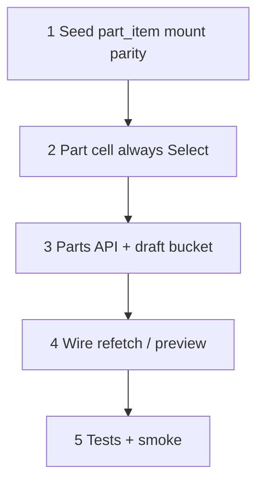

# 37aj — Estimate Part Select + catalog seed parity

> **Status:** Complete (2026-07-13). Next: [37h](./37a-category-scope-decision-dbml-migration.md) (or resume walkthrough W2b material $).
>
> **Decisions:** [W1 triggers](../decisions/estimate.md#decision-line-item-pick--costing-walkthrough-2026-07-13) · [W2a Part Select](../decisions/estimate.md#decision-line-item-pick--costing-walkthrough-2026-07-13) · [O1 material](./37f-estimate-line-costing.md#decision-o1--ambiguous-part-material-cost-2026-07-04) (unchanged) · [P2/P3 live preview](../decisions/estimate.md#decision-estimate-dual-line-locks-and-live-preview-2026-07-11).

## Problem

1. **Part column UX** — 0/1 matches render as plain text (`No match` / single MPN). Product wants **always a Select**: empty options OK; options = all matched parts; pick → `material_locked`.
2. **Draft vs saved filter** — condition config preview uses **draft** specs for costing/`part_id`, but `GET …/pickers/parts` reads **persisted** `estimate_condition_spec` and the React Query key is only `[itemId, conditionId]`. Unsaved C-panel changes leave the Part dropdown stale.
3. **Dev catalog gap** — after **059** mount split, `part_item` seeds (**063** / **066**) link System Sensor notification parts only under **Wall** leaves. Ceiling / Outdoor `Horn/Strobe` (etc.) are selectable but have **zero** candidates → permanent “No match” / $0 material when fallback is 0.

## Goal

Make item → filtered parts → Part Select trustworthy end-to-end: seed every mount leaf that should share the Wall part pool (or document intentional empties), always show a Part dropdown of the **current** match set, keep lock-on-pick + preview.

**Exit:** Migration applied; Part cell always Select; parts API accepts draft bucket (or equivalent); UI refreshes options on item + unsaved config; tests + manual smoke; STATUS points next.

**Not in this task:** Changing O1 material formulas; freight/labor commercial seed; item picker mount labels; W2b material $ product changes; 37h job FKs.

---

## Locked summary (do not re-litigate)

| # | Choice |
|---|--------|
| **W2a (a)** | Part column **always** `Select` — empty options OK |
| **W2a (b)** | Options = **all** matched parts (same filter as `resolveFilteredParts`) |
| **W2a (c)** | Manual pick → `material_locked = true` + line preview |
| **W1** | Item/part → one-line preview; condition config → fan-out preview |
| **Draft list** | Part Select options must track **draft** condition specs (same inputs as preview), not only last-saved DB |

---

## Implementation steps

---

## Step 1 — Dev seed: notification mount `part_item` parity

**Migration:** `067_notification_mount_part_item_parity.sql` (idempotent).

| Action | Detail |
|--------|--------|
| Inventory | For Fire Alarm → Notification Appliances → `{Ceiling,Wall,Outdoor}` → device leaves (`Horn`, `Strobe`, `Horn/Strobe`, `Speaker`, `Speaker/Strobe`, …) |
| Copy links | For each MPN already linked to the **Wall** leaf of the same device name, ensure a `part_item` row exists on Ceiling and Outdoor siblings (same `sort_order` when practical) |
| Vendor | Do **not** duplicate `vendor_part` — only `part_item` |
| Specs | No change to `manufacturer_part_spec` (shared by MPN) |
| Guard | `DO $$` raise if Wall Horn/Strobe / P2RL path missing (prereq 059+063) |

**Optional follow-on (same migration or note):** if other post-059 leaves are empty by mistake, extend VALUES the same way — keep scope to notification appliances unless smoke finds more.

### Verify

- [x] After migrate: `part_item` count for Ceiling Horn/Strobe ≥ Wall Horn/Strobe for seeded System Sensor MPNs
- [x] Estimate Line Items → **Ceiling → Horn/Strobe** → Part Select has options (not empty) with blank C specs
- [x] **Wall → Horn/Strobe** still lists P2RL / P2RLED / white / LF lineup as before

---

## Step 2 — Part column always a Select

| File | Action |
|------|--------|
| `components/estimates/estimate-line-cells.tsx` (`PartCell`) | Remove 0/1 text branches. Always render `Select` when `item_id` set: `options` from picker; `allowClear`; placeholder e.g. `Pick PN` or `No match` when `parts.length === 0`; loading state while fetching |
| Same | Keep pick → `material_locked = true` + `onPreview?.(index)`; clear → unlock? **Keep current clear behavior** unless already unlocking — if clear today leaves lock on, open a one-line note in Step 4; default: clear sets `part_id` null and does **not** auto-unlock (estimator uses lock control) — **confirm in PR if unclear** |
| Docs | Amend estimate surface / 37f UX note that 0/1 text modes are retired |

### Verify

- [x] 0 matches → Select visible, empty options, no “No match” Typography
- [x] 1 match → Select with one option (preview may still auto-set `part_id`)
- [x] 2+ → Select with all MPNs; pick locks material

---

## Step 3 — Parts picker: current filter = draft bucket

Parts list must use the **same** merged bucket the preview uses when C is dirty.

| Approach (pick one in PR; prefer A) | Detail |
|-------------------------------------|--------|
| **A — POST draft** | `POST /api/estimates/pickers/parts` body: `{ item_id, estimate_condition_id, condition_draft?: { specs… } }` → merge draft over DB ancestors like line-preview; return `{ parts }` |
| **B — GET + query** | Pass serialized draft specs as query (brittle) — avoid |
| **C — Client-only** | Don’t — filter must stay server-side with `spec-match` |

Also update:

| File | Action |
|------|--------|
| `app/api/estimates/pickers/parts/route.ts` | Accept draft; keep GET for saved-only if useful, or migrate callers to POST |
| `lib/estimates/repository/estimate-part-picker.ts` (+ preview helpers) | Reuse preview’s draft-bucket merge with `resolveFilteredParts` |
| `lib/surface-api.ts` / `useEstimatePartPicker` | Call new contract; **queryKey** includes draft-spec fingerprint (or specs hash) + `itemId` + `conditionId` so unsaved C changes refetch |

### Verify

- [x] Blank specs → Wall Horn/Strobe returns full linked pool
- [x] Set Candela High (unsaved) → Part options narrow **before Save**
- [x] Clear Candela → options expand again without Save
- [x] Preview `part_id` / material and Select options agree on the same candidate set

---

## Step 4 — Wire item + config → options + costing

| File | Action |
|------|--------|
| `PartCell` / `useEstimatePartPicker` | Refetch when item or draft specs fingerprint changes |
| `EstimateLineItemsPanels` / `useEstimateLinePreview` | Keep W1: item → `previewLineAt`; config → `previewConditionLines` |
| Ensure | After config preview, Part Select options already match (Step 3) — no separate ad-hoc invalidate if queryKey is correct |

**Clear note:** Part clear sets `part_id` null and does **not** auto-unlock `material_locked` (estimator uses M control).

### Verify

- [x] Change item on a line → Select options + money columns update without Save
- [x] Change C specs → all lines under that condition re-preview; each Part Select options update
- [x] Qty change does **not** refetch parts / unit costs

---

## Step 5 — Tests + smoke

| File | Action |
|------|--------|
| `estimate-part-resolver.test.ts` (or picker test) | Draft bucket filter cases if new merge helper |
| Parts route / picker unit | Empty pool; draft narrows; GET/POST contract |
| Manual smoke | Checklist below |

### Manual smoke

1. Migrate **067**.
2. Draft estimate, Fire Alarm condition, blank specs.
3. Add line → **Wall / Horn/Strobe** → Part Select lists System Sensor MPNs; pick one → material lock on; material $ > 0 (vendor).
4. Add line → **Ceiling / Horn/Strobe** → Part Select **not empty**; pick → costing runs.
5. Set Candela High on C (unsaved) → both lines’ Part options shrink; clear → expand.
6. Save → reload → same options from persisted specs.

### Verify

- [x] Automated tests green for touched packages
- [x] Smoke 1–6 pass on local `:3003`
- [x] STATUS **Right now** → next backlog (**37h** or W2b)

---

## Stop gate

- [x] All step verifies `[x]`
- [x] Migration `067` applied on dev
- [x] W2a (a)(b)(c) + draft list behavior observable in UI
- [x] [`STATUS.md`](../../STATUS.md) + [01-task-index](./01-task-index.md) updated

---

## Dependencies

| Upstream | Provides |
|----------|----------|
| **37aa** | Preview + dual locks |
| **37ai** | Root namespace matching |
| **059 / 063 / 066** | Mount tree + Wall part links |

| Downstream | Needs |
|------------|--------|
| Walkthrough **W2b** | Trustworthy part set before debating material $ edge cases |
| **37h** | Unblocked (parallel OK) |
