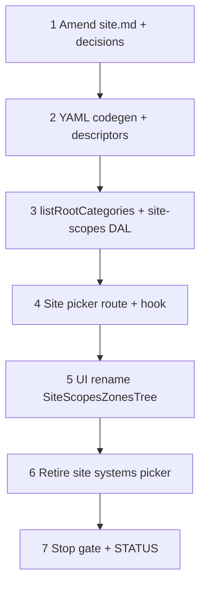

# 37c — Site scopes & zones: DAL + UI + root category picker

> **Status:** Complete (2026-07-01). **Prerequisite:** [37b-category-scope-migration-apply.md](./37b-category-scope-migration-apply.md) ✅ (migration **033** applied on dev).
>
> **Next:** [37d-category-catalog-dal-surfaces.md](./37d-category-catalog-dal-surfaces.md) — category admin surfaces (reuses root read helper).
>
> **Spec:** [`site.md`](../surface-specs/site.md) · **Planning:** [11-categories-scope-model.md](../planning/11-categories-scope-model.md) · **Decision:** [site scopes & zones](../decisions/site.md#decision-site-scopes--zones--category-root-instances-2026-06-30)

## Decisions (locked 2026-07-01)

| # | Topic | Choice |
|---|--------|--------|
| D1 | **API / Field vocabulary** | **Option A** — rename Fields and PATCH keys: `scopes` + `general_zones`; nested `zones[]`; `root_category_id` / `root_category_name` (drop `systems`, `default_areas`, `areas`, `system_id`) |
| D2 | **Root picker auth** | **Field-grant entailed read** — picker runs under **`site_detail`** context. User with `scopes` **read** (add) or **write** may load root categories for the dropdown; **no** separate `category_list` grant required. Catalog admin (`/categories`) remains **`category_list`** / **`category_detail`** (37d). |
| D3 | **Execution order** | **37c first** — ship thin `listRootCategories` read helper + site picker; 37d reuses helper + adds catalog surfaces |
| D4 | **Add scope default name** | Prefill instance **`name`** from selected root category **`name`** (e.g. pick "Fire Alarm" → `name: "Fire Alarm"`); user may rename (e.g. Panel A / Panel B) |
| D5 | **Empty roots catalog** | Zero `category` rows with `parent_id IS NULL` → **disable Add scope**; optional hint/CTA to catalog admin when 37d nav exists |
| D6 | **File rename** | Rename geography artifacts → scopes/zones: `site-scopes.ts`, `site-scopes-write.ts`, `site-scopes-tree.ts`, `SiteScopesZonesTree.tsx`, tests |
| D7 | **Site scope duplicate names** | **Not enforced v1** — multiple `site_scope` rows may share the same `name` (including same `root_category_id`). No sibling-name uniqueness on site tree for scopes/zones in this task. |
| D8 | **Category duplicate names** | **`category` UNIQUE (`name`, `parent_id`)** — catalog concern; **37d** (not 37c). Site picker only reads roots. |
| D9 | **UI chrome** | Tab **Scopes & zones**; toolbar **Add scope ▾** + **Add zone**; reuse task 36 antd `Tree` behavior (DnD, delete, General synthetic root) |
| D10 | **Out of scope** | Estimate systems DAL (37e); job `site_zone_id` column renames (37h); `site_asset` editor; commercial types (37g) |

### Picker auth (D2) — implementation note

Latch grants are **Field-scoped on the active Surface**. The site scope dropdown is not a separate catalog Surface visit:

```text
site_detail manifest grants scopes.read / scopes.write
  → GET /api/sites/pickers/category-roots (site_detail ctx)
  → DAL listRootCategories (id, name, sort_order only)
  → no category_list manifest required
```

Full category CRUD, tree admin, and `spec_def` editors remain behind **`category_*`** surfaces (37d).

---

## Goal

Refactor site DAL/UI from dropped **`site_system` / `site_area`** to **`site_scope` / `site_zone`**; rename API Fields to **`scopes` / `general_zones`**; wire **root category picker**; restore site detail load/save on dev DB post-033.

**Exit:** Site detail Scopes & zones tab round-trips; `codegen:check`; `site-scopes-write` tests; site picker replaces `useCatalogSystemPicker` on site form; breakage from [37b § Step 3](./37b-category-scope-migration-apply.md#step-3--breakage-inventory) **site geography** rows cleared.

**Not in scope:** Estimate/job DAL; category admin UI (37d).

---

## Rename matrix

| Layer | Old | New |
|-------|-----|-----|
| Tables | `site_system`, `site_area` | `site_scope`, `site_zone` |
| Columns | `system_id`, `site_system_id`, `parent_area_id` | `root_category_id`, `site_scope_id`, `parent_zone_id` |
| Field ids | `systems`, `default_areas` | `scopes`, `general_zones` |
| Nested PATCH | `areas[]` | `zones[]` |
| Read DTO | `system_id`, `system_name` | `root_category_id`, `root_category_name` |
| Blocker FKs | `site_area_id` | `site_zone_id` |
| Picker | `/api/sites/pickers/systems`, `useCatalogSystemPicker` | `/api/sites/pickers/category-roots`, `useCategoryRootPicker` |
| Tab label | Geography | **Scopes & zones** |

---

## Execution order



---

## Step 1 — Spec + planning amend

| File | Action |
|------|--------|
| [`docs/surface-specs/site.md`](../surface-specs/site.md) | **Amend** — `scopes` / `general_zones` Fields; `site_scope` / `site_zone` tables; Scopes & zones tab wireframe; root category picker |
| [`docs/planning/10-site-geography-ui-decisions.md`](../planning/10-site-geography-ui-decisions.md) | **Amend** SG vocabulary (scope/zone); link 37c |
| [`docs/planning/01-site-as-built.md`](../planning/01-site-as-built.md) | **Amend** — `site_scope` / `site_zone` terms |
| [`docs/decisions/site.md`](../decisions/site.md) | **Add** D1–D7 decision block (API rename + picker auth) |

### Verify

- [x] `site.md` has no remaining `site_system` / `systems` Field as target shape
- [x] Tab label **Scopes & zones** in spec §G

---

## Step 2 — YAML + codegen + descriptors

| File | Action |
|------|--------|
| `modules/site/site_detail.surface.yaml` | **Update** tables → `site_scope`, `site_zone`; fields → `scopes`, `general_zones` |
| `npm run codegen` | Regenerate site glue/schema/store |
| `lib/sites/descriptors/site-detail.ts` | **Rename** types, Zod schemas, manifest projection (`SiteScopeRow`, `SiteZoneRow`, …) |

### Verify

- [x] `npm run codegen:check` passes

---

## Step 3 — DAL read/write

| File | Action |
|------|--------|
| `lib/catalog/repository/category-roots.ts` | **Create** — `listRootCategories(pool)` — `id`, `name`, `sort_order` where `parent_id IS NULL` |
| `lib/sites/repository/site-scopes.ts` | **Create** (rename from `site-geography.ts`) — load `scopes` + `general_zones`; join `category` for `root_category_name`; blocker query uses `site_zone_id` |
| `lib/sites/repository/site-scopes-write.ts` | **Create** (rename from `site-geography-write.ts`) — replace-array; validate `root_category_id` exists and is root; **no** duplicate scope name rule v1 |
| `lib/sites/stores/site-detail-store.ts` | **Update** patch keys + imports |
| `lib/sites/repository/site-contacts.ts` | **Update** import `loadSiteScopes` |

**Delete:** `site-geography.ts`, `site-geography-write.ts` after rename.

**Tests:** `lib/sites/repository/site-scopes-write.test.ts` — carry forward flatten/delete/blocker cases; drop `assertDistinctSystemNamesPerCatalogId` or leave test-only if helper removed.

### Verify

- [x] `npm test -- --run site-scopes-write`

---

## Step 4 — Site picker API + hook

| File | Action |
|------|--------|
| `app/api/sites/pickers/category-roots/route.ts` | **Create** — `site_detail` ctx; require `scopes` Field **read** (or write); `listRootCategories` |
| `lib/hooks/use-category-root-picker.ts` | **Create** — replaces `useCatalogSystemPicker` on site form |
| `lib/hooks/surface-query-keys.ts` | **Add** picker query key |
| `lib/surface-api.ts` | **Add** `fetchCategoryRootPicker` |

**Delete:** `app/api/sites/pickers/systems/route.ts` (site path).

### Verify

- [x] Picker returns roots without `category_list` manifest
- [x] Principal without `scopes` Field read → 403 on picker route

---

## Step 5 — UI

| File | Action |
|------|--------|
| `components/sites/site-scopes-tree.ts` | **Create** (rename from `site-geography-tree.ts`) — `scopes`, `general_zones`, `zones`, row kinds `scope` / `zone` / `general` |
| `components/sites/SiteScopesZonesTree.tsx` | **Create** (rename from `SiteGeographyTree.tsx`) — **Add scope ▾** + **Add zone**; `useCategoryRootPicker`; prefill name from category |
| `components/sites/SiteDetailForm.tsx` | Tab **Scopes & zones**; field ids; `stripScopesForPatch` |
| `app/(private)/sites/(master-detail)/[id]/page.tsx` | Types if needed |

**Delete:** `SiteGeographyTree.tsx`, `site-geography-tree.ts`.

### Verify

- [x] Add scope → prefill name from category; second instance same root allowed (same name OK v1)
- [x] Empty roots → Add scope disabled
- [x] General + zones + DnD + referenced-zone delete 409 still work

---

## Step 6 — Retire site `system` picker usage

| File | Action |
|------|--------|
| `lib/hooks/use-catalog-system-picker.ts` | **Remove** site imports only; delete file when estimate path gone (37e) or leave if estimate still references |
| `lib/estimates/repository/catalog-systems.ts` | **Leave** until 37e (estimate breakage expected) |

### Verify

- [x] No `useCatalogSystemPicker` import under `components/sites/`

---

## Step 7 — Task index + STATUS

| File | Action |
|------|--------|
| [`docs/tasks/01-task-index.md`](./01-task-index.md) | Link **37c** file |
| [`STATUS.md`](../../STATUS.md) | Point **Right now** at 37c implement; recently completed when done |

```bash
cd apps/subhub
npm run codegen:check
npm test -- --run site-scopes-write
npm run build
# Manual: open site detail → Scopes & zones → add scope, add zone, save, reload
```

### Verify

- [x] All step checklists `[x]`
- [x] STATUS updated on completion

---

## Manual smoke (stop gate)

1. Load existing site — scopes/zones from migrated `site_scope` / `site_zone` rows display.
2. **Add scope** — pick root category; name prefilled; save + reload.
3. **Add zone** under scope and under General.
4. Delete unreferenced zone; referenced zone → trash disabled + Save 409.
5. Sibling DnD reorder persists `sort_order`.
6. Site with no category roots — **Add scope** disabled.

---

## Dependencies

| Consumer | Provides |
|----------|----------|
| **37d** | Reuses `listRootCategories`; adds `GET /api/categories/roots` on `category_list` for catalog admin |
| **37e** | Reads live `site_scope` / `site_zone` tree for estimate Scope tab |

---

## Risk notes

| Risk | Mitigation |
|------|------------|
| Breaking PATCH keys | Big-bang accepted (033); no API compat layer |
| Estimate still broken | Expected until 37e; document in STATUS |
| Dual roots routes | Site picker (`site_detail`) vs catalog roots (`category_list`) — different auth, same SQL helper |

---

## Related

- [37a-category-scope-decision-dbml-migration.md](./37a-category-scope-decision-dbml-migration.md)
- [37b-category-scope-migration-apply.md](./37b-category-scope-migration-apply.md)
- [37d-category-catalog-dal-surfaces.md](./37d-category-catalog-dal-surfaces.md)
- [36-site-geography-tree-ui.md](./36-site-geography-tree-ui.md) — UI pattern source (superseded at vocabulary by 37c)
