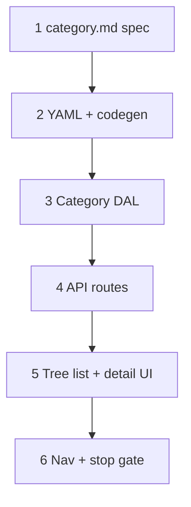

# 37d — Category catalog: DAL + `category_list` / `category_detail`

> **Status:** Complete (2026-07-01). Next: [37e-estimate-scope-tab.md](./37e-estimate-scope-tab.md).
>
> **Prerequisite:** [37b-category-scope-migration-apply.md](./37b-category-scope-migration-apply.md) ✅ (migration **033** applied on dev).
>
> **Superseded (participation semantics):** flat `spec_participation` checkboxes → [37d2](./37d2-category-spec-inheritance.md) inherit + include − exclude (2026-07-02).

## Decisions (lock before implement)

| # | Topic | Choice |
|---|--------|--------|
| D1 | **Surfaces** | **`category_list`** + **`category_detail`** — tree in list pane ([`category.md`](../surface-specs/category.md) §G) |
| D2 | **List API** | **`GET /api/categories/tree`** — nested forest; not flat paginated list |
| D3 | **Root picker API** | **`GET /api/categories/roots`** — flat roots for catalog admin; **site form** uses **`GET /api/sites/pickers/category-roots`** (`site_detail` Field grant — [37c](./37c-site-scopes-zones.md) D2). Shared **`listRootCategories`** helper. |
| D4 | **Detail — all nodes** | **`profile`:** `name`, `sort_order`; `parent_id` read-only |
| D5 | **Detail — root only** | **`spec_definitions`** — replace-array `spec_def` + nested `spec_option` |
| D6 | **Detail — nested only** | **`spec_participation`** — replace-array `category_spec_def` (`spec_def_id` from ancestor root) |
| D7 | **Create** | Toolbar **New root** / **New child** (child requires tree selection) |
| D8 | **Delete** | Hard delete when unreferenced; `ConflictError` blockers per spec §F |
| D9 | **M:N stubs** | DAL helpers for `item_category` / `part_category` **read** only — assignment UI deferred to `item_detail` |
| D10 | **DnD / reparent** | **Deferred** — manual `sort_order` only v1 |
| D11 | **Retire** | Remove `useCatalogSystemPicker` / `catalog-systems` after site 37c switches to roots |

---

## Goal

Ship **category tree admin**: list-detail with **Tree list pane**, detail for **name** + **spec definitions** (roots) or **spec participation** (nested). Provide **root picker read API** for task **37c**.

**Exit:** `/categories` master-detail works; `codegen:check`; category + spec DAL tests; `GET /api/categories/roots` returns scope roots.

**Not in scope:** Item/part category assignment UI; commercial type surfaces (37g); estimate Scope tab (37e).

---

## Locked rules

| Rule | UI | Server |
|------|-----|--------|
| Scope root | `parent_id IS NULL`; badge in tree | Enforced on create |
| Root specs | Spec definitions editor on detail | PATCH `spec_definitions` replace-array |
| Nested participation | Checkbox list of root’s defs | PATCH `spec_participation` replace-array |
| Root PATCH participation | Hidden | 400 if sent |
| Nested PATCH spec_definitions | Hidden | 400 if sent |
| Delete with children | — | 409 block |
| Delete root in use | — | 409 + sample `site_scope` labels |

---

## Execution order



**Parallel after step 3:** 37c site DAL may consume `listRoots` while UI proceeds.

---

## Step 1 — Surface spec

| File | Action |
|------|--------|
| [`docs/surface-specs/category.md`](../surface-specs/category.md) | **Create** — full A–J spec |
| [`docs/surface-specs/00-scan.md`](../surface-specs/00-scan.md) | **Update** — `category_list` / `category_detail`; link spec |
| [`docs/decisions/catalog.md`](../decisions/catalog.md) | **Optional** — link to category surfaces |

### Verify

- [x] Tree list-detail wireframe in spec §G
- [x] Root vs nested Field split documented

---

## Step 2 — YAML + codegen

| File | Action |
|------|--------|
| `modules/catalog/category_list.surface.yaml` | **Create** — `tree` read Field |
| `modules/catalog/category_detail.surface.yaml` | **Create** — `profile`, `spec_definitions`, `spec_participation` |
| `modules/catalog/category_*.policies.yaml` | **Create** — v1 single write grant |
| `npm run codegen` | Regenerate glue/schema/store |

**Field ids (target):**

```yaml
# category_list
tree: read

# category_detail
profile: read, write
spec_definitions: read, write  # manifest hides on nested via server/UI
spec_participation: read, write  # manifest hides on root via server/UI
```

### Verify

- [x] `npm run codegen:check` passes

---

## Step 3 — Category DAL

| File | Action |
|------|--------|
| `lib/catalog/repository/category-tree.ts` | **Create** — `listCategoryTree`, `listRootCategories`, nest helper |
| `lib/catalog/repository/category-detail.ts` | **Create** — `getCategory`, profile read |
| `lib/catalog/repository/category-write.ts` | **Create** — create/update/delete category |
| `lib/catalog/repository/spec-def-write.ts` | **Create** — replace-array `spec_def` + `spec_option` per root |
| `lib/catalog/repository/category-spec-participation-write.ts` | **Create** — replace-array `category_spec_def` |
| `lib/catalog/descriptors/category-*.ts` | **Create** — Zod DTOs narrowed from manifest |
| `lib/catalog/dal.ts` | **Wire** category stores |

**Tests:**

| File | Cases |
|------|--------|
| `category-write.test.ts` | create root/child; delete blockers |
| `spec-def-write.test.ts` | replace-array options; reject nested root PATCH |
| `category-spec-participation-write.test.ts` | reject spec_def from wrong root |

### Verify

- [x] `npm test -- --run category-write spec-def-write category-spec-participation-write`

---

## Step 4 — API routes

| Route | Handler |
|-------|---------|
| `GET /api/categories/tree` | `listCategoryTree` |
| `GET /api/categories/roots` | `listRootCategories` |
| `GET/PATCH/DELETE /api/categories/[id]` | detail |
| `POST /api/categories` | create (list `create` action) |

Orchestrate through existing surface API pattern ([`lib/surface-api.ts`](../../lib/surface-api.ts) or route modules mirroring parts).

### Verify

- [x] Manual GET tree returns nested JSON matching spec §B

---

## Step 5 — UI

| File | Action |
|------|--------|
| `app/(private)/categories/layout.tsx` | **Create** — master-detail shell |
| `app/(private)/categories/[id]/page.tsx` | **Create** — detail route |
| `components/catalog/CategoryTreeList.tsx` | **Create** — antd `Tree` in list pane; selection → route |
| `components/catalog/CategoryDetailForm.tsx` | **Create** — profile + conditional spec sections |
| `components/catalog/CategorySpecDefinitionsField.tsx` | **Create** — root spec_def editor |
| `components/catalog/CategorySpecParticipationField.tsx` | **Create** — nested checklist |
| Nav manifest | **Add** Catalog → Categories |

**List pane behavior:**

- Load tree from `GET /api/categories/tree`.
- Click node → `router.push(/categories/[id])`.
- **New root** / **New child** call POST then navigate.

**Detail behavior:**

- If `is_root`: show `spec_definitions`; hide `spec_participation`.
- Else: show `spec_participation`; hide `spec_definitions`.

**Reuse:** Tree styling/selection patterns from [`SiteGeographyTree`](../../components/sites/SiteGeographyTree.tsx) — **do not** share RHF geography PATCH helpers.

### Verify

- [x] Create root → add child → set participation on child → add spec_def on root round-trip
- [x] Delete blocked when child exists

---

## Step 6 — Stop gate + STATUS

| File | Action |
|------|--------|
| [`STATUS.md`](../../STATUS.md) | Recently completed 37d; **Right now** → 37c or 37e |
| [`docs/tasks/01-task-index.md`](./01-task-index.md) | Mark 37d row |
| [`docs/planning/11-categories-scope-model.md`](../planning/11-categories-scope-model.md) | Link task file |

```bash
cd apps/subhub
npm run codegen:check
npm test -- --run category-write spec-def-write category-spec-participation-write
npm run build
```

### Verify

- [x] All step checklists `[x]`
- [x] STATUS updated

---

## Dependencies

| Consumer | Needs from 37d |
|----------|----------------|
| **37c** site scope picker | `GET /api/categories/roots` (min); full tree optional |
| **37e** estimate TreeSelect | subtree read by root id (extend DAL or filter client-side) |
| **37f** part filter | `category_spec_def` + `spec_def` populated |

---

## Risk notes

| Risk | Mitigation |
|------|------------|
| Full tree load slow | v1 acceptable; add `root_id` query param later |
| Dual spec UI complexity | Strict server guards root vs nested Fields |
| Old system picker still referenced | 37c removes `useCatalogSystemPicker` usage on site form |

---

## Related

- [37a-category-scope-decision-dbml-migration.md](./37a-category-scope-decision-dbml-migration.md)
- [37b-category-scope-migration-apply.md](./37b-category-scope-migration-apply.md)
- [37c-site-scopes-zones.md](./37c-site-scopes-zones.md) — consumes root picker
