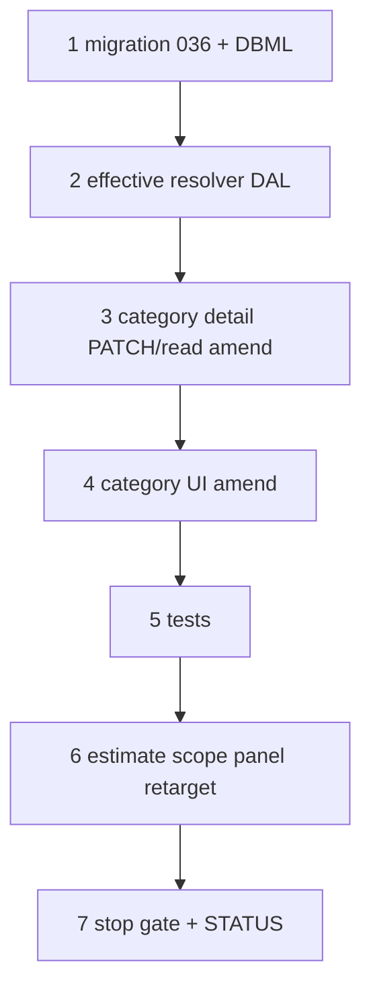

# 37d2 — Category spec participation: inherit, include, exclude

> **Status:** Complete (2026-07-02). **Superseded (algorithm + UI):** [37d3](./37d3-category-spec-participation-simplify.md) — assign-once participation. **Next:** [37d3](./37d3-category-spec-participation-simplify.md) then [37f](./37f-estimate-line-costing.md).
>
> **Prerequisites:** [37d](./37d-category-catalog-dal-surfaces.md) ✅ (flat `spec_participation` shipped); [37e](./37e-estimate-scope-tab.md) ✅ (scope spec panel — retarget in Step 6).
>
> **Decisions:** [inherit / include / exclude](../decisions/catalog.md#decision-category-spec-participation--inherit-include-exclude-2026-07-02) · [spec_def value types + matching](../decisions/catalog.md#decision-spec_def-value-types-and-part-matching-rules-2026-07-02) · **Planning:** [11-categories-scope-model.md](../planning/11-categories-scope-model.md) (C9, C20) · **Spec:** [`category.md`](../surface-specs/category.md) *(amend in Step 1)*

## Decisions (locked 2026-07-02 — do not re-litigate in implementation)

| # | Topic | Choice |
|---|--------|--------|
| D1 | **Includes** | `category_spec_def` — additive local participation |
| D2 | **Excludes** | New **`category_spec_exclude`** — opt out of inherited `spec_def_id` |
| D3 | **Algorithm** | `effective(child) = (effective(parent) ∪ includes) \ excludes`; empty child rows = inherit parent |
| D4 | **Root base** | Root may PATCH `includes` → `category_spec_def` on root; `excludes` on root rejected v1 |
| D5 | **Multi-link items** | `effective(item) = ⋃ effective(category)` across `item_category` links |
| D6 | **Scope panel** | `scopePanelDefs(R) = ⋃ effective(C)` for all nodes in subtree rooted at **R** — amends 37e DAL |
| D7 | **Migration** | Existing nested `category_spec_def` rows → **includes only**; excludes start empty |
| D8 | **UI** | Nested: read-only **Inherited** + editable **Include** / **Exclude** lists; root: base includes only |

### Decision block (already in docs)

See [catalog.md § category spec participation](../decisions/catalog.md#decision-category-spec-participation--inherit-include-exclude-2026-07-02).

---

## Goal

Replace 37d **flat participation checkboxes** with **inherit + include − exclude**; ship `category_spec_exclude` DDL; expose **effective participation** from catalog DAL; retarget estimate **scope spec panel** to subtree union (37e amend).

**Exit:** Fire Alarm worked example round-trips in category admin; estimate Scope tab shows union `{ slc_protocol, color, series }` when defs distributed across subtree; `codegen:check`; DAL tests for effective resolver + exclude constraints.

**Not in scope:** `spec_def` `number` type DDL ([37f](./37f-estimate-line-costing.md)); `manufacturer_part_spec` UI; line-level part filter engine (37f); child-create participation seeding ([planning 12](../planning/12-master-detail-chrome.md) deferred).

---

## Supersedes (37d behavior)

| 37d (shipped) | 37d2 |
|---------------|------|
| Nested checkbox = full participation set | Checkbox = **include** delta only |
| No inheritance | Parent effective set inherited implicitly |
| Root cannot PATCH `spec_participation` | Root PATCH **includes** for base set |
| — | **`category_spec_exclude`** for opt-out |

---

## Execution order



---

## Step 1 — Migration + docs

| File | Action |
|------|--------|
| `migrations/036_category_spec_exclude.sql` | **Create** — `category_spec_exclude`; grants; `latch_app` access |
| [`docs/schema/current.dbml`](../schema/current.dbml) | **Verify** — `category_spec_exclude` + refs (decision already drafted) |
| [`docs/surface-specs/category.md`](../surface-specs/category.md) | **Verify** — `spec_participation` inherited/includes/excludes DTO (decision already drafted) |
| [`docs/migrations/036-category-spec-exclude-plan.md`](../migrations/036-category-spec-exclude-plan.md) | **Create** — rollback notes, data migration note for existing `category_spec_def` |

### Verify

- [x] Migration applies on dev
- [x] `category_spec_exclude` FK to `category` + `spec_def`

---

## Step 2 — Effective participation resolver (DAL)

| File | Action |
|------|--------|
| `lib/catalog/repository/category-effective-specs.ts` | **Create** — `effectiveParticipation(pool, categoryId)`, `scopePanelDefs(pool, rootCategoryId)`, `unionEffectiveForCategories(pool, categoryIds[])` |
| `lib/catalog/repository/category-effective-specs.test.ts` | **Create** — Fire Alarm example; Notification opt-out; multi-link union |

**Rules (from decision):**

```text
effective(root R):
  rows on category_spec_def for R → base set (may be ∅)

effective(child C):
  (effective(parent) ∪ includes_C) \ excludes_C
```

### Verify

- [x] Initiating devices with no rows → same effective as parent
- [x] Notification: includes `{color, series}`, excludes `{slc_protocol}` → `{color, series}` only
- [x] Same `spec_def_id` in include + exclude on one node → `ValidationError`

---

## Step 3 — Category detail DAL + API amend

| File | Action |
|------|--------|
| `lib/catalog/repository/category-detail.ts` | **Amend** — read `inherited` / `includes` / `excludes`; compute effective for GET |
| `lib/catalog/repository/category-spec-participation-write.ts` | **Amend** — replace includes; add `category-spec-exclude-write.ts` for excludes |
| `lib/catalog/repository/category-write.ts` | **Amend** — allow root `spec_participation` PATCH (includes only); reject excludes on root |
| `lib/catalog/descriptors/category-detail.ts` | **Amend** — PATCH schema: `includes[]`, `excludes[]`; strict |
| `modules/catalog/category_detail.surface.yaml` | **Amend** — `spec_participation` on root + nested |

### Verify

- [x] GET nested category returns inherited + includes + excludes
- [x] PATCH round-trip Fire Alarm subtree example
- [x] Root PATCH excludes → 400

---

## Step 4 — Category UI amend

| File | Action |
|------|--------|
| `components/catalog/CategorySpecParticipationField.tsx` | **Amend** — three sections: Inherited (read-only), Include, Exclude |
| `components/catalog/CategoryDetailForm.tsx` | **Amend** — show `spec_participation` on **root** (base includes) and nested |

### Verify

- [x] Root: spec definitions + base includes
- [x] Nested: inherited list updates when parent participation changes (reload)
- [x] Exclude SLC on Notification appliances → effective preview matches decision table

---

## Step 5 — Tests

```bash
cd apps/subhub
npm test -- --run category-effective-specs category-spec-participation-write category-spec-exclude-write category-write
npm run codegen:check
```

### Verify

- [x] All new/amended repository tests pass
- [x] `codegen:check` clean

---

## Step 6 — Estimate scope spec panel retarget (37e amend)

| File | Action |
|------|--------|
| `lib/estimates/repository/estimate-scopes.ts` | **Amend** — `mergeScopeSpecs` / zone specs: join `scopePanelDefs(root_category_id)` not all `spec_def` for root |
| `lib/estimates/repository/estimate-site-tree.ts` | **Amend** — `spec_templates` keys use subtree union per root |
| `lib/estimates/repository/estimate-scopes-write.test.ts` | **Amend** — panel defs when only subset of root defs participate in subtree |

**Before:** scope panel lists every `spec_def` where `root_category_id = R`.

**After:** scope panel lists `scopePanelDefs(R)` only — union of effective participation across category subtree.

### Verify

- [x] Root defs not used in any subtree effective set → **hidden** on scope panel
- [x] Fire Alarm example: panel shows `{ slc_protocol, color, series }`
- [x] Saved `estimate_scope_spec` rows for defs no longer in panel → DAL rejects on PATCH or ignores orphan (pick one; document in category.md / estimate.md)

---

## Step 7 — Stop gate + STATUS

| File | Action |
|------|--------|
| [`STATUS.md`](../../STATUS.md) | Recently completed 37d2; **Right now** → 37f |
| [`docs/tasks/01-task-index.md`](./01-task-index.md) | Mark 37d2 row |
| [37d](./37d-category-catalog-dal-surfaces.md) | Add footnote — participation semantics superseded by 37d2 |

```bash
cd apps/subhub
npm run codegen:check
npm test -- --run category-effective-specs estimate-scopes-write
npm run build
```

### Verify (stop gate)

- [x] All step checklists `[x]`
- [x] STATUS updated
- [x] Migration 036 on dev
- [ ] Category admin + estimate Scope tab smoke (Fire Alarm example)

---

## Manual smoke

1. **Fire Alarm** root — `spec_definitions`: SLC, Color, Series; **includes**: SLC only.
2. **Initiating devices** child — no rows → inherited shows SLC only.
3. **Notification appliances** — include Color + Series; exclude SLC → effective `{ Color, Series }`.
4. Estimate with site + **Fire Alarm** scope checked — Scope tab shows SLC, Color, Series (not extra unused root defs).
5. Zone under scope — same three defs; override one zone value; reload round-trip.

---

## Dependencies

| Consumer | Needs from 37d2 |
|----------|-----------------|
| **37f** | `effectiveParticipation` + `scopePanelDefs`; part filter uses per-item effective set |
| **37f** | `spec_def` number type + `manufacturer_part_spec` UI (separate migration) |

---

## Risk notes

| Risk | Mitigation |
|------|------------|
| Existing 37d data interpreted as full set | Document one-time admin pass; optional seed script to strip redundant includes now inherited |
| Orphan `estimate_scope_spec` after panel shrinks | PATCH validation: reject unknown `spec_def_id` not in `scopePanelDefs` |
| Performance — subtree union on every GET | Cache per root in request; category count modest v1 |

---

## Related

- [37d-category-catalog-dal-surfaces.md](./37d-category-catalog-dal-surfaces.md)
- [37e-estimate-scope-tab.md](./37e-estimate-scope-tab.md)
- [11-categories-scope-model.md](../planning/11-categories-scope-model.md)
