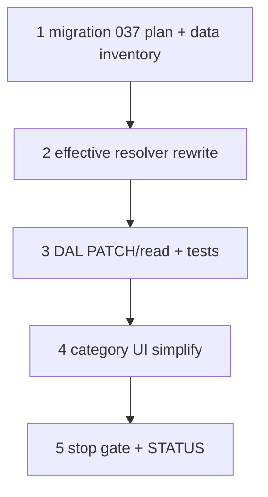

# 37d3 — Category spec participation: assign-once + simplified UI

> **Status:** Complete (2026-07-03). **Visibility superseded:** [37d4](./37d4-category-spec-visibility.md). **Storage superseded:** [37d5](./37d5-category-spec-owner-column.md) — `category_spec_def` (assign-once table) dropped in favor of the `spec_def.category_id` owner column; participation write reduced to exclude-only. Next: [37f](./37f-estimate-line-costing.md).
>
> **Prerequisites:** [37d2](./37d2-category-spec-inheritance.md) ✅ (tables + scope panel union — **algorithm/UI superseded here**).
>
> **Decision:** [assign-once, branch exclude](../decisions/catalog.md#decision-category-spec-participation--assign-once-branch-exclude-2026-07-03) · **Migration:** [037 plan](../migrations/037-category-spec-assign-once-plan.md) · **Spec:** [`category.md`](../surface-specs/category.md)

## Decisions (locked 2026-07-03 — do not re-litigate in implementation)

| # | Topic | Choice |
|---|--------|--------|
| D1 | **Assignment** | **`category_spec_def`** — at most **one row per `spec_def_id`** (`UNIQUE`) |
| D2 | **Exclude** | **`category_spec_exclude`** — branch cut; **no re-include** below exclude |
| D3 | **Algorithm** | `effective(N,D)` iff `assign(D)` is ancestor of `N` and no exclude on path `assign(D)→N` |
| D4 | **Root** | Policy A — participates only when assigned on root row |
| D5 | **UI root** | **`spec_definitions`** only (no Base includes section) |
| D6 | **UI nested** | Read-only def table + **Participates** checkbox per def |
| D7 | **DDL** | Migration **037** — unique index on `category_spec_def(spec_def_id)` after data cleanup |

### Supersedes (37d2)

| 37d2 (shipped) | 37d3 |
|----------------|------|
| Delta `includes[]` / `excludes[]` PATCH | Participates checkbox → assign or exclude rows |
| Multiple `category_spec_def` per def | **One** assignment per def |
| Re-include below exclude | **Forbidden** |
| Inherited / Include / Exclude / Effective UI | Single participates column |
| Root Base includes section | Removed — optional participates on root only via same column |

---

## Goal

Align DAL, API DTO, and category admin UI with **assign-once, branch exclude** participation. Ship migration **037** after data cleanup.

**Exit:** Fire Alarm worked example round-trips; `scopePanelDefs` unchanged intent; category UI matches decision table; tests for assign-once + branch exclude; `codegen:check`.

**Not in scope:** `spec_def` number type / units ([37f](./37f-estimate-line-costing.md)); per-category def display order.

---

## Execution order



---

## Step 1 — Migration + data cleanup

| File | Action |
|------|--------|
| `migrations/037_category_spec_assign_once.sql` | **Create** — unique index on `category_spec_def(spec_def_id)` |
| [`docs/migrations/037-category-spec-assign-once-plan.md`](../migrations/037-category-spec-assign-once-plan.md) | **Verify** — cleanup rules |
| [`docs/schema/current.dbml`](../schema/current.dbml) | **Amend** — `category_spec_def` note + unique on `spec_def_id` |

### Verify

- [x] Duplicate assignment inventory on dev documented
- [x] Cleanup script or manual pass before index apply
- [x] Migration applies on dev

**Dev inventory (2026-07-03):** pre-flight duplicate query returned **0** rows; migration `037` applied (`DELETE 0`).

---

## Step 2 — Effective participation resolver

| File | Action |
|------|--------|
| `lib/catalog/repository/category-effective-specs.ts` | **Amend** — assign-once + path exclude algorithm |
| `lib/catalog/repository/category-effective-specs.test.ts` | **Amend** — Fire Alarm; `a→b→c→d` chain; no re-include |

### Verify

- [x] `assign(D)` unique per def
- [x] Exclude on `c` removes def for `c` and `d`
- [x] `d` cannot restore def after exclude on `c`

---

## Step 3 — Category detail DAL + API

| File | Action |
|------|--------|
| `lib/catalog/repository/category-detail.ts` | **Amend** — read: `spec_definitions` + `participates: boolean` per def |
| `lib/catalog/repository/category-spec-participation-write.ts` | **Amend** — assign / unassign / exclude from participates flag |
| `lib/catalog/repository/category-spec-exclude-write.ts` | **Amend** — branch exclude only; reject re-include attempts |
| `lib/catalog/descriptors/category-detail.ts` | **Amend** — PATCH `spec_participation: { participates: [{ spec_def_id, active }] }` strict |
| `lib/catalog/stores/category-detail-store.ts` | **Amend** — wire new write semantics |

### Verify

- [x] Assign def at `b` → effective on `c`, `d` without rows
- [x] Second assign same def elsewhere → 400
- [x] Participates false when inherited → exclude row

---

## Step 4 — Category UI

| File | Action |
|------|--------|
| `components/catalog/CategorySpecParticipationField.tsx` | **Replace** — participates column on read-only def table (nested); remove 37d2 sections |
| `components/catalog/CategoryDetailForm.tsx` | **Amend** — root: definitions only; nested: defs + participates |
| `components/catalog/CategorySpecDefinitionsField.tsx` | **Amend** — read-only mode prop for nested |

### Verify

- [x] Root: no Base includes block
- [x] Nested: one checkbox per def; reload round-trip
- [x] Fire Alarm manual smoke (decision table)

---

## Step 5 — Stop gate + STATUS

```bash
cd apps/subhub
npm run codegen:check
npm test -- --run category-effective-specs category-spec-participation-write
npm run build
```

| File | Action |
|------|--------|
| [`STATUS.md`](../../STATUS.md) | 37d3 complete → **37f** |
| [`docs/tasks/01-task-index.md`](./01-task-index.md) | 37d3 row |
| [37d2](./37d2-category-spec-inheritance.md) | Footnote — superseded by 37d3 |

### Verify (stop gate)

- [x] All step checklists `[x]`
- [x] STATUS updated
- [x] Migration 037 on dev

---

## Manual smoke

Same as [decision Fire Alarm example](../decisions/catalog.md#decision-category-spec-participation--assign-once-branch-exclude-2026-07-03):

1. Root — defs SLC, Color, Series; assign SLC at root.
2. Initiating — participates SLC implicitly (no rows).
3. Notification — assign Color + Series; exclude SLC.
4. Estimate Scope tab — SLC, Color, Series on panel.
5. Line items under Notification vs Initiating — filter participation unchanged intent.

---

## Related

- [37d2-category-spec-inheritance.md](./37d2-category-spec-inheritance.md)
- [37f-estimate-line-costing.md](./37f-estimate-line-costing.md)
- [11-categories-scope-model.md](../planning/11-categories-scope-model.md)
