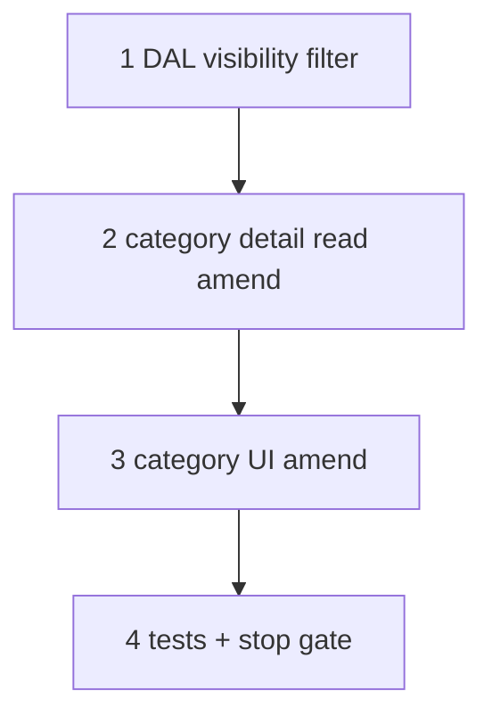

# 37d4 — Category spec visibility: owner-branch knowledge

> **Status:** Complete (2026-07-04). Next: [37f-estimate-line-costing.md](./37f-estimate-line-costing.md).
>
> **Storage superseded:** [37d5](./37d5-category-spec-owner-column.md) — the `category_spec_def` assignment table + `spec_def.root_category_id` are replaced by the `spec_def.category_id` owner column. The owner-branch visibility algorithm here is **unchanged**; only its data source moved.
>
> **Prerequisites:** [37d3](./37d3-category-spec-participation-simplify.md) ✅ (assign-once storage + `effective()` — **UI visibility superseded here**).
>
> **Decision:** [owner-branch knowledge](../decisions/catalog.md#decision-category-spec-visibility--owner-branch-knowledge-2026-07-03) · **Spec:** [`category.md`](../surface-specs/category.md)

## Goal

Align category admin **per-node visibility** with locked rules R1–R4: owner-branch knowledge, exclude node knows-but-does-not-use, descendants below exclude are blind, only owner edits defs.

**Exit:** Generic tree example (1 / 1-1 / 1-1-1 / 1-1-1-1 / 1-1-2) round-trips in DAL tests + category UI; Fire Alarm manual smoke passes decision table; `codegen:check`.

**Not in scope:** `effective()` / `scopePanelDefs` algorithm change (unchanged); `spec_def` number type ([37f](./37f-estimate-line-costing.md)).

## Decisions (locked — do not re-litigate)

See [catalog.md § owner-branch knowledge](../decisions/catalog.md#decision-category-spec-visibility--owner-branch-knowledge-2026-07-03).

**Confirm:** `1-1-2` knows and uses `D` (descendant of owner, no exclude on path).

## Execution order



## Step 1 — DAL visibility filter

| File | Action |
|------|--------|
| `lib/catalog/repository/category-detail.ts` | **Amend** — replace `filterSpecsForNestedCategory` with owner-branch rules; apply same filter on root (hide child-branch / unassigned-on-non-root defs) |
| `lib/catalog/repository/category-detail.test.ts` | **Amend** — generic tree table; Fire Alarm visibility cases |

### Verify

- [x] Owner sees + edits def
- [x] `1-1-2` sees inherited def (know + use)
- [x] `1-1-1` sees def, excluded (know, no use)
- [x] `1-1-1-1` does not see def
- [x] Ancestor `1` does not see def assigned at `1-1`

## Step 2 — Category detail read

| File | Action |
|------|--------|
| `lib/catalog/descriptors/category-detail.ts` | **Verify** — `state` hints match visibility rules |
| `docs/surface-specs/category.md` | **Amend** — per-node visibility table |

### Verify

- [x] GET nested returns only visible defs + participation rows
- [x] GET root hides defs assigned only on descendant branches

## Step 3 — Category UI

| File | Action |
|------|--------|
| `components/catalog/CategorySpecDefinitionsField.tsx` | **Amend** — edit only at owner; read-only inherited; hide below-exclude and off-branch |
| `components/catalog/CategoryDetailForm.tsx` | **Verify** — wire filtered DTO |

### Verify

- [x] Fire Alarm: SLC editable at root when owner; Spec B hidden when assigned at Initiating only
- [x] Initiating children: inherited SLC read-only + participates implicit
- [x] Exclude node: checkbox only

## Step 4 — Stop gate

```bash
cd apps/subhub
npm run codegen:check
npm test -- --run category-detail category-effective-specs
npm run build
```

| File | Action |
|------|--------|
| [`STATUS.md`](../../STATUS.md) | 37d4 complete when done |
| [`docs/tasks/01-task-index.md`](./01-task-index.md) | 37d4 row |

### Verify (stop gate)

- [x] All step checklists `[x]`
- [x] Decision table tests green
- [ ] Manual smoke: generic tree + Fire Alarm

## Related

- [37d3-category-spec-participation-simplify.md](./37d3-category-spec-participation-simplify.md)
- [37f-estimate-line-costing.md](./37f-estimate-line-costing.md)
