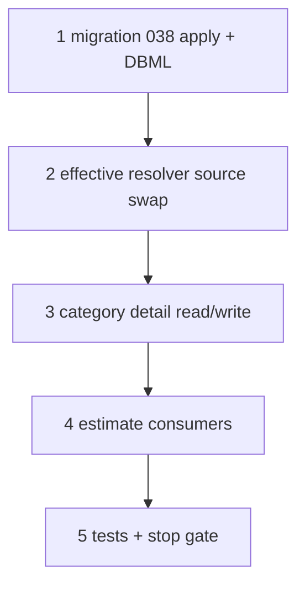

# 37d5 — Spec ownership column: `spec_def.category_id`, drop `category_spec_def`

> **Status:** Complete (2026-07-04). Next: [37f-estimate-line-costing.md](./37f-estimate-line-costing.md).
>
> **Prerequisites:** [37d4](./37d4-category-spec-visibility.md) ✅ (owner-branch visibility + `effective()`), migration [037](../migrations/037-category-spec-assign-once-plan.md) applied.
>
> **Decision:** [spec ownership — `spec_def.category_id`, drop `category_spec_def`](../decisions/catalog.md#decision-spec-ownership--spec_defcategory_id-drop-category_spec_def-2026-07-04) · **Migration:** [038 plan](../migrations/038-category-spec-owner-column-plan.md) · **Spec:** [`category.md`](../surface-specs/category.md)

## Goal

Collapse the 1:1 `category_spec_def` assignment table into **`spec_def.category_id`** (owner column). Derive the namespace scope root from the category tree. Keep `category_spec_exclude` and the `effective()` / owner-branch visibility algorithms behaviorally identical.

**Exit:** Fire Alarm + generic tree round-trip unchanged in DAL tests; migration `038` applied on dev; `category_spec_def` gone from schema, code, and DBML; `codegen:check`; `build` green.

**Not in scope:** algorithm changes (`effective` / visibility semantics unchanged); `spec_def` number type ([37f](./37f-estimate-line-costing.md)); scope-root columns on other tables (see caution below).

## Decisions (locked — do not re-litigate)

See [catalog.md § spec ownership](../decisions/catalog.md#decision-spec-ownership--spec_defcategory_id-drop-category_spec_def-2026-07-04).

- `spec_def.category_id` = single owner (root **or** nested).
- Assign-once is structural (one row = one owner).
- Namespace root = root ancestor of `category_id` (derived, not stored).
- `category_spec_exclude` unchanged.

## ⚠️ Do not touch — unrelated `root_category_id` columns

Only **`spec_def.root_category_id`** is removed. These are **scope-root** FKs on other tables and **must stay**:

- `site_scope.root_category_id`
- `estimate_scope.root_category_id`
- `job_scope_group.root_category_id`

## Execution order



## Step 1 — Migration + DBML

| File | Action |
|------|--------|
| `migrations/038_category_spec_owner_column.sql` | **Apply** on dev (already drafted) |
| [`docs/migrations/038-category-spec-owner-column-plan.md`](../migrations/038-category-spec-owner-column-plan.md) | **Verify** — inventory count of unassigned defs recorded |
| [`docs/schema/current.dbml`](../schema/current.dbml) | **Amend** — `spec_def.category_id` (drop `root_category_id`); **remove** `category_spec_def` table + refs; update `TableGroup catalog`; drop `Ref` lines for `category_spec_def`; repoint `spec_def` FK note |

### Verify

- [x] Migration applies on dev
- [x] Every `spec_def` has non-null `category_id`
- [x] Unassigned-def inventory count documented (SLC-class fixed) — 1 of 2 (`SLC Protocol`), see [038 plan](../migrations/038-category-spec-owner-column-plan.md)
- [x] `category_spec_def` absent from DBML

## Step 2 — Effective resolver source swap

| File | Action |
|------|--------|
| `lib/catalog/repository/category-effective-specs.ts` | **Amend** — `loadParticipationMaps` builds `assignByDef` from `spec_def.category_id` (not `category_spec_def`); algorithm untouched |

### Verify

- [x] `category-effective-specs.test.ts` passes unchanged (algorithm identical)
- [x] `assignByDef` sourced from `spec_def`

## Step 3 — Category detail read + write

| File | Action |
|------|--------|
| `lib/catalog/repository/category-detail.ts` | **Amend** — `loadRootSpecDefinitions` selects defs whose `category_id` is in subtree of root R; `loadParticipationContext.assignByDef` from `spec_def.category_id` |
| `lib/catalog/repository/spec-def-write.ts` | **Amend** — set `spec_def.category_id` on insert; owner = creating category; drop `assignSpecDefAtCategoryTx` + `category_spec_def` writes; keep owner-only edit guard via `category_id` |
| `lib/catalog/repository/category-spec-participation-write.ts` | **Amend** — participation write reduces to **exclude-only** (assign lives on `spec_def`); remove `category_spec_def` INSERT/DELETE branches; keep exclude + no-re-include guard |
| `lib/catalog/repository/category-write.ts` | **Verify** — delete blockers join owner-in-subtree instead of `sd.root_category_id` |
| `lib/catalog/descriptors/category-detail.ts` | **Verify** — DTO/patch shape unchanged (participation still `{ spec_def_id, active }`) |

### Verify

- [x] Owner def edit/delete works; non-owner rejected (`owner_only`)
- [x] New def at a nested owner sets `spec_def.category_id = that node`
- [x] Exclude checkbox writes/removes `category_spec_exclude` only
- [x] Nested GET visibility identical to 37d4 behavior

## Step 4 — Estimate consumers

| File | Action |
|------|--------|
| `lib/estimates/repository/estimate-scopes.ts` | **Verify** — `scopePanelDefs(root)` still returns subtree union (logic unchanged; new source) |
| `lib/estimates/repository/estimate-site-tree.ts` | **Verify** — spec_templates keys unchanged |
| `lib/estimates/repository/estimate-scopes-write.ts` | **Verify** — panel-def validation still keys on `scopePanelDefs` |

> `estimate_scope.root_category_id` (scope-root FK) is **not** the removed column — leave intact.

### Verify

- [x] Estimate Scope tab panel defs unchanged for Fire Alarm example — `scopePanelDefs` logic untouched; source column swapped
- [x] `estimate-scopes-write.test.ts` passes

## Step 5 — Tests + stop gate

```bash
cd apps/subhub
npm run codegen:check
npm test -- --run category-detail category-effective-specs category-spec-participation-write spec-def-write estimate-scopes-write
npm run build
```

| File | Action |
|------|--------|
| [`STATUS.md`](../../STATUS.md) | 37d5 complete → 37f |
| [`docs/tasks/01-task-index.md`](./01-task-index.md) | 37d5 row |
| [37d3](./37d3-category-spec-participation-simplify.md) / [37d4](./37d4-category-spec-visibility.md) | Footnote — storage superseded by 37d5 |

### Verify (stop gate)

- [x] All step checklists `[x]`
- [x] Migration `038` on dev
- [x] `category_spec_def` removed from code + DBML; grep clean (only remaining hit is a test asserting no assignment row is written)
- [x] All listed tests green (`vitest run` — 255 passed; targeted suites green); `codegen:check` + `build` green
- [ ] Manual smoke: Fire Alarm (SLC on all descendants; Spec B on Initiating branch) — DB data verified via SQL (SLC owned by Fire Alarm root inherits to subtree; Spec B owned by Initiating Devices); UI walkthrough pending human

## Manual smoke

1. Fire Alarm root — SLC editable; shows on Initiating, test 4, test 5, Test 1, Test 3 (read-only).
2. Initiating — Spec B editable; shows on test 4, test 5.
3. Exclude SLC on some descendant → that node + below stop rendering SLC; no re-include below.
4. Estimate with Fire Alarm scope — panel shows SLC + Spec B union.

## Related

- [37d4-category-spec-visibility.md](./37d4-category-spec-visibility.md)
- [038 migration plan](../migrations/038-category-spec-owner-column-plan.md)
- [37f-estimate-line-costing.md](./37f-estimate-line-costing.md)
