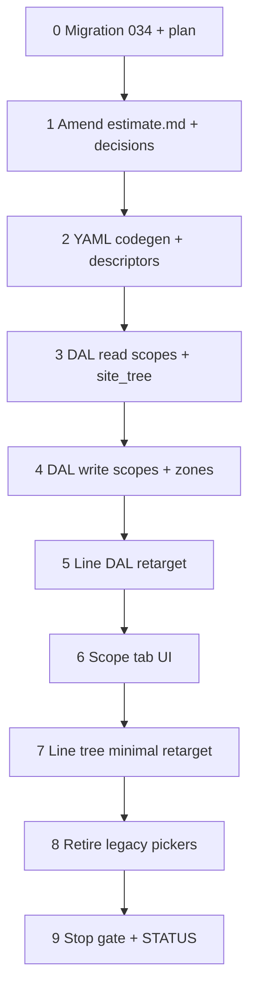

# 37e — Estimate scope tab: DAL + Scope tab + minimal line retarget

> **Status:** Complete (2026-07-02). **Next:** [37d2](./37d2-category-spec-inheritance.md) — spec participation inherit/exclude (prerequisite for [37f](./37f-estimate-line-costing.md)).
>
> **Prerequisites:** [37b](./37b-category-scope-migration-apply.md) ✅ (migration **033**); [37c](./37c-site-scopes-zones.md) ✅ (site scopes/zones DAL); [37d](./37d-category-catalog-dal-surfaces.md) ✅ (`spec_def` / category tree).
>
> **Spec:** [`estimate.md`](../surface-specs/estimate.md) *(amend in Step 1)* · **Planning:** [11-categories-scope-model.md](../planning/11-categories-scope-model.md) · **Decision:** [estimate scope](../decisions/estimate.md#decision-estimate-scope--category-roots-checkbox-site-tree-item-first-lines-2026-06-30)

## Decisions (locked 2026-07-02)

| # | Topic | Choice |
|---|--------|--------|
| D1 | **Zone membership** | New **`estimate_zone`** junction — PK `(estimate_scope_id, site_zone_id)`; row existence = checked; **no `use` boolean**; uncheck = delete row. Migration **`034`**. |
| D2 | **Scope membership** | **`estimate_scope`** row existence = checked scope (table exists from 033); uncheck = delete row. |
| D3 | **Site General zones** | **Synthetic General `estimate_scope`** per estimate — `site_scope_id IS NULL` and `root_category_id IS NULL`. General zone checkboxes → `estimate_zone` rows on that scope. **`034`** makes `root_category_id` nullable with CHECK: scoped rows require `root_category_id`; General row may have both null. At most one General scope row per estimate. |
| D4 | **Uncheck with lines** | **Block** — UI disables checkbox (or reverts) when any `line_items` reference `estimate_scope_id` or `site_zone_id`; DAL rejects PATCH omitting referenced scope/zone → `ValidationError`. |
| D5 | **Line tree cut (37e vs 37f)** | **Minimal retarget in 37e** — rename `estimate_system_id` → `estimate_scope_id`; tree parents **General** + **scope** from checked scopes; drop **Add system** toolbar. **Defer to 37f:** zone parent rows, item TreeSelect, `unit_material` / `unit_labor` / `unit_incidental`, `estimate_line_spec` UI. |
| D6 | **Field vocabulary** | Rename `systems` → **`scopes`**; drop catalog `system_id` picker. PATCH keys follow rename matrix below. |
| D7 | **Spec storage** | Locked 37a tables — **`estimate_scope_spec`**, **`estimate_zone_spec`**, **`estimate_line_spec`**. **37e** implements read merge + PATCH replace for **scope** and **zone** tiers on Scope tab only. Line-level specs → **37f**. |
| D8 | **Spec read merge** | Merge all `spec_def` for scope’s `root_category_id` with saved values (null when unsaved) — same pattern as wave 4e `systems[].specs[]`. General scope: no root namespace → hide scope-level spec panel. |
| D9 | **Spec PATCH shape** | Nested: `scopes[].specs[]` (scope-level) + `scopes[].zones[].specs[]` (zone overrides). Zone membership via `scopes[].zones[].site_zone_id` (checked zones). |
| D10 | **Tabs + gating** | `General` \| **`Scope`** \| `Line Items`. **Scope** and **Line Items** gated on non-empty `profile.site_id` (extend task 33). |
| D11 | **Site change on create** | Extend task 33 D12 — changing/clearing `site_id` on create clears **`scopes`** + `line_items` (replaces `systems`). |
| D12 | **Site tree on GET** | Read-only enrichment: **`site_tree`** (or inline under `scopes`) — live `site_scope` / `site_zone` for estimate’s `site_id`; **no site writes** on estimate Save. Auth: entailed read under **`estimate_detail`** (mirror [37c D2](./37c-site-scopes-zones.md)). |
| D13 | **Checkbox cascade** | Check zone → auto-check parent scope (create `estimate_scope` + `estimate_zone` if needed). Check scope → **do not** auto-check child zones (locked D14 / planning C5). |
| D14 | **Commercial types** | `labor_context_type_id`, `markup_type_id` on `estimate_scope` — **DAL columns only** in 37e; picker UI → **37g**. |
| D15 | **ROM bucket** | Synthetic **General** line parent always available; lines with `estimate_scope_id = null` (planning C6). Distinct from site General **zones** (D3). |
| D16 | **Retire** | Delete `estimate-systems*.ts`, `catalog-systems*.ts`, `catalog-system-specs.ts`, `use-catalog-system-picker.ts`, `/api/estimates/pickers/systems`, `/api/sites/pickers/systems` (if still present). |

### Decision block (paste into docs)

```markdown
### Decision: estimate scope tab — junction zones, General scope row, block uncheck (2026-07-02)

**Choice:**

- **`estimate_zone`** junction (PK `estimate_scope_id`, `site_zone_id`) — zone checkbox persistence; no `use` boolean.
- **Synthetic General `estimate_scope`** — `site_scope_id` and `root_category_id` both null; migration **034**.
- **Uncheck** scope/zone blocked when `line_items` reference bucket/zone.
- **37e** Scope tab + minimal line retarget; **37f** zone line parents + item picker + costing.

**Task:** [37e](../tasks/37e-estimate-scope-tab.md) · **Planning:** [11](../planning/11-categories-scope-model.md).
```

---

## Goal

Restore estimate CRUD post-033: replace **`estimate_system`** / catalog **`system`** stack with **`estimate_scope`** + live site checkbox tree; ship **Scope** tab; minimally retarget **Line Items** tree.

**Exit:** Estimate detail load/save works on dev DB; Scope tab round-trips checked scopes/zones + scope/zone specs; ROM + scoped quotes smoke; `codegen:check`; estimate scope DAL tests; migration **034** applied on dev.

**Not in scope:** Item TreeSelect / part resolution / costing engine (**37f**); commercial type catalog surfaces (**37g**); job `site_zone_id` app renames (**37h**); `estimate_line_spec` UI (**37f**); win → job (**4b**).

---

## Rename matrix

| Layer | Old | New |
|-------|-----|-----|
| Tables (YAML) | `estimate_system`, `estimate_system_spec` | `estimate_scope`, `estimate_scope_spec`, `estimate_zone`, `estimate_zone_spec` |
| Field id | `systems` | **`scopes`** |
| Scope row | `system_id`, `system_name` | `root_category_id`, `root_category_name`, `site_scope_id`, `site_scope_name` |
| Spec FKs | `system_spec_def_id`, `system_spec_option_id` | `spec_def_id`, `spec_option_id` |
| Line FK | `estimate_system_id` | `estimate_scope_id` |
| Line zone FK | `site_area_id` *(if any app ref)* | `site_zone_id` |
| Repos | `estimate-systems.ts`, `estimate-systems-write.ts` | `estimate-scopes.ts`, `estimate-scopes-write.ts` |
| UI tab | *(none)* | **Scope** |
| Line tree parent | `system` | `scope` |
| Toolbar | **Add system** → catalog picker | **removed** — scope from Scope tab |

---

## Migration 034 (DDL)

| Change | Notes |
|--------|--------|
| **`CREATE TABLE estimate_zone`** | `estimate_scope_id`, `site_zone_id`, optional `sort_order`; PK `(estimate_scope_id, site_zone_id)`; CASCADE deletes |
| **`estimate_scope.root_category_id`** | Drop NOT NULL; add CHECK scoped row ⇒ `root_category_id IS NOT NULL` OR General row (`site_scope_id IS NULL AND root_category_id IS NULL`) |
| **Grants** | `latch_app` on `estimate_zone` |
| **Plan doc** | [`docs/migrations/034-estimate-zone-plan.md`](../migrations/034-estimate-zone-plan.md) *(create in Step 0)* |

```bash
cd apps/subhub
psql "$DATABASE_URL" -f migrations/035_estimate_zone.sql
```

---

## API / DTO contracts (target)

### `GET estimate_detail` — `scopes` + `site_tree`

```json
{
  "site_tree": {
    "scopes": [
      {
        "id": "<site_scope_id>",
        "name": "Fire Alarm",
        "root_category_id": "<uuid>",
        "zones": [{ "id": "<site_zone_id>", "name": "Floor 1" }]
      }
    ],
    "general_zones": [{ "id": "<site_zone_id>", "name": "Mobilization" }]
  },
  "scopes": [
    {
      "id": "<estimate_scope_id>",
      "site_scope_id": "<site_scope_id>",
      "root_category_id": "<uuid>",
      "root_category_name": "Fire Alarm",
      "sort_order": 1,
      "labor_context_type_id": null,
      "markup_type_id": null,
      "specs": [
        {
          "spec_def_id": "<uuid>",
          "def_display_name": "SLC Protocol",
          "value_type": "enum",
          "spec_option_id": null,
          "option_display_name": null,
          "value_text": null,
          "value_boolean": null,
          "options": []
        }
      ],
      "zones": [
        {
          "site_zone_id": "<site_zone_id>",
          "sort_order": 1,
          "specs": []
        }
      ]
    }
  ],
  "line_items": [
    {
      "id": "<uuid>",
      "estimate_scope_id": null,
      "site_zone_id": null,
      "line_kind": "expense",
      "description": "Mobilization"
    }
  ]
}
```

- **`site_tree`** — read-only snapshot of quote site geography; drives Scope tab checkboxes.
- **`scopes`** — checked buckets only; `zones[]` lists checked `site_zone_id` + nested zone specs.
- General scope row: `site_scope_id: null`, `root_category_id: null`.

### `PATCH` — writable keys

```json
{
  "scopes": [
    {
      "id": "<uuid optional>",
      "site_scope_id": "<site_scope_id or null for General>",
      "root_category_id": "<uuid or null for General>",
      "sort_order": 1,
      "labor_context_type_id": null,
      "markup_type_id": null,
      "specs": [
        {
          "spec_def_id": "<uuid>",
          "spec_option_id": "<uuid>",
          "value_text": null,
          "value_boolean": null
        }
      ],
      "zones": [
        {
          "site_zone_id": "<uuid>",
          "sort_order": 1,
          "specs": []
        }
      ]
    }
  ],
  "line_items": ["… + estimate_scope_id, site_zone_id …"]
}
```

**Replace-array rules:**

1. **`scopes`** — upsert by `id`; delete omitted rows + children (`estimate_scope_spec`, `estimate_zone`, `estimate_zone_spec`); reject duplicate `site_scope_id` per estimate (General row at most one).
2. **`scopes[].specs`** — replace per scope; one row per `spec_def_id`.
3. **`scopes[].zones`** — replace checked zones per scope; upsert `estimate_zone`; **`scopes[].zones[].specs`** replace per zone.
4. **Reject** omitting scope/zone still referenced by `line_items` in same payload.
5. **`line_items`** — each `estimate_scope_id` must match a scope in payload or be `null` (ROM); `site_zone_id` must be checked in matching scope’s `zones[]` when set (or null).

---

## Execution order



---

## Step 0 — Migration 034

| File | Action |
|------|--------|
| `migrations/035_estimate_zone.sql` | **Create** — `estimate_zone` + `estimate_scope.root_category_id` nullable + CHECK |
| [`docs/migrations/035-estimate-zone-plan.md`](../migrations/035-estimate-zone-plan.md) | **Create** — apply notes, smoke queries |
| [`docs/schema/current.dbml`](../schema/current.dbml) | **Amend** — `estimate_zone` table; `estimate_scope.root_category_id` nullable note |

### Verify

- [x] `034` applied on dev DB
- [x] `SELECT to_regclass('public.estimate_zone')` not null
- [x] General scope insert smoke: `root_category_id` null + `site_scope_id` null allowed

---

## Step 1 — Spec + planning amend

| File | Action |
|------|--------|
| [`docs/surface-specs/estimate.md`](../surface-specs/estimate.md) | **Amend** — `scopes` Field, Scope tab §G, DTO contracts above; drop `systems` / Add system / 4c′ `estimate_area`; supersede 4e tree-only scope model |
| [`docs/planning/02-estimates.md`](../planning/02-estimates.md) | **Amend** — checkbox scope model; remove `estimate_area` / Import from site as target |
| [`docs/planning/11-categories-scope-model.md`](../planning/11-categories-scope-model.md) | **Amend** — link task 37e; note `estimate_zone` junction |
| [`docs/decisions/estimate.md`](../decisions/estimate.md) | **Add** decision block (D1–D4 above) |
| [`docs/migrations/033-category-scope-plan.md`](../migrations/033-category-scope-plan.md) | **Amend** — pointer to 034 follow-on |

### Verify

- [x] `estimate.md` documents Scope tab + `scopes` + `site_tree`
- [x] No remaining target references to `estimate_system` / catalog `system` picker

---

## Step 2 — YAML + codegen

| File | Action |
|------|--------|
| `modules/estimate/estimate_detail.surface.yaml` | Rename Field `systems` → **`scopes`**; tables → `estimate_scope`, `estimate_scope_spec`, `estimate_zone`, `estimate_zone_spec` |
| `lib/estimates/descriptors/estimate-detail.ts` | `EstimateScopePatchElementSchema`, nested `zones[].specs`; line schema `estimate_scope_id`, `site_zone_id` |
| `npm run codegen` | Regenerate glue/schema/store |

### Verify

- [x] `npm run codegen:check` passes
- [x] Generated manifest includes `scopes` field id (not `systems`)

---

## Step 3 — Estimate DAL (read)

| File | Action |
|------|--------|
| `lib/estimates/repository/estimate-scopes.ts` | **Create** — `loadEstimateScopes`, merge `spec_def` labels; load `estimate_zone` + `estimate_zone_spec` |
| `lib/estimates/repository/estimate-site-tree.ts` | **Create** — read-only `site_scope` / `site_zone` for `estimate.site_id` (reuse site-scopes nest helper or shared SQL) |
| `lib/estimates/repository/estimate.ts` | Compose `site_tree`, `scopes`, `line_items` |
| `lib/estimates/repository/estimate-lines.ts` | SELECT `estimate_scope_id`, `site_zone_id`; drop `estimate_system_id` |

| Method | Behavior |
|--------|----------|
| `get(ctx, id)` | `site_tree` from site; `scopes` checked rows only; spec merge per root; `line_items` flat ordered |

### Verify

- [x] GET returns DTO contract; no query to dropped `system` table

---

## Step 4 — Estimate DAL (write)

| File | Action |
|------|--------|
| `lib/estimates/repository/estimate-scopes-write.ts` | **Create** — replace-array `estimate_scope`, `estimate_scope_spec`, `estimate_zone`, `estimate_zone_spec` |
| `lib/estimates/repository/estimate-write.ts` | Orchestrate `scopes` then `line_items`; validate line FK refs |
| `lib/estimates/repository/estimate-lines-write.ts` | `estimate_scope_id`, `site_zone_id`; remove `estimate_system_id` validation |

**Validation (minimum):**

| Rule | Enforce |
|------|---------|
| Scoped row | `site_scope_id` set ⇒ `root_category_id` matches site scope’s root |
| General row | `site_scope_id` null ⇒ `root_category_id` null |
| Zone membership | `site_zone_id` belongs to estimate’s site and correct scope bucket (General vs scoped) |
| Uncheck block | Omit scope/zone referenced by `line_items` → `ValidationError` |
| Duplicate scope | At most one `estimate_scope` per `site_scope_id` per estimate |

### Verify

- [x] `npm test -- --run estimate-scopes-write` *(or extend estimate-write.test.ts)*

---

## Step 5 — Line DAL retarget

| File | Action |
|------|--------|
| `lib/estimates/repository/estimate-lines-write.ts` | `estimate_scope_id` must match payload `scopes[].id` or null |
| `components/estimates/estimate-line-tree.ts` | Rename types/helpers `estimate_system_id` → `estimate_scope_id` |
| `lib/estimates/descriptors/estimate-detail.ts` | Line DTO keys |

### Verify

- [x] Line PATCH round-trip with `estimate_scope_id` null and non-null

---

## Step 6 — Scope tab UI

| File | Action |
|------|--------|
| `components/estimates/EstimateScopeTab.tsx` | **Create** — read-only site tree + checkboxes; spec panel for selected checked scope/zone |
| `components/estimates/estimate-scope-tree.ts` | **Create** — build antd tree from `site_tree` + merge checked state from `scopes` |
| `components/estimates/EstimateDetailForm.tsx` | Add **Scope** tab; wire `scopes` RHF field; extend site-change clear (D11) |

**Scope tab behavior:**

- Load `site_tree` + `scopes` from detail GET.
- Checkbox on `site_scope` → insert/remove `estimate_scope` in form state; cascade zone check per D13.
- Checkbox on `site_zone` → insert/remove `estimate_zone` in nested `scopes[].zones[]`; block uncheck per D4.
- Spec editors: scope-level when scoped row selected and `root_category_id` set; zone-level when zone selected.
- General zones: under synthetic General parent; use General `estimate_scope` row (D3).

**Reuse:** Read-only fork of [`SiteScopesZonesTree`](../../components/sites/SiteScopesZonesTree.tsx) checkbox variant — **do not** share site PATCH helpers.

### Verify

- [x] Check scope → save → reload persists
- [x] Check zone → parent scope auto-checked
- [x] Uncheck scope with lines → blocked

---

## Step 7 — Line tree minimal retarget

| File | Action |
|------|--------|
| `components/estimates/EstimateLineTreeTable.tsx` | Parent rows from checked `scopes` (not catalog picker); remove **Add system** |
| `components/estimates/EstimateDetailForm.tsx` | PATCH body `scopes` not `systems` |

**Line tree (37e):**

| `rowKind` | Backing |
|-----------|---------|
| `general` | Synthetic ROM bucket — `estimate_scope_id = null` |
| `scope` | Checked `estimate_scope` row |
| `line` | `estimate_line` leaf |

**Not in 37e:** `zone` parent rows under scope (**37f**).

### Verify

- [x] ROM-only quote: General parent + lines, no scopes checked
- [x] Mixed: General lines + scope parent + lines under scope
- [x] No Add system control

---

## Step 8 — Retire legacy

| File | Action |
|------|--------|
| `lib/estimates/repository/estimate-systems.ts` | **Delete** |
| `lib/estimates/repository/estimate-systems-write.ts` | **Delete** |
| `lib/estimates/repository/catalog-systems.ts` | **Delete** |
| `lib/estimates/repository/catalog-system-specs.ts` | **Delete** |
| `lib/hooks/use-catalog-system-picker.ts` | **Delete** |
| `app/api/estimates/pickers/systems/route.ts` | **Delete** |

### Verify

- [x] `rg estimate_system|catalog-systems|use-catalog-system-picker` — no app hits outside docs/migrations

---

## Step 9 — Stop gate + STATUS

| File | Action |
|------|--------|
| [`STATUS.md`](../../STATUS.md) | Recently completed 37e; **Right now** → 37f |
| [`docs/tasks/01-task-index.md`](./01-task-index.md) | Mark 37e row |
| [`docs/planning/11-categories-scope-model.md`](../planning/11-categories-scope-model.md) | Link task file; mark 37e |

```bash
cd apps/subhub
npm run codegen:check
npm test -- --run estimate-scopes-write estimate-write
npm run build
```

### Verify (stop gate)

- [x] All step checklists `[x]`
- [x] STATUS updated
- [x] Migration 035 on dev
- [x] Estimate detail load/save on dev DB
- [x] Scope tab checkbox + spec round-trip
- [x] Line tree scope parents + ROM smoke

---

## Manual smoke

1. Open estimate with `site_id` — Scope tab shows site scopes/zones (read-only names).
2. Check a **site scope** → save → reload — `estimate_scope` row present.
3. Check a **zone** under that scope — parent scope auto-checked → save → reload — `estimate_zone` row present.
4. Check a **General** site zone — General `estimate_scope` created → zone membership persists.
5. Add line under scope parent — try uncheck scope → blocked.
6. ROM quote — no scopes checked; lines under General parent only.
7. Create estimate — change site — `scopes` and `line_items` cleared.

---

## Dependencies

| Upstream | Provides |
|----------|----------|
| **37c** | `site-scopes` read patterns; `site_scope` / `site_zone` shape |
| **37d** | `spec_def` / `spec_option` catalog; `listCategoryTree` for 37f |
| **33** | Site anchor + tab gating |

| Downstream | Needs from 37e |
|------------|----------------|
| **37f** | `scopes` + `estimate_zone` membership; `site_zone_id` on lines; spec resolution path |
| **37g** | `labor_context_type_id` / `markup_type_id` columns on scope rows |
| **37h** | Estimate scope stable before job line renames |

---

## Risk notes

| Risk | Mitigation |
|------|------------|
| Dual General concepts (ROM lines vs site General zones) | Document in UI copy; D3 vs D15 |
| `site_tree` stale after site edit | Accept v1 — reload estimate after site geography change |
| Large site tree on every GET | v1 full tree OK; defer partial load |
| General scope spec panel | Hide when `root_category_id` null (D8) |

---

## Related

- [37a-category-scope-decision-dbml-migration.md](./37a-category-scope-decision-dbml-migration.md)
- [37b-category-scope-migration-apply.md](./37b-category-scope-migration-apply.md) — breakage inventory
- [32-estimate-wave-4e.md](./32-estimate-wave-4e.md) — superseded scope model
- [33-estimate-site-anchor.md](./33-estimate-site-anchor.md) — site gating + D12 extend
- [38-master-detail-chrome.md](./38-master-detail-chrome.md) — estimate layout shell
