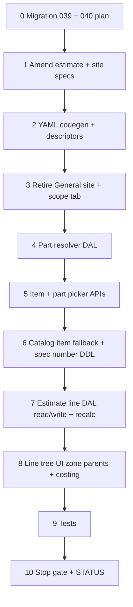

# 37f — Estimate line costing: scope required, zone parents, item TreeSelect, part filter

> **Status:** Complete (2026-07-04). Next: [37g](./37g-commercial-costing.md).
>
> **Decisions:** [commercial costing](../decisions/catalog.md#decision-commercial-costing--org-tables-category-defaults-estimate-overrides-2026-07-04) · [scope required](../decisions/estimate.md#decision-estimate-scope-required--pricing-overrides-2026-07-04) · [spec_def value types](../decisions/catalog.md#decision-spec_def-value-types-and-part-matching-rules-2026-07-02) · [category participation](../decisions/catalog.md#decision-category-spec-participation--assign-once-branch-exclude-2026-07-03) · **Planning:** [11-categories-scope-model.md](../planning/11-categories-scope-model.md) · **Migration:** [039 plan](../migrations/039-retire-general-scope-plan.md)

## Goal

Ship estimate **Line Items** finish per amended scope model: **≥1 checked scope**; zone tree parents; item **TreeSelect** (root subtree); `manufacturer_part_spec` part resolution; **material** costing snapshot + **`unit_price_target`**; retire ROM General.

**Exit:** Line add flow smoke on dev DB; part filter uses effective participation + bucket matching rules; scope-required validation; migration **039** (+ **040** if split); `codegen:check`; estimate + part-resolver tests.

**Not in 37f:** Full labor/incidental engine, org commercial list surfaces, category commercial defaults UI, `estimate_line_spec` editor, `sell_locked` → **[37g](./37g-commercial-costing.md)** · job `site_zone_id` renames → **37h**.

---

## Locked decisions (2026-07-04)

| # | Topic | Choice |
|---|--------|--------|
| D1 | **Scope required** | ≥1 checked `estimate_scope`; every line `estimate_scope_id` NOT NULL; no ROM General |
| D2 | **Site zones** | Every `site_zone` under a `site_scope` (no site General) — migration follow-on in 37f or paired site amend |
| D3 | **Item picker** | TreeSelect on active scope’s `root_category_id` subtree only |
| D4 | **Part filter** | Merged bucket (line → zone → scope) + `effective(item)` + [matching rules](../decisions/catalog.md#decision-spec_def-value-types-and-part-matching-rules-2026-07-02) |
| D5 | **Costing v1** | **Material snapshot** from part/vendor resolver + `item.fallback_unit_cost`; `unit_labor` / `unit_incidental` = 0 until 37g |
| D6 | **Target sell** | Snapshot **`unit_price_target`** from catalog types; estimator edits **`unit_price`** only |
| D7 | **Rate types on quote** | **No** estimator override of `markup_type` / `complexity_factor` / etc. on scope or line — **category only** ([amendment](#decision-o3--estimator-sell-override-only-2026-07-04)) |
| D8 | **Category commercial** | Inherit walk up tree; **no item override** v1 — 37g |
| D9 | **Incidental v1** | % of **material only** (when 37g ships engine) |
| D10 | **Commission** | No sales commission table v1 |
| D11 | **Ambiguous material $** | [O1](#decision-o1--ambiguous-part-material-cost-2026-07-04) — `item.fallback_unit_cost`; many → max filtered vendor |
| D12 | **Part pin** | [O2](#decision-o2--line-item-part-pin-2026-07-04) — `item_id` required; `part_id` optional; `part_locked` |

---

## Decision: O6 — Retire General — single migration 039 with 37f (2026-07-04)

**Status:** **Locked.**

**Choice:** **One coordinated cut** — migration **`039_retire_general_scope.sql`** + site/estimate DAL/UI changes land in the **same 37f change set**. No prep-only migration that leaves app code inconsistent with DDL.

**Rejected:** Prep migration weeks before UI (would break ROM lines / General scope tab against new NOT NULL constraints without matching app).

**Backfill (dev):** See [`039-retire-general-scope-plan.md`](../migrations/039-retire-general-scope-plan.md):

1. Seed catalog root **`General`** if missing.
2. Re-parent **`site_zone`** orphans → per-site **`site_scope`** instance on that root.
3. Delete synthetic General **`estimate_scope`** rows.
4. Re-home **`estimate_line`** with null `estimate_scope_id` to first scoped row or auto-create `estimate_scope` from site; **fail migration** if impossible.

**App:** Remove site **`general_zones`** surface field; remove estimate ROM General line parent and synthetic General scope UX.

---

## Decision: O1 — Ambiguous part material cost (2026-07-04)

**Status:** **Locked.**

**Choice:**

| Match count | `part_id` | `unit_material` |
|-------------|-----------|-----------------|
| **0** | null | **`item.fallback_unit_cost`** + alert |
| **1** | auto-set `part_id`, `part_locked=false` | Vendor price for matched part |
| **Many** | null until picker; user pick → `part_locked=true` | **`max`** vendor among filtered; else fallback |
| **User pin** | `part_locked=true` | Resolved pin part vendor path |

**Item catalog:** add **`fallback_unit_cost`** (estimate UOM, default 0) — used when part/vendor table cannot determine material $. **Not** `default_part` vendor when that part is outside the filtered set.

**Rejected v1:** Org-wide “max vendor” flag separate from filtered set; costing from `default_part` when it fails spec filter.

**DDL:** `item.fallback_unit_cost` in 37f migration (or **040** with spec number columns).

---

## Decision: O2 — Line item part pin (2026-07-04)

**Status:** **Locked.**

**Choice:**

| Field | Rule |
|-------|------|
| **`item_id`** | **Required** on product lines (DAL + UI) |
| **`part_id`** | **Optional** — set when exact PN is determined or user picks from filtered list |
| **`part_locked`** | **Boolean**, default `false`. `true` when user selects/confirms PN — recalc **must not** change `part_id`. `false` when system auto-set from single filter match — may update/clear on item or bucket change |

**Resolver behavior:**

1. **Exactly 1 filtered part** → set `part_id`, `part_locked = false`, `material_status = suggested`.
2. **User picks PN** from filtered list → set `part_id`, `part_locked = true`, `material_status = verified` (or `suggested` until save — UI detail).
3. **0 or many matches** (no user pick) → `part_id` null, `part_locked` false, `material_status = generic` (material $ per [O1](#decision-o1--ambiguous-part-material-cost-2026-07-04)).
4. **Recalc** when `part_locked` → keep `part_id`; if PN no longer in filtered set → **alert**, do not auto-clear v1 (user must unlock or change item).

**Rejected:** `part_id` required on every line; suggest-only without recording single-match PN.

**DDL:** `estimate_line.part_locked BOOLEAN NOT NULL DEFAULT false`; `item_id` NOT NULL on product lines (app + migration backfill).

---

## Decision: O3 — Estimator sell override only (2026-07-04)

**Status:** **Locked.** **Supersedes** scope/zone **`markup_type_id`** and **`complexity_factor_id`** override pickers (2026-07-04 session).

**Choice:**

- Estimator **cannot** change which org **rate types** apply on a quote (`markup_type`, `labor_rate_type`, `incidental_rate_type`, `complexity_factor`) — resolution is **category inherit walk** only.
- Estimator **may** override the **actual sell rate**: edit **`unit_price`** on the line (under/over **`unit_price_target`**).
- **`unit_price_target`** recalculates when resolver inputs change (item, part, bucket specs, category commercial assignment) — **not** when estimator edits sell.
- **No** `estimate_scope` markup/complexity picker UI in 37g.

**Rejected:** Per-scope markup type override; per-zone complexity override on estimate.

**Recalc (v1):** When resolver re-runs, update `unit_price_target` + cost snapshots; **do not** overwrite **`unit_price`** on existing lines ([O4](#decision-o4--sell-lock-deferred-2026-07-04) deferred).

---

## Decision: O4 — Sell lock (deferred)

**Status:** **Deferred.** Placeholder name: **`sell_locked`** on `estimate_line` — **not** in v1 DDL/UI/DAL.

**v1 behavior until `sell_locked` ships:**

- Recalc updates **`unit_material`**, **`unit_labor`**, **`unit_incidental`**, **`unit_cost`**, **`unit_price_target`**.
- Recalc **never** changes **`unit_price`** on an existing line (estimator’s sell sticks until they edit it).
- New line: set **`unit_price = unit_price_target`** on first calc.

**Future (when implemented):** `sell_locked` boolean — when `true`, same as v1; when `false`, optional “sync sell to target” on recalc (TBD).

---

## Decision: O5 — `estimate_line_spec` UI (deferred)

**Status:** **Deferred** beyond 37f.

**v1:** Part filter uses merged bucket **line → zone → scope** only. **`estimate_line_spec`** table exists; **no** line-level spec editor on estimate UI in 37f. Scope + zone spec panels (37e) suffice for v1 part resolution.

**Future:** Line-level spec overrides when estimators need per-line bucket values without changing zone/scope for all lines (HVAC zone override pattern at line granularity).

---

## Decision index (all resolved)

| # | Topic | Status |
|---|--------|--------|
| O1 | Many / zero part matches — material $ | ✅ [O1](#decision-o1--ambiguous-part-material-cost-2026-07-04) |
| O2 | Unique part match / part pin | ✅ [O2](#decision-o2--line-item-part-pin-2026-07-04) |
| O3 | Estimator pricing | ✅ [O3](#decision-o3--estimator-sell-override-only-2026-07-04) |
| O4 | Manual sell lock | ⏸ [O4](#decision-o4--sell-lock-deferred-2026-07-04) |
| O5 | `estimate_line_spec` UI | ⏸ [O5](#decision-o5--estimate_line_spec-ui-deferred) |
| O6 | Retire General — migration cut | ✅ [O6](#decision-o6--retire-general--single-migration-039-with-37f) |
| O7 | 0 matches UX | ✅ [O1](#decision-o1--ambiguous-part-material-cost-2026-07-04) |

---

## Retire / rename matrix

| Layer | Remove / change | Target |
|-------|-----------------|--------|
| Site Field | `general_zones` | Zones only under `scopes[]` |
| Site tree UI | `GENERAL_TREE_KEY`, orphan zone bucket | All zones nested under `site_scope` |
| Estimate `site_tree` DTO | `general_zones` | `scopes[].zones[]` only |
| Estimate Scope tab | Synthetic General `estimate_scope` create | Scoped rows only (`site_scope_id` + `root_category_id` required) |
| Line tree `rowKind` | `general` | **`scope`** → **`zone`** → **`line`** |
| Line FK | `estimate_scope_id` nullable (ROM) | **NOT NULL** — every line under a checked scope |
| Line add gating | Lines without scopes | **Block** until ≥1 checked `estimate_scope` |
| Item picker | Full catalog / ROM bucket | **TreeSelect** on active scope’s `root_category_id` subtree |
| Cost columns (DAL) | `unit_cost` / `unit_price` only in SELECT/PATCH | + `unit_material`, `unit_labor`, `unit_incidental`, `unit_price_target`, `part_locked` |
| `unit_price_target` v1 | — | `= unit_cost` (material-only until **37g** markup engine) |
| Part resolver | — | **Create** `lib/estimates/repository/estimate-part-resolver.ts` (+ tests) |

---

## Migrations

### 039 — `039_retire_general_scope.sql` (required)

Per [`039-retire-general-scope-plan.md`](../migrations/039-retire-general-scope-plan.md):

| Change | Notes |
|--------|--------|
| Backfill | Catalog root **General**; re-parent site orphan zones; delete synthetic estimate General scopes; re-home ROM lines |
| `site_zone.site_scope_id` | `SET NOT NULL` |
| `estimate_line.estimate_scope_id` | `SET NOT NULL` |
| `estimate_scope` | `site_scope_id` + `root_category_id` both `NOT NULL`; drop General CHECK + partial unique index |
| `item.fallback_unit_cost` | `NUMERIC NOT NULL DEFAULT 0` |
| `estimate_line.part_locked` | `BOOLEAN NOT NULL DEFAULT false` |
| `estimate_line.unit_price_target` | `NUMERIC` nullable |
| `estimate_line.item_id` | Backfill expense/labor placeholders if needed; `SET NOT NULL` for `line_kind = product` via CHECK or app rule |

`unit_material` / `unit_labor` / `unit_incidental` already exist from **033** — no DDL unless missing on dev.

```bash
cd apps/subhub
psql "$DATABASE_URL" -f migrations/039_retire_general_scope.sql
```

### 040 — `040_spec_def_number_type.sql` (split if 039 too large)

| Change | Notes |
|--------|--------|
| `spec_def.value_type` CHECK | Add **`number`** |
| `spec_def` | `unit`, `display_unit`, `wildcard_option_id` nullable FK |
| `manufacturer_part_spec` | `value_number`, `value_number_max` nullable |
| `estimate_scope_spec` / `estimate_zone_spec` / `estimate_line_spec` | `value_number` nullable |
| `effective()` / scope panel | Extend `value_type` union to include `number` |

**v1 part filter** must ship enum/boolean/text even if number DDL lands in **040**; number defs inert until admin UI + part rows exist.

---

## API / DTO contracts (target)

### `GET estimate_detail` — line_items (amended)

```json
{
  "site_tree": {
    "scopes": [
      {
        "id": "<site_scope_id>",
        "name": "Fire Alarm",
        "root_category_id": "<uuid>",
        "zones": [{ "id": "<site_zone_id>", "name": "Floor 1" }]
      }
    ]
  },
  "scopes": ["… checked scopes + zones + specs …"],
  "line_items": [
    {
      "id": "<uuid>",
      "estimate_scope_id": "<estimate_scope_id>",
      "site_zone_id": "<site_zone_id or null>",
      "line_kind": "product",
      "item_id": "<uuid>",
      "part_id": null,
      "part_locked": false,
      "vendor_part_id": null,
      "material_status": "generic",
      "unit_material": 0,
      "unit_labor": 0,
      "unit_incidental": 0,
      "unit_cost": 0,
      "unit_price_target": 0,
      "unit_price": 0,
      "quantity": 1,
      "unit": "ea",
      "description": "…"
    }
  ]
}
```

- **`site_tree`** — no `general_zones`.
- **`line_items[].estimate_scope_id`** — always non-null on persisted rows.
- **Resolver enrichments (optional on GET):** `filtered_part_count`, `part_match_alert` — UI-only DTO fields OK; do not persist.

### `PATCH` — validation (minimum)

| Rule | Enforce |
|------|---------|
| ≥1 scope | Reject save with zero checked scopes when `line_items` non-empty |
| Line scope FK | Every `line_items[].estimate_scope_id` matches a row in `scopes[]` |
| Line zone FK | `site_zone_id` null or checked in parent scope’s `zones[]` |
| Product line | `item_id` required; `part_id` must be in filtered set when set |
| `part_locked` | Writable; when `true`, resolver on save must not change `part_id` |
| `unit_price` | Writable; `unit_price_target` read-only on PATCH (server recalc) |
| Recalc | Update `unit_*` + `unit_cost` + `unit_price_target`; **never** overwrite `unit_price` on existing lines ([O4](#decision-o4--sell-lock-deferred-2026-07-04)) |
| New line first calc | `unit_price = unit_price_target` |

### Picker — `GET /api/estimates/pickers/items`

Query: `root_category_id` (required), optional `q` (label search).

Response: nested category + item tree for TreeSelect — categories under root + `item` leaves linked via `item_category` where category ∈ subtree. **No** items outside root subtree.

### Picker — `GET /api/estimates/pickers/parts`

Query: `estimate_id`, `line_id` or inline bucket params + `item_id`.

Response: filtered `manufacturer_part` rows per [matching rules](../decisions/catalog.md#decision-spec_def-value-types-and-part-matching-rules-2026-07-02); include vendor price for material $ display.

---

## Execution order



---

## Step 0 — Migrations 039 (+ 040)

| File | Action |
|------|--------|
| `migrations/039_retire_general_scope.sql` | **Create** — backfill + NOT NULL + line/item columns per [plan](../migrations/039-retire-general-scope-plan.md) |
| `migrations/040_spec_def_number_type.sql` | **Create** if split — number type DDL |
| [`docs/migrations/040-spec-def-number-plan.md`](../migrations/040-spec-def-number-plan.md) | **Create** when 040 split |
| [`docs/schema/current.dbml`](../schema/current.dbml) | **Amend** — sync columns already drafted; `estimate_scope_id` NOT NULL note |

### Verify

- [x] `039` applied on dev DB
- [x] Smoke queries in [039 plan](../migrations/039-retire-general-scope-plan.md) return 0 orphans
- [x] `item.fallback_unit_cost`, `estimate_line.part_locked`, `estimate_line.unit_price_target` exist

---

## Step 1 — Spec + planning amend

| File | Action |
|------|--------|
| [`docs/surface-specs/estimate.md`](../surface-specs/estimate.md) | **Amend** — supersede 37e General/ROM; scope required; zone line parents; item TreeSelect; costing columns; picker routes; drop `general_zones` from `site_tree` contract |
| [`docs/surface-specs/site.md`](../surface-specs/site.md) | **Amend** — remove `general_zones` Field; all zones under `scopes` |
| [`docs/planning/02-estimates.md`](../planning/02-estimates.md) | **Amend** — line costing v1; pointer to 37g for full engine |
| [`docs/migrations/035-estimate-zone-plan.md`](../migrations/035-estimate-zone-plan.md) | **Amend** — superseded General paths → 039 |

### Verify

- [x] `estimate.md` documents zone parents + scope-required gating
- [x] No target doc still describes ROM General line bucket as v1 behavior

---

## Step 2 — YAML + codegen

| File | Action |
|------|--------|
| `modules/site/site_detail.surface.yaml` | **Remove** Field `general_zones` |
| `modules/estimate/estimate_detail.surface.yaml` | **Amend** `line_items` logical field — document child columns in descriptor (codegen stub unchanged) |
| `lib/sites/descriptors/site-detail.ts` | Drop `general_zones` from DTO/PATCH |
| `lib/estimates/descriptors/estimate-detail.ts` | Line schema: `part_locked`, `unit_material`, `unit_labor`, `unit_incidental`, `unit_price_target`; `estimate_scope_id` non-null on product lines; `item_id` required on product |
| `npm run codegen` | Regenerate glue |

### Verify

- [x] `npm run codegen:check` passes
- [x] Site manifest has no `general_zones` field id

---

## Step 3 — Retire General (site + estimate scope)

| File | Action |
|------|--------|
| `lib/sites/repository/site-scopes.ts` | Load zones only under scopes; no orphan bucket |
| `lib/sites/repository/site-scopes-write.ts` | Reject `general_zones`; require `site_scope_id` on all zones |
| `components/sites/site-scopes-tree.ts` | Remove `GENERAL_TREE_KEY` + `general_zones` form shape |
| `components/sites/SiteScopesZonesTree.tsx` | Single tree under scopes |
| `lib/estimates/repository/estimate-site-tree.ts` | Drop `general_zones` from DTO |
| `lib/estimates/repository/estimate-scopes-write.ts` | Remove `isGeneralScope`; require `site_scope_id` + `root_category_id` on all scope rows |
| `components/estimates/estimate-scope-tree.ts` | Remove General parent + synthetic scope create |
| `components/estimates/EstimateScopeTab.tsx` | Scoped checkboxes only |
| `lib/estimates/repository/estimate-scopes-write.test.ts` | Update — no General scope fixtures |

### Verify

- [x] Site detail save with zones only under scopes
- [x] Estimate Scope tab — no General zone parent
- [x] `estimate-scopes-write` tests pass without General rows

---

## Step 4 — Part resolver DAL

| File | Action |
|------|--------|
| `lib/estimates/repository/estimate-bucket-specs.ts` | **Create** — merge line → zone → scope bucket values per `spec_def_id` |
| `lib/estimates/repository/estimate-part-resolver.ts` | **Create** — `resolveFilteredParts(ctx, inputs)` + `resolveLineMaterial(ctx, line, bucket)` |
| `lib/catalog/repository/category-effective-specs.ts` | Extend `value_type` union when **040** lands; reuse `effective(item)` |
| `lib/estimates/repository/estimate-part-resolver.test.ts` | **Create** — 0 / 1 / many match; `part_locked`; max vendor; fallback cost |

| Function | Behavior |
|----------|----------|
| `mergeBucketSpecs` | Zone overrides scope; line tier reads DB only ([O5](#decision-o5--estimate_line_spec-ui-deferred) — no UI writes) |
| `filterParts` | `effective(item)` ∩ bucket per [catalog decision](../decisions/catalog.md#decision-spec_def-value-types-and-part-matching-rules-2026-07-02) |
| `applyMatchOutcome` | [O1](#decision-o1--ambiguous-part-material-cost-2026-07-04) + [O2](#decision-o2--line-item-part-pin-2026-07-04) |
| `materialUnitCost` | Pinned part vendor → max filtered → `item.fallback_unit_cost` |

### Verify

- [x] Unit tests cover enum/boolean/text matching + 0/1/many outcomes
- [x] `part_locked=true` preserves `part_id` on recalc

---

## Step 5 — Picker APIs

| File | Action |
|------|--------|
| `lib/catalog/repository/item-tree.ts` | **Create** — items under `root_category_id` subtree for TreeSelect |
| `app/api/estimates/pickers/items/route.ts` | **Create** — auth via `estimate_detail` entailed read |
| `lib/estimates/repository/estimate-part-picker.ts` | **Create** — filtered parts list + vendor price for line context |
| `app/api/estimates/pickers/parts/route.ts` | **Create** — query by estimate + line or explicit bucket + `item_id` |

### Verify

- [x] Item picker returns only subtree of scope root
- [x] Part picker returns subset matching bucket + item effective specs

---

## Step 6 — Catalog: `fallback_unit_cost` + spec number (040)

| File | Action |
|------|--------|
| `modules/catalog/part_detail.surface.yaml` *(or item when exists)* | **`manufacturer_part_spec`** writable `value_number` when 040 applied |
| Catalog item read/write | **`fallback_unit_cost`** on item row — surface TBD (`part_detail` related or thin item amend); minimum: DAL column + dev seed |
| `lib/catalog/repository/spec-def-write.ts` | Accept `value_type: number` + `unit` when 040 applied |
| `components/catalog/CategorySpecDefinitionsField.tsx` | Number def editor when 040 applied |

**Minimum bar for 37f stop gate:** `item.fallback_unit_cost` readable/writable somewhere in catalog admin (item form or migration seed on dev).

### Verify

- [x] Dev seed items have `fallback_unit_cost` for resolver smoke
- [x] Number type DDL applied OR explicitly deferred with enum-only smoke documented

---

## Step 7 — Estimate line DAL + recalc

| File | Action |
|------|--------|
| `lib/estimates/repository/estimate-lines.ts` | SELECT `unit_material`, `unit_labor`, `unit_incidental`, `unit_price_target`, `part_locked` |
| `lib/estimates/repository/estimate-lines-write.ts` | Persist new columns; validate `item_id` on product; `estimate_scope_id` NOT NULL; zone in scope |
| `lib/estimates/repository/estimate-line-recalc.ts` | **Create** — orchestrate resolver per product line on save / explicit recalc hook |
| `lib/estimates/repository/estimate-write.ts` | Require ≥1 scope when lines present; run recalc before persist |
| `lib/estimates/repository/estimate-lines-write.test.ts` | **Create** or extend — scope required, part_locked, sell stickiness |

**Recalc v1:**

```text
unit_material ← resolver
unit_labor, unit_incidental ← 0
unit_cost ← unit_material + unit_labor + unit_incidental
unit_price_target ← unit_cost   // until 37g markup
unit_price ← unchanged (existing) | unit_price_target (new line)
```

### Verify

- [x] PATCH round-trip new columns
- [x] Recalc does not overwrite `unit_price` on existing lines
- [x] New product line gets `unit_price = unit_price_target`

---

## Step 8 — Line tree UI

| File | Action |
|------|--------|
| `components/estimates/estimate-line-tree.ts` | Drop `general` rowKind; add **`zone`**; nest lines under scope → zone → line; `estimate_scope_id` required on add |
| `components/estimates/EstimateLineTreeTable.tsx` | Zone parent rows; gate **Add line** on `scopes.length >= 1`; item **TreeSelect** (product); PN **Select** from filtered parts; `unit_price_target` read-only column; `unit_price` editable; material alert on 0 matches |
| `components/estimates/EstimateDetailForm.tsx` | Line Items tab empty state when no scopes; wire pickers |
| `lib/hooks/use-estimate-item-picker.ts` | **Create** — fetch item tree by `root_category_id` |

**Line tree (37f):**

| `rowKind` | Backing |
|-----------|---------|
| `scope` | Checked `estimate_scope` |
| `zone` | Checked `estimate_zone` under scope (lines with matching `site_zone_id`; unzoned lines under scope root) |
| `line` | `estimate_line` leaf |

**Product line columns (minimum):** item, part (when many), `material_status`, `unit_material`, `unit_price_target`, `unit_price`, qty, extended.

### Verify

- [x] Cannot add line with zero checked scopes
- [x] Item picker limited to scope root subtree
- [x] Single match auto-fills `part_id`; many shows picker; 0 shows alert + fallback $

---

## Step 9 — Tests + build

```bash
cd apps/subhub
npm run codegen:check
npm test -- --run estimate-part-resolver estimate-scopes-write estimate-lines-write estimate-write
npm run build
```

### Verify

- [x] Targeted tests pass
- [x] `npm run build` succeeds

---

## Step 10 — Stop gate + STATUS

| File | Action |
|------|--------|
| This file | Mark **Status:** Complete; all verify `[x]` |
| [`STATUS.md`](../../STATUS.md) | Recently completed 37f; **Right now** → 37g |
| [`docs/tasks/01-task-index.md`](./01-task-index.md) | Mark 37f row |

### Verify (stop gate)

- [x] All step checklists `[x]`
- [x] STATUS updated
- [x] Migration 039 on dev
- [x] Manual smoke partial on dev DB — see [results](#manual-smoke-results-2026-07-04) (1–4, 8A–8B pass; 5–7 blocked)

---

## Manual smoke

1. **Site** — open site detail; all zones under a scope; save/reload; no General zone bucket.
2. **Estimate Scope** — check ≥1 site scope + optional zone; save; no General scope row created.
3. **Line gating** — zero scopes → Line Items shows “check a scope first”; cannot add line.
4. **Item pick** — add product line under scope; TreeSelect shows only items in scope root subtree.
5. **Part filter** — set scope specs → pick item → 1 match auto-PN; many → picker; 0 → alert + fallback cost.
6. **Sell stickiness** — edit `unit_price`; change bucket specs; save → `unit_price` unchanged, `unit_price_target` updated.
7. **Part pin** — pick PN from many → `part_locked`; change bucket → alert, PN kept.
8. **Uncheck block** — line under scope/zone → uncheck still blocked (37e D4).

### Manual smoke results (2026-07-04)

Environment: local dev (`localhost:3003`). No `item` rows under scope roots in dev DB at time of walkthrough.

| # | Test | Result | Notes |
|---|------|--------|-------|
| 1 | Site — zones under scopes only | **Pass** | No General zone bucket |
| 2 | Estimate Scope — no General row | **Pass** | Checked scope + zone; save/reload OK |
| 3 | Line gating | **Pass** | Zero scopes → cannot add line |
| 4 | Item pick | **Pass** | TreeSelect scoped to scope root; **empty tree expected** with no catalog items |
| 5 | Part filter | **Blocked** | Product lines require `item_id` on save; no items in DB; Part column UX pinned (see below) |
| 6 | Sell stickiness | **Not run** | Product path blocked (no items). Narrow **Labor** path (`unit_cost` → override Sell → change Cost) not exercised |
| 7 | Part pin | **Blocked** | Depends on #5 many-match picker |
| 8A | Scope uncheck block | **Pass** | **Labor** line under scope parent; checkbox disabled while checked |
| 8B | Zone uncheck block | **Pass** | **Labor** line under zone parent; zone checkbox disabled while checked |

**UX / design (pinned — not fixed in 37f):**

- **Kind vs Item** — default `line_kind = product` gates the Item column; selecting Product is the only path to catalog material lines, but feels wrong as the “pick an item” affordance. Revisit line model + column layout.
- **Part column** — **always a Select** when an item is set ([37aj](./37aj-estimate-part-select-and-seed.md) / W2a): empty options OK (placeholder “No match”); options = all filtered matches; pick → `material_locked`. 0/1 text modes retired. Live preview on item/part/config ([37aa](./37aa-estimate-line-live-preview.md)). No material alert banner for 0 matches.
- **Dev catalog gap** — `027_part_dev_seed.sql` has parts but dev lacked `item` / `item_category` / `part_category` links needed for product-line smoke (#5–#7).

**Follow-up before full line smoke:**

1. Minimal dev seed — items under scope `root_category_id`, optional `part_category` + `fallback_unit_cost`.
2. UX pass on Line Items (Kind / Item / Part) — separate from 37g commercial engine.
3. Optional: run #6 on **Labor** line without catalog; run #5–#7 after seed.

**Automated gaps (unchanged):** `estimate-lines-write.test.ts` not created; thin coverage for recalc, `part_locked`, picker APIs.

---

## Dependencies

| Upstream | Provides |
|----------|----------|
| **37d5** | `spec_def.category_id` owner model; `effective()` / `scopePanelDefs` |
| **37e** | `scopes`, `estimate_zone`, scope/zone spec PATCH, `site_zone_id` on lines |
| **37c** | `site_scope` / `site_zone` shape (post-039 all zones scoped) |
| **24** | `manufacturer_part`, `vendor_part`, `item` tables |

| Downstream | Needs from 37f |
|------------|----------------|
| **37g** | Line cost columns + `unit_price_target`; material resolver; category commercial FKs |
| **37h** | Stable estimate line shape before job renames |
| **4b** win → job | `estimate_line_spec` copy path (table exists; UI deferred) |

---

## Risk notes

| Risk | Mitigation |
|------|------------|
| 039 backfill fails on dev quotes | Manual fix per [039 plan](../migrations/039-retire-general-scope-plan.md); migration raises explicit exception |
| 039 DDL too large | Split spec number to **040**; ship enum/text/boolean filter first |
| No `item_detail` surface | Thin DAL + seed `fallback_unit_cost`; defer full item admin UI |
| `unit_price_target = unit_cost` until 37g | Document in UI as “target (pre-markup)”; 37g replaces formula |
| Zone parent vs unzoned lines | Lines with `site_zone_id = null` render directly under scope parent |
| Picker perf on large subtrees | v1 full subtree OK; defer search-only / lazy load |

---

## Deliverables (summary)

| Area | Deliverable |
|------|-------------|
| DDL | Migration **039** retire General + costing columns; **040** optional number type |
| Site | Remove `general_zones`; zones under scopes only |
| Catalog | `item.fallback_unit_cost`; number spec DDL when 040 ships |
| Estimate amend | Scope required; zone line parents; retire ROM General |
| APIs | Item tree + filtered parts pickers |
| DAL | Part-matching resolver; material costing v1; recalc + sell stickiness |
| UI | Item TreeSelect; PN picker; target vs actual sell; material alerts |

---

## Task split: 37f vs 37g

| | **37f** | **37g** |
|---|---------|---------|
| Part filter + specs number DDL | ✅ | |
| Item tree API + line UI | ✅ | |
| Material `unit_material` snapshot | ✅ | |
| `unit_price_target` column + basic markup from category (if category cols exist) | partial | ✅ full |
| Org rate table surfaces | | ✅ |
| Category `phase_template` + commercial FKs | | ✅ |
| Labor / incidental engine + complexity | | ✅ |
| Category commercial defaults UI | | ✅ |

---

## Verify (stop gate)

- [x] Open decisions O1–O7 resolved or deferred in this file
- [x] Task steps written (Steps 0–10)
- [x] Implementation complete
- [x] STATUS updated
- [x] Manual smoke 1–4, 8A–8B pass on dev (2026-07-04)
- [ ] Manual smoke 5–7 — blocked on dev catalog; retry after item seed + UX follow-up
