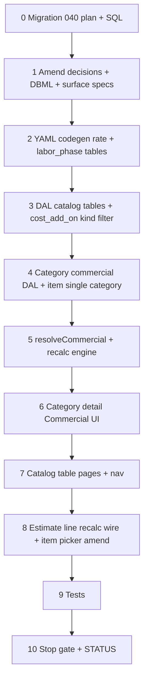

# 37g — Commercial costing: org rate tables, category defaults, full engine

> **Status:** Planned (2026-07-04). **Prerequisites:** [37f](./37f-estimate-line-costing.md) ✅ (material snapshot + line shape).
>
> **Amends:** [commercial costing (2026-07-04)](../decisions/catalog.md#decision-commercial-costing--org-tables-category-defaults-estimate-overrides-2026-07-04) — split freight/incidental, split markup, `labor_phase` model, single item category. **Planning:** [11-categories-scope-model.md](../planning/11-categories-scope-model.md) · **Migration:** [040 plan](../migrations/040-commercial-costing-plan.md) · **37f carry-forward:** [O3 sell override](./37f-estimate-line-costing.md#decision-o3--estimator-sell-override-only-2026-07-04) · [O4 sell lock deferred](./37f-estimate-line-costing.md#decision-o4--sell-lock-deferred-2026-07-04)

## Goal

Ship org **commercial catalog tables** (catalog-table Surfaces under **Catalog** nav), **category commercial defaults** (`labor_phase` matrix + freight / incidental / markup / complexity), **item single-category** rule, and full **estimate line recalc** (`unit_labor`, `unit_freight`, `unit_incidental`, `unit_price_target`).

**Exit:** Admins maintain rate cards + category commercial; product line recalc populates all cost snapshots + policy sell; estimator edits **`unit_price`** only ([O3](./37f-estimate-line-costing.md#decision-o3--estimator-sell-override-only-2026-07-04)). Migration **040** on dev; `codegen:check`; DAL + recalc tests.

**Not in scope:** Estimate scope/zone rate-type pickers; item-level commercial override; sales commission; inherited-value preview on category dropdowns (v1); `sell_locked`; job `scope_phase` / progress re-seed (jobs slice revisits phasing); progressive setup / dev seeds for rate tables.

---

## Locked decisions (2026-07-04 session)

### Cross-cutting — all rate catalog surfaces

| # | Topic | Choice |
|---|--------|--------|
| G1 | **Nav** | **Catalog** group — sibling links (with Parts, Categories) |
| G2 | **Surface shape** | **Catalog table** (`{table}_table`) — draft Save/Revert, staged delete, drag reorder |
| G3 | **Delete** | **409 `ConflictError`** when row referenced (category FK, `category_labor_phase`, etc.) |
| G4 | **Row order** | `sort_order` 1-based from drag position on Save |
| G5 | **Seed data** | **None** — tables empty at migrate |

### `labor_rate_type`

| # | Topic | Choice |
|---|--------|--------|
| L1 | **Model** | One table = labor class + rate — `name` + hourly $; **no** separate `labor_class` / `labor_class_id` |
| L2 | **Hourly input** | **Dollars** in UI → `rate_cents` in DB |
| L3 | **`name`** | **Unique** |

### Freight + incidental — `cost_add_on_type`

| # | Topic | Choice |
|---|--------|--------|
| F1 | **Storage** | **One table**; `kind` in DB only (`freight` \| `incidental`) — **not** org-editable `rate_type` catalog |
| F2 | **Surfaces** | **`freight_rate_type_table`** + **`incidental_rate_type_table`** — filtered views; server sets `kind` on write |
| F3 | **Columns (UI)** | `name`, `percent`, `amount` |
| F4 | **`percent`** | % of **`unit_material`** |
| F5 | **`amount`** | **Fixed per quoted unit** — $ in UI → `amount_cents` in DB |
| F6 | **Both set** | **Additive** on line; **validation error if both blank** on Save |
| F7 | **`name`** | **Unique per `kind`** |
| F8 | **Line snapshot** | **`unit_freight`** + **`unit_incidental`** (new `unit_freight` column) |
| F9 | **Retire** | Drop migration **033** `incidental_rate_type` (`amount_cents` + `unit`) |

### `markup_type`

| # | Topic | Choice |
|---|--------|--------|
| M1 | **Row shape** | `name` + **`material_markup_percent`** + **`labor_markup_percent`** |
| M2 | **Material side** | Markup on **`unit_material + unit_freight + unit_incidental`** |
| M3 | **Labor side** | Markup on **`unit_labor` only** |
| M4 | **`name`** | **Unique** |
| M5 | **Retire** | Single `markup_percent` column from **033** |

### `complexity_factor`

| # | Topic | Choice |
|---|--------|--------|
| X1 | **Applies to** | **Labor cost only** |
| X2 | **Scale** | **Percent** — `100` = normal; `unit_labor = base_labor × (factor_percent / 100)` |
| X3 | **`name`** | **Unique** |
| X4 | **Table** | **New** — not in DB today |

### Item ↔ category

| # | Topic | Choice |
|---|--------|--------|
| I1 | **Item categories** | **Exactly one** — `item.category_id` **NOT NULL** |
| I2 | **Retire** | **`item_category`** M:N — migrate then drop |
| I3 | **Parts** | Keep **`part_category`** M:N unchanged |
| I4 | **Scope root** | **`estimate_scope.root_category_id`** retained — item must be in scope subtree; derive root from `item.category_id` walk |
| I5 | **Supersedes** | Planning **C8** (same item under multiple category paths) |

### Category commercial assignment

| # | Topic | Choice |
|---|--------|--------|
| C1 | **Commercial FKs** | `freight_rate_type_id`, `incidental_rate_type_id`, `markup_type_id`, `complexity_factor_id` — nullable on **any** category node |
| C2 | **Inherit (FKs)** | Walk **`item.category_id` → root**; **first non-null wins** per FK |
| C3 | **Missing profile** | **Zero / skip** — no validation error (e.g. no markup → 0% on that side) |
| C4 | **UI** | One **Commercial** block on `category_detail` — labor phase table + four dropdowns |
| C5 | **Inherited preview** | **Deferred v1** — empty dropdown = inherit; no helper text |

### Labor phases — `labor_phase` + `category_labor_phase`

| # | Topic | Choice |
|---|--------|--------|
| P1 | **`labor_phase`** | Org catalog (`name`, id) + **`labor_phase_table`** surface |
| P2 | **Junction** | `category_labor_phase`: `labor_phase_id`, `labor_rate_type_id`, `hours_per_unit` |
| P3 | **Inherit (phases)** | **Additive** root → `item.category_id`; **child replaces** same `labor_phase_id` on branch |
| P4 | **Anchor** | **`item.category_id`** |
| P5 | **Category UI** | **Draft table** — Phase / Labor rate / Hrs/unit; copy: rows add to or override parent phases |
| P6 | **Duplicates** | **One row per `labor_phase_id` per category** — reject on Save |
| P7 | **Hours input** | **Decimal hours** (e.g. `0.5`, `1.25`) |
| P8 | **Retire estimate path** | Drop **`phase_template`**, **`phase_template_step`**, **`category.default_phase_template_id`**, **`item.phase_template_id`** in **040** |

### Estimate pricing (unchanged from 37f)

| # | Topic | Choice |
|---|--------|--------|
| E1 | **Estimator** | Edits **`unit_price`** only — no rate-type pickers on scope/zone/line ([O3](./37f-estimate-line-costing.md#decision-o3--estimator-sell-override-only-2026-07-04)) |
| E2 | **Recalc** | Updates cost snapshots + `unit_price_target`; **never** overwrites `unit_price` on existing lines ([O4](./37f-estimate-line-costing.md#decision-o4--sell-lock-deferred-2026-07-04)) |
| E3 | **New line** | `unit_price = unit_price_target` on first calc |

---

## Costing formulas (v1)

### Resolution anchor

```text
anchor_category = item.category_id
scope check: anchor_category is descendant of estimate_scope.root_category_id
```

### Labor

```text
phases = merge_additive(root → anchor_category)
  union category_labor_phase rows on path
  same labor_phase_id: nearest (deepest) row wins

base_labor = Σ (hours_per_unit × labor_rate_type.rate)
unit_labor = base_labor × (complexity_factor_percent / 100)   // 100 if unresolved
```

### Freight + incidental

```text
profile = walk_up(anchor_category, freight_rate_type_id)   // first non-null
unit_freight =
  (unit_material × percent / 100) + amount_per_unit
  // percent/amount from profile; 0 if unresolved or both blank on profile (invalid row blocked at catalog Save)

profile = walk_up(anchor_category, incidental_rate_type_id)
unit_incidental = same formula
```

### Cost + target sell

```text
unit_cost = unit_material + unit_labor + unit_freight + unit_incidental

material_side = unit_material + unit_freight + unit_incidental
labor_side    = unit_labor

markup = walk_up(anchor_category, markup_type_id)
unit_price_target =
  material_side × (1 + material_markup_percent / 100)
+ labor_side    × (1 + labor_markup_percent / 100)
// 0% on side when markup profile null
```

### Recalc order (single line)

```text
1. unit_material     ← 37f part resolver (unchanged)
2. unit_freight      ← cost_add_on (freight)
3. unit_incidental   ← cost_add_on (incidental)
4. unit_labor        ← labor_phase merge + complexity
5. unit_cost         ← sum
6. unit_price_target ← split markup
7. unit_price        ← stick unless new line
```

---

## Catalog surfaces (target)

| Surface id | Route (flat) | Table | Writable columns |
|------------|--------------|-------|------------------|
| `labor_rate_type_table` | `/labor-rates` | `labor_rate_type` | `name`, rate/hr ($) |
| `freight_rate_type_table` | `/freight-rates` | `cost_add_on_type` | `name`, `percent`, `amount` — `kind=freight` |
| `incidental_rate_type_table` | `/incidental-rates` | `cost_add_on_type` | `name`, `percent`, `amount` — `kind=incidental` |
| `markup_type_table` | `/markup-types` | `markup_type` | `name`, `material_markup_%`, `labor_markup_%` |
| `complexity_factor_table` | `/complexity-factors` | `complexity_factor` | `name`, `factor_percent` |
| `labor_phase_table` | `/labor-phases` | `labor_phase` | `name` |

All: catalog-table UX per [general decision — catalog table](../decisions/general.md#decision-catalog-tables--editable-table-page-not-master-detail-2026-06-16).

---

## Migrations

### 040 — `040_commercial_costing.sql` (required)

Full step list: [`040-commercial-costing-plan.md`](../migrations/040-commercial-costing-plan.md).

| Area | Change |
|------|--------|
| **New** | `labor_phase`, `category_labor_phase`, `cost_add_on_type`, `complexity_factor` |
| **Amend** | `markup_type` — `material_markup_percent`, `labor_markup_percent`; drop `markup_percent` |
| **Amend** | `labor_rate_type` — drop `labor_class_id` |
| **Amend** | `category` — add commercial FKs; drop `default_phase_template_id` |
| **Amend** | `item` — `category_id` NOT NULL; drop `phase_template_id` |
| **Amend** | `estimate_line` — `unit_freight NUMERIC NOT NULL DEFAULT 0` |
| **Drop** | `item_category`, `incidental_rate_type`, `phase_template`, `phase_template_step` |
| **Drop / null** | `scope_phase.phase_template_step_id` → NULL then drop FK before template drop |
| **Cleanup** | `estimate_scope.markup_type_id`, `labor_context_type_id` unused — drop in 040 or note 041 |
| **Picker** | Item tree reads `item.category_id` in scope subtree (replace `item_category` join) |

> If [040 spec number](../migrations/040-spec-def-number-plan.md) ships separately, renumber — commercial costing is **`040`** first on current dev chain after **039**.

```bash
cd apps/subhub
psql "$DATABASE_URL" -f migrations/040_commercial_costing.sql
```

---

## Execution order



---

## Step 0 — Migration 040

| File | Action |
|------|--------|
| [`docs/migrations/040-commercial-costing-plan.md`](../migrations/040-commercial-costing-plan.md) | **Create** — backfill + DDL |
| `migrations/040_commercial_costing.sql` | **Create** |
| [`docs/schema/current.dbml`](../docs/schema/current.dbml) | **Amend** |

### Verify

- [ ] `040` applied on dev DB
- [ ] `item_category` dropped; `item.category_id` NOT NULL
- [ ] `cost_add_on_type`, `labor_phase`, `complexity_factor` exist
- [ ] `estimate_line.unit_freight` exists
- [ ] `phase_template` / `phase_template_step` dropped

---

## Step 1 — Docs amend

| File | Action |
|------|--------|
| [`docs/decisions/catalog.md`](../decisions/catalog.md) | **Amend** — commercial costing decision (freight split, markup split, labor_phase, item single category) |
| [`docs/planning/11-categories-scope-model.md`](../planning/11-categories-scope-model.md) | **Amend** — C8, C13–C14, C21–C22, costing rollup formula |
| [`docs/surface-specs/category.md`](../surface-specs/category.md) | **Amend** — Commercial field group |
| [`docs/surfaces.md`](../surfaces.md) | **Amend** — Catalog nav entries |

### Verify

- [ ] No doc still describes single `incidental_rate_type` as freight+incidental combined
- [ ] No doc requires `item_category` M:N for items

---

## Step 2 — Surface YAML + codegen

| Module | Surfaces |
|--------|----------|
| `modules/catalog/` | `labor_rate_type_table`, `freight_rate_type_table`, `incidental_rate_type_table`, `markup_type_table`, `complexity_factor_table`, `labor_phase_table` |
| `modules/catalog/category_detail.surface.yaml` | **Amend** — `commercial` field: FKs + `category_labor_phase` collection |

### Verify

- [ ] `npm run codegen:check` passes

---

## Step 3 — Catalog table DAL + APIs

| Deliverable | Notes |
|-------------|--------|
| List/replace PATCH per `*_table` | Same pattern as `site_contact_relation_table` |
| `cost_add_on_type` write | Enforce `kind` per surface; percent/amount validation |
| Delete guards | Join category + junction tables |

### Verify

- [ ] CRUD smoke on each catalog table route
- [ ] Duplicate `name` rejected per rules

---

## Step 4 — Category commercial DAL

| Deliverable | Notes |
|-------------|--------|
| `resolveCategoryCommercial(anchor_category_id)` | FK walk + labor phase merge |
| `category_labor_phase` replace on PATCH | Unique `labor_phase_id` per category |
| Item writes | Require `category_id`; scope subtree validation on estimate lines |
| Item tree API | Filter `item.category_id` ∈ scope root subtree |

### Verify

- [ ] Unit tests: additive phases + child replace + FK walk
- [ ] Item picker excludes items outside scope subtree

---

## Step 5 — `resolveCommercial` + recalc

| File | Action |
|------|--------|
| `lib/estimates/repository/estimate-line-recalc.ts` | **Amend** — full formula |
| `lib/estimates/repository/estimate-commercial.ts` | **Create** — resolution helpers |

### Verify

- [ ] Recalc tests: material + freight + incidental + labor + split markup + complexity
- [ ] Existing line: `unit_price` unchanged after recalc
- [ ] New line: `unit_price = unit_price_target`

---

## Step 6 — Category detail UI

| Component | Notes |
|-----------|--------|
| `CategoryDetailForm` | Commercial section: labor phase `FieldArrayTable` + four pickers |
| Remove | `default_phase_template_id` field |

### Verify

- [ ] PATCH round-trip commercial block
- [ ] Duplicate phase blocked in UI or on server

---

## Step 7 — Catalog table pages + nav

| Route | Component |
|-------|-----------|
| `/labor-rates`, `/freight-rates`, … | `CatalogTableSurface` pattern |

| File | Action |
|------|--------|
| `lib/nav.ts` | Add Catalog group entries |

### Verify

- [ ] Manifest grants gate nav entries
- [ ] Save/Revert + drag reorder on each table

---

## Step 8 — Estimate UI wire-up

| Deliverable | Notes |
|-------------|--------|
| Line costing columns | Show `unit_freight` / `unit_incidental` / `unit_labor` / `unit_price_target` where manifest grants |
| Recalc on save | Material + commercial |

### Verify

- [ ] Line save recalculates all unit snapshots
- [ ] `unit_price` editable; target read-only on PATCH

---

## Step 9 — Tests

| Area | Minimum |
|------|---------|
| `estimate-commercial.test.ts` | Phase merge, markup split, cost_add_on additive |
| `estimate-line-recalc.test.ts` | End-to-end line |
| Catalog table writes | kind filter + validation |

---

## Step 10 — Stop gate

### Verify

- [x] Open decisions locked in this file
- [x] Task steps written (Steps 0–10)
- [ ] Migration 040 applied on dev
- [ ] Implementation complete
- [ ] `codegen:check` passes
- [ ] STATUS updated
- [ ] Manual smoke: create rates → category commercial → line recalc shows M/L/freight/incidental/target

---

## Risk notes

| Risk | Mitigation |
|------|------------|
| `item_category` backfill | Migration picks single category per item (deepest or sole link); fail with explicit exception if zero links |
| Drop `phase_template` while `scope_phase` exists | Null `phase_template_step_id` first; jobs slice reintroduces phasing |
| Empty rate catalogs | Zero/skip costing — document admin setup order |
| 040 size | Split item_category drop vs commercial DDL if needed (**040a** / **040b**) |

---

## Related

- [37f — estimate line costing](./37f-estimate-line-costing.md)
- [040 commercial costing plan](../migrations/040-commercial-costing-plan.md)
- [Decision — commercial costing](../decisions/catalog.md#decision-commercial-costing--org-tables-category-defaults-estimate-overrides-2026-07-04)
