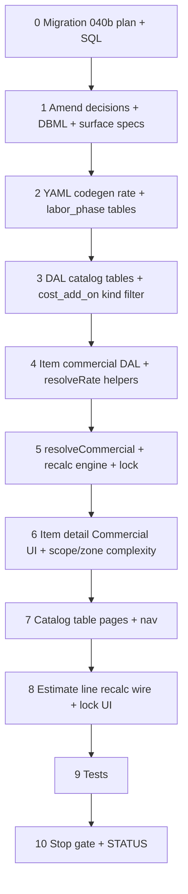

# 37g — Commercial costing: org rate tables, item node defaults, full engine

> **Status:** Complete (2026-07-06). Next: follow-on estimate polish or next slice per [`01-task-index.md`](./01-task-index.md).
>
> **Scope:** Commercial engine lands in migration **040b** only (after **040a**). Structural merge is **done** ([040a plan](../migrations/040a-unified-item-tree-plan.md)). Anchor = `estimate_line.item_id` at **any tree depth** + **`resolveRate(N, R)`** (D4); complexity on **estimate scope/zone** (D5); `lock` enum in 040b (D6b). Implement per [catalog D1–D8](../decisions/catalog.md#locked-decisions-review-2026-07-05).
>
> **Amends:** [commercial costing (2026-07-04)](../decisions/catalog.md#decision-commercial-costing--org-tables-category-defaults-estimate-overrides-2026-07-04) — split freight/incidental, split markup, `item_labor_phase` model, unified `resolveRate`. **Planning:** [11-categories-scope-model.md](../planning/11-categories-scope-model.md) · **Migration:** [040b plan](../migrations/040-commercial-costing-plan.md) *(re-scope to 040b-only — trim 040a-retired DDL)* · **37f carry-forward:** [O3 sell override](./37f-estimate-line-costing.md#decision-o3--estimator-sell-override-only-2026-07-04) · [O4 superseded by D6b](./37f-estimate-line-costing.md#decision-o4--sell-lock-deferred-2026-07-04)

## Goal

Ship org **commercial catalog tables** (catalog-table Surfaces under **Catalog** nav), **item node commercial defaults** (`item_labor_phase` matrix + freight / incidental / markup FKs on the unified tree), **`resolveRate`** recalc engine, **complexity pickers** on estimate scope/zone, **`estimate_line.lock`**, and full **estimate line recalc** (`unit_labor`, `unit_freight`, `unit_incidental`, `unit_price_target`).

**Exit:** Admins maintain rate cards + item-node commercial policy; product line recalc populates all cost snapshots + policy sell per D6b; estimator edits **`unit_price`** and scope/zone **complexity** only ([O3](./37f-estimate-line-costing.md#decision-o3--estimator-sell-override-only-2026-07-04)). Migration **040b** on dev; `codegen:check`; DAL + recalc tests.

**Not in scope:** Estimate scope/zone rate-type pickers (markup/freight/incidental remain item-tree policy); item-level commercial override beyond node authoring; sales commission; inherited-value preview on item commercial dropdowns (v1); job `scope_phase` / progress re-seed (jobs slice revisits phasing); progressive setup / dev seeds for rate tables; kit/assembly recalc (D7 v2).

**Already done (37i / 040a — do not re-implement):** unified `item` tree; drop `item_category`, `item.kind`, `estimate_line.line_kind`; `estimate_scope.root_item_id`; `part_item`; branch-selectable item picker.

---

## Locked decisions (2026-07-04 session, amended 2026-07-05 unified tree)

### Cross-cutting — all rate catalog surfaces

| # | Topic | Choice |
|---|--------|--------|
| G1 | **Nav** | **Catalog** group — sibling links (with Parts, **Items**) |
| G2 | **Surface shape** | **Catalog table** (`{table}_table`) — draft Save/Revert, staged delete, drag reorder |
| G3 | **Delete** | **409 `ConflictError`** when row referenced (item FK, `item_labor_phase`, etc.) |
| G4 | **Row order** | `sort_order` 1-based from drag position on Save |
| G5 | **Seed data** | **None** — tables empty at migrate |

### `labor_rate_type`

| # | Topic | Choice |
|---|--------|--------|
| L1 | **Model** | One table = labor class + rate — `name` + hourly $; **no** separate `labor_class` / `labor_class_id` |
| L2 | **Hourly input** | **Dollars** in UI → `rate_cents` in DB |
| L3 | **`name`** | **Unique** |

### Freight + incidental — `cost_add_on_type`

| # | Topic | Choice |
|---|--------|--------|
| F1 | **Storage** | **One table**; `kind` in DB only (`freight` \| `incidental`) — **not** org-editable `rate_type` catalog |
| F2 | **Surfaces** | **`freight_rate_type_table`** + **`incidental_rate_type_table`** — filtered views; server sets `kind` on write |
| F3 | **Columns (UI)** | `name`, `percent`, `amount` |
| F4 | **`percent`** | % of **`unit_material`** |
| F5 | **`amount`** | **Fixed per quoted unit** — $ in UI → `amount_cents` in DB |
| F6 | **Both set** | **Additive** on line; **validation error if both blank** on Save |
| F7 | **`name`** | **Unique per `kind`** |
| F8 | **Line snapshot** | **`unit_freight`** + **`unit_incidental`** (new `unit_freight` column) |
| F9 | **Retire** | Drop migration **033** `incidental_rate_type` (`amount_cents` + `unit`) |

### `markup_type`

| # | Topic | Choice |
|---|--------|--------|
| M1 | **Row shape** | `name` + **`material_markup_percent`** + **`labor_markup_percent`** |
| M2 | **Material side** | Markup on **`unit_material + unit_freight + unit_incidental`** |
| M3 | **Labor side** | Markup on **`unit_labor` only** |
| M4 | **`name`** | **Unique** |
| M5 | **Retire** | Single `markup_percent` column from **033** |

### `complexity_factor` (org catalog + estimate assignment)

| # | Topic | Choice |
|---|--------|--------|
| X1 | **Applies to** | **Labor cost only** |
| X2 | **Scale** | **Percent** — `100` = normal; `unit_labor = base_labor × (factor_percent / 100)` |
| X3 | **`name`** | **Unique** |
| X4 | **Table** | **New** — not in DB today |
| X5 | **Stored on** | **`estimate_scope.complexity_factor_id`** and/or **`estimate_zone.complexity_factor_id`** only — **not** on `item` (D5) |
| X6 | **Resolution** | **Zone > scope > 100%** (no effect when neither set) |
| X7 | **Estimator control** | **Yes** — PM/estimator picks per scope or zone |

### Item node commercial assignment

| # | Topic | Choice |
|---|--------|--------|
| C1 | **Commercial FKs** | `freight_rate_type_id`, `incidental_rate_type_id`, `markup_type_id` — nullable on **any** item node |
| C2 | **Resolution (FKs)** | **`resolveRate(N, R)`** from line anchor `N = estimate_line.item_id` (D4): self → descendant-max → ancestry walk-up → neutral |
| C3 | **Missing profile** | **Zero / skip** — no validation error (e.g. no markup → 0% on that side) |
| C4 | **UI** | One **Commercial** block on `item_detail` — `item_labor_phase` table + three rate pickers (no complexity picker here) |
| C5 | **Inherited preview** | **Deferred v1** — empty dropdown = inherit via `resolveRate`; no helper text |

### Labor phases — `labor_phase` + `item_labor_phase`

| # | Topic | Choice |
|---|--------|--------|
| P1 | **`labor_phase`** | Org catalog (`name`, id) + **`labor_phase_table`** surface |
| P2 | **Junction** | `item_labor_phase`: `item_id`, `labor_phase_id`, `labor_rate_type_id`, `hours_per_unit` |
| P3 | **Resolution (labor $)** | **`resolveRate(N, labor)`** — branch ROM = max descendant labor cost; leaf = self then ancestry; see [D4](../decisions/catalog.md#unified-rate-resolution--one-algorithm-for-every-cost-rate-q2--q21) |
| P4 | **Anchor** | **`estimate_line.item_id`** (any depth) |
| P5 | **Item UI** | **Draft table** — Phase / Labor rate / Hrs/unit; authored on the node being edited |
| P6 | **Duplicates** | **One row per `labor_phase_id` per item** — reject on Save |
| P7 | **Hours input** | **Decimal hours** (e.g. `0.5`, `1.25`) |
| P8 | **Retire estimate path** | Drop **`phase_template`**, **`phase_template_step`**, **`item.default_phase_template_id`** in **040b** |

### Estimate pricing + lock (D6)

| # | Topic | Choice |
|---|--------|--------|
| E1 | **Estimator** | Edits **`unit_price`** only — no rate-type pickers on scope/zone/line ([O3](./37f-estimate-line-costing.md#decision-o3--estimator-sell-override-only-2026-07-04)) |
| E2 | **Recalc + lock** | While `estimate.status = draft`: `lock = none` → full fluid recalc incl. sell; `sell` → freeze `unit_price` only; `line` → skip recalc entirely. **`sent` / `won`** → no recalc (D6a). Replaces 37f O4 stickiness ([D6b](../decisions/catalog.md#estimate-line-locking-d6b--draft-only)) |
| E3 | **New line** | `unit_price = unit_price_target` on first calc when `lock = none` |
| E4 | **`lock` column** | `none` \| `sell` \| `line` — drops `part_locked`, `sell_locked`, `material_status` (D6b, D6e) |
| E5 | **Scope check** | Line `item_id` must be in subtree of `estimate_scope.root_item_id` (picker enforces; DAL validates) |

---

## Costing formulas (v1)

### Resolution anchor

```text
N = estimate_line.item_id                    // any tree depth (branch or leaf)
scope check: N is descendant of estimate_scope.root_item_id (or equal)
```

### Unified rate resolution (D4)

All cost rates — **labor, markup, freight, incidental** — use the same algorithm:

```text
resolveRate(N, R):
  1. self     — N defines R?                     → use it
  2. descend  — N is a branch? max(descendants)  → worst-case (ROM)
  3. ascend   — walk N → root, first non-null    → inherited policy
  4. neutral  — nothing anywhere                 → 0 / skip
```

**Excluded:** **complexity** (scope/zone choice below) and **specs** (separate mechanism).

**Material ROM guard:** branch descendant-max for material uses each leaf's **`fallback_unit_cost`** proxy — not per-leaf part resolution ([D4 material guard](../decisions/catalog.md#is-the-unified-rule-affordable-for-the-daldb-q22)).

### Labor

```text
base_labor = resolveRate(N, labor)   // from item_labor_phase rows: Σ hours × rate per node; max on branch

complexity = estimate_zone.complexity_factor_id
          ?? estimate_scope.complexity_factor_id
          ?? 100%

unit_labor = base_labor × (complexity_percent / 100)
```

### Freight + incidental

```text
freight_profile = resolveRate(N, freight_rate_type_id)
unit_freight =
  (unit_material × percent / 100) + amount_per_unit
  // percent/amount from profile; 0 if unresolved or both blank on profile (invalid row blocked at catalog Save)

incidental_profile = resolveRate(N, incidental_rate_type_id)
unit_incidental = same formula
```

### Cost + target sell

```text
unit_cost = unit_material + unit_labor + unit_freight + unit_incidental

material_side = unit_material + unit_freight + unit_incidental
labor_side    = unit_labor

markup = resolveRate(N, markup_type_id)
unit_price_target =
  material_side × (1 + material_markup_percent / 100)
+ labor_side    × (1 + labor_markup_percent / 100)
// 0% on side when markup profile null
```

### Recalc order (single line)

```text
if estimate.status !== 'draft': skip
else if line.lock === 'line': skip

1. unit_material     ← 37f part resolver (unchanged)
2. unit_freight      ← cost_add_on (freight)
3. unit_incidental   ← cost_add_on (incidental)
4. base_labor        ← resolveRate(N, labor)
5. unit_labor        ← base_labor × complexity (scope/zone)
6. unit_cost         ← sum
7. unit_price_target ← split markup
8. unit_price        ← per lock: none → target; sell → keep; line → keep
```

---

## Catalog surfaces (target)

| Surface id | Route (flat) | Table | Writable columns |
|------------|--------------|-------|------------------|
| `labor_rate_type_table` | `/labor-rates` | `labor_rate_type` | `name`, rate/hr ($) |
| `freight_rate_type_table` | `/freight-rates` | `cost_add_on_type` | `name`, `percent`, `amount` — `kind=freight` |
| `incidental_rate_type_table` | `/incidental-rates` | `cost_add_on_type` | `name`, `percent`, `amount` — `kind=incidental` |
| `markup_type_table` | `/markup-types` | `markup_type` | `name`, `material_markup_%`, `labor_markup_%` |
| `complexity_factor_table` | `/complexity-factors` | `complexity_factor` | `name`, `factor_percent` |
| `labor_phase_table` | `/labor-phases` | `labor_phase` | `name` |

All: catalog-table UX per [general decision — catalog table](../decisions/general.md#decision-catalog-tables--editable-table-page-not-master-detail-2026-06-16).

---

## Migrations

### 040b — `040b_commercial_costing.sql` (required)

Full step list: [`040-commercial-costing-plan.md`](../migrations/040-commercial-costing-plan.md) — **trim to 040b-only** (remove 040a-retired `category` / `item_category` / `item.category_id` steps).

| Area | Change |
|------|--------|
| **New** | `labor_phase`, `item_labor_phase`, `cost_add_on_type`, `complexity_factor` |
| **Amend** | `markup_type` — `material_markup_percent`, `labor_markup_percent`; drop `markup_percent` |
| **Amend** | `labor_rate_type` — drop `labor_class_id` |
| **Amend** | `item` — commercial FKs (`freight_rate_type_id`, `incidental_rate_type_id`, `markup_type_id`); drop `default_phase_template_id` |
| **Amend** | `estimate_scope` — `complexity_factor_id` (nullable FK) |
| **Amend** | `estimate_zone` — `complexity_factor_id` (nullable FK) |
| **Amend** | `estimate_line` — `unit_freight`; `lock` enum; drop `part_locked`, `material_status` |
| **Drop** | `incidental_rate_type`, `phase_template`, `phase_template_step` |
| **Drop / null** | `scope_phase.phase_template_step_id` → NULL then drop FK before template drop |
| **Cleanup** | `estimate_scope.markup_type_id`, `labor_context_type_id` unused — drop in 040b or note 041 |
| **Picker** | Already unified tree under `root_item_id` (37i) — no picker DDL in 040b |

```bash
cd apps/subhub
node ../../scripts/db-migrate.mjs --dir=. --only=040b_commercial_costing.sql
```

---

## Execution order



---

## Step 0 — Migration 040b

| File | Action |
|------|--------|
| [`docs/migrations/040-commercial-costing-plan.md`](../migrations/040-commercial-costing-plan.md) | **Amend** — 040b-only DDL (drop 040a-retired steps) |
| `migrations/040b_commercial_costing.sql` | **Create** |
| [`docs/schema/current.dbml`](../docs/schema/current.dbml) | **Amend** |

### Verify

- [x] `040b` applied on dev DB
- [x] `item_labor_phase`, commercial FKs on `item` exist
- [x] `cost_add_on_type`, `labor_phase`, `complexity_factor` exist
- [x] `estimate_line.unit_freight` and `estimate_line.lock` exist
- [x] `estimate_scope` / `estimate_zone` have `complexity_factor_id`
- [x] `phase_template` / `phase_template_step` dropped
- [x] `part_locked` / `material_status` dropped from `estimate_line`

---

## Step 1 — Docs amend

| File | Action |
|------|--------|
| [`docs/decisions/catalog.md`](../decisions/catalog.md) | **Amend** — commercial costing Layer 2/3 body to match D4–D6 (if still pre-merge prose) |
| [`docs/planning/11-categories-scope-model.md`](../planning/11-categories-scope-model.md) | **Amend** — costing rollup + complexity on scope/zone |
| [`docs/surface-specs/item.md`](../surface-specs/item.md) | **Amend** — Commercial field group |
| [`docs/surfaces.md`](../surfaces.md) | **Amend** — Catalog nav entries + scope/zone complexity fields |

### Verify

- [x] No doc still describes single `incidental_rate_type` as freight+incidental combined
- [x] No doc requires `item_category` M:N or `item.category_id` for costing
- [x] No doc assigns `complexity_factor_id` to item nodes

---

## Step 2 — Surface YAML + codegen

| Module | Surfaces |
|--------|----------|
| `modules/catalog/` | `labor_rate_type_table`, `freight_rate_type_table`, `incidental_rate_type_table`, `markup_type_table`, `complexity_factor_table`, `labor_phase_table` |
| `modules/catalog/item_detail.surface.yaml` | **Amend** — `commercial` field: FKs + `item_labor_phase` collection |
| `modules/estimates/` | **Amend** — `complexity_factor_id` on scope/zone surfaces |

### Verify

- [x] `npm run codegen:check` passes

---

## Step 3 — Catalog table DAL + APIs

| Deliverable | Notes |
|-------------|--------|
| List/replace PATCH per `*_table` | Same pattern as `site_contact_relation_table` |
| `cost_add_on_type` write | Enforce `kind` per surface; percent/amount validation |
| Delete guards | Join item FK + `item_labor_phase` |

### Verify

- [x] CRUD smoke on each catalog table route
- [x] Duplicate `name` rejected per rules

---

## Step 4 — Item commercial DAL + `resolveRate`

| Deliverable | Notes |
|-------------|--------|
| `resolveRate(N, R)` | Self → descendant-max → ancestry → neutral per D4 |
| `item_labor_phase` replace on PATCH | Unique `labor_phase_id` per item |
| Line writes | `item_id` ∈ `estimate_scope.root_item_id` subtree |
| Item tree API | Already unified (37i) — verify scope filter still correct |

### Verify

- [x] Unit tests: `resolveRate` self/descend/ascend/neutral for each rate family
- [ ] Branch ROM labor = max descendant; branch material ROM uses `fallback_unit_cost` proxy
- [ ] Item picker excludes nodes outside scope subtree

---

## Step 5 — `resolveCommercial` + recalc + lock

| File | Action |
|------|--------|
| `lib/estimates/repository/estimate-line-recalc.ts` | **Amend** — full formula + D6a/D6b lock gates |
| `lib/estimates/repository/estimate-commercial.ts` | **Create** — `resolveRate` + complexity resolution |

### Verify

- [x] Recalc tests: material + freight + incidental + labor + split markup + scope/zone complexity
- [x] `lock = sell`: `unit_price` unchanged after recalc; costs + target update
- [x] `lock = line`: all snapshots unchanged
- [x] `lock = none`: `unit_price = unit_price_target` after recalc
- [x] New line: `unit_price = unit_price_target`

---

## Step 6 — Item detail Commercial UI + complexity pickers

| Component | Notes |
|-----------|--------|
| `ItemDetailForm` | Commercial section: `item_labor_phase` `FieldArrayTable` + three rate pickers |
| `EstimateScopeTab` / zone editor | `complexity_factor_id` picker per manifest |
| Remove | `default_phase_template_id` field |

### Verify

- [x] PATCH round-trip commercial block on item
- [x] PATCH round-trip complexity on scope/zone
- [x] Duplicate phase blocked in UI or on server

---

## Step 7 — Catalog table pages + nav

| Route | Component |
|-------|-----------|
| `/labor-rates`, `/freight-rates`, … | `CatalogTableSurface` pattern |

| File | Action |
|------|--------|
| `lib/nav.ts` | Add Catalog group entries |

### Verify

- [x] Manifest grants gate nav entries
- [x] Save/Revert + drag reorder on each table

---

## Step 8 — Estimate UI wire-up

| Deliverable | Notes |
|-------------|--------|
| Line costing columns | Show `unit_freight` / `unit_incidental` / `unit_labor` / `unit_price_target` where manifest grants |
| Lock control | Cycle `none` → `sell` → `line`; auto `sell` on manual `unit_price` edit |
| Recalc on save | Material + commercial per lock rules |

### Verify

- [x] Line save recalculates unit snapshots per lock
- [x] `unit_price` editable; target read-only on PATCH when `lock ≠ none`
- [x] `sent` estimate blocks recalc

---

## Step 9 — Tests

| Area | Minimum |
|------|---------|
| `estimate-commercial.test.ts` | `resolveRate` paths, markup split, cost_add_on additive, complexity zone > scope |
| `estimate-line-recalc.test.ts` | End-to-end line + lock matrix |
| Catalog table writes | kind filter + validation |

### Verify

- [x] `estimate-commercial.test.ts` — 8 tests (`resolveRate`, markup split, add-on additive, complexity)
- [x] `estimate-line-recalc.test.ts` — 5 tests (lock matrix + non-draft skip + new vs existing line)
- [x] `commercial-catalogs.test.ts` — 8 tests (kind filter, validation, replaceCatalogTable integration)

## Step 10 — Stop gate

### Verify

- [x] Open decisions locked in this file
- [x] Task steps written (Steps 0–10)
- [x] Migration 040b applied on dev
- [x] Implementation complete
- [x] `codegen:check` passes
- [x] STATUS updated
- [x] Manual smoke: create rates → item commercial → scope complexity → line recalc shows M/L/freight/incidental/target

---

## Risk notes

| Risk | Mitigation |
|------|------------|
| `resolveRate` branch material fan-out | Use `fallback_unit_cost` proxy for descendant-max (D4 guard); full part resolution only at leaf |
| Drop `phase_template` while `scope_phase` exists | Null `phase_template_step_id` first; jobs slice reintroduces phasing |
| Empty rate catalogs | Zero/skip costing — document admin setup order |
| 040b depends on 040a | **040a green** (37i complete) before applying 040b |

---

## Related

- [37f — estimate line costing](./37f-estimate-line-costing.md)
- [37i — unified item tree](./37i-unified-item-tree-apply.md)
- [040b commercial costing plan](../migrations/040-commercial-costing-plan.md)
- [Decision — unified item tree](../decisions/catalog.md#decision-unified-item-tree--merge-category--item-node-anchored-estimate-lines-2026-07-05)
- [Decision — commercial costing](../decisions/catalog.md#decision-commercial-costing--org-tables-category-defaults-estimate-overrides-2026-07-04)
