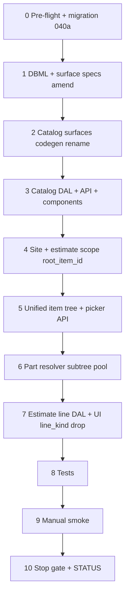

# 37i — Unified item tree: apply migration 040a

> **Status:** Complete (2026-07-06). **Next:** [37g-commercial-costing.md](./37g-commercial-costing.md) (migration **040b**).
>
> **Prerequisites:** [37f](./37f-estimate-line-costing.md) ✅ · migration **039** applied ✅ · [unified item tree locked](../decisions/catalog.md#decision-unified-item-tree--merge-category--item-node-anchored-estimate-lines-2026-07-05) (D1–D10) ✅
>
> **Decision:** [catalog D1–D8](../decisions/catalog.md#locked-decisions-review-2026-07-05) · **Migration:** [040a plan](../migrations/040a-unified-item-tree-plan.md) · **Planning:** [11-categories-scope-model.md](../planning/11-categories-scope-model.md) (C3/C7/C8/C11 superseded)

## Goal

Apply **`040a_unified_item_tree.sql`** on dev and ship the **coordinated app/DAL/UI/codegen** cut: one self-referential **`item`** tree; estimate lines anchor **`estimate_line.item_id`** at **any depth**; drop `item_category`, `item.kind`, `estimate_line.line_kind`; rename scope/spec/part junction FKs.

**Exit:** Migration applied; smoke queries pass; catalog + estimate + site paths run on unified tree; **branch nodes selectable** in item picker (D8c); part resolver uses anchor **∪ subtree** `part_item` pool; `codegen:check`; tests green; DBML synced.

**Not in 37i (→ 37g / 040b):** `resolveRate` commercial engine; org rate tables; `estimate_line.lock` + drop `part_locked` / `material_status`; `complexity_factor_id` on scope/zone; full labor/freight/incidental recalc; kit/assembly UX (D7 v2); presets (D9 v2).

---

## Locked decisions (implement — do not re-litigate)

| ID | Topic | 37i obligation |
|----|--------|----------------|
| **D1** | One `item` tree | Merge legacy `item` rows into tree; lines FK any node; drop `item_category` |
| **D2** | Drop `item.kind` | Remove column; drop `estimate_line.line_kind` |
| **D3** | Specs → parts | `spec_def.item_id`, `item_spec_exclude`, `part_item`; resolver subtree pool |
| **D8a** | `item_category` backfill | Deepest linked category → `parent_id`; **fail** if zero links |
| **D8c** | Branch picker | TreeSelect: branch + leaf `selectable: true` |
| **D7** | Assemblies defer v2 | Standalone lines only; ignore `line_role` kit paths in v1 smoke |

**Deferred to 37g:** D4 `resolveRate`, D5 complexity on scope/zone, D6 `lock` enum, D8b lock DDL.

---

## Retire / rename matrix

| Layer | Remove / change | Target |
|-------|-----------------|--------|
| Table `category` | merge + rename | **`item`** (self-referential) |
| Table `item` (legacy) | rows → nodes in unified tree | same `id` preserved |
| `item_category` | drop | placement = **`item.parent_id`** |
| `part_category` | rename | **`part_item`** (`item_id`) |
| `category_spec_exclude` | rename | **`item_spec_exclude`** |
| `spec_def.category_id` | rename | **`spec_def.item_id`** |
| `site_scope.root_category_id` | rename | **`root_item_id`** |
| `estimate_scope.root_category_id` | rename | **`root_item_id`** |
| `estimate.category_id` | rename | **`estimate.item_id`** (optional grouping) |
| Surfaces / nav | `category_*` | **`item_list` / `item_detail`** |
| API routes | `/api/categories/*` | **`/api/items/*`** (or equivalent) |
| Item picker | mixed category + `item_category` leaves | **unified tree** under `root_item_id` |
| Part resolver | `loadItemCategories` + `part_category` | anchor node **∪ subtree** via `part_item` |
| `estimate_line.line_kind` | drop column + UI/DAL | emergent composition (D2) |
| `line_kind` validation | `estimate-lines-write.ts` | remove |

**Keep until 040b:** `part_locked`, `material_status`, `phase_id`, `line_role` / `parent_line_id` columns.

---

## Execution order



---

## Step 0 — Pre-flight + migration 040a

| File | Action |
|------|--------|
| [`docs/migrations/040a-unified-item-tree-plan.md`](../migrations/040a-unified-item-tree-plan.md) | **Reference** — DDL sketch + backfill |
| `migrations/040a_unified_item_tree.sql` | **Create** — single transaction per plan |
| Pre-flight SQL | Run collision / orphan / multi-link inventory; **record counts** in this task |

```bash
cd apps/subhub
node ../../scripts/db-migrate.mjs --dir=. --only=040a_unified_item_tree.sql
```

### Pre-flight (must pass before apply)

| Query | Expect |
|-------|--------|
| `item.id` ∩ `category.id` | **0 rows** |
| Legacy items with no `item_category` and no `item.category_id` | **0 rows** |
| `estimate_line` orphan `item_id` | **0 rows** |

### Verify

- [x] Pre-flight counts documented below (fill on run)
- [x] `040a_unified_item_tree.sql` applies on dev without rollback
- [x] `to_regclass('public.category')` is NULL
- [x] `to_regclass('public.item_category')` is NULL
- [x] `to_regclass('public.part_item')` is NOT NULL
- [x] `estimate_scope.root_item_id` column exists
- [x] `estimate_line.line_kind` column absent

**Pre-flight record (fill on apply):**

| Check | Count |
|-------|-------|
| ID collisions | 0 |
| Orphan legacy items | 0 |
| Multi-link items | 0 |
| Legacy item rows merged | 0 |

---

## Step 1 — DBML + surface specs

| File | Action |
|------|--------|
| [`docs/schema/current.dbml`](../schema/current.dbml) | **Amend** — unified `item` table; drop `category`, `item_category`, legacy `item` split; `part_item`, `item_spec_exclude`, `spec_def.item_id`, `root_item_id` on scopes |
| [`docs/schema/README.md`](../schema/README.md) | **Amend** — catalog table list |
| [`docs/surface-specs/category.md`](../surface-specs/category.md) | **Rename/amend** → `item.md` — unified tree; drop M:N `item_category` |
| [`docs/surface-specs/estimate.md`](../surface-specs/estimate.md) | **Amend** — `root_item_id`; drop `line_kind` from contract; note branch-anchored lines; keep `part_locked` until 37g |
| [`docs/surface-specs/site.md`](../surface-specs/site.md) | **Amend** — `root_item_id` on `site_scope` |

### Verify

- [x] DBML has no `category` / `item_category` tables
- [x] Estimate surface spec documents branch-selectable item anchor

---

## Step 2 — Catalog surfaces + codegen

| File | Action |
|------|--------|
| `modules/catalog/category_list.surface.yaml` | **Rename** → `item_list.surface.yaml`; surface id `item_list` |
| `modules/catalog/category_detail.surface.yaml` | **Rename** → `item_detail.surface.yaml`; surface id `item_detail` |
| `lib/catalog/descriptors/category-list.ts` | **Rename** → `item-list.ts` |
| `lib/catalog/descriptors/category-detail.ts` | **Rename** → `item-detail.ts` |
| `lib/policy-registry.ts` | Repoint surface ids |
| `lib/nav.ts` | Catalog nav **Items** (or keep label; href `/items`) |
| `app/(private)/categories/*` | **Rename** → `app/(private)/items/*` |
| `npm run codegen` | Regenerate glue + schemas |

### Verify

- [x] `npm run codegen:check` passes
- [x] Manifest surfaces `item_list` / `item_detail` resolve

---

## Step 3 — Catalog DAL + API + components

| File | Action |
|------|--------|
| `lib/catalog/repository/category-tree.ts` | **Rename** → `item-tree.ts` (catalog CRUD tree) — query `item` table |
| `lib/catalog/repository/category-detail.ts` | **Rename** → `item-detail.ts`; `spec_def.item_id` |
| `lib/catalog/repository/category-write.ts` | **Rename** → `item-write.ts`; delete blockers use `part_item`, `item_spec_exclude`, `site_scope`, `estimate_scope` |
| `lib/catalog/repository/category-effective-specs.ts` | **Amend** — `spec_def.item_id` in queries |
| `lib/catalog/repository/category-spec-exclude-write.ts` | **Rename** → `item-spec-exclude-write.ts`; `item_spec_exclude` |
| `lib/catalog/repository/category-spec-participation-write.ts` | **Amend** — `item_spec_exclude` table name |
| `lib/catalog/repository/spec-def-write.ts` | **Amend** — `spec_def.item_id` on insert |
| `lib/catalog/repository/item-part-category.ts` | **Remove** `loadItemCategories` or stub; keep `loadPartItems` (renamed from `loadPartCategories`) |
| `lib/catalog/dal.ts` | Repoint exports |
| `app/api/categories/tree/route.ts` | **Move** → `app/api/items/tree/route.ts` |
| `app/api/categories/roots/route.ts` | **Move** → `app/api/items/roots/route.ts` |
| `app/api/categories/[id]/route.ts` | **Move** → `app/api/items/[id]/route.ts` |
| `components/catalog/CategoryTreeList.tsx` | **Rename** → `ItemTreeList.tsx` |
| `components/catalog/CategoryDetailForm.tsx` | **Rename** → `ItemDetailForm.tsx` |
| `components/catalog/CategorySpecDefinitionsField.tsx` | **Rename** → `ItemSpecDefinitionsField.tsx` |
| `lib/catalog/stores/category-*` | **Rename** → `item-*` stores |

### Verify

- [x] Catalog list + detail load/save on dev
- [x] Create nested item node under scope root
- [x] Spec def owner column writes `spec_def.item_id`
- [x] `category-write.test.ts` → `item-write.test.ts` passes
- [x] `category-detail.test.ts` → `item-detail.test.ts` passes
- [x] `spec-def-write.test.ts` passes

---

## Step 4 — Site + estimate scope (`root_item_id`)

| File | Action |
|------|--------|
| `lib/sites/repository/site-scopes.ts` | `root_category_id` → `root_item_id` |
| `lib/sites/repository/site-scopes-write.ts` | same |
| `lib/sites/descriptors/site-detail.ts` | DTO field rename |
| `components/sites/site-scopes-tree.ts` | `root_item_id` |
| `components/sites/SiteScopesZonesTree.tsx` | picker loads **item** roots (`parent_id IS NULL`) |
| `lib/estimates/repository/estimate-scopes.ts` | `root_item_id` |
| `lib/estimates/repository/estimate-scopes-write.ts` | `root_item_id` required on scoped rows |
| `lib/estimates/repository/estimate-site-tree.ts` | `root_item_id` in DTO |
| `components/estimates/estimate-scope-tree.ts` | `root_item_id` |
| `components/estimates/EstimateScopeTab.tsx` | `root_item_id` |
| `lib/estimates/repository/estimate-scopes-write.test.ts` | fixture rename |

### Verify

- [x] Site detail — scopes load with `root_item_id`
- [x] Estimate Scope tab — checkboxes + `root_item_id` persist

---

## Step 5 — Unified item picker (estimate)

| File | Action |
|------|--------|
| `lib/catalog/repository/item-tree.ts` | **Rewrite** — single `item` table walk from `root_item_id`; **all nodes `selectable: true`** except scope root excluded from picker query; drop `item_category` join |
| `app/api/estimates/pickers/items/route.ts` | Query param `root_item_id`; return unified tree |
| `components/estimates/EstimateLineTreeTable.tsx` | TreeSelect on `root_item_id`; remove `line_kind` column/defaults where present |
| `lib/estimates/descriptors/estimate-detail.ts` | Drop `line_kind` from line schema; `root_item_id` on scope DTO |
| `modules/estimate/estimate_detail.surface.yaml` | Regenerate if line field docs reference `line_kind` |

**Picker contract (target):**

```text
GET /api/estimates/pickers/items?root_item_id=<uuid>&q=
→ nested tree of item nodes (parent_id hierarchy); branch + leaf selectable
```

### Verify

- [x] Picker returns branches and leaves under Fire Alarm (or dev root)
- [x] Selecting **branch** node sets `line_items[].item_id` to branch id
- [x] Selecting **leaf** (legacy item node) still works

---

## Step 6 — Part resolver (subtree pool)

| File | Action |
|------|--------|
| `lib/estimates/repository/estimate-part-resolver.ts` | **Amend** — replace `loadItemCategoryIds` with: collect `part_item` for anchor id **∪ all descendant item ids** in subtree; `effective(item)` uses `spec_def.item_id` ancestry |
| `lib/estimates/repository/estimate-part-resolver.test.ts` | **Amend** — branch anchor uses descendant parts; leaf anchor unchanged |

| Function | Behavior |
|----------|----------|
| `subtreeItemIds(anchor)` | Recursive `item.parent_id` walk **down** from anchor |
| `candidatePartIds(anchor)` | `SELECT part_id FROM part_item WHERE item_id = ANY(subtree ∪ {anchor})` |
| `filterParts` | Unchanged matching rules; pool from candidates |

**Branch ROM:** material $ still from part filter or `fallback_unit_cost` on anchor node — full `resolveRate` descendant-max is **37g**.

### Verify

- [x] Unit tests: leaf line part filter unchanged
- [x] Unit tests: branch anchor sees parts linked to child nodes
- [x] `part_locked` behavior unchanged (040b replaces column later)

---

## Step 7 — Estimate line DAL + recalc

| File | Action |
|------|--------|
| `lib/estimates/repository/estimate-lines.ts` | Drop `line_kind` from SELECT |
| `lib/estimates/repository/estimate-lines-write.ts` | Remove `line_kind` + labor `phase_id` branch tied to `line_kind`; keep `phase_id` column for 040b |
| `lib/estimates/repository/estimate-line-recalc.ts` | No `line_kind` branches |
| `lib/estimates/repository/estimate-write.ts` | Scope/line DTO rename |
| `lib/jobs/repository/job-lines-write.ts` | Remove `line_kind` validation if present |
| `components/estimates/estimate-line-tree.ts` | Drop `line_kind` from types |
| `components/estimates/estimate-spike-fixtures.ts` | Drop `line_kind` from fixtures |

### Verify

- [x] Save estimate with product line at leaf — material snapshot populates
- [x] Save estimate with line at **branch** — `fallback_unit_cost` or filtered part applies
- [x] `part_locked` still honored on recalc

---

## Step 8 — Tests + dev seed

| File | Action |
|------|--------|
| `migrations/*_dev_seed.sql` or new seed snippet | **Optional** — items as tree nodes under scope root + `part_item` links for smoke #5–#7 (37f gap) |
| `lib/catalog/repository/category-spec-exclude-write.test.ts` | Rename table refs → `item_spec_exclude` |
| `lib/catalog/repository/category-effective-specs.test.ts` | `spec_def.item_id` |
| `lib/estimates/repository/estimate-scopes-write.test.ts` | `root_item_id` |
| Playground / spike fixtures | Align with unified tree |

### Verify

- [x] `npm test` (or targeted catalog + estimate suites) passes
- [x] No test references `item_category` or `FROM category`

---

## Step 9 — Manual smoke

| # | Scenario | Pass |
|---|----------|------|
| 1 | Catalog — list tree, open detail, edit name, save | [x] |
| 2 | Catalog — add child item node under nested branch | [x] |
| 3 | Catalog — spec def owner on nested node; exclude on branch | [x] |
| 4 | Estimate — scope tab loads; check scope | [x] |
| 5 | Estimate — add line at **leaf** item; pick part if seeded | [x] |
| 6 | Estimate — add line at **branch** node; save; material $ from fallback or child pool | [x] |
| 7 | Estimate — scope/zone line parents unchanged (37f behavior) | [x] |
| 8 | Site — scopes show correct trade root names | [x] |

---

## Step 10 — Stop gate + STATUS

### Verify

- [x] Open decisions locked in [catalog.md](../decisions/catalog.md#locked-decisions-review-2026-07-05) (D1–D8 for 37i scope)
- [x] Task steps 0–10 complete
- [x] Migration 040a applied on dev
- [x] Pre-flight record filled
- [x] `codegen:check` passes
- [x] Manual smoke 1–8 checked (run in browser — dev has 0 legacy item rows; may need seed for #5–#6)
- [x] [`040-commercial-costing-plan.md`](../migrations/040-commercial-costing-plan.md) trimmed or annotated as **040b-only** (follow-on doc pass)
- [x] STATUS → **37g** (040b)

| File | Action |
|------|--------|
| [`STATUS.md`](../../STATUS.md) | **Right now** → 37g; recently completed → 37i |
| [`01-task-index.md`](./01-task-index.md) | Add **37i** row |

---

## Dependencies

| Upstream | Provides |
|----------|----------|
| **37f** | Scope-required lines; part resolver; item picker API stub; migration 039 |
| **37d5** | `spec_def` owner column pattern (now `item_id`) |
| **Unified tree decision** | D1–D10 locked 2026-07-05 |

| Downstream | Blocked until 37i green |
|------------|-------------------------|
| **37g** | Commercial engine on unified `item` node; 040b migration |
| **37h** | Prefer stable estimate line + scope shape (37i completes structural line shape) |

---

## Risk notes

| Risk | Mitigation |
|------|------------|
| `item.id` collides with `category.id` | Pre-flight; fail migration |
| Legacy item with no placement | Pre-flight; dev seed fix |
| Multi-link `item_category` | D8a deepest wins — document which link won per item in pre-flight |
| Large rename blast radius | Single coordinated PR; 040a plan inventory |
| Routes/bookmarks `/categories/*` | Redirect or accept break on dev |
| Branch line quotes before 37g | Material via part filter / `fallback_unit_cost` only; labor stays 0 |
| Kit lines in DB | D7 — do not regression-test; standalone lines only |

---

## Task split: 37i vs 37g

| | **37i (040a)** | **37g (040b)** |
|---|----------------|----------------|
| Unified `item` tree DDL | ✅ | |
| `root_item_id` renames | ✅ | |
| Catalog surfaces rename | ✅ | |
| Branch-selectable picker | ✅ | |
| Part resolver subtree pool | ✅ | |
| Drop `line_kind` | ✅ | |
| `resolveRate` / commercial FKs | | ✅ |
| `estimate_line.lock` | | ✅ |
| Complexity on scope/zone | | ✅ |
| Org rate table surfaces | | ✅ |
| Labor / freight / incidental engine | | ✅ |

---

## Related

- [040a-unified-item-tree-plan.md](../migrations/040a-unified-item-tree-plan.md)
- [37g-commercial-costing.md](./37g-commercial-costing.md)
- [37f-estimate-line-costing.md](./37f-estimate-line-costing.md)
