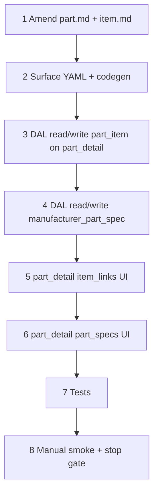

# 37j — Catalog part authoring: part pool + part specs UI

> **Status:** Complete (2026-07-06). Next: [37k](./37k-part-spec-lifecycle.md) — part spec lifecycle (prune, option diff, UI warnings).
>
> **Prerequisites:** [37i](./37i-unified-item-tree-apply.md) ✅ · [37f](./37f-estimate-line-costing.md) ✅ · [37g](./37g-commercial-costing.md) ✅ · dev seed [043](../migrations/043_catalog_fire_alarm_dev_seed.sql) *(optional smoke data)*
>
> **Decisions (locked upstream):** [unified item tree D3](../decisions/catalog.md#locked-decisions-review-2026-07-05) (specs filter `part_item` pool) · [spec_def value types + part matching](../decisions/catalog.md#decision-spec_def-value-types-and-part-matching-rules-2026-07-02) · [assign-once spec participation](../decisions/catalog.md#decision-category-spec-participation--assign-once-branch-exclude-2026-07-03)
>
> **Specs to amend:** [`part.md`](../surface-specs/part.md) · [`item.md`](../surface-specs/item.md)

## Goal

Ship **catalog admin UI** so admins can maintain estimate material data without SQL seeds:

1. **Assign parts to item tree nodes** — `part_item` M:N (`part_id`, `item_id`, `sort_order`).
2. **Author part compatibility specs** — `manufacturer_part_spec` rows on `part_detail` (**enum / boolean / text** v1; `number` → follow-up migration).

**Exit:** CRUD on `/parts/[id]` — assign part → items (`item_links`) + compatibility specs (`part_specs`); **no** part-pool edit on `/items/[id]` v1; estimate part resolver unchanged; `codegen:check`; DAL tests; manual smoke on product estimate lines (#5–#7 from [37f](./37f-estimate-line-costing.md#manual-smoke)).

**Not in scope:** `item_part_link` / assembly BOM (`link_role`, qty) — **D7 v2**; `manufacturer_part.specs` free-text column; cut sheets / submittals; bulk import; line-level `estimate_line_spec` editor; changing part-matching algorithm.

---

## `part_item` vs `item_part_link` (terminology)

| Table | What it means | v1 task? |
|-------|----------------|----------|
| **`part_item`** | “This MPN is in the **candidate pool** when an estimator picks this item (or a descendant branch).” Simple link: `part_id` + `item_id` + `sort_order`. | **Yes — J1 locked** |
| **`item_part_link`** | “This item is **composed of** these parts” (assembly kit) or “approved **alternate** PN” with `link_role` + `quantity`. | **No — defer v2** |

**Estimate resolver today** (`estimate-part-resolver.ts`): collects `part_id` from `part_item` where `item_id` ∈ **anchor node ∪ subtree**. Assigning a part to a **parent** item makes it available when quoting that branch or any child.

---

---

## Locked decisions (implement — do not re-litigate)

| ID | Topic | Choice |
|----|--------|--------|
| **J1** | Assignment table | **`part_item`** only — `item_part_link` deferred to assemblies v2 (D7) |
| **J2** | Primary authoring Surface | **`part_detail` only** — writable Field **`item_links`** (`part_item`); **`item_detail` omits `part_pool`** v1 (no add/remove on `/items`) |
| **J3** | Nodes that accept parts | **Any tree node** (root scope, branch, leaf) |
| **J4** | `item_links` UX on `part_detail` | **Replace-array** — item tree picker rows (`item_id`, denormalized name + breadcrumb, `sort_order`) |
| **J5** | Part specs Surface | **`part_detail` only** — Field `part_specs` on same form as `item_links` |
| **J6** | Which defs on part form | **Contextual union** — effective `spec_def` ids for scope roots of `item_links` (linked item → root subtree participation) |
| **J7** | Enum multi-value on part | **One `manufacturer_part_spec` row per allowed `spec_option_id`** |
| **J8** | `number` value type | **Defer** — ship enum / boolean / text in 37j; `value_number` DDL + UI in **37j-follow** (migration `044`) |
| — | Part filter engine | Unchanged — [matching rules](../decisions/catalog.md#decision-spec_def-value-types-and-part-matching-rules-2026-07-02) |
| — | Subtree pool | `part_item` for anchor **∪ descendants** — [37i](./37i-unified-item-tree-apply.md) |
| — | `manufacturer_part.specs` text | Human notes only — never used for filtering |
| — | Writable schemas | `.strict()` POST/PATCH; manifest-narrowed Fields |
| — | Delete blockers | Existing `item-write` / `part-write` blocker queries stay |

---

## Execution order



---

## Step 0 — Lock decisions

| File | Action |
|------|--------|
| This file | Fill **Choice** column for J1–J8; move locked rows to § Locked decisions |
| [`docs/decisions/catalog.md`](../decisions/catalog.md) | Add dated **Decision: catalog part authoring UI** block when J1–J8 closed |

### Verify

- [x] J1 resolved
- [x] J2 resolved (amended 2026-07-06)
- [x] J3 resolved
- [x] J4 resolved (with J2 — replace-array on `part_detail`)
- [x] J5 resolved
- [x] J6 resolved
- [x] J7 resolved
- [x] J8 resolved — enum / boolean / text v1; number deferred to 37j-follow
- [x] [`docs/decisions/catalog.md`](../decisions/catalog.md) — catalog part authoring UI decision added

---

## Step 1 — Surface specs

| File | Action |
|------|--------|
| [`docs/surface-specs/item.md`](../surface-specs/item.md) | **No `part_pool` Field v1** — assignment deferred to `part_detail`; note read-only reverse nav optional later |
| [`docs/surface-specs/part.md`](../surface-specs/part.md) | Add **`item_links`** + **`part_specs`** Fields; retire “defer specs” from locked answers |
| [`docs/surfaces.md`](../surfaces.md) | Align `part_detail` field table |

### `part_detail` — `item_links` element (target)

```json
{
  "item_id": "<uuid>",
  "name": "Addressable smoke detector",
  "breadcrumb": "Fire Alarm / Initiating",
  "sort_order": 1
}
```

### `part_detail` — `part_specs` element (target)

```json
{
  "spec_def_id": "<uuid>",
  "code": "slc_protocol",
  "display_name": "SLC protocol",
  "value_type": "enum",
  "spec_option_id": "<uuid>",
  "option_display_name": "Fire-Lite LiteSpeed",
  "value_text": null,
  "value_boolean": null
}
```

Enum defs may appear as **multiple rows** (one per compatible option). Boolean/text: one row per def.

### Verify

- [x] `part.md` + `item.md` A–K amended
- [x] No doc still says part assignment is seed-only

---

## Step 2 — Surface YAML + codegen

| File | Action |
|------|--------|
| `modules/part/part_detail.surface.yaml` | Add logical Fields **`item_links`** (`part_item`) + **`part_specs`** (`manufacturer_part_spec`, `spec_def`, `spec_option`) |
| `modules/catalog/item_detail.surface.yaml` | **No change** — no `part_pool` v1 |
| `npm run codegen` | Regenerate glue/schema/store |

### Verify

- [x] `npm run codegen:check` passes

---

## Step 3 — DAL: `part_item` (via `part_detail`)

| File | Action |
|------|--------|
| `lib/parts/repository/part-item-links.ts` | **Create** — `loadItemLinks(pool, partId)`, `replaceItemLinks(pool, partId, rows)` |
| `lib/parts/repository/part-detail.ts` (or get) | **Amend** — include `item_links` in GET when readable |
| `lib/parts/repository/part-write.ts` | **Amend** — PATCH `item_links` replace-array; validate `item_id` exists |
| `lib/catalog/repository/item-part-category.ts` | **Retire or alias** — stub `loadPartItems` → new module |

**Semantics:** replace-array — upsert by `item_id`; delete omitted rows; `sort_order` from array index. Same `part_item` rows as before; authoring direction is part → items.

### Verify

- [x] Unit tests: round-trip, delete omitted row, duplicate `item_id` rejected

---

## Step 4 — DAL: `manufacturer_part_spec`

| File | Action |
|------|--------|
| `lib/parts/repository/part-specs.ts` | **Create** — load/write spec rows for part |
| `lib/parts/repository/part-detail.ts` (or `get`) | **Amend** — `part_specs` in read DTO |
| `lib/parts/repository/part-write.ts` | **Amend** — PATCH `part_specs` replace-array |
| `lib/catalog/repository/spec-def-write.ts` | Reuse delete-blocker query (already references `manufacturer_part_spec`) |

**J6 implementation note:** `listDefsForPart(pool, partId)` — defs effective on any `part_item`-linked item node (walk each link’s scope root subtree participation union). Cache per GET if needed.

Optional migration (if **J8** = same task):

| File | Action |
|------|--------|
| `migrations/044_spec_def_number_type.sql` | `spec_def.unit`, `value_number` on `manufacturer_part_spec` + bucket tables per [37f step 6](./37f-estimate-line-costing.md) |

### Verify

- [x] Unit tests: enum multi-row, boolean/text, strict reject unknown keys
- [x] Delete `spec_def` still blocked when part rows reference it

---

## Step 5 — UI: `part_detail` item links

| File | Action |
|------|--------|
| `components/parts/PartItemLinksField.tsx` | **Create** — item tree picker + table; pattern `PartVendorPricingFields` |
| `components/parts/PartDetailForm.tsx` | **Amend** — section after `vendor_pricing` |
| `lib/hooks/use-item-tree-picker.ts` | **Create or extend** — pick any item node under org tree |

**Empty state:** “Not assigned to any items — add an item to include this part in estimate resolution.”

### Verify

- [x] Save round-trip assigns part to 2+ items
- [x] Linked item shows part in estimate part picker smoke

---

## Step 6 — UI: `part_detail` part specs

| File | Action |
|------|--------|
| `components/parts/PartSpecsField.tsx` | **Create** — rows per J7; enum option multi-select → multiple rows |
| `components/parts/PartDetailForm.tsx` | **Amend** — section after `item_links` |

### Verify

- [x] Save round-trip on part with enum + boolean defs
- [x] 043 seed parts editable in UI without SQL

---

## Step 7 — Tests

```bash
cd apps/subhub
npm test -- --run part-item-links part-specs part-write estimate-part-resolver
npm run codegen:check
npm run build
```

### Verify

- [x] Targeted tests pass
- [x] Build succeeds

---

## Step 8 — Manual smoke + stop gate

1. **Part** — open MPN; assign to 2+ items via **Item links**; set SLC protocol spec row; save/reload.
2. **Estimate** — product line on a linked item; scope specs → single PN auto-fill or filtered picker ([37f](./37f-estimate-line-costing.md) scenarios #5–#7).

| File | Action |
|------|--------|
| This file | Mark **Status:** Complete; all verify `[x]` |
| [`STATUS.md`](../../STATUS.md) | Repoint **Right now** |
| [`docs/tasks/01-task-index.md`](./01-task-index.md) | Mark 37j complete |

### Verify (stop gate)

- [x] J1–J8 locked in decisions + this file
- [x] `item_links` + `part_specs` shipped on `/parts/[id]`
- [x] Estimate part filter smoke passes without 043-only data
- [x] `npm run test` green
- [x] STATUS updated

---

## Dependencies

| Upstream | Provides |
|----------|----------|
| **24** | `part_list` / `part_detail`, `manufacturer_part` |
| **37d–37d5** | `spec_def` owner model, participation |
| **37i** | `part_item` table, unified `item_detail` |
| **37f** | Part resolver (consumer only) |

| Downstream | Needs from 37j |
|------------|----------------|
| [37k](./37k-part-spec-lifecycle.md) | Prune + option guards + part warnings |
| Estimate line polish | Real catalog data for demos |
| **D7 v2** assemblies | May introduce `item_part_link` separately |

---

## Risk notes

| Risk | Mitigation |
|------|------------|
| J6 “defs for part” query expensive | Modest catalog size; single GET per part detail |
| Number type not migrated | Ship J8 phase 1 without number; inert defs hidden or read-only |
| Duplicate `part_item` rows | PK `(part_id, item_id)` — DAL validation |
| Scope root part pool | Allowed if J3 = any node; document that roots usually own specs not parts |
