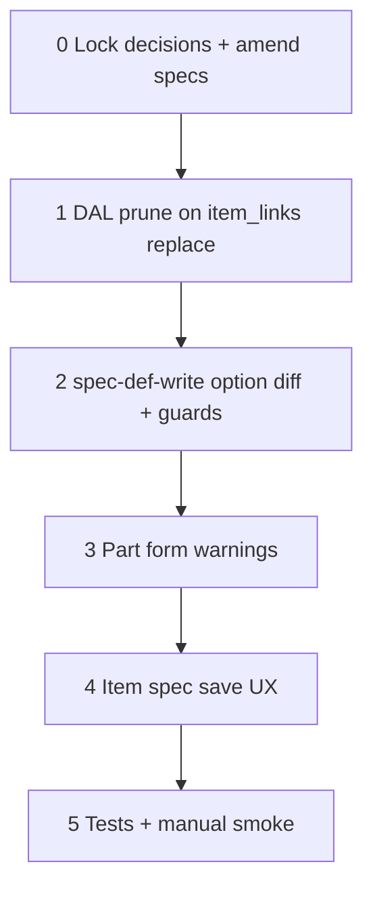

# 37k — Part spec lifecycle: prune, option diff, UI warnings

> **Status:** Complete (2026-07-06). Next: [37f](./37f-estimate-line-costing.md) manual smoke #5–#7 (optional).
>
> **Prerequisites:** [37j](./37j-catalog-part-authoring.md) ✅ · [37d5](./37d5-category-spec-owner-column.md) ✅ (`spec_def` owner model) · [37i](./37i-unified-item-tree-apply.md) ✅ (`unionEffectiveForItems`)
>
> **Parent context:** [37j](./37j-catalog-part-authoring.md) shipped `item_links` + `part_specs` UI and replace-array writes. Runtime gaps remain between **catalog edits**, **part link changes**, and **`manufacturer_part_spec` rows** in the DB.
>
> **Specs to amend:** [`part.md`](../surface-specs/part.md) § K edge cases · [`item.md`](../surface-specs/item.md) § spec_definitions lifecycle

## Goal

**Rewrite behaviors, not structures.** Keep `part_item`, `manufacturer_part_spec`, contextual union (J6), and replace-array PATCH semantics from 37j. Close lifecycle gaps so admins cannot silently orphan or lose compatibility data.

**Exit:**

1. **Prune** — `manufacturer_part_spec` rows are removed when a part’s linked items or effective spec union **shrinks** (server-side; not UI-only).
2. **Option writes** — item `spec_definitions` save no longer **blindly deletes all** `spec_option` rows per def; referenced options are protected or diff-updated.
3. **Part UI warnings** — light feedback when link changes affect compatibility specs or when saved DB rows are outside the current union (pre-save).

**Not in scope:** New tables; moving `part_specs` to `item_detail`; estimate resolver algorithm changes; migration `044` (`number` type); bulk “impact report” across all parts; `item_part_link` / assemblies (D7 v2).

---

## Problem statement (37j gaps)

| Gap | Today | Risk |
|-----|--------|------|
| **Link shrink without `part_specs` PATCH** | `replaceItemLinks` updates `part_item` only; `manufacturer_part_spec` untouched until part save | Orphan rows in DB; confusing GET until re-save |
| **UI-only stale drop** | `mergePartSpecsWithDefs` hides stale defs in the form | DB diverges if user changes links and navigates away |
| **Item enum option save** | `replaceSpecDefinitionsTx` → `DELETE FROM spec_option WHERE spec_def_id = …` then re-insert | FK may CASCADE-delete or SET NULL part rows (see § Locked K2); silent compatibility loss |
| **Spec def delete** | Already blocked when parts reference def (`spec_def_in_use`) | OK — keep |
| **Participation / exclude change** | Does not touch `manufacturer_part_spec` | Rows inert at estimate time but stale in DB until prune |

Estimate resolver (`estimate-part-resolver.ts`) already ignores defs outside `unionEffectiveForItems` for the line’s item — **no resolver rewrite** required for correctness; prune improves data hygiene and admin trust.

---

## Locked decisions (implement — do not re-litigate)

| ID | Topic | Choice |
|----|--------|--------|
| **K1** | Prune trigger | **On `item_links` replace** (and optionally after participation changes — defer to K1b) — delete `manufacturer_part_spec` rows whose `spec_def_id` ∉ contextual union for the part’s current links |
| **K1b** | Participation-only shrink | **Defer v1** — prune on link replace only; document that item participation edits require part re-save or a future hook |
| **K2** | `spec_option` delete policy | **Protect referenced options** — diff-based option upsert; **block** removal of options referenced by `manufacturer_part_spec` (mirror `assertSpecDefDeletable` for options) |
| **K3** | FK documentation | **Align DBML with shipped DDL** — verify actual `manufacturer_part_spec.spec_option_id` FK (`028` CASCADE vs DBML `set null`); document chosen runtime policy in [`catalog.md`](../decisions/catalog.md) |
| **K4** | Prune without part save | **Server always prunes** on link replace — clients cannot leave orphans via `item_links`-only PATCH |
| **K5** | Part UI | **Inform, don’t block** — secondary text / banner when links dirty or GET has specs outside union; mark form dirty when links change affects specs |
| **K6** | Item UI | **Confirm or block** when option removal would break parts — reuse DAL guard; no silent CASCADE reliance |
| **K7** | Empty enum selections on save | **Unchanged** — `expandPartSpecsForPatch` omits blank rows; replace-array clears unspecified values (37j J7) |

---

## Execution order



---

## Step 0 — Lock decisions + docs

| File | Action |
|------|--------|
| This file | Close **K1–K7** in § Locked decisions when implementation starts |
| [`docs/decisions/catalog.md`](../decisions/catalog.md) | Add **Decision: part spec lifecycle (2026-07-06)** — K1–K7 summary |
| [`docs/surface-specs/part.md`](../surface-specs/part.md) | § K — prune on link save; stale-row banner behavior |
| [`docs/surface-specs/item.md`](../surface-specs/item.md) | § spec_definitions — option diff write; block referenced option delete |
| [`docs/schema/current.dbml`](../schema/current.dbml) | Fix `manufacturer_part_spec.spec_option_id` ref if DDL audit differs from DBML |

### Verify

- [x] K1–K7 locked in decisions + this file
- [x] Surface specs amended (behavior only; no new Fields)

---

## Step 1 — DAL: prune `manufacturer_part_spec` on link shrink

| File | Action |
|------|--------|
| `lib/parts/repository/part-specs.ts` | **Add** `prunePartSpecsToContextTx(client, partId)` — load links → `unionEffectiveForItems` → `DELETE` rows where `spec_def_id` not in union |
| `lib/parts/repository/part-item-links.ts` | **Amend** `replaceItemLinksTx` — call prune after link replace (same transaction) |
| `lib/parts/stores/part-detail-store.ts` | **Confirm** `replaceRelated` order: `item_links` then `part_specs` (unchanged); prune runs inside links replace |

**Semantics:**

- Prune runs even when PATCH omits `part_specs`.
- Prune is **idempotent** — safe when union grows or unchanged.
- No prune when link list empty → delete **all** `manufacturer_part_spec` for part (or equivalent: union is empty).

### Verify

- [x] Unit test: shrink links → orphan `spec_def_id` rows removed without `part_specs` in PATCH body
- [x] Unit test: grow links → existing valid rows preserved
- [x] Unit test: clear all links → all part spec rows removed

---

## Step 2 — DAL: diff `spec_option` writes + reference guards

| File | Action |
|------|--------|
| `lib/catalog/repository/spec-def-write.ts` | **Replace** delete-all-options in `upsertSpecDefinitionTx` with diff: update in place by `id`, insert new, delete only unreferenced |
| `lib/catalog/repository/spec-def-write.ts` | **Add** `assertSpecOptionDeletable` — count `manufacturer_part_spec` by `spec_option_id`; throw `spec_option_in_use` |
| `lib/catalog/repository/spec-def-write.test.ts` | **Extend** — block option removal when parts reference; allow rename/sort on same id |

**Do not** change `assertSpecDefDeletable` behavior for whole-def delete.

### Verify

- [x] Unit test: save item spec def with renamed option (same id) — part rows intact
- [x] Unit test: omit option referenced by part — `ValidationError` with structured code
- [x] Unit test: add new option + remove unreferenced option — succeeds

---

## Step 3 — UI: part form warnings

| File | Action |
|------|--------|
| `components/parts/PartSpecsField.tsx` | **Amend** — restore `shouldDirty` when `item_links` change; optional banner when GET specs exist outside current `displayRows` union |
| `components/parts/PartItemLinksField.tsx` | **Optional** — one-line hint: “Saving updates compatibility specs for linked items.” |
| `components/parts/PartDetailForm.tsx` | **Optional** — surface prune result message after save if server pruned rows (only if API returns count; else defer) |

Keep existing `mergePartSpecsWithDefs` + `displayRows` pattern from 37j bugfix — **no structural rewrite**.

### Verify

- [x] Change item links → compatibility section dirty / helper visible
- [x] Open part with DB orphans (simulate) → banner or post-save prune clears rows on save

---

## Step 4 — UI: item spec definitions guard

| File | Action |
|------|--------|
| `components/catalog/ItemSpecDefinitionsField.tsx` (or equivalent) | **Amend** — on save failure `spec_option_in_use`, show actionable error (“N parts use this option — update parts first”) |
| Item detail form | **Optional** — pre-save warning if removing options (requires read-only impact query API — defer if heavy) |

v1 minimum: structured error from Step 2 surfaced in UI.

### Verify

- [x] Manual: remove enum option used on SD365T SLC row → blocked with clear message
- [x] Manual: rename option display name → save succeeds; part compatibility unchanged

---

## Step 5 — Tests + manual smoke

```bash
cd apps/subhub
npm test -- --run part-item-links part-specs spec-def-write
npm run codegen:check
npm run build
```

### Manual smoke

1. **Part link shrink** — SD365T linked to Smoke Detector + another item with extra spec; remove one link; save **without** editing compatibility table → reload → orphan defs gone from GET.
2. **Item option protect** — attempt to delete SLC option referenced by seed part → blocked.
3. **Estimate #5** — unchanged behavior after prune; part filter still matches bucket specs.

### Verify (stop gate)

- [x] K1–K7 locked
- [x] Prune on link replace covered by tests
- [x] Option diff + `spec_option_in_use` covered by tests
- [x] Part + item UI warnings/guards smoke pass
- [x] `npm run test` green
- [x] STATUS + task index updated

---

## Dependencies

| Upstream | Provides |
|----------|----------|
| **37j** | `part_item` + `manufacturer_part_spec` authoring, `listDefsForPart` / `unionEffectiveForItems` |
| **37d5** | `spec-def-write`, `assertSpecDefDeletable` pattern |
| **37f** | Part resolver (consumer; unchanged) |

| Downstream | Needs from 37k |
|------------|----------------|
| Estimate demos | Trustworthy catalog data without orphan specs |
| **044** number type | Cleaner option/def lifecycle before new value columns |

---

## Risk notes

| Risk | Mitigation |
|------|------------|
| Prune too aggressive | Union = `unionEffectiveForItems` only (J6); unit tests per item tree shape |
| Item save UX slower | Option diff is local to one def; no full-catalog scan |
| FK mismatch DDL vs DBML | Step 0 audit; migration only if policy change requires it |
| Participation shrink without link change | Document K1b defer; admins re-save part or wait for follow-up |

---

## Files touched (summary)

| Area | Files |
|------|--------|
| DAL | `part-specs.ts`, `part-item-links.ts`, `spec-def-write.ts` |
| UI | `PartSpecsField.tsx`, `ItemSpecDefinitionsField.tsx` (+ optional `PartDetailForm`) |
| Docs | `catalog.md`, `part.md`, `item.md`, `current.dbml` |
| Tests | `part-specs.test.ts`, `part-item-links.test.ts`, `spec-def-write.test.ts` |
