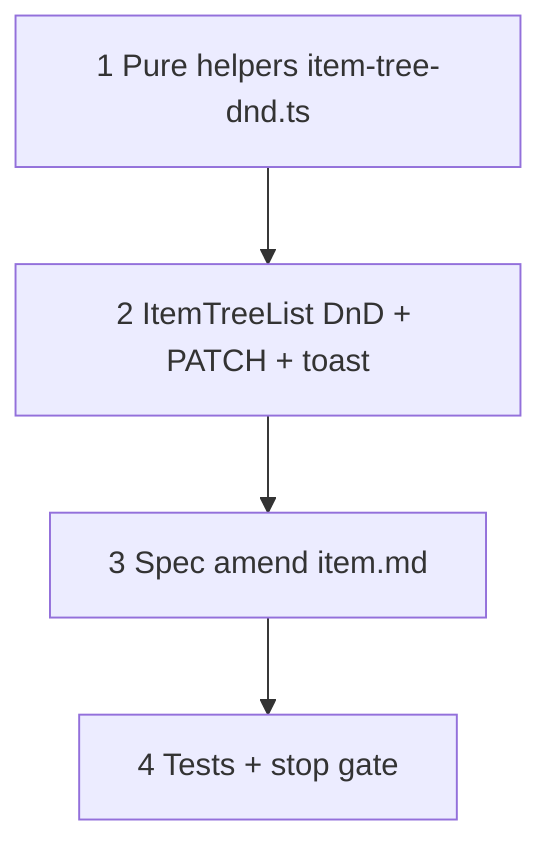

# 37m — Item tree DnD UI (`item_list` reorder + reparent)

> **Status:** Complete (2026-07-07). Next: [37n — labor phase inclusion](./37n-labor-phase-inclusion.md).
>
> **Spec:** [`item.md`](../surface-specs/item.md) · **Builds on:** [37l](./37l-leaf-quotable-item-model.md) (I2–I3 DAL reparent guards) · **Pattern:** [`SiteScopesZonesTree`](../../components/sites/SiteScopesZonesTree.tsx) (antd `draggable` + `allowDrop`; items add **reparent-on-drop**)

## Problem

The `/items` list pane still shows noisy **root / scope / leaf** chips from the 37l rollout. Reparent is only available via the detail form parent picker; `sort_order` is a manual numeric field. The surface spec explicitly deferred list-pane drag ([`item.md`](../surface-specs/item.md) §E / §G).

Catalog authors need to reorganize the tree in place — reorder siblings and move branches — without opening the detail form or touching unrelated profile fields.

## Decisions (locked 2026-07-07)

| # | Topic | Choice |
|---|--------|--------|
| D1 | **Chip cleanup** | Remove **root**, **scope**, and **leaf** text badges from list pane |
| D2 | **Scope roots** | **Bold** font (`fontWeight: 600`) for `node_type === "scope"` (replaces root chip) |
| D3 | **Quotable indicator** | `<Badge status="default" />` dot only after `node_type === "item"` — **no** tooltip |
| D4 | **DnD scope** | **Reorder + reparent** on drop — gap = sibling reorder; drop **on** node = reparent as **last child** (antd default) |
| D5 | **Scope root drag** | Roots reorderable among roots (gap only); **never** reparent under another node |
| D6 | **Save model** | **Separate** from detail Save — optimistic tree on drop, **immediate `PATCH`** (no confirm dialog) |
| D7 | **Feedback** | **Toast only:** success → short message (e.g. `Moved "FPLR" under "Wire"` / `Reordered "FPLR"`); failure → error toast + revert tree |
| D8 | **API** | Reuse `PATCH /api/items/[id]` with `{ profile: { parent_id, sort_order } }` only — no new route or `item_list` write surface |
| D9 | **sort_order** | **Single-node PATCH** (v1) — set dragged node's `sort_order` from drop index; do not renumber all siblings |
| D10 | **Permissions** | Enable drag when `item_detail` manifest grants **write** on `profile` (`parent_id` / `sort_order`) |
| D11 | **Search** | **Disable** DnD while name filter is active (`listQuery.q` set) |
| D12 | **Failure** | Toast error + revert tree to last server load |

**Out of scope:** cross-root moves; drop onto quotable items; `node_type` changes via drag; batch sibling renumber; dirty-detail warning when tree moves selected item.

---

## `allowDrop` rules (UI mirrors 37l I2–I3)

| Dragged | Allowed drop |
|---------|----------------|
| Scope root (`node_type === "scope"`) | Gap among **root** siblings only |
| Category or quotable leaf | Gap among **same-parent** siblings, **or** onto a **non-quotable** node (`scope` \| `category`) in the **same scope root** |
| Any | **Never** onto `node_type === "item"` |
| Any | **Never** across scope roots |
| Any | **Never** onto self or a descendant (cycle) |

Server remains authoritative — `updateItem` + `assertReparentAllowed` reject anything the UI misses.

---

## Target layout

```text
┌─ /items ──────────────────────────────────────────────────────────────┐
│ SurfaceToolbar — New root | New child | Save | Revert | Delete        │
├─ Tree (list pane) ──────────────┬─ Detail pane ───────────────────────┤
│ ▼ Fire Alarm                    │  Profile                            │
│   Initiating                    │    Name [________]                  │
│   Wire                          │    Parent [TreeSelect]              │
│     FPLR ●                      │  ── Commercial / specs … ──         │
│ ▼ Intrusion                     │                                     │
└─────────────────────────────────┴─────────────────────────────────────┘
```

- **Bold** = scope root.
- **●** = `<Badge status="default" />` on quotable leaves only.
- Drag handle via antd `draggable={{ icon: false }}` + `blockNode`.

---

## Execution order



---

## Step 1 — Pure helpers

**Create** `lib/catalog/item-tree-dnd.ts` (or `components/catalog/item-tree-dnd.ts` if UI-adjacent — prefer `lib/` for unit tests).

Export typed helpers over `ItemTreeNode[]` from [`item-list.ts`](../../lib/catalog/descriptors/item-list.ts):

| Function | Purpose |
|----------|---------|
| `findNodeById` | *(move from `ItemTreeList` or re-export)* |
| `resolveScopeRootId(tree, nodeId)` | Walk `parent_id` to root |
| `isDescendantOf(tree, ancestorId, nodeId)` | Cycle guard |
| `allowItemDrop(info, tree)` | antd `TreeProps.allowDrop` predicate |
| `resolveDropPatch(info, tree)` | Returns `{ id, parent_id, sort_order, successMessage }` or `null` |

**Toast copy (D7):**

- Reparent: `Moved "{dragged}" under "{target}"`
- Reorder: `Reordered "{dragged}"`
- Failure: server message or `Unable to move "{dragged}"`

**Drop → patch logic:**

- **Gap drop:** new `parent_id` = dragged node's current parent (or `null` for roots); `sort_order` = 1-based index among target parent's children after insert.
- **On-node drop:** new `parent_id` = target node id; `sort_order` = `target.children.length + 1` (last child).
- Scope root dragged onto non-gap → reject (`allowDrop` false).

### Verify

- [x] Unit tests: reorder among siblings; reparent onto category; blocked drop onto quotable; blocked cross-root; blocked cycle; root gap-only

---

## Step 2 — `ItemTreeList` UI

**Edit** [`components/catalog/ItemTreeList.tsx`](../../components/catalog/ItemTreeList.tsx).

### Title render

```tsx
<span style={node.node_type === "scope" ? { fontWeight: 600 } : undefined}>
  {node.name}
  {node.node_type === "item" ? <Badge status="default" style={{ marginLeft: 8 }} /> : null}
</span>
```

Remove `nodeTypeBadge`, `is_root` badge, and related imports.

### DnD wiring

| Concern | Implementation |
|---------|----------------|
| Writable | Read `item_detail` manifest (via existing hook or `useSurfaceManifest("item_detail")` / list pairing) — `draggable={writable && !searchActive ? { icon: false } : false}` |
| Tree data | Keep local `displayTree` state synced from query; apply optimistic move on drop |
| `allowDrop` | `allowItemDrop` |
| `onDrop` | Compute patch → optimistic `displayTree` → `PATCH` via `surfaceApi.patch("item_detail", id, { profile: { parent_id, sort_order } })` |
| Success | `message.success(successMessage)`; invalidate `item_list`; if `selectedId === id`, invalidate `item_detail` |
| PATCH error | `message.error(...)`; revert `displayTree` to query data (D12) |
| Detail form | **Do not** mark detail RHF dirty; tree save is independent |

Use `App.useApp()` for `message` (same as [`ItemDetailForm`](../../components/catalog/ItemDetailForm.tsx)).

### Verify

- [x] Chips gone; bold roots; dot on quotable leaves only
- [x] Drag disabled when search filter active
- [x] Drop → immediate PATCH → success toast; detail form unchanged when not saving detail
- [x] Invalid drops blocked by antd (`allowDrop`); no PATCH fired

---

## Step 3 — Spec amend

**Edit** [`docs/surface-specs/item.md`](../surface-specs/item.md):

| Section | Change |
|---------|--------|
| §E | Replace "tree DnD reorder deferred" — list pane supports reorder + reparent via drag (immediate PATCH on drop) |
| §G wireframe | Remove `[root]` chip; note bold roots + quotable dot; document DnD + auto-save |
| §G controls | Add row: **Tree drag** → `PATCH` `parent_id` + `sort_order` on drop; toast feedback; independent of detail Save |
| Omit list | Remove "drag reparent" from detail omit line (list pane owns drag; detail keeps parent TreeSelect) |

### Verify

- [x] `item.md` matches D1–D12

---

## Step 4 — Manual smoke

1. Reorder two categories under the same scope — success toast; tree order persists after refresh.
2. Reparent a quotable leaf to a sibling category (same root) — OK; detail parent picker matches after refetch.
3. Attempt drop onto quotable item — blocked (no drop indicator).
4. Attempt drag scope root onto a category — blocked.
5. Reorder two scope roots among top level — OK.
6. Start editing detail name (dirty) → drag another node in list → detail stays dirty; tree move still saves independently.
7. Force PATCH failure (e.g. revoke write mid-session) — toast + tree reverts.

### Verify (stop gate)

- [x] `item-tree-dnd` unit tests pass
- [x] `npm run codegen:check` clean (no schema change expected)
- [x] `npm test -- --run item-tree-dnd item-write` (or targeted glob) green
- [x] `npm run build` green
- [ ] Manual smoke 1–7 on dev
- [x] [`STATUS.md`](../../STATUS.md) + [`01-task-index.md`](./01-task-index.md) updated

---

## Risk notes

| Risk | Mitigation |
|------|------------|
| Duplicate `sort_order` after single-node PATCH | Acceptable v1 — sibling sort uses `sort_order`, `name`, `id` tiebreak (existing `item-tree.ts`) |
| Optimistic tree diverges from server | Revert on PATCH error; refetch on success |
| User expects detail Save to persist drag | Toast + docs; tree PATCH fires immediately on drop |
| Drag while detail shows moved node's stale `parent_id` | Refetch `item_detail` when `selectedId === patched id` |
