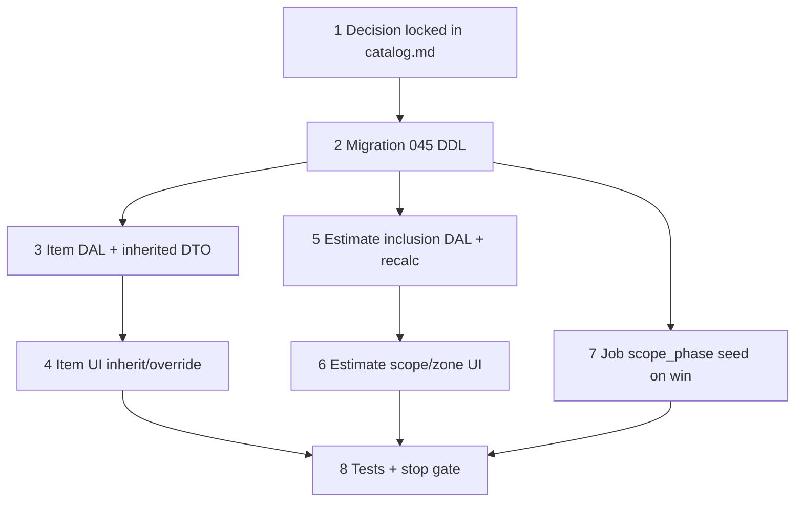

# 37n — Labor phase inclusion (catalog → estimate → job)

> **Status:** Complete (2026-07-07). Next: manual smoke on dev, then next slice task.
>
> **Decision:** [labor phase inclusion](../decisions/catalog.md#decision-labor-phase-inclusion--catalog--estimate--job-2026-07-07) (N1–N8 locked 2026-07-07). **Builds on:** [37g](./37g-commercial-costing.md) (`labor_phase`, `item_labor_phase`), [37l](./37l-leaf-quotable-item-model.md) (atomic ancestry labor group). **Touches:** [`item.md`](../surface-specs/item.md), estimate scope/zone UI, job `scope_phase` seed (jobs slice).

## Problem

040b shipped **`labor_phase`** + **`item_labor_phase`** for costing, but three gaps remain:

1. **Estimate** — no way to say "this scope/zone includes Program + Test only" (omit Install / Prewire from labor $).
2. **Job** — `scope_phase` still references retired `phase_template_step`; no bridge from item labor matrix to progress rows.
3. **Catalog UI** — leaves show empty labor table when defaults live on a **category** ancestor; no inherited read-only + override pattern.

Legacy org **`phase`**, **`phase_template`**, and per-line `phase_id` are dead weight.

## Locked decisions (N1–N8)

See [catalog.md § labor phase inclusion](../decisions/catalog.md#decision-labor-phase-inclusion--catalog--estimate--job-2026-07-07). Summary:

| # | Deliverable |
|---|-------------|
| N1 | Single catalog: `labor_phase` + `labor_rate_type`; retire `phase` / templates |
| N2 | Author `item_labor_phase` on **category** + **item**; 37l atomic resolve |
| N3 | Item UI: inherited read-only → **Add labor phase** override → delete-all reverts |
| N4 | `estimate_scope_labor_phase` + `estimate_zone_labor_phase` junctions |
| N5 | Recalc `unit_labor` filtered by included phases × complexity |
| N6 | Win seeds `scope_phase` per included `labor_phase_id` |
| N7 | Progress % rollups use included phases (billing deferred B4) |
| N8 | Phase inclusion frozen at `sent` / `won` |

## Execution order



**Slice split:** Steps 3–4 = catalog (3b). Steps 5–6 = estimates (4). Step 7 = jobs (5b win). Step 7 may land in the job win task if 37n catalog+estimate ships first.

---

## Step 1 — Decision (catalog.md)

Paste [decision block](../decisions/catalog.md#decision-labor-phase-inclusion--catalog--estimate--job-2026-07-07); mark J5 / legacy `phase` superseded in [`job.md`](../decisions/job.md).

### Verify

- [x] Decision N1–N8 in `catalog.md`
- [x] J5 superseded in `catalog.md` + `job.md`
- [x] Legacy `labor phases — catalog only` amended with 37n pointer

---

## Step 2 — Migration `045_labor_phase_inclusion.sql`

> Prerequisite: **040b**, **044** applied.

### New tables

```sql
-- estimate_scope_labor_phase — which labor phases apply to lines in this scope bucket
CREATE TABLE estimate_scope_labor_phase (
  estimate_scope_id  TEXT NOT NULL REFERENCES estimate_scope (id) ON DELETE CASCADE,
  labor_phase_id     TEXT NOT NULL REFERENCES labor_phase (id) ON DELETE RESTRICT,
  sort_order         INT NOT NULL DEFAULT 0,
  PRIMARY KEY (estimate_scope_id, labor_phase_id)
);

-- estimate_zone_labor_phase — zone override (row existence = checked phase)
CREATE TABLE estimate_zone_labor_phase (
  estimate_scope_id  TEXT NOT NULL,
  site_zone_id       TEXT NOT NULL,
  labor_phase_id     TEXT NOT NULL REFERENCES labor_phase (id) ON DELETE RESTRICT,
  sort_order         INT NOT NULL DEFAULT 0,
  PRIMARY KEY (estimate_scope_id, site_zone_id, labor_phase_id),
  FOREIGN KEY (estimate_scope_id, site_zone_id)
    REFERENCES estimate_zone (estimate_scope_id, site_zone_id) ON DELETE CASCADE
);
```

### Amend `scope_phase`

```sql
ALTER TABLE scope_phase
  ADD COLUMN IF NOT EXISTS labor_phase_id TEXT REFERENCES labor_phase (id) ON DELETE RESTRICT;

-- Backfill name from labor_phase where possible; then drop template FK if present
ALTER TABLE scope_phase DROP COLUMN IF EXISTS phase_template_step_id;
```

### Retire legacy

```sql
-- Safe when no app reads remain (grep before apply)
ALTER TABLE estimate_line DROP COLUMN IF EXISTS phase_id;
DROP TABLE IF EXISTS phase CASCADE;  -- only after FK audit
```

Sync [`current.dbml`](../schema/current.dbml): add junctions, `scope_phase.labor_phase_id`, remove/strike `phase` table note.

### Verify

- [x] `045` applies on dev
- [x] `current.dbml` synced
- [x] `codegen` unaffected or regenerated if new estimate fields added

---

## Step 3 — Item DAL: inherited labor phases + category authoring

### `lib/catalog/repository/item-detail.ts`

- **`resolveInheritedLaborPhases(pool, itemId)`** — walk ancestry (skip self); return **first** ancestor's `item_labor_phase` rows + `source_item_id` / `source_item_name`.
- **`loadItemDetailRelated`** — always return own `item_labor_phase`; add read-only **`inherited_labor_phase`** when own rows empty and ancestor has rows.
- **`labor_phase_mode`**: derived — `"override"` when own rows exist, else `"inherited"` when inherited non-empty, else `"empty"`.

### `lib/catalog/repository/item-write.ts`

- Allow **`item_labor_phase` replace-array on `node_type = 'category'`** (not scope roots). Reject on `scope`.
- Leaf override: replace-array on `item` only (unchanged semantics).

### Descriptor / YAML

- [`item_detail.surface.yaml`](../../modules/catalog/item_detail.surface.yaml) — document logical `inherited_labor_phase` read field (or fold into `item_labor_phase` DTO shape in descriptor only).
- PATCH schema: `item_labor_phase` writable on **category** + **item**.

### Verify

- [x] GET leaf with category defaults returns `inherited_labor_phase` + `labor_phase_mode: "inherited"`
- [x] GET leaf with own rows returns own rows only; mode `"override"`
- [x] PATCH category `item_labor_phase` persists
- [x] PATCH scope `item_labor_phase` → 400

---

## Step 4 — Item UI: inherit / override

**Edit** [`ItemCommercialFields.tsx`](../../components/catalog/ItemCommercialFields.tsx).

| Mode | UI |
|------|-----|
| `inherited` | Read-only `FieldArrayTable` bound to `inherited_labor_phase`; caption *Inherited from "{source_item_name}"*; **Add labor phase** seeds one empty row → switches form to override |
| `override` | Editable table on `item_labor_phase` (current behavior) |
| `empty` | Empty state + **Add labor phase** |
| Revert | Delete all `item_labor_phase` rows on save → mode returns to `inherited` |

**Category nodes:** show editable `item_labor_phase` table (branch defaults) — same columns as leaf override.

Gate: scope roots — no labor table (margin policy only).

### Spec amend

**Edit** [`item.md`](../surface-specs/item.md):

- Locked answer #10 → link 37n decision.
- Commercial §: category authors labor defaults; leaf inherit + override (N3).
- Remove "quotable leaves only" for `item_labor_phase` authoring — **category + item**.

### Verify

- [x] Category detail: editable labor phase table
- [x] Leaf with ancestor defaults: read-only inherited + Add override
- [x] Delete all override rows → inherited display after save + refetch
- [x] `item.md` matches N3

---

## Step 5 — Estimate inclusion DAL + `unit_labor` filter

### DAL

- **`loadScopeLaborPhases(ctx, estimateScopeId)`** / **`loadZoneLaborPhases(ctx, estimateScopeId, siteZoneId)`**
- **PATCH `estimate_scope`** — replace-array `included_labor_phases: { labor_phase_id }[]` (manifest-narrowed, `.strict()`).
- **PATCH `estimate_zone`** — same per zone row.

### Recalc — `lib/estimates/repository/estimate-commercial.ts`

```ts
// Pseudocode
const resolved = resolveLaborGroup(catalog, itemId); // 37l atomic
const included = zonePhases ?? scopePhases ?? resolved.map(r => r.labor_phase_id);
const filtered = resolved.filter(r => included.has(r.labor_phase_id));
const baseLabor = sumHoursTimesRate(filtered);
const unitLabor = baseLabor * (complexityPercent / 100);
```

- **`resolveLaborGroup(catalog, itemId)`** — extract from existing `selfRate` / `ancestryFirst` labor path; return row array (not scalar).
- Recalc runs on line save and bulk recalc; respect `lock` / `sent` (D6a).

### Verify

- [x] Scope with Program+Test only → line labor excludes Install hours
- [x] Unset inclusion → all resolved phases count (N4 default)
- [x] Zone inclusion overrides scope
- [x] Unit tests in `estimate-commercial.test.ts`

---

## Step 6 — Estimate scope/zone UI

**Where:** estimate Scope tab (existing scope/zone panel from 37e).

- Per **checked scope**: multi-select (or checkbox list) of org `labor_phase` rows — *Included labor phases*.
- Per **checked zone**: optional override list (zone > scope).
- Empty = include all (helper text).
- Frozen when estimate `status` is `sent` or `won` (N8).

### Verify

- [x] Scope panel saves `estimate_scope_labor_phase` replace-array
- [x] Zone panel saves `estimate_zone_labor_phase`
- [x] UI disabled on sent/won estimate

---

## Step 7 — Job `scope_phase` seed (win / line create)

**Where:** job win DAL (5b) or shared helper in `lib/jobs/`.

On win (or `job_line` create from estimate line):

```text
group = resolveLaborGroup(catalog, job_line.item_id)
included = zonePhases ?? scopePhases ?? all phase ids in group
for each row in group where row.labor_phase_id ∈ included:
  INSERT scope_phase (job_line_id, labor_phase_id, name, sequence, planned_qty, progress_weight, …)
```

- `planned_qty` = `job_line.quantity`
- `progress_weight` default = `hours_per_unit` from matching `item_labor_phase` row (J3 custom weights deferred)
- Idempotent re-win: document replace vs skip policy (prefer: delete + reseed only on first win)

### Verify

- [x] Win creates one `scope_phase` per included phase
- [x] Omitted phases (estimate inclusion) → no `scope_phase` row
- [x] `scope_phase.labor_phase_id` populated

---

## Step 8 — Tests + stop gate

```bash
cd apps/subhub
npm run codegen:check
npm test -- --run item-detail estimate-commercial item-commercial-fields
npm run build
```

### Manual smoke

1. Category — author Program + Test labor defaults on "Speakers" category.
2. Leaf speaker item — shows inherited read-only; Add override → change hours → save.
3. Delete all leaf rows — reverts to inherited after save.
4. Estimate scope "Parts & Smarts" — include Program + Test only.
5. Line on that scope — `unit_labor` excludes Install/Prewire hours.
6. Win → job — `scope_phase` rows match included phases only.

### Verify (stop gate)

- [x] Migration `045` on dev; DBML synced
- [x] Item inherit/override UI + category authoring
- [x] Estimate inclusion DAL + recalc filter
- [x] Estimate scope/zone phase picker UI
- [x] Job `scope_phase` seed on win
- [x] Targeted tests + `codegen:check` + `build` green
- [ ] Manual smoke 1–6 on dev
- [x] [`STATUS.md`](../../STATUS.md) + [`01-task-index.md`](./01-task-index.md) updated

---

## Risk notes

| Risk | Mitigation |
|------|------------|
| Drop `phase` breaks dev FKs | Audit `grep phase_id` before `DROP`; migrate or null first |
| Recalc drift on sent estimates | N8 freeze; inclusion PATCH rejected when `sent`/`won` |
| Override vs inherit confusion | Explicit `labor_phase_mode` in DTO; caption in UI |
| Job step blocks on estimate UI | Step 7 can ship in 5b with shared `resolveIncludedLaborPhases` helper |
| `scope_phase` duplicate seed on re-win | Win DAL: seed only when job_line has zero scope_phase rows |

## Out of scope (37n)

- J3 custom `progress_weight` / `billing_weight` editor (default from hours)
- Billing auto-generator from `scope_phase` (B4)
- Per-line phase inclusion (scope/zone only)
- Per-phase merge across ancestry levels (37l atomic group stands)
