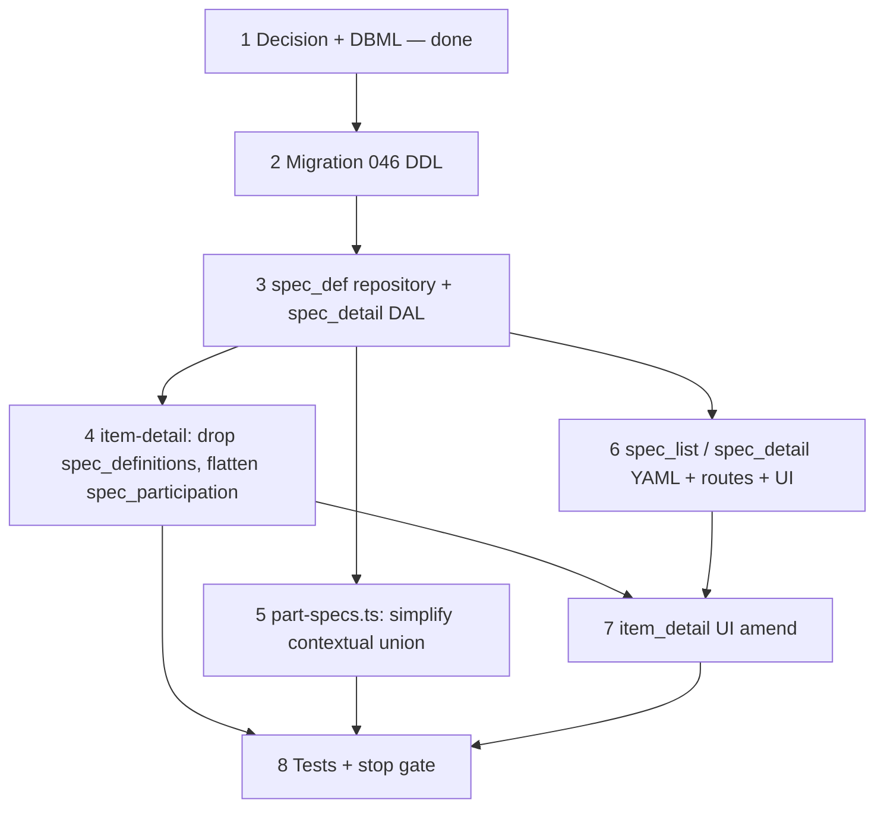
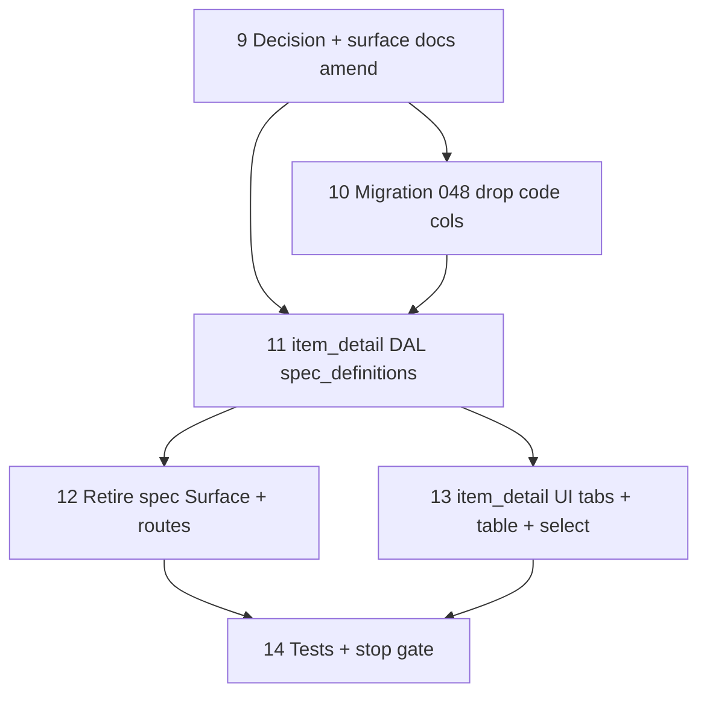

# 37o — Spec participation flatten (definitions off the tree, leaf-only opt-in)

> **Status:** Complete (2026-07-08). UI pivot §9–§14 landed. Manual smoke §14 steps 1–7 optional on dev.
>
> **Decision:** [spec definitions scoped to root, flat item participation](../decisions/catalog.md#decision-spec-definitions-scoped-to-root-flat-item-participation--no-ownershipinheritance-2026-07-07) (S1–S10 locked 2026-07-07; **S2 amended** 2026-07-08 — see [§9](#step-9--decision-amend--surface-docs-ui-pivot)). **Builds on:** [37d5](./37d5-category-spec-owner-column.md) (`spec_def.category_id` owner column — retired here), [37j](./37j-catalog-part-authoring.md) (`part_specs` contextual union — simplified here), [37k](./37k-part-spec-lifecycle.md) (prune-on-link-save — unchanged here). **Touches:** [`item.md`](../surface-specs/item.md), [`spec.md`](../surface-specs/spec.md) *(to retire)*, [`part.md`](../surface-specs/part.md) § `part_specs`.

## Problem

The ownership + branch-exclude model (`spec_def` owned by one item-tree node, inheriting down, cut by `item_spec_exclude` with no re-include) had three real costs:

1. **Ancestor walk everywhere** — every "what specs apply here" question (`effective()`, `scopePanelDefs()`, `unionEffectiveForItems()`) required walking the item tree and a participation map, not a flat lookup.
2. **Editing rights tied to tree position** — whichever node happened to own a def was the only place to rename/retype it; that node wasn't a stable, obvious concept for catalog admins.
3. **Cross-subtree edit fan-out** — changing participation on a category could silently change `effective()` for every descendant leaf and every part linked to any of them, with no bounded blast radius.

Discussion (chat trail, 2026-07-07) converged on: definitions become a flat namespace per **scope root only**, and participation becomes a flat **per-leaf-item opt-in** with no inheritance, no exclude, no ancestor walk. **Follow-up (2026-07-08):** the interim `/specs` master-detail Surface is retired — definitions return to **`item_detail`** on scope roots (Specs tab); see §9–§14.

## Locked decisions (S1–S10)

See [catalog.md § spec definitions scoped to root](../decisions/catalog.md#decision-spec-definitions-scoped-to-root-flat-item-participation--no-ownershipinheritance-2026-07-07). Summary:

| # | Deliverable |
|---|-------------|
| S1 | `spec_def.scope_root_item_id` — flat namespace per scope root, no owning node |
| S2 | ~~Definitions edited on **new `spec_detail`** Surface~~ → **amended 2026-07-08:** definitions edited on **`item_detail` Specs tab** (`spec_definitions` Field, `node_type = scope` only); separate `/specs` Surface **retired** |
| S3 | `item_spec_participation (item_id, spec_def_id)` — leaf items only, direct opt-in |
| S4 | Categories carry no spec Fields at all |
| S5 | Drop `item_spec_exclude` |
| S6 | Part contextual union = direct join over linked items' participation (no ancestor walk) |
| S7 | Estimate scope panel = entire namespace for the scope root (no subtree union) |
| S8 | Line-level narrowing mechanism unchanged (bucket ∩ participation → filter `part_item`) |
| S9 | Orphan `manufacturer_part_spec` rows are inert; prune stays scoped to part's own `item_links` save |
| S10 | Bulk/"copy from item" authoring convenience is UI-only, not schema |

## Execution order



**Slice split:** Steps 3, 6 = new catalog Surface (3b). Step 4, 7 = amend existing `item_detail` (3b). Step 5 = part authoring (3b, already shipped Surface). No estimate or job slice changes — S7/S8 confirm the bucket-merge and part-matching algorithms are untouched.

---

## Step 1 — Decision + DBML + surface docs (complete)

| File | Action |
|------|--------|
| [`docs/decisions/catalog.md`](../decisions/catalog.md) | **Added** — S1–S10 decision block |
| [`docs/decisions/README.md`](../decisions/README.md) | **Added** — index row |
| [`docs/schema/current.dbml`](../schema/current.dbml) | **Amended** — `spec_def.scope_root_item_id` (was `item_id`); `item_spec_exclude` → `item_spec_participation`; `TableGroup catalog` + `Ref:` block updated |
| [`docs/surface-specs/item.md`](../surface-specs/item.md) | **Amended** — removed `spec_definitions`; flattened `spec_participation` to leaf-only |
| [`docs/surface-specs/spec.md`](../surface-specs/spec.md) | **Created** — new `spec_list` / `spec_detail` Surface spec (A–K) |
| [`docs/surface-specs/part.md`](../surface-specs/part.md) | **Amended** — `part_specs` contextual union note (S6) |

### Verify

- [x] Decision S1–S10 in `catalog.md`; superseded blocks cross-linked
- [x] `current.dbml`: `spec_def` renamed column, `item_spec_exclude` replaced, `TableGroup` + `Ref:` synced
- [x] `item.md` — no `spec_definitions` Field remains; `spec_participation` documented leaf-only, flat
- [x] `spec.md` created, A–K filled, cross-linked from `item.md` and `part.md`
- [x] `part.md` — `part_specs` union description matches S6

---

## Step 2 — Migration `046_spec_participation_flatten.sql`

> Prerequisite: **040a**, **038** applied (existing `spec_def.item_id` + `item_spec_exclude`).

### Planned SQL (not yet created — draft for step execution)

```sql
-- 1. Add new namespace column, backfill by walking item_id to its scope root
ALTER TABLE spec_def ADD COLUMN scope_root_item_id text;

WITH RECURSIVE ancestry AS (
  SELECT id, id AS origin_id, parent_id FROM item
  UNION ALL
  SELECT i.id, a.origin_id, i.parent_id
  FROM item i
  JOIN ancestry a ON i.id = a.parent_id
)
UPDATE spec_def sd
SET scope_root_item_id = a.id
FROM ancestry a
WHERE a.origin_id = sd.item_id AND a.parent_id IS NULL;

ALTER TABLE spec_def ALTER COLUMN scope_root_item_id SET NOT NULL;
ALTER TABLE spec_def ADD CONSTRAINT spec_def_scope_root_fk
  FOREIGN KEY (scope_root_item_id) REFERENCES item (id) ON DELETE RESTRICT;

-- 2. New flat participation table
CREATE TABLE item_spec_participation (
  item_id      text NOT NULL REFERENCES item (id) ON DELETE CASCADE,
  spec_def_id  uuid NOT NULL REFERENCES spec_def (id) ON DELETE CASCADE,
  sort_order   int NOT NULL DEFAULT 0,
  PRIMARY KEY (item_id, spec_def_id)
);

-- 3. Backfill participation from the OLD effective() output (one-time, best-effort)
--    Run via a script (not pure SQL) that reuses the existing
--    computeEffectiveSpecDefIds() from item-effective-specs.ts against every
--    node_type = 'item' row, inserting one row per (item_id, spec_def_id) where
--    the old algorithm returned true. Document row counts before/after in the
--    migration plan doc for review.

-- 4. Drop legacy ownership + exclude
ALTER TABLE spec_def DROP COLUMN item_id;
DROP TABLE item_spec_exclude;
```

**Backfill script note:** step 3 cannot be pure SQL because the old `effective()` algorithm is a recursive ancestor + exclude-path walk implemented in TypeScript (`item-effective-specs.ts`). Write a one-off Node script (or a temporary `WITH RECURSIVE` port) run **once**, reviewed against dev seed data (fire-alarm seed `043`) before `DROP COLUMN item_id` / `DROP TABLE item_spec_exclude`.

Sync [`current.dbml`](../schema/current.dbml) — already amended in Step 1 to the target state; confirm no drift after `046` applies.

### Verify

- [x] `046` applies on dev
- [x] Backfill row counts reviewed (spot-check fire-alarm seed: SLC protocol on Initiating leaves, Color on Notification leaves)
- [x] `current.dbml` matches applied schema exactly
- [x] `codegen:check` clean

---

## Step 3 — `spec_def` repository + `spec_detail` DAL

### New: `lib/catalog/repository/spec-detail.ts` (or split read/write per existing convention)

- **`get(ctx, id)`** — `spec_def` row + `spec_option[]` when enum; denormalize `scope_root_name`; compute `in_use_participation_count` / `in_use_part_count`.
- **`list(ctx, { q?, scope_root_id? })`** — flat list, join `item` for scope root label.
- **`create` / `patch` / `delete`** — port existing logic from `spec-def-write.ts` (`assertSpecDefinitionShape`, `assertSpecOptionDeletable`, enum diff-upsert) unchanged; **add** `scope_root_id` required-on-create + reassign-lock check (§ E in `spec.md`).
- **Picker:** `listScopeRoots(ctx)` — `SELECT id, name FROM item WHERE node_type = 'scope' ORDER BY sort_order`.

### Retire

- `lib/catalog/repository/item-spec-exclude-write.ts` + test — delete (no exclude concept).
- `assertRootSpecDefinitionsPatch` in `spec-def-write.ts` — delete (no longer root-of-item-tree gated; gated by the new Surface's own policy instead).

### Verify

- [x] `spec_detail` GET/PATCH/POST/DELETE round-trip on dev
- [x] `scope_root_id` reassign blocked when in use
- [x] Enum option diff-upsert + `spec_option_in_use` block — behavior parity with pre-37o tests

---

## Step 4 — `item-detail.ts`: drop `spec_definitions`, flatten `spec_participation`

### `lib/catalog/repository/item-effective-specs.ts`

- **Delete** `isAncestorOrSelf`, `pathFromAncestorToNode`, `hasExcludeOnAssignPath`, `isEffectiveSpecDef`, `computeEffectiveSpecDefIds`, `loadParticipationMaps`, `effectiveParticipation` — ancestor-walk machinery no longer needed.
- **Replace** `scopePanelDefs(pool, rootItemId)` → `SELECT * FROM spec_def WHERE scope_root_item_id = $1 ORDER BY sort_order` (S7 — no subtree union).
- **Replace** `unionEffectiveForItems(pool, itemIds)` → `SELECT DISTINCT sd.* FROM spec_def sd JOIN item_spec_participation p ON p.spec_def_id = sd.id WHERE p.item_id = ANY($1)` (S6 — direct join).
- Keep `loadScopePanelDefIdSet` (thin wrapper), update its body to match the new `scopePanelDefs`.

### `lib/catalog/repository/item-detail.ts`

- **Remove** `loadRootSpecDefinitions` (or equivalent) + the `spec_definitions` DTO field entirely.
- **`spec_participation` read:** resolve item's ancestor scope root (existing `resolveRootCategoryId`/`resolveRootItemId` helper), load `spec_def WHERE scope_root_item_id = root`, left-join `item_spec_participation` for this item, return flat `participates[]` (no `state`).
- **Gate:** `spec_participation` only populated when `node_type = 'item'`; omit entirely for `scope` / `category`.

### `lib/catalog/repository/item-spec-participation-write.ts`

- **Simplify** `assertSpecDefsBelongToRoot` — same shape, but query becomes `WHERE scope_root_item_id = $1` (no recursive subtree CTE — namespace is already flat per root).
- **Delete** `loadOwnerByDef`, `hasExcludeStrictlyAbove` (or equivalent exclude-path helpers) — no owner, no exclude.
- **Replace** PATCH handler body: for each `{ spec_def_id, active }` — `active: true` → upsert `item_spec_participation`; else → delete row. No assign-once check.

### Descriptor / YAML

- [`lib/catalog/descriptors/item-detail.ts`](../../lib/catalog/descriptors/item-detail.ts) — remove `spec_definitions` from readable/writable schemas + DTO type; simplify `SpecParticipationRow` (drop `state`, `excluded_here`, `assign_item_id`).
- [`modules/catalog/item_detail.surface.yaml`](../../modules/catalog/item_detail.surface.yaml) — remove `spec_definitions` field + `item_spec_exclude` from `tables:`; keep `spec_participation` (now flat) + add `item_spec_participation` to `tables:`.

### Verify

- [x] GET leaf item returns flat `spec_participation` from ancestor scope's namespace
- [x] GET scope root / category returns no spec Fields
- [x] PATCH `spec_participation` upserts/deletes correctly; rejects out-of-namespace `spec_def_id`
- [x] `codegen:check` clean

---

## Step 5 — `part-specs.ts`: simplify contextual union

### `lib/parts/repository/part-specs.ts`

- Replace the "contextual union of effective defs for scope roots of `item_links`" query (whatever ancestor-walk call it currently makes into `item-effective-specs.ts`) with: `SELECT DISTINCT sd.* FROM spec_def sd JOIN item_spec_participation p ON p.spec_def_id = sd.id WHERE p.item_id = ANY($1::text[])` where `$1` = the part's linked `item_id`s.
- **Prune-on-link-save (37k K1) — unchanged in spirit**, just points at the new union query: delete `manufacturer_part_spec` rows outside the recomputed union on `item_links` replace.

### Verify

- [x] `part_specs` writable-def union matches new participation model
- [x] Prune-on-link-shrink test still green against new union query

---

## Step 6 — `spec_list` / `spec_detail` Surface (new) — **superseded by §12**

> Shipped 2026-07-07; **to be retired** per UI pivot §9. Keep as reference until §12 lands.

Per [`spec.md`](../surface-specs/spec.md) A–K:

- YAML: `modules/catalog/spec_list.surface.yaml`, `modules/catalog/spec_detail.surface.yaml`.
- Routes: `app/(app)/specs/layout.tsx`, `app/(app)/specs/[id]/page.tsx`, `app/(app)/specs/new/page.tsx`.
- API: `app/api/specs/route.ts`, `app/api/specs/[id]/route.ts`, `app/api/specs/pickers/scope-roots/route.ts`.
- UI: flat list (antd `Table`, not `Tree` — unlike `item_list`) + detail form (`profile` + `options` `FieldArrayTable`).
- Nav: add **Catalog → Specs** entry.

### Verify

- [x] `codegen:check` for `spec_list` / `spec_detail`
- [x] CRUD round-trip through UI on dev
- [x] Nav entry present + permission-gated

---

## Step 7 — `item_detail` UI amend — **superseded by §13**

> Shipped 2026-07-07 (checkbox + “Manage specs” link); **replaced** by tabbed scope editor + leaf multi-select per §13.

**Edit** [`ItemDetailForm.tsx`](../../components/catalog/ItemDetailForm.tsx) (or wherever the spec sections currently render):

- **Remove** the root-only "Spec definitions" table section entirely.
- **Replace** the participation checklist with a flat multi-select (or checkbox list) bound to the new flat `spec_participation.participates[]` — drop any "Inherited" / "Excluded" caption logic.
- **Add** a link/button — "Manage specs for this scope" → `/specs?scope_root_id=<ancestor root id>` — shown on scope root and category detail (since they no longer render any spec UI inline).
- Gate: `spec_participation` section only renders for `node_type = 'item'`.

### Verify

- [x] Scope root / category detail: no spec section; "Manage specs" link present
- [x] Leaf item detail: flat checklist, saves via simplified PATCH
- [x] No remaining UI references to `state` / `excluded` / `inherited` for specs

---

## Step 8 — Tests + stop gate

```bash
cd apps/subhub
npm run codegen:check
npm test -- --run spec-detail item-detail item-effective-specs item-spec-participation-write part-specs
npm run build
```

### Manual smoke

1. Create scope root "Fire Alarm" (existing) → navigate to new `/specs`, filter by scope, create "SLC protocol" (enum) + "Color" (enum).
2. Leaf item "Smoke Detector" under Fire Alarm → `spec_participation` shows both defs unchecked; check both, save.
3. Leaf item "Horn/Strobe" → check only "Color", save. Confirm "SLC protocol" not forced.
4. Part linked to both leaves → `part_specs` writable defs = union `{ slc_protocol, color }`.
5. Estimate — check Fire Alarm scope → scope panel shows both defs (even before any line uses them).
6. Line on Smoke Detector → narrows using `{ slc_protocol, color }` only; line on Horn/Strobe → narrows using `{ color }` only.
7. Edit Smoke Detector's participation (uncheck `color`) → confirm Horn/Strobe's participation and its linked parts are untouched (bounded blast radius, S9).

### Verify (stop gate)

- [x] Migration `046` on dev; `current.dbml` synced (already target-state from Step 1)
- [x] `spec_list` / `spec_detail` Surface shipped
- [x] `item_detail` — `spec_definitions` removed; `spec_participation` flattened
- [x] `part_specs` contextual union simplified; prune-on-link-save still green
- [x] Estimate scope panel + line narrowing unaffected in behavior (S7/S8 — verified, not just assumed)
- [x] Targeted tests + `codegen:check` + `build` green
- [ ] Manual smoke 1–7 on dev *(interim `/specs` UI — re-run against §14 after pivot)*
- [x] [`STATUS.md`](../../STATUS.md) + [`01-task-index.md`](./01-task-index.md) updated

---

## Amendment — specs UI on `item_detail` (2026-07-08)

**Problem:** the interim `/specs` Surface decouples definitions from the item tree correctly in storage (S1) but adds a nav hop and splits authoring across two screens. Scope roots are the natural namespace anchor — definitions belong on the scope node's detail, not a flat catalog filtered by scope.

### Locked product answers (UI pivot)

| # | Topic | Choice |
|---|--------|--------|
| U1 | **Retire `/specs`** | Remove `spec_list` / `spec_detail` Surfaces, routes, nav; no standalone spec master-detail |
| U2 | **`item_detail` tabs** | **`General` \| `Specs`** — **Specs tab only when `node_type = scope`** |
| U3 | **Scope — `spec_definitions`** | `FieldArrayTable` on Specs tab — columns **Name** (`display_name`), **Type** (`value_type`), **Options** (antd `Select mode="tags"` when `enum`, same as interim spec Surface); **one Save** with profile |
| U4 | **Table sort** | **`orderable={true}`** on `FieldArrayTable` — drag reorder like commercial rate tables ([`CommercialCatalogTable.tsx`](../../components/catalog/CommercialCatalogTable.tsx)); persist `sort_order` from array position (1-based) |
| U5 | **Leaf — `spec_participation`** | Single Field on **General** tab, label **Specs** — **multi-select** of defs in the ancestor scope's namespace (not single-select) |
| U6 | **Permissions** | **`spec_definitions`** and **`spec_participation`** are **separate Fields** with independent manifest read/write grants |
| U7 | **`code` columns** | **No UI exposure.** Audit: matching/filtering uses `spec_def_id` / `spec_option_id` FKs only — `spec_def.code` and `spec_option.code` are unused for runtime logic. **Drop both columns** in migration **`048`**; remove from DTOs/SQL reads |
| U8 | **DAL retention** | Keep **`spec-detail-write.ts`** helpers only if still called from `item_detail` `spec_definitions` PATCH. **Retire** surface-only paths (`spec-detail.ts` list/get, `spec_list` loaders, `/api/specs/*`) once `item_detail` owns read/write |

### Execution order (UI pivot)



---

## Step 9 — Decision amend + surface docs (UI pivot)

| File | Action |
|------|--------|
| [`docs/decisions/catalog.md`](../decisions/catalog.md) | **Amend** S2 row — definitions on `item_detail` `spec_definitions` (scope tab), not dedicated Surface; note `/specs` retired |
| [`docs/schema/current.dbml`](../schema/current.dbml) | **Amend** — drop `spec_def.code`, `spec_option.code` columns + notes |
| [`docs/surface-specs/item.md`](../surface-specs/item.md) | **Amend** — restore `spec_definitions` Field (scope only); document General \| Specs tabs; leaf `spec_participation` as multi-select labeled Specs; two Field grants |
| [`docs/surface-specs/spec.md`](../surface-specs/spec.md) | **Retire or mark superseded** — content folded into `item.md` |
| [`docs/decisions/README.md`](../decisions/README.md) | **Amend** index row if S2 wording changes |

### Verify

- [x] S2 amendment dated 2026-07-08 in `catalog.md`
- [x] `item.md` documents tab gating, sortable table, separate Field permissions, no `code` in UI
- [x] `current.dbml` reflects `048` target (no `code` on `spec_def` / `spec_option`)

---

## Step 10 — Migration `048_drop_spec_code_columns.sql`

> Prerequisite: **046** applied.

```sql
-- spec_def.code and spec_option.code are unused at runtime (FK matching only).
-- UI never exposed them; drop after stripping from DAL SELECT lists (Step 11).

ALTER TABLE spec_def DROP COLUMN IF EXISTS code;
ALTER TABLE spec_option DROP COLUMN IF EXISTS code;
```

Sync [`current.dbml`](../schema/current.dbml). Update dev seed `043` if it still INSERTs `code` (use `display_name` only).

### Verify

- [x] `048` SQL created; `current.dbml` matches target schema
- [x] No remaining `spec_def.code` / `spec_option.code` references in app SQL (grep)

---

## Step 11 — `item_detail` DAL: restore `spec_definitions` (scope only)

### Read (`item-detail.ts`)

- When `node_type = scope`: load `spec_def WHERE scope_root_item_id = id` + nested `spec_option[]` for enum rows → `spec_definitions[]` DTO (no `code` keys).
- When `node_type = item`: keep flat `spec_participation` (unchanged).
- When `node_type = category`: omit both spec Fields.

### Write

- **PATCH `spec_definitions`** (scope only): replace-array semantics — same rules as interim `spec_detail` § E (`assertSpecDefinitionShape`, enum diff-upsert, `spec_option_in_use`, delete blockers when def in use).
- **Delegate** to [`spec-detail-write.ts`](../../lib/catalog/repository/spec-detail-write.ts) helpers — **retain this module** for write paths; do **not** keep a parallel copy.
- **`scope_root_id` implicit** — always the scope node's own `id`; no picker on edit (unlike interim `spec_detail`).
- Reject `spec_definitions` PATCH on non-scope nodes (`400`).

### Retire (after `item_detail` owns read/write)

| Module / route | Action |
|----------------|--------|
| `lib/catalog/repository/spec-detail.ts` | **Delete** if only used by `/api/specs` |
| `lib/catalog/stores/spec-detail-*.ts` | **Delete** |
| `app/api/specs/**` | **Delete** |
| `modules/catalog/spec_list.surface.yaml`, `spec_detail.surface.yaml` | **Delete** + `codegen` |
| Nav `/specs` entry | **Remove** |

Keep **`spec-detail-write.ts`** + its tests while Step 11 calls into it.

### Descriptor / YAML

- [`modules/catalog/item_detail.surface.yaml`](../../modules/catalog/item_detail.surface.yaml) — add `spec_definitions` Field; `tables:` add `spec_def`, `spec_option`; keep `spec_participation` + `item_spec_participation`.
- [`lib/catalog/descriptors/item-detail.ts`](../../lib/catalog/descriptors/item-detail.ts) — `spec_definitions` readable/writable schema (strict); drop `code` from element shapes.

### Verify

- [x] GET scope root returns `spec_definitions[]` with options nested for enums
- [x] PATCH scope root round-trip: add/rename/reorder/delete defs; enum option diff-upsert + `spec_option_in_use` block
- [x] PATCH `spec_definitions` on category / leaf → `400`
- [x] `spec-detail-write.ts` still exercised by tests (via `item_detail` path or direct unit tests)

---

## Step 12 — Retire interim `spec_list` / `spec_detail` Surface

- Remove `app/(private)/specs/**` pages.
- Remove master-detail registry + surface-loader entries for `spec_list` / `spec_detail`.
- Remove generated glue under `modules/catalog/generated/spec_*` (run `codegen`).
- Optional redirect: `/specs` → `/categories` (or 404) — no deep link to individual spec ids needed once defs are rows on the scope tab.

### Verify

- [x] No nav entry **Catalog → Specs**
- [x] `codegen:check` clean with spec Surface YAML removed
- [x] Grep: no remaining `routes.specs` / `/specs` links in catalog UI (estimate cross-links updated or dropped)

---

## Step 13 — `item_detail` UI (tabs + table + select)

**Edit** [`ItemDetailForm.tsx`](../../components/catalog/ItemDetailForm.tsx):

| `node_type` | UI |
|-------------|-----|
| `scope` | antd **Tabs**: **General** (profile) \| **Specs** (`spec_definitions` `FieldArrayTable`) |
| `category` | **General** only |
| `item` | **General** — profile, commercial, labor, **`spec_participation`** as multi-select labeled **Specs** |

**Specs tab table** (scope):

- Reuse [`FieldArrayTable`](../../components/form/FieldArrayTable.tsx) — same primitive as labor phases / commercial catalogs.
- Columns: Name (`display_name`), Type (`value_type` Select), Options (tags `Select` when enum).
- `orderable={fieldAllows(manifest, "spec_definitions", "write")}` — drag handle + `sort_order` reindex on drop (U4).
- Add row / delete row; delete disabled or server-blocked when def in use (show counts inline).
- **No `code` column or hidden field.**

**Leaf Specs field:**

- Replace checkbox grid + “Manage specs” link with **multi-select** bound to active `spec_def_id`s in `spec_participation.participates[]`.
- Gate: `fieldAllows(manifest, "spec_participation", "read"|"write")`.

**Save:** single toolbar Save patches manifest-narrowed body (profile + `spec_definitions` and/or `spec_participation`).

Optional: `?tab=specs` query param to deep-link to Specs tab on scope nodes.

### Verify

- [x] Scope node: Specs tab table sortable; options tags match interim spec Surface behavior
- [x] Leaf: Specs multi-select on General; no `/specs` links
- [x] Category: no spec UI
- [x] Separate Field grants: hide/disable Specs tab vs leaf multi-select independently per manifest

---

## Step 14 — Tests + stop gate (UI pivot)

```bash
cd apps/subhub
npm run codegen:check
npm test -- --run item-detail item-spec-participation-write spec-detail-write part-specs
npm run build
```

### Manual smoke (revised)

1. Open scope root **Fire Alarm** → **Specs** tab → add "SLC protocol" (enum, options via tags) + "Color" (enum); drag to reorder; Save.
2. Leaf **Smoke Detector** → General → **Specs** multi-select: both defs; Save.
3. Leaf **Horn/Strobe** → **Specs**: only Color; Save.
4. Part linked to both leaves → `part_specs` union `{ slc_protocol, color }`.
5. Estimate — Fire Alarm scope checked → panel shows both defs.
6. Line narrowing unchanged (S7/S8).
7. User with `spec_definitions` write but `spec_participation` read-only (or vice versa) → correct partial UI per manifest.

### Verify (stop gate — UI pivot)

- [x] Migration `048` SQL created; `current.dbml` synced *(apply `npm run db:migrate` on dev when connected)*
- [x] `spec_definitions` on scope `item_detail`; `/specs` Surface retired
- [x] `code` dropped from DB + DTOs; no UI exposure
- [x] Sortable spec table on scope Specs tab
- [x] Leaf **Specs** multi-select on General tab
- [x] `spec-detail-write.ts` retained only while called from `item_detail`; surface-only DAL deleted
- [x] Targeted tests + `codegen:check` + `build` green
- [ ] Manual smoke 1–7 (revised) on dev
- [x] [`STATUS.md`](../../STATUS.md) + [`01-task-index.md`](./01-task-index.md) updated

---

## Risk notes

| Risk | Mitigation |
|------|------------|
| Backfill (Step 2.3) misclassifies participation | Review row counts + spot-check against fire-alarm dev seed before dropping `item_id` / `item_spec_exclude`; keep a `047_rollback` plan until dev confirms |
| Estimate scope panel becomes "too broad" in practice (shows unused dims) | Accepted trade-off (S7 rationale) — re-visit only if real usage shows noise; not a v1 blocker |
| UI copy/bulk-apply convenience (S10) not built in 37o | Fine to ship 37o without it — repeated per-item clicking is a UX nit, not a correctness gap; track as a fast-follow if catalog admins complain |
| `spec_detail.scope_root_id` reassign lock surprises admins | **Moot after UI pivot** — scope root is implicit; no reassign flow |
| `code` column drop breaks external importers | v1 has no importer; seeds amended in `048` follow-up |
| Large spec namespace on one table | Accept for v1; add client filter on Specs tab only if noise appears |

## Out of scope (37o)

- `number` value type (still deferred, unrelated)
- `estimate_line_spec` UI (still deferred, unrelated — bucket tables/merge untouched)
- Bulk "copy participation from item" UI (S10 — note only, not built)
- Expandable-row / modal option editor beyond tags `Select` (v1 = same as interim spec Surface)
